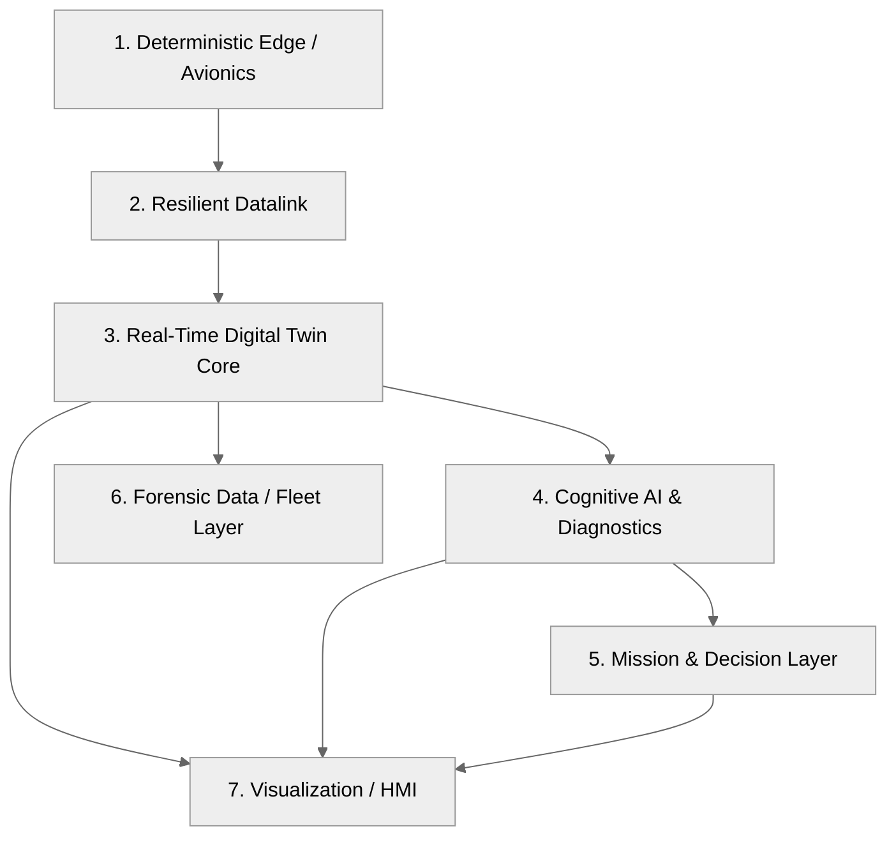
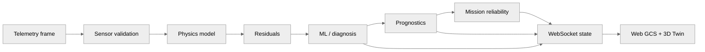

# System Architecture

## 1. Seven-layer conceptual architecture

## 2. Runtime data path

## 3. Edge / ground split

The target architecture separates deterministic low-latency processing from heavier asynchronous reasoning.

### Deterministic path

- telemetry ingestion,
- physical feature extraction,
- fast residual generation,
- fast novelty screening,
- black-box / store-and-forward logging.

### Cognitive path

- state estimation,
- fault diagnosis,
- degradation analysis,
- RUL estimation,
- mission consequence analysis,
- retrieval-augmented operator assistance.

## 4. Why the split matters

AI inference should not block the time-sensitive telemetry path. The documentation should make this architectural boundary obvious instead of presenting every algorithm as if it executes inside the same real-time loop.

## 5. Repository-to-architecture mapping

Document the actual code paths here using links such as:

- `backend/runtime/`
- `backend/twin/`
- `backend/physics/`
- `backend/ml/`
- `backend/mission/`
- `backend/telemetry/`
- `backend/server/`
- `web/site/`
- `tests/`

Each mapping should be verified against the current repository before publication.
