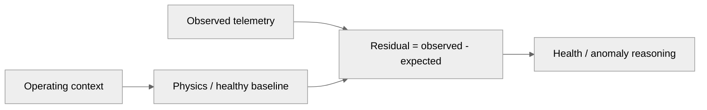

# Digital Twin Core & Physics

## 1. What makes the twin a computational model?

The 3D engine is a visualization of state. The Digital Twin itself is the software state and physics machinery that estimates how the engine should behave under current operating conditions.

## 2. Reference engine

The current documentation uses the Rotax 912 iS as a reference aero-piston engine profile.

## 3. Core monitored parameters

- RPM
- Cylinder Head Temperature (CHT)
- Exhaust Gas Temperature (EGT)
- Oil pressure
- Oil temperature
- Fuel flow
- Vibration features
- Battery / alternator health
- Injection timing
- Flight context such as altitude, airspeed, and outside-air temperature

## 4. Physics residual concept

Residuals are the principal interface between the physics layer and downstream diagnostics.

## 5. State estimation

Where implemented, state-estimation components should be documented in terms of:

- state vector,
- measurement vector,
- process model,
- observation model,
- covariance assumptions,
- update frequency,
- and validation tests.

The current project documentation identifies an Unscented Kalman Filter (UKF) in the Digital Twin stack.

## 6. Sensor integrity

Sensor faults and engine faults are different failure classes. Rate-of-change and physical-consistency checks are used to avoid treating an obviously invalid instrument reading as a genuine engine-state transition.

Example reasoning:

**sensor jump → plausibility check → mark channel invalid → shield affected residual → prevent corrupted measurement from dominating downstream inference**

## 7. Engineering boundary

This page must explicitly mark which equations are:

- manufacturer / published engineering constants,
- analytical models,
- simulated plant equations,
- fitted parameters,
- or provisional assumptions.
