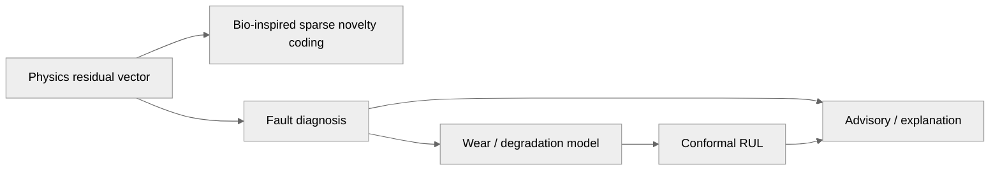
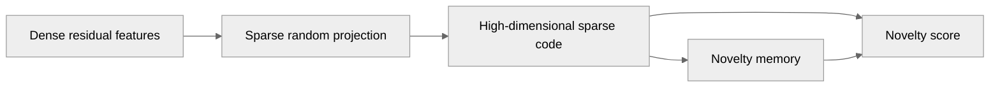

# AI / ML & Fly Brain

## 1. AI is not one model

ANUMAAN uses multiple analytical layers with different jobs.

## 2. Bio-inspired sparse novelty coding

Use the documentation name:

**Bio-Inspired Sparse Novelty Coding**

Do not present this as a generic deep-learning classifier.

The current project implementation is based on FlyHash-style sparse random projection / novelty gating. It operates on engineered residual and vibration features and does not require backpropagation training for its novelty-code construction.

### Explain it visually

## 3. Fault diagnosis

The novelty layer answers:

> Is this behaviour unusual?

A downstream diagnosis layer answers:

> Which fault hypotheses are consistent with the observed evidence?

Keep those questions separate throughout the documentation.

## 4. Prognostics

The prognostic layer should explain:

- degradation state,
- trend model,
- time-to-threshold,
- RUL point estimate,
- prediction interval,
- calibration / coverage,
- and uncertainty.

Where conformal prediction is used, explain the calibration set and coverage assumptions rather than presenting an interval as certainty.

## 5. Data posture

The project documentation explicitly distinguishes proxy / public benchmark datasets from real UAV engine telemetry.

The public documentation must never imply that the system was trained on classified DRDO flight data unless such data is actually supplied and authorized for disclosure.

## 6. What is trained vs fixed

Add a table here:

| Component | Learns parameters? | Data required | Current evidence |
|---|---:|---|---|
| Sparse novelty encoder | No conventional backprop training | Calibration / nominal observations | Tests |
| Fault classifier / ranker | Depends on implementation | Labelled fault data | Tests / evaluation |
| Degradation model | Analytical / fitted depending on module | Time-series degradation | Validation |
| Conformal calibration | Calibrates interval threshold | Held-out calibration set | Coverage test |
