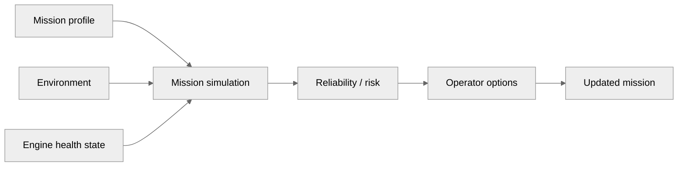

# Mission Planning & Simulation

## 1. Why mission planning belongs in the Digital Twin

Engine health becomes operationally meaningful when it changes what the vehicle can safely complete.

The intended closed loop is:

## 2. Mission planner concept

The browser experience should eventually let an operator define:

- origin,
- destination,
- return-to-base,
- waypoints,
- altitude,
- speed,
- throttle / power profile,
- loiter segments,
- environmental conditions,
- and mission phases.

## 3. Phase model

The existing project documentation describes phases such as:

- taxi out,
- takeoff,
- climb,
- cruise / transit,
- loiter / reconnaissance,
- dash,
- descent,
- approach / landing,
- taxi in,
- shutdown.

## 4. Engine-aware simulation

The simulator should connect mission conditions to engine operating conditions.

Examples:

- higher altitude → different air-density conditions,
- throttle change → power and thermal response,
- degraded cooling → different CHT / EGT trajectory,
- engine degradation → reduced available margin,
- route duration → cumulative life consumption.

## 5. Current vs roadmap

The project audit describes mission-profile definitions and reliability logic in the backend, while an integrated route / phase-builder browser workflow is a separate implementation target.

Keep these concepts distinct:

**existing analytical components ≠ completed mission-planner UI**

## 6. Web-native requirement

The target user experience is a browser-based mission workflow where the route, profile, engine state, simulation result, and 3D flight path are visible in one coherent application.

The final page should include a screenshot / recording once that integrated workflow exists.
