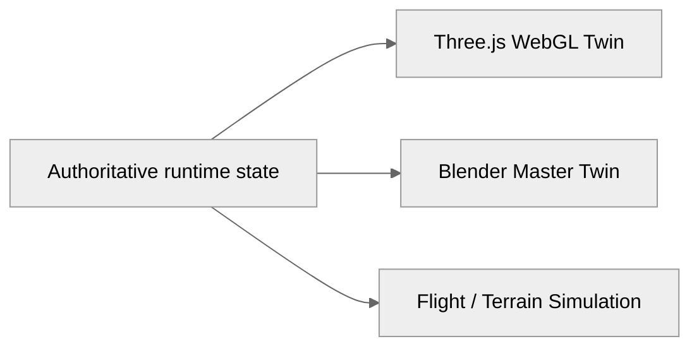

# 3D Twin, Simulation & Frontend

## 1. Three visualization tracks

## 2. Three.js WebGL twin

The web twin should visualize:

- engine geometry,
- component state,
- live telemetry,
- fault target highlighting,
- and synchronized status indicators.

The page should explain that the mesh is a visualization consumer of the runtime state, not the Digital Twin by itself.

## 3. Blender environment

Blender assets are used for high-fidelity visualization, authored environments, and desktop simulation workflows.

Document each asset with:

- filename,
- source,
- size,
- intended use,
- runtime location,
- web compatibility,
- and whether it is active or archival.

## 4. Browser performance

Document:

- GLB / Draco compression where used,
- model loading strategy,
- update frequency,
- WebSocket synchronization,
- and what state is interpolated client-side.

## 5. UX principle

The operator should never have to understand the implementation architecture to use the system.

The UI flow should read naturally:

**select engine → start / replay telemetry → inspect health → inspect anomaly → inspect predicted consequence → inspect mission impact**

## 6. Design language

- white / off-white canvas,
- black / charcoal typography,
- thin borders,
- restrained grays,
- no rainbow diagrams,
- no decorative gradients,
- technical labels,
- generous whitespace,
- diagrams that feel hand-drawn / engineering-notebook-like.
