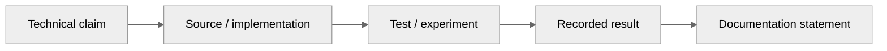

# Validation & Evidence

## 1. Evidence-first documentation

Every major claim should be traceable to one of:

- source code,
- automated test,
- experiment result,
- benchmark dataset,
- recorded UI behaviour,
- or an explicitly labelled assumption.

## 2. Evidence matrix

## 3. Current verification categories

### Software verification

Examples from the project documentation include:

- real-time runtime tests,
- sensor validation tests,
- FlyHash tests,
- ground-truth isolation checks,
- analytical-pipeline tests,
- link / blackbox integrity tests,
- multi-engine runtime tests.

### Data validation

Document:

- dataset name,
- source,
- license,
- sample count,
- train / validation / test split,
- fault labels,
- and exactly which component uses it.

### UI verification

For each major workflow, provide:

**Action → expected visual state → observed result → screenshot / recording**

## 4. Claims we should not make

Do not publish a sentence such as:

> “Validated on real DRDO UAV flight data”

unless the data is actually available for disclosure.

Instead state the current validation source precisely, for example:

> “Software behaviour has been verified using simulated / proxy data and automated tests; physical flight-data validation remains future work.”

## 5. Reproducibility

Each major experiment should have:

- command,
- environment,
- input data version,
- configuration,
- expected output,
- and captured result.
