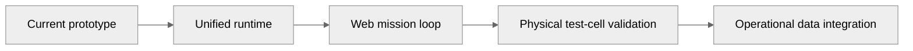

# Limitations, Assumptions & Roadmap

## 1. Why this page matters

A technical project becomes more credible when the boundary of the current implementation is explicit.

## 2. Current limitations

The current project documentation identifies limitations including:

- dependence on synthetic / proxy telemetry rather than operational DRDO flight telemetry,
- persistent long-history storage requiring further integration,
- some edge processing still implemented in Python rather than a final bare-metal runtime,
- portions of the mission-planning workflow requiring browser integration,
- and certain AI components being tested but not yet connected to every live runtime path.

## 3. Architecture maturity labels

Use these labels everywhere:

| Label | Meaning |
|---|---|
| **LIVE** | Connected to the current running application |
| **IMPLEMENTED** | Code exists and is locally testable, but may not be in the primary UI path |
| **PARTIAL** | Some pieces exist; integration or validation remains |
| **SIMULATED** | Behaviour is produced by a virtual plant / synthetic scenario |
| **ROADMAP** | Design target, not a current capability |

## 4. Roadmap

## 5. Engineering objective

The roadmap should move from:

**demonstrable software → integrated engineering system → experimentally calibrated digital twin**

rather than simply adding more AI components.
