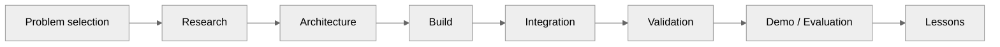

# Our SIH Journey

## 1. The story structure

The SIH section should read like an engineering chronicle, not a promotional timeline.

## 2. Chapter template

Every milestone should use this structure:

### What happened?

A concise factual description.

### What did we build?

Concrete repositories, modules, models, screens, diagrams, or experiments.

### What changed?

Explain how the architecture evolved.

### What failed?

Document discarded approaches and integration problems.

### Evidence

Attach the relevant:

- screenshot,
- commit,
- presentation,
- architecture diagram,
- benchmark,
- test output,
- or meeting / submission artifact.

## 3. Recommended chapters

1. Why we picked PS 26054
2. Understanding the Digital Twin requirement
3. Research phase
4. First architecture
5. Building the engine / physics layer
6. Building telemetry and diagnostics
7. AI/ML experiments
8. 3D twin and visualization
9. Mission planning evolution
10. Integration problems
11. Testing and evidence
12. Presentation / demonstration preparation
13. What we would change in a second iteration

## 4. Timeline rule

Dates must be sourced from actual evidence. Do not fabricate exact dates from memory.

Each timeline entry should contain:

`date → event → artifact → outcome`

## 5. Human side

A small amount of team context is useful:

- who owned which subsystem,
- how parallel work was coordinated,
- what was learned,
- and where architecture decisions changed because of implementation reality.

Keep this factual and avoid turning it into generic motivational content.
