# Technical Demonstration Runbook

## 1. Demo objective

The demonstration should feel like an engineering experiment rather than a dashboard tour.

## 2. Demonstration chain

```mermaid
%%{init: {'theme': 'neutral'}}%%
flowchart LR
    A[Initialize]
    B[Set operating condition]
    C[Start telemetry]
    D[Observe healthy baseline]
    E[Inject controlled fault]
    F[Watch residual divergence]
    G[Detect / diagnose]
    H[Estimate degradation / RUL]
    I[Propagate to mission]
    J[Review 3D / operator output]

    A --> B --> C --> D --> E --> F --> G --> H --> I --> J
```

## 3. For every demo step record

- input state,
- action,
- expected system behaviour,
- actual system behaviour,
- screenshot,
- relevant backend module,
- relevant test,
- and known limitation.

## 4. Fault injection principle

Faults should be progressive and physically interpretable.

For example:

**fault injection → affected sensor / subsystem → physics residual response → diagnostic hypothesis → maintenance / mission consequence**

## 5. Judge questions

Create a searchable technical FAQ covering:

- Is this actually a Digital Twin?
- Which data is real vs simulated?
- What is the role of physics?
- Why do we need residuals?
- What is FlyHash actually doing?
- Which models are trained?
- What data are they trained / calibrated on?
- How is sensor failure distinguished from engine failure?
- What happens during link loss?
- What can the AI command?
- How are RUL intervals validated?
- What remains unvalidated?
