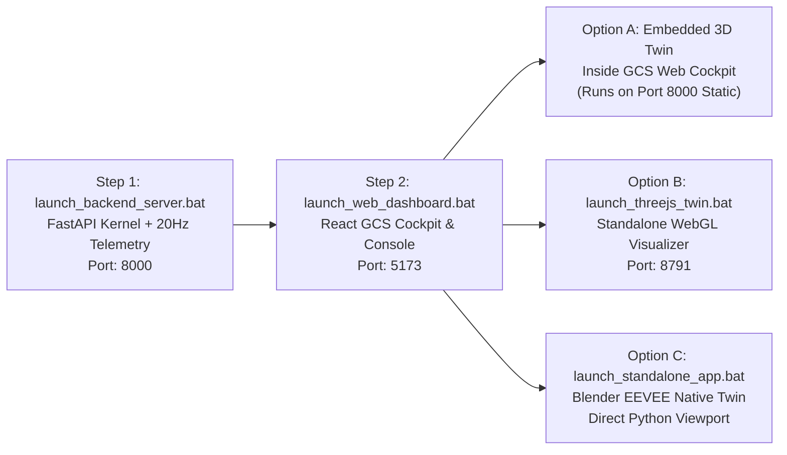

# PROJECT ANUMAAN // COMPLETE SYSTEM LAUNCH & DEMO GUIDE
## DRDO MALE UAV Aero-Piston Engine Digital Twin (SIH Problem Statement 26054)

---

## 1. Quick Start: The Recommended 3-Step Demo Startup
For the official hackathon demonstration or live presentation to judges, follow this **3-step startup sequence**:



### Step 1: Start the Authoritative Backend Server
Double-click or run:
```powershell
.\launch_backend_server.bat
```
* **Host & Port:** `http://127.0.0.1:8000` (and `0.0.0.0:8000` on your LAN IP)
* **What it does:**
  - Enforces UTF-8 console output (`PYTHONUTF8=1`).
  - Verifies Python dependencies (`fastapi`, `uvicorn`, `websockets`, `pydantic`).
  - Checks and releases port 8000 if occupied (`scripts/check_backend_port.ps1`).
  - Launches the Authoritative 20 Hz Telemetry, Health Diagnostics, Predictive AI (`FlyBrain`), Knowledge Base, and multi-engine `RuntimeHub`.
  - Exposes interactive OpenAPI docs at `http://127.0.0.1:8000/docs`.
  - Mounts 3D twin assets at `/apps/threejs_twin/` and CAD renders at `/assets/`.

### Step 2: Start the Web Dashboard & Ground Control Station (GCS)
In a separate terminal or by double-clicking:
```powershell
.\launch_web_dashboard.bat
```
* **Host & Port:** `http://127.0.0.1:5173` (served on `0.0.0.0:5173` for mobile phone/tablet LAN access)
* **What it does:**
  - Verifies Node.js dependencies (`frontend/node_modules`).
  - Automatically runs `npm run build` to generate an ultra-fast production bundle, then serves it via `vite preview --host 0.0.0.0 --port 5173`.
  - Provides the tactical Cockpit with real-time gauges, multi-engine runtime switcher, synthetic audio generator, offline voice copilot, and embedded interactive 3D digital twin.

### Step 3: Launch the 3D Digital Twin Visualizer
You have two choices depending on your demonstration setup:
* **Option A (All-in-One Web GCS):** Open `http://localhost:5173` in your browser. The embedded Three.js WebGL twin loads directly into the 3D viewport of the cockpit!
* **Option B (Dedicated High-Performance Three.js Window):** Run `.\launch_threejs_twin.bat`. Launches a dedicated hardware-accelerated Chrome/Edge app window at `http://localhost:8791` with full Draco-compressed CAD geometry, thermographic inspection shaders, exploded subsystem views, and bi-directional postMessage sync with the GCS.
* **Option C (Photorealistic Native Blender 3D Twin):** Run `.\launch_standalone_app.bat` or `.\launch_engine_showcase_menu.bat` to launch native Blender EEVEE viewport with live WebSocket telemetry synchronization.

---

## 2. Master Catalog of All 23 Batch Files (.bat)

Below is the exhaustive, categorized reference for all 23 `.bat` files in the repository:

### Category A: Core Servers & Web Interfaces

| Batch File | Target Component | Default URL / Port | Description |
| :--- | :--- | :--- | :--- |
| `launch_backend_server.bat` | FastAPI Digital Twin Server | `http://127.0.0.1:8000` | **Primary backend.** Runs 20 Hz multi-engine telemetry generator, fault injection engine, Bayesian/LSTM prognostic models, and REST/WebSocket APIs. |
| `launch_web_dashboard.bat` | Vite React Ground Control Station | `http://127.0.0.1:5173` | **Primary frontend.** Builds and serves the tactical GCS cockpit, gauge cluster, mission timer, voice copilot, and engine runtime console. |
| `launch_threejs_twin.bat` | Three.js WebGL Digital Twin | `http://localhost:8791` | **Dedicated 3D WebGL viewer.** Launches an isolated, GPU-optimized window with Draco 3D models, thermal heatmaps, exploded views, and telemetry overlays. |
| `launch_anumaan_site.bat` | Project ANUMAAN Showcase Site | `http://localhost:8080` | **Static presentation website.** Serves `web/site/` via Python HTTP server for architectural overviews, research deck, and documentation. |
| `launch_public_tunnel.bat` | Ngrok Global Internet Tunnel | Secure `https://*.ngrok-free.app` | **Cellular / remote bridge.** Exposes port 8000 to the public internet so a mobile phone or remote judge can control the twin over 4G/5G. |

---

### Category B: Interactive Blender 3D Showcases & Subsystem Inspectors

These batch files open Blender with custom Python inspection scripts (`apps/blender_twin/standalone_digital_twin_app.py`) pointing to the master 3D asset `assets/blender/anumaan_master_twin.blend` or `rotax_912_is_sport.blend`.

| Batch File | Engine / Target | Subsystems & Features | Key Shortcuts |
| :--- | :--- | :--- | :--- |
| `launch_engine_showcase_menu.bat` | **Interactive Master Menu** | Menu CLI permitting selection of any of the 5 aero engines, master switcher, or offline render gallery. | `1-5`: Select engine<br/>`6`: Master App<br/>`7`: Renders folder |
| `launch_standalone_app.bat` | **Master Blender Twin** | Boots `assets/blender/rotax_912_is_sport.blend` and connects to backend telemetry via WebSocket (`ws://127.0.0.1:8000/ws/blender`). | `1-5`: Focus subsystems<br/>`0`: Reset view<br/>`ESC`: Exit |
| `launch_rotax_912is_showcase.bat` | **Rotax 912 iS Sport (100 HP)** | Inspects: Prop Gearbox, Airbox/Dual Injectors, Exhaust Header, ECU/FADEC, Oil Tank. | `1`: Gearbox `2`: Induction `3`: Exhaust `4`: ECU `5`: Oil |
| `launch_rotax_914_showcase.bat` | **Rotax 914 F Turbo (115 HP)** | Inspects: Prop Gearbox, Dual Induction Manifold, Scavenging Exhaust, Garrett Turbocharger & Wastegate, TCU. | `1`: Gearbox `2`: Manifold `3`: Exhaust `4`: Turbo `5`: TCU |
| `launch_rotax_915is_showcase.bat` | **Rotax 915 iS Turbo (141 HP)** | Inspects: Prop Reduction Unit, Intercooler & Charge Piping, Twin Exhaust, Turbocharger, Dual-Channel FADEC. | `1`: Reduction `2`: Intercooler `3`: Exhaust `4`: Turbo `5`: FADEC |
| `launch_austro_ae300_showcase.bat` | **Austro Engine AE300 (180 HP)** | Inspects: Common Rail High-Pressure Pump & Injectors, Variable Geometry Turbo (VGT), Dual EECS FADEC, Oil Heat Exchanger. | `1`: Common Rail `2`: VGT Turbo `3`: Intercooler `4`: EECS `5`: Heat Exch |
| `launch_vrde_jayem_2_2l_showcase.bat` | **DRDO VRDE Jayem 2.2L (180 HP)** | Inspects: Indigenous Common Rail System, Heavy-Fuel 2-Stage Turbocharger, Mil-Spec Dual FADEC, Integrated Starter-Gen. | `1`: Rail `2`: Turbo `3`: FADEC `4`: Starter-Gen `5`: Sump |

---

### Category C: Engine Quick-Launch Shortcuts

Convenient alias scripts that set `ANUMAAN_ENGINE_ID` and delegate to `launch_standalone_app.bat`:

| Batch File | Target Engine ID | Command Delegated |
| :--- | :--- | :--- |
| `launch_rotax_912is.bat` | `rotax_912is` | `call launch_standalone_app.bat rotax_912is` |
| `launch_rotax_914.bat` | `rotax_914` | `call launch_standalone_app.bat rotax_914` |
| `launch_rotax_915is.bat` | `rotax_915is` | `call launch_standalone_app.bat rotax_915is` |
| `launch_austro_ae300.bat` | `austro_ae300` | `call launch_standalone_app.bat austro_ae300` |
| `launch_vrde_jayem_2_2l.bat` | `vrde_jayem_2_2l` | `call launch_standalone_app.bat vrde_jayem_2_2l` |

---

### Category D: Direct CAD File Blender Viewport Launchers

Launches the raw CAD `.blend` files directly in Blender without the background telemetry bridge script, ideal for examining high-poly geometry and wireframe topology:

| Batch File | Blend File Path | Description |
| :--- | :--- | :--- |
| `launch_rotax_914_cad.bat` | `assets/blender/rotax_914.blend` | Direct CAD model of the Rotax 914 F Turbocharged aero engine. |
| `launch_rotax_915_cad.bat` | `assets/blender/rotax_915is.blend` | Direct CAD model of the Rotax 915 iS Turbocharged/Intercooled engine. |
| `launch_austro_ae300_cad.bat` | `assets/blender/austro_ae300.blend` | Direct CAD model of the Austro AE300 Common-Rail Turbodiesel. |
| `launch_vrde_jayem_2_2l_cad.bat` | `assets/blender/vrde_jayem_2_2l.blend` | Direct CAD model of the DRDO VRDE / Jayem 2.2L Indigenous Heavy-Fuel Turbodiesel. |

---

### Category E: Tactical Flight & Mission Analytics

Specialized simulation environments demonstrating operational MALE UAV flight and mission data intelligence:

| Batch File | Module Executed | Description & Controls |
| :--- | :--- | :--- |
| `launch_canyon_simulation.bat` | `apps/blender_twin/standalone_canyon_flight_app.py`<br/>over `assets/models/terrain.blend` | **Ladakh Tactical Flight Simulator.** Real-time flight physics across Himalayan canyon terrain with Ground Collision Avoidance System (Auto-GCAS).<br/>*Controls:* `W/S` Pitch, `A/D` Turn, `E/Q` Throttle, `7/8/9/0` Airspeed presets (140/180/234/264 kt), `C` Copilot, `R` Reset, `ESC` Exit. |
| `launch_mission_graph.bat` | `apps/mission_graph_viewer/standalone_mission_graph_app.py` | **3D Mission Knowledge Graph Explorer.** Renders interactive 3D node-link graph of past UAV sorties, failure clusters, sensor correlations, and maintenance actions from `report_dump/`.<br/>*Controls:* Left Click + Drag to Orbit, Left Click on node to inspect, Scroll Wheel to Zoom, `R` to rescan directory. |

---

## 3. Step-by-Step Hackathon Judge Demonstration Runbook

To demonstrate the full capability of the digital twin to the evaluation panel, follow this script:

### Step 1: Initialize System Infrastructure
1. Open PowerShell and run:
   ```powershell
   .\launch_backend_server.bat
   ```
2. Wait 3 seconds until you see:
   ```text
   [OK] Dependencies verified.
   [OK] Port 8000 is clean.
   INFO: Uvicorn running on http://0.0.0.0:8000 (Press CTRL+C to quit)
   ```
3. Open a second PowerShell window and run:
   ```powershell
   .\launch_web_dashboard.bat
   ```
4. The production build will bundle and serve on `http://127.0.0.1:5173`. Open this URL in Google Chrome or Microsoft Edge.

### Step 2: Demonstrate Multi-Engine Capabilities
1. In the Web Cockpit, navigate to the **Multi-Engine Runtime Console**.
2. Show the judges the 5 available propulsion configurations:
   - **Rotax 912 iS Sport:** 100 HP, naturally aspirated, dual redundancy ECU.
   - **Rotax 914 F:** 115 HP, turbocharger with electronic wastegate servomotor.
   - **Rotax 915 iS:** 141 HP, turbocharger + intercooler, dual ECU lane architecture.
   - **Austro Engine AE300:** 180 HP, Jet-A1 common rail turbodiesel.
   - **DRDO VRDE Jayem 2.2L:** 180 HP, indigenous MALE UAV heavy-fuel turbodiesel engine.
3. Switch active engine to **Rotax 915 iS**. Notice how:
   - The authoritative physics engine updates operating pressures, RPM, MAP, and EGT limits instantly.
   - The 3D Digital Twin automatically swaps CAD models to the Rotax 915 iS geometry via postMessage synchronization!

### Step 3: Demonstrate Fault Injection & Health Diagnostics
1. On the Web GCS, click **Inject Fault** -> **Turbo Boost Wastegate Leak** (or **Fuel Filter Clog**).
2. Point out the chain of events:
   - EGT rises, Manifold Pressure drops below commanded target.
   - The **CUSUM & Bayesian Changepoint algorithms** trigger anomaly warnings in < 250 milliseconds.
   - The **FlyBrain Anomaly Scorer** flags the degrading subsystem.
   - The 3D Twin highlights the affected component (Garrett Turbo / Wastegate) in flashing red thermal stress visualization.
   - The **Offline Voice Copilot** speaks out: *"Caution: Manifold pressure dropping. Suspected turbocharger wastegate leak."*

### Step 4: Demonstrate Tactical Ladakh Canyon Flight & GCAS
1. Open a third terminal and run:
   ```powershell
   .\launch_canyon_simulation.bat
   ```
2. Show the UAV flying through high-altitude Himalayan valleys at 15,000 ft density altitude.
3. Demonstrate real-time engine telemetry fluctuating with climb rates, ambient pressure lapse, and terrain elevation.

### Step 5: Post-Mission Analytics & Knowledge Graph
1. Run:
   ```powershell
   .\launch_mission_graph.bat
   ```
2. Show the panel the post-flight diagnostics graph connecting mission flight logs, identified fault modes, MIL-STD-1553 bus health, and automated maintenance work orders.

---

## 4. Port and Network Reference Table

| Port | Protocol | Service | Bind Address |
| :--- | :--- | :--- | :--- |
| `8000` | HTTP / WS | FastAPI Authoritative Engine, Telemetry WS, Static 3D Twin | `0.0.0.0:8000` |
| `5173` | HTTP | React Web GCS Cockpit & Multi-Engine Console | `0.0.0.0:5173` |
| `8791` | HTTP | Dedicated Standalone Three.js 3D Twin Client | `127.0.0.1:8791` |
| `8080` | HTTP | Project ANUMAAN Presentation & Architecture Landing Site | `127.0.0.1:8080` |

---

## 5. Troubleshooting & FAQ

* **Port 8000 or 5173 is already in use:**
  `launch_backend_server.bat` automatically runs `scripts/check_backend_port.ps1` to detect and offer termination of stale processes. Alternatively, run:
  ```powershell
  Get-NetTCPConnection -LocalPort 8000, 5173 | ForEach-Object { Stop-Process -Id $_.OwningProcess -Force }
  ```
* **Blender fails to launch with "executable not found":**
  Ensure Blender 4.2+ or 5.x is installed in `E:\Blender\blender.exe` or `C:\Program Files\Blender Foundation\Blender <version>\blender.exe`, or added to your system `PATH`.
* **WebGL 3D Twin fails to load in browser:**
  Verify that hardware acceleration is enabled in Chrome/Edge settings (`chrome://settings/system` -> "Use graphics acceleration when available").
