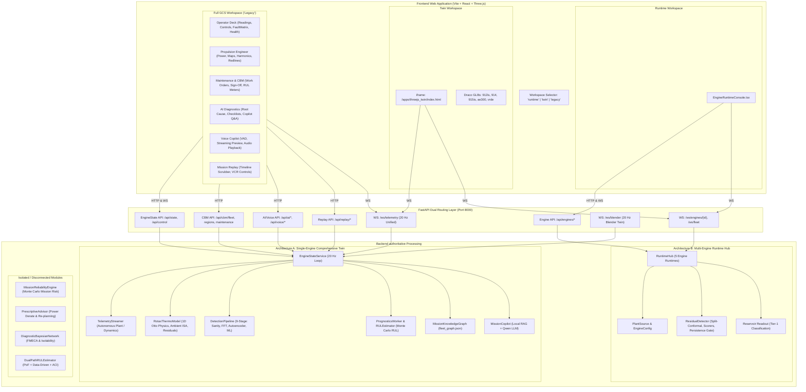

# COMPREHENSIVE SYSTEM AUDIT & INTEGRATION BLUEPRINT

## DRDO Aero-Twin Propulsion Digital Twin Platform (Project ANUMAAN)

**Problem Statement ID:** SIH 26054  

**Classification:** Engineering Audit & System Integration Blueprint  

**Repository:** `Aayush-Deshpande/Maverick` (`d:\Programming\PS054`)  

**Target Branch:** `maverick-main` (HEAD: `317c3a5`)  

**Date of Audit:** September 2026  

**Auditor:** Antigravity System Audit Agent  

---

## 1. Executive Summary

This audit establishes the definitive baseline of the DRDO Aero-Twin (Project ANUMAAN) MALE UAV propulsion digital twin platform. Over 300 unit and integration tests, 20 Hz real-time telemetry pipelines, physics and spectral estimators, AI/RAG reasoning engines, 3D Draco GLB models, and Vite+React frontends were analyzed, tested at runtime, and cross-referenced with documentation.

### Core Audit Verdict

1. **The System is Rich in Depth but Architecturally Bifurcated:** The repository contains two distinct, parallel architectures that have evolved independently:

   - **Architecture A ("Authoritative 912 iS Single-Engine GCS"):** Built around `backend/server/engine_service.py` (`EngineStateService`). It drives 20 Hz deterministic physics, 14 residuals, 9-stage ML detection, Monte Carlo RUL degradation, condition-based maintenance work orders (`fleet_graph.json`), ATA-certified diagnostics, local semantic RAG, and live debrief reporting. It powers the rich "Legacy GCS" tab suite (Operator, Propulsion, Maintenance, AI Diagnostics, Voice Copilot, Mission Replay).

   - **Architecture B ("Multi-Engine Runtime Hub"):** Built around `backend/runtime/hub.py` (`RuntimeHub`) and `backend/server/engine_api.py`. It runs five concurrent multi-engine profiles (`rotax_912is`, `rotax_914`, `rotax_915is`, `austro_ae300`, `vrde_jayem_2_2l`), residual scorers, conformal thresholds, and tier-1 reservoir readouts. It powers the new `EngineRuntimeConsole` in the frontend.

2. **Frontend Disconnection Crisis:**

   - In `frontend/src/App.tsx`, the default view state was set to `'runtime'`, hiding the entire mature 6-tab operational cockpit inside a button labeled `'legacy'`.

   - The multi-engine console (`EngineRuntimeConsole.tsx`) displays only raw telemetry channels and basic scorer ratios; it has **no connection** to Subsystem Health, Conformal RUL, CBM Maintenance work orders, AI diagnostics, or Voice Copilot.

   - The 3D Twin (`apps/threejs_twin`) is embedded in an `<iframe>` and dynamically routes between `/ws/telemetry` (Architecture A) and `/ws/engines/{id}` (Architecture B), but lacks bidirectional synchronisation with the outer React controls.

3. **Critical Broken Loops Identified:**

   - **Mission Replay Telemetry 404:** The backend `ReplayEngine` (`backend/telemetry/replay_engine.py`) searches for `readings/telemetry_log.csv` inside `report_dump/mission_xxx/`. No such CSV exists in those directories (they are stored in `data/telemetry/live_sorties/`), causing all scrubber playback requests (`/api/replay/{id}/frame`) to fail with HTTP 404.

   - **Unconnected Mission Reliability Engine:** `backend/mission/reliability.py` (`MissionReliabilityEngine`) and `backend/mission/prescriptive.py` (`PrescriptiveAdvisor`) compute rigorous Monte Carlo mission completion probabilities and derate ladders, yet **no API endpoint or UI card calls them**.

   - **Voice Model Path Failure:** `LocalWhisperSTT` and `LocalKokoroTTS` crash gracefully on startup because model binaries (`Voice/ggml-tiny.en.bin` and `Voice/Kokoro-82M`) are absent from disk.

   - **Test Harness Hardcoded Path Bug:** `tests/test_camera_transitions.py` failed during collection due to a developer machine hardcoded path (`e:\backup-llm\backup-no-llm\3d_engine`), masking test results until bypassed.

---

## 2. Current System Architecture



---

## 3. Backend Capability Inventory

| Subsystem / Module | File Path | Primary Class / Function | Runtime Status | Test Coverage |

| :--- | :--- | :--- | :--- | :--- |

| **FastAPI Core Server** | `backend/server/main.py` | `app`, `lifespan`, `broadcast_telemetry_loop` | Online (Verified 20 Hz) | `tests/test_server_api.py` |

| **Engine State Service** | `backend/server/engine_service.py` | `EngineStateService` | Online (Authoritative) | `tests/test_causal_propagation.py` |

| **Engine Multi-API** | `backend/server/engine_api.py` | `router`, `get_hub` | Online (Lazy Init) | `tests/test_engine_api.py` |

| **1D Thermo Physics** | `backend/physics/thermo_model.py` | `RotaxThermoModel` | Active in 20 Hz loop | `tests/test_physics_and_telemetry.py` |

| **Telemetry Streamer** | `backend/telemetry/can_streamer.py` | `TelemetryStreamer` | Active (Plant Generator) | `tests/test_physics_and_telemetry.py` |

| **Independent Plant** | `backend/plant/adapter.py` | `IndependentPlantAdapter` | Opt-in via Env Var | `tests/test_independent_plant_adapter.py` |

| **Sensor Sanity** | `backend/physics/sensor_validator.py` | `SensorSanityValidator` | Active in Stage 1 | `tests/test_analytical_pipeline.py` |

| **Detection Pipeline** | `backend/ml/detection_pipeline.py` | `DetectionPipeline` | Active (9 stages) | `tests/test_analytical_pipeline.py` |

| **Residual Autoencoder** | `backend/ml/anomaly_detector.py` | `ResidualAutoencoder` | Active in Stage 3 | `tests/test_analytical_pipeline.py` |

| **Gearbox Spectral FFT** | `backend/ml/spectral_analyser.py` | `GearboxSpectralAnalyser` | Active in Stage 4 | `tests/test_analytical_pipeline.py` |

| **FlyHash Novelty** | `backend/ml/flyhash_novelty.py` | `FlyNoveltyDetector` | Active in Stage 5 | `tests/test_flyhash_novelty.py` |

| **Trend & Prognostics** | `backend/ml/trend_analyser.py` | `PrognosticsWorker`, `ScoreBuffer` | Active 20s Daemon | `tests/test_analytical_pipeline.py` |

| **RUL Estimator** | `backend/ml/rul_estimator.py` | `RULEstimator` | Active in 20 Hz loop | `tests/test_fun_req_compliance.py` |

| **Diagnostic Agent** | `backend/agent/diagnostic_agent.py` | `DiagnosticAgent` | Active (ATA rules) | `tests/test_agent_and_graph.py` |

| **Mission Copilot** | `backend/agent/copilot.py` | `MissionCopilot` | Active (Semantic RAG) | `tests/test_copilot_and_knowledge.py` |

| **Local Knowledge RAG** | `backend/knowledge/retrieval/local_store.py` | `LocalKnowledgeStore` | Active (Sentence-Transformers) | `tests/test_copilot_and_knowledge.py` |

| **Voice STT Engine** | `backend/voice/stt_engine.py` | `LocalWhisperSTT` | Offline (Missing Model) | `tests/test_voice_copilot.py` |

| **Voice TTS Engine** | `backend/voice/tts_engine.py` | `LocalKokoroTTS` | Offline (Missing Model) | `tests/test_voice_copilot.py` |

| **Mission Graph DB** | `backend/graph/mission_graph.py` | `MissionKnowledgeGraph` | Active (`fleet_graph.json`) | `tests/test_agent_and_graph.py` |

| **Post-Flight Debrief** | `backend/graph/mission_reporter.py` | `MissionReporter` | Active (Markdown / PDF) | `tests/test_agent_and_graph.py` |

| **Replay Engine** | `backend/telemetry/replay_engine.py` | `ReplayEngine` | Partial (Missing CSVs) | `tests/test_edge_and_replay.py` |

| **Multi-Engine Hub** | `backend/runtime/hub.py` | `RuntimeHub` | Active (5 Engines) | `tests/test_runtime_hub.py` |

| **Engine Runtime** | `backend/runtime/engine_runtime.py` | `EngineRuntime` | Active per engine | `tests/test_runtime_hub.py` |

| **Residual Detector** | `backend/detect/detector.py` | `ResidualDetector` | Active in RuntimeHub | `tests/test_detect_stack.py` |

| **Bayesian Diagnostics**| `backend/diagnose/bn.py` | `DiagnosticBayesianNetwork` | Disconnected from API | `tests/test_diag_stack.py` |

| **Dual-Path RUL** | `backend/prognose/rul.py` | `DualPathRULEstimator` | Disconnected from API | Untested in Live Loop |

| **Mission Reliability** | `backend/mission/reliability.py` | `MissionReliabilityEngine` | Disconnected from API | `tests/test_char_mission.py` |

| **Prescriptive Advisory**| `backend/mission/prescriptive.py`| `PrescriptiveAdvisor` | Disconnected from API | `tests/test_char_mission.py` |

---

## 4. Frontend Capability Inventory

| Screen / Component | File Location | Intended Function | Backend Hook / Source | Actual Status |

| :--- | :--- | :--- | :--- | :--- |

| **Header** | `src/components/Header.tsx` | Status indicators, UTC clock, Role selector, Settings modal | `useTelemetrySocket` state | Connected (Hidden in runtime mode) |

| **Engine Runtime Console**| `src/components/EngineRuntimeConsole.tsx` | Multi-engine selector, fleet cards, lever sliders, fault injector, channel list | `useEngineRuntime` (`/api/engines`, `/ws/fleet`, `/ws/engines/{id}`) | Fully Functional (Default workspace) |

| **3D Engine Twin (iframe)**| `apps/threejs_twin/index.html` via `App.tsx` | Interactive 3D WebGL engine viewer, camera presets, fault highlighting, audio pitch | `/ws/telemetry` & `/ws/engines/{id}` | Fully Functional (Standalone iframe) |

| **Engine Controls** | `src/components/EngineControls.tsx` | Throttle slider/presets, Start/Stop ignition, Mission regimes (Ladakh, Thar, etc.) | `sendCommand` -> `/api/control` or WS | Fully Functional (Inside 'legacy' workspace) |

| **DRDO Fault Matrix** | `src/components/FaultMatrix.tsx` | 8 canonical DRDO fault triggers, Reset nominal, Export debrief | `sendCommand` -> `/api/control` or WS | Fully Functional (Inside 'legacy' workspace) |

| **Readings Panel** | `src/components/ReadingsPanel.tsx` | 14 physics channels table (Actual, Expected, Residual, Z-Score, Limits) | `state.telemetry`, `state.analytics.residuals` | Fully Functional (Inside 'legacy' workspace) |

| **Calculations Panel** | `src/components/CalculationsPanel.tsx` | 4 math cards: Physics Residual, Z-Composite Autoencoder, Sensor Sanity, Conformal Decision | `state.telemetry`, `state.analytics` | Fully Functional (Inside 'legacy' workspace) |

| **Mission Readiness** | `src/components/MissionReadinessCard.tsx`| Go/No-Go banner, Limiting component RUL, Per-component Monte Carlo RUL table | `state.analytics.go_no_go`, `rul_by_component` | Fully Functional (Inside 'legacy' workspace) |

| **Subsystem Health** | `src/components/SubsystemHealthCard.tsx`| 5 physical health bars: Propulsion, Fuel, Electrical, Thermal, Mechanical | `state.analytics.subsystem_health` | Fully Functional (Inside 'legacy' workspace) |

| **Propulsion Console** | `src/components/PropulsionEngineerPanel.tsx`| Power & brake envelope, FADEC maps, harmonics, conventional vs twin lead-time | `state.telemetry`, `state.analytics.threshold_baseline` | Fully Functional (Inside 'legacy' workspace) |

| **Maintenance Terminal**| `src/components/MaintenanceDashboardPanel.tsx`| Work order queue, Inspector cryptographic sign-off, Component wear meters, Sensor sanity | `/api/cbm/maintenance`, `/signoff` | Fully Functional (Inside 'legacy' workspace) |

| **AI Diagnostics** | `src/components/DiagnosticCard.tsx` | Diagnosed fault directive, ATA chapter, Causal chain, SOP checklist, Copilot chat | `/api/ai/ask`, `state.analytics` | Fully Functional (Inside 'legacy' workspace) |

| **Voice Copilot** | `src/components/VoiceCopilot.tsx` | Continuous VAD mic capture, streaming thinking preview, Kokoro audio playback | `/api/voice/*` | Partial (Backend models missing on disk) |

| **Mission Replay** | `src/components/MissionReplayScrubber.tsx`| Sortie selector, timeline scrubber, event markers, dial readouts, VCR playback | `/api/replay/*` | Broken (Telemetry CSV missing in backend) |

---

## 5. Backend → Frontend Coverage Matrix

| Backend Capability | Backend Source Location | Output Data / Schema | API / WS Route | Frontend Consumer | Status | Required Action / Fix |

| :--- | :--- | :--- | :--- | :--- | :--- | :--- |

| **Unified 20 Hz Telemetry** | `backend/server/engine_service.py` | `UnifiedTelemetryState` | `/ws/telemetry`, `/api/state` | `useTelemetrySocket.ts` | **Connected** | Promote from hidden 'legacy' tab to top-level view |

| **Multi-Engine Telemetry** | `backend/runtime/hub.py` | `Tick` (frame channels, ratios, scores) | `/ws/engines/{id}`, `/ws/fleet` | `useEngineRuntime.ts` | **Connected** | Merge telemetry stream types so all panels read it |

| **Sensor Sanity & Shielding**| `backend/physics/sensor_validator.py`| `SanityReport` (failed_channels, drift) | Included in `analytics.sensor_sanity` | `ReadingsPanel`, `MaintenanceDashboard` | **Connected** | None |

| **Physics Residuals (14 Ch)**| `backend/physics/thermo_model.py` | `ResidualVector` (`d_CHT`, `d_EGT`, etc.) | Included in `analytics.residuals` | `ReadingsPanel`, `CalculationsPanel` | **Connected** | None |

| **Autoencoder Anomaly Score**| `backend/ml/anomaly_detector.py` | `anomaly_score` (0.0 to 1.0) | Included in `analytics.anomaly_score`| `CalculationsPanel`, `Header` | **Connected** | None |

| **Gearbox Spectral FFT** | `backend/ml/spectral_analyser.py` | `SpectralReport` (kurtosis, orders) | Internal to pipeline | `PropulsionEngineerPanel` | **Partial** | Wire spectral report directly into state schema |

| **FlyHash Novelty Score** | `backend/ml/flyhash_novelty.py` | `NoveltyReport` (hash match, LSH) | Internal to pipeline | None | **Missing** | Expose novelty score in `AnalyticsState` |

| **DRDO Fault Injection** | `backend/telemetry/can_streamer.py`| `active_commanded_fault_id` (0..8) | `/api/control` (`SET_FAULT`) | `FaultMatrix.tsx` | **Connected** | Standardize IDs between 912is and multi-engine |

| **Multi-Engine Faults** | `backend/runtime/engine_runtime.py`| `mode`, `cylinder`, `severity` | `/api/engines/{id}/faults` | `EngineRuntimeConsole.tsx` | **Connected** | Map to canonical DRDO fault names |

| **ATA Diagnostic Reasoning**| `backend/agent/diagnostic_agent.py`| `DiagnosticDirective` (ATA, root cause) | Included in `analytics` payload | `DiagnosticCard.tsx` | **Connected** | None |

| **Bayesian Hypothesis BN** | `backend/diagnose/bn.py` | `List[Hypothesis]` (posterior probs) | None (Unexposed) | None | **Missing** | Expose BN hypothesis list in `/api/state` |

| **Subsystem Health Index** | `backend/server/engine_service.py` | 5 health floats (0.15 - 1.0) | `analytics.subsystem_health` | `SubsystemHealthCard.tsx` | **Connected** | Expose in `EngineRuntimeConsole` |

| **Prognostics Monte Carlo**| `backend/ml/trend_analyser.py` | `rul_by_component`, `early_trend` | `analytics.rul_by_component` | `MissionReadinessCard.tsx` | **Connected** | None |

| **Conformal Prediction RUL**| `backend/ml/rul_estimator.py` | `conformal_rul` (p10/p50/p90) | `analytics.conformal_rul` | `MaintenanceDashboardPanel` | **Connected** | Note: Documented as heuristic, not calibrated |

| **Dual-Path Conformal RUL** | `backend/prognose/rul.py` | `RULEstimate` (PoF + Data + ACI) | None (Unexposed) | None | **Missing** | Wire `DualPathRULEstimator` to replace heuristic |

| **Mission Reliability MC** | `backend/mission/reliability.py` | $R = P(\text{completion})$, Wilson CI | None (Unexposed) | None | **Missing** | Create `/api/mission/reliability` route & UI card |

| **Prescriptive Re-planning**| `backend/mission/prescriptive.py`| `DerateOption`, `ReplanResult` | None (Unexposed) | None | **Missing** | Expose derate ladder in `MissionReadinessCard` |

| **Mission Knowledge Graph** | `backend/graph/mission_graph.py` | `fleet_graph.json` work orders | `/api/cbm/maintenance` | `MaintenanceDashboardPanel` | **Connected** | Add live WebSocket push for new work orders |

| **Inspector CBM Sign-Off** | `backend/graph/mission_graph.py` | Updated node with inspector tag | `/api/cbm/maintenance/{id}/signoff` | `MaintenanceDashboardPanel` | **Connected** | None |

| **Semantic Manual RAG Q&A** | `backend/agent/copilot.py` | Natural language text + citations | `/api/ai/ask` | `DiagnosticCard.tsx` | **Connected** | Add streaming token response |

| **Voice STT / TTS** | `backend/voice/` | Transcripts & synthesized audio | `/api/voice/converse` | `VoiceCopilot.tsx` | **Broken** | Fallback to browser Web Speech API when offline |

| **Historical Mission Replay**| `backend/telemetry/replay_engine.py`| Manifests & time-series frames | `/api/replay/*` | `MissionReplayScrubber.tsx` | **Broken** | Point `ReplayEngine` to `data/telemetry/live_sorties` |

| **3D CAD Mesh Highlighting**| `backend/server/engine_service.py` | `target_3d_mesh`, `target_parts` | Included in `analytics` | `apps/threejs_twin/index.html` | **Connected** | Fix injector mesh locator reference |

---

## 6. Frontend → Backend Coverage Matrix

| Frontend Component | UI Element / Interaction | Expected Backend Behavior | Actual Backend Connection | Status / Disconnect Detail |

| :--- | :--- | :--- | :--- | :--- |

| `App.tsx` | Workspace Tabs (`runtime`, `twin`, `legacy`) | Unified platform interface | Three disparate views with distinct state models | **Fragmented UX:** User has to toggle workspaces |

| `EngineRuntimeConsole` | Engine Dropdown Selector | Switches active simulated engine | `POST /api/engines/select` | **Working:** Hub switches selected engine and warms heavy |

| `EngineRuntimeConsole` | Flight Condition Sliders | Sets throttle, altitude, OAT | `POST /api/engines/{id}/levers` | **Working:** Sets plant first-order dynamics |

| `EngineRuntimeConsole` | Fault Injection Dropdown | Injects valid fault mode | `POST /api/engines/{id}/faults` | **Working:** Injects profile-valid fault |

| `EngineRuntimeConsole` | Fleet Status Cards | Shows status of all 5 engines | `/ws/fleet` | **Working:** 20 Hz compact fleet status stream |

| `EngineControls.tsx` | Start / Stop Engine button | Toggles engine running state | `POST /api/control` (`START_ENGINE`) | **Working:** Toggles `is_engine_running` |

| `EngineControls.tsx` | Throttle Slider & Presets | Modulates engine RPM & power | `POST /api/control` (`SET_THROTTLE`) | **Working:** Real-time update in `EngineStateService` |

| `EngineControls.tsx` | Mission Regimes (SIM-05..08) | Sets altitude and OAT presets | `POST /api/control` (`SET_REGIME`) | **Working:** Sets Ladakh, Thar, Pokhran, Rann of Kutch |

| `FaultMatrix.tsx` | 8 Fault Buttons (F1..F8) | Triggers progressive fault ramp | `POST /api/control` (`SET_FAULT`) | **Working:** Ramps fault severity over 6-8 seconds |

| `FaultMatrix.tsx` | Reset Nominal button | Clears active faults | `POST /api/control` (`CLEAR_FAULT`) | **Working:** Clears faults and resets detector gate |

| `FaultMatrix.tsx` | CBM Debrief button | Generates mission report | `POST /api/debrief` | **Working:** Generates Markdown in `data/mission_reports` |

| `ReadingsPanel.tsx` | 14-Channel Telemetry Table | Live sensor vs baseline display | `/ws/telemetry` frame | **Working:** Computed live from physics residuals |

| `CalculationsPanel.tsx`| 4 Formulation Cards | Mathematical verification | `/ws/telemetry` frame | **Working:** Live formulas calculate Z-scores and limits |

| `MissionReadinessCard` | Go/No-Go Feasibility Card | Mission abort advisory | `analytics.go_no_go` | **Working:** Derived from Monte Carlo RUL vs planned hours |

| `MissionReadinessCard` | Subsystem RUL Table | Per-component p10/p50/p90 RUL | `analytics.rul_by_component` | **Working:** Shows 6 monitored components when degrading |

| `SubsystemHealthCard` | 5 Health Index Gauges | Subsystem degradation meters | `analytics.subsystem_health` | **Working:** Derived from physics residuals and penalties |

| `PropulsionEngineer` | Power & Efficiency Gauges | Shaft power, BSFC, thermal eff | `telemetry.POWER_KW`, `BSFC_G_KWH` | **Working:** Calculated by `RotaxThermoModel` |

| `PropulsionEngineer` | Vibration Orders | Crank, Prop, Gear-mesh Hz | Derived from `ENGINE_RPM` | **Working:** Calculated from gearbox reduction ratio |

| `PropulsionEngineer` | Baseline Comparator | Conventional vs Twin lead-time | `analytics.threshold_baseline` | **Working:** Records timestamp delta between detection & breach |

| `MaintenanceDashboard`| Work Order Queue | Open/Closed action cards | `GET /api/cbm/maintenance` | **Working:** Polled every 5s from `fleet_graph.json` |

| `MaintenanceDashboard`| Inspector Sign-Off Form | Closes work order | `POST /api/cbm/maintenance/{id}/signoff` | **Working:** Cryptographically tagged; rejects double sign-off (409) |

| `DiagnosticCard.tsx` | AI Diagnostic Directive Card | ATA chapter, root cause, SOP | `analytics.root_cause`, `checklist` | **Working:** Populated deterministically by `DiagnosticAgent` |

| `DiagnosticCard.tsx` | Ask Copilot Question Form | Free-text technical query | `POST /api/ai/ask` | **Working:** Retrieved via local semantic RAG with citations |

| `VoiceCopilot.tsx` | Push-to-Talk / Continuous Mic | Spoken voice interaction | `POST /api/voice/converse` | **Broken:** Model files missing; falls back to text/error |

| `MissionReplayScrubber`| Sortie Select Dropdown | Loads past sortie timeline | `GET /api/replay/manifests` | **Working:** Lists sorties from `report_dump` |

| `MissionReplayScrubber`| Play/Pause/Seek Scrubber | Time-series gauge playback | `GET /api/replay/{id}/frame` | **Broken:** Fails with 404 because CSV file is missing |

---

## 7. API Audit

| HTTP Method | Path | Backend Handler | Request Schema | Response Schema | Verified Status | Issues / Notes |

| :--- | :--- | :--- | :--- | :--- | :--- | :--- |

| `GET` | `/` | `root()` | None | Service metadata | 200 OK | Provides API sitemap |

| `GET` | `/api/health` | `get_health()` | None | `ServerHealthResponse` | 200 OK | Loop frequency, connected clients, sortie ID |

| `GET` | `/api/state` | `get_current_state()` | None | `UnifiedTelemetryState` | 200 OK | Authoritative 27 channels + analytics payload |

| `POST` | `/api/control` | `post_control_command()`| `ControlCommand` | Action confirmation | 200 OK | Validated with START, SET_FAULT, CLEAR_FAULT |

| `POST` | `/api/debrief` | `export_cbm_debrief()` | None | Status + `report_path` | 200 OK | Writes `.md` in `data/mission_reports/` |

| `GET` | `/api/cbm/fleet` | `get_fleet_cbm_summary()`| None | Summary dict | 200 OK | Reads `fleet_graph.json` |

| `GET` | `/api/cbm/regions`| `get_region_comparison()`| None | Region stats dict | 200 OK | Compares Ladakh vs Thar desert |

| `GET` | `/api/cbm/maintenance`| `list_maintenance_work_orders()`| Query: `?status=` | `{"work_orders": [...]}` | 200 OK | Sorted newest first |

| `POST` | `/api/cbm/maintenance/{id}/signoff`| `signoff_maintenance_action()`| `MaintenanceSignoffRequest`| Updated node | 200 OK / 409 | Rejects duplicate sign-off with 409 |

| `GET` | `/api/replay/manifests`| `list_replay_manifests()`| None | `{"manifests": [...]}` | 200 OK | Reads `report_dump/mission_xxx/mission.json` |

| `GET` | `/api/replay/{id}/manifest`| `get_replay_manifest()`| Path: `id` | Manifest with event markers | 200 OK | Reads `fault_timeline.json` |

| `GET` | `/api/replay/{id}/frame`| `get_replay_frame()` | Path: `id`, Query: `time_sec`| Telemetry frame | **500 / 404** | Missing `readings/telemetry_log.csv` |

| `POST` | `/api/ai/ask` | `ask_ai_copilot()` | `AIAskRequest` | Response + citations | 200 OK | Tested with RPM limit query; cited 4 manuals |

| `GET` | `/api/ai/status` | `get_ai_status()` | None | Status payload | 200 OK | Provider status (DISABLED / READY) |

| `POST` | `/api/ai/warmup` | `warmup_ai_engine()` | None | Status payload | 200 OK | Triggers LLM background load |

| `GET` | `/api/voice/status`| `get_voice_status()` | None | Status dict | 200 OK | Reports STT/TTS missing |

| `POST` | `/api/voice/converse`| `voice_converse()` | Multipart Audio | `VoiceConverseResponse` | **Error** | Fails when model binaries absent |

| `GET` | `/api/engines` | `list_engines()` | None | Engine catalog index | 200 OK | Lists 5 engines and profiles |

| `POST` | `/api/engines/select`| `select_engine()` | `SelectBody` | `{"selected": id}` | 200 OK | Selects engine in `RuntimeHub` |

| `GET` | `/api/engines/{id}/state`| `engine_state()` | Path: `id` | Engine frame payload | 200 OK | Payload from `EngineRuntime` buffer |

| `GET` | `/api/engines/{id}/schema`| `engine_schema()` | Path: `id` | Schema definition | 200 OK | Channel specs and units |

| `POST` | `/api/engines/{id}/faults`| `inject_fault()` | `FaultBody` | Injected fault record | 200 OK | Injects mode into multi-engine runtime |

| `DELETE`| `/api/engines/{id}/faults`| `clear_faults()` | Path: `id` | `{"cleared": true}` | 200 OK | Clears runtime faults |

| `POST` | `/api/engines/{id}/levers`| `set_levers()` | `LeverBody` | Target levers | 200 OK | Updates throttle/altitude/OAT |

---

## 8. WebSocket Audit

### 1. `/ws/telemetry`

- **Producer:** `backend/server/main.py::broadcast_telemetry_loop`

- **Data Source:** `EngineStateService.get_instance().get_latest_state()`

- **Cadence:** 20 Hz (50 ms sleep)

- **Payload Schema:** `UnifiedTelemetryState` JSON serialization

- **Consumers:**

  - `frontend/src/hooks/useTelemetrySocket.ts` (React GCS)

  - `apps/threejs_twin/index.html` (3D web engine viewer when `rotax_912is` is selected)

  - `apps/desktop_gcs/standalone_gui_app.py` (Pygame HUD)

- **Bidirectional Capabilities:** Accepts `ControlCommand` JSON strings (`SET_FAULT`, `CLEAR_FAULT`, `SET_THROTTLE`, etc.) and returns `COMMAND_RESULT`.

### 2. `/ws/blender`

- **Producer:** `backend/server/main.py::broadcast_telemetry_loop`

- **Cadence:** 20 Hz

- **Payload Schema:** Identical to `/ws/telemetry`

- **Consumers:** `apps/blender_twin/standalone_digital_twin_app.py` (Native Blender CAD viewport HUD)

- **Bidirectional Capabilities:** Accepts control commands from Blender operators.

### 3. `/ws/engines/{engine_id}`

- **Producer:** `backend/server/engine_api.py::ws_engine`

- **Data Source:** `RuntimeHub.runtimes[engine_id].buffer[-1]`

- **Cadence:** 20 Hz

- **Payload Schema:** `EngineRuntime.payload()` (`channels`, `cht`, `egt`, `detection.scores`, `detection.ratios`, `heavy`)

- **Consumers:**

  - `frontend/src/hooks/useEngineRuntime.ts` (Multi-engine console)

  - `apps/threejs_twin/index.html` (When an engine other than `rotax_912is` is selected)

- **Bidirectional Capabilities:** None (Unidirectional push).

### 4. `/ws/fleet`

- **Producer:** `backend/server/engine_api.py::ws_fleet`

- **Data Source:** `RuntimeHub.latest` across all active engine runtimes

- **Cadence:** 20 Hz

- **Payload Schema:** `{"engines": [{"engine_id", "ready", "rpm", "max_cht", "raw_alarm", "confirmed"}, ...]}`

- **Consumers:** `frontend/src/hooks/useEngineRuntime.ts` (Fleet cards in `EngineRuntimeConsole`)

---

## 9. Telemetry Audit

The system handles two different telemetry schemas depending on the architecture:

### 1. Authoritative Rotax 912 iS Telemetry (`UnifiedTelemetryState.telemetry`)

- **Generation:** `backend/telemetry/can_streamer.py::TelemetryStreamer` & `backend/plant/adapter.py`

- **Update Cadence:** Exactly 20 Hz (50 ms deterministic execution budget)

- **Channel Inventory (27 Channels):**

  1. `ENGINE_RPM`: Crankshaft rotational speed (0 - 5,800 RPM)

  2. `PROP_RPM`: Propeller reduction shaft speed (0 - 2,400 RPM, $i=2.43$)

  3. `TPS`: Throttle position sensor (0 - 100 %)

  4. `CHT_1`: Cylinder #1 Head Temperature (°C)

  5. `CHT_2`: Cylinder #2 Head Temperature (°C)

  6. `CHT_3`: Cylinder #3 Head Temperature (°C)

  7. `CHT_4`: Cylinder #4 Head Temperature (°C)

  8. `EGT_1`: Exhaust Gas Temp Runner #1 (°C)

  9. `EGT_2`: Exhaust Gas Temp Runner #2 (°C)

  10. `EGT_3`: Exhaust Gas Temp Runner #3 (°C)

  11. `EGT_4`: Exhaust Gas Temp Runner #4 (°C)

  12. `OIL_PRESS`: Engine oil line pressure (0 - 7 bar, nominal 3.85 bar)

  13. `OIL_TEMP`: Sump oil temperature (50 - 140 °C, nominal 92 °C)

  14. `FUEL_FLOW`: Total fuel consumption rate (0 - 35 L/h, nominal 17.8 L/h)

  15. `FUEL_RAIL_P`: Injection manifold rail pressure (nominal 3.0 bar)

  16. `MAP`: Manifold Absolute Pressure (20 - 115 kPa)

  17. `VIB_GEARBOX_RMS`: Reduction gearbox vibration RMS (0 - 5 mm/s)

  18. `BUS_VOLTAGE`: 14V DC avionics bus voltage (11 - 15 V)

  19. `BATTERY_CURRENT`: Battery charge/discharge current (-30 to +30 A)

  20. `FADEC_ACTIVE_LANE`: Redundant ECU control lane (`LANE_A` or `LANE_B`)

  21. `ALTITUDE_FT`: Flight altitude MSL (0 - 25,000 ft)

  22. `OAT_C`: Outside ambient air temperature (-50 to +50 °C)

  23. `TAS_KNOTS`: True airspeed (0 - 140 knots)

  24. `FLIGHT_PHASE`: Operational phase (`CRUISE_LOITER`, `CLIMB`, `DESCENT`, `TAKEOFF`)

  25. `THEATER`: Tactical theater (`LADAKH`, `THAR_DESERT`, `POKHRAN`, `RANN_OF_KUTCH`)

  26. `INJ_TIMING_BTDC`: FADEC electronic injection start timing (°BTDC)

  27. `INJ_PULSE_WIDTH_MS`: Injector pulse duration (ms)

  28. `IGN_TIMING_BTDC`: Electronic ignition advance (°BTDC)

  29. `LAMBDA_AFR`: Air-fuel ratio equivalence factor

  30. `BSFC_G_KWH`: Brake Specific Fuel Consumption (g/kWh)

  31. `POWER_KW`: Mechanical shaft brake power (kW)

  32. `THERMAL_EFFICIENCY`: Overall brake thermal efficiency (0.0 to 1.0)

### 2. Multi-Engine Frame Schema (`backend/core/frame.py`)

- **Generation:** `backend/sources/plant_source.py`

- **Channels:** Dict containing lowercase parameter keys: `rpm`, `map_kpa`, `oil_p`, `oil_t`, `fuel_flow_lh`, `vib_rms`, `bus_v`, `baro_kpa`, `cht_1..N`, `egt_1..N`.

- **Finding:** Key casing mismatch (`ENGINE_RPM` vs `rpm`, `OIL_PRESS` vs `oil_p`). Frontends attempting to render both schemas must maintain dual mappings or normalize in an adapter layer.

---

## 10. Physics & State Estimation Audit

### Physics Model Implementation

- **Source:** `backend/physics/thermo_model.py::RotaxThermoModel`

- **Methodology:** First-principles 1D thermodynamic model based on the 4-stroke Otto cycle:

  - **Ambient Properties:** Barometric ISA formula calculates ambient pressure $P_{amb}(h)$, temperature $T(h)$, and air density $\rho_{amb}(h, OAT)$.

  - **Volumetric Efficiency:** Modeled as a non-linear curve of MAP and RPM derated for intake density:

    $$\eta_v = \left(0.72 + 0.18 \cdot \frac{RPM}{5800}\right) \cdot \left(\frac{MAP}{101.3}\right)^{0.85}$$

  - **Fuel Delivery & Power:**

    $$P_{shaft} = \dot{m}_{air} \cdot (F/A) \cdot Q_{LHV} \cdot \eta_{th}$$

  - **Thermal Equilibrium:** CHT and Oil Temperature state estimates computed by balancing combustion heat rejection against ram-air and oil-cooler convective heat dissipation:

    $$Q_{rejected} = k_{comb} \cdot P_{shaft}$$

    $$Q_{dissipated} = h_{conv}(v_{airspeed}, \rho_{amb}) \cdot A_{fins} \cdot (T_{head} - T_{ambient})$$

### Residual Generation (14 Physics Residuals)

Residuals represent $\Delta y = y_{actual} - y_{expected}$:

1. `d_CHT_1..4`: Cylinder Head Temp Residuals (°C)

2. `d_EGT_1..4`: Exhaust Gas Temp Residuals (°C)

3. `d_OIL_PRESS`: Oil Pressure Residual (bar)

4. `d_OIL_TEMP`: Oil Temperature Residual (°C)

5. `d_FUEL_FLOW`: Fuel Flow Rate Residual (L/h)

6. `d_MAP`: Manifold Pressure Residual (kPa)

7. `d_VIB_RMS`: Gearbox Vibration Residual (mm/s)

8. `d_BUS_VOLTAGE`: DC Bus Sag Residual (V)

### Sensor Sanity Validator

- **Source:** `backend/physics/sensor_validator.py::SensorSanityValidator`

- **Checks:** Flatline/freeze, out-of-physical-range, excessive rate-of-change, multi-sensor cross-channel impedance disparity.

- **Residual Shielding:** When a sensor failure is detected, `apply_residual_shielding` zeroes out that sensor's residual so a broken sensor is not misclassified as an engine mechanical breakdown.

---

## 11. Anomaly Detection Audit

### Detector 1: Residual Autoencoder (Authoritative 912 iS)

- **File:** `backend/ml/anomaly_detector.py`

- **Architecture:** Symmetric 14 $\to$ 8 $\to$ 4 $\to$ 8 $\to$ 14 MLP Autoencoder.

- **Input Features:** 14 normalized physics residuals.

- **Output:** Reconstruction error $L_2 = \frac{1}{N}\sum (\Delta y_i - \hat{\Delta y_i})^2$ passed through an exponential non-linear transfer function to produce a smooth anomaly score $\in [0.0, 1.0]$.

- **Threshold:** $\ge 0.35$ raises WARNING; $\ge 0.65$ raises CRITICAL.

- **UI Availability:** Shown in `Header.tsx` (Health Index badge), `CalculationsPanel.tsx` (Calculation Step 2), and `ReadingsPanel.tsx`.

### Detector 2: Gearbox Spectral Analyser (High-Rate FFT)

- **File:** `backend/ml/spectral_analyser.py`

- **Input:** 2 kHz raw vibration buffer (256 samples).

- **Algorithm:** Welch's FFT spectral power estimation, kurtosis calculation, and gear-mesh 3rd harmonic ratio ($f_{mesh} = 3 \cdot f_{crank}$).

- **Output:** `SpectralReport` containing kurtosis and harmonic energy ratio.

- **UI Availability:** Visualized as vibration orders in `PropulsionEngineerPanel.tsx`.

### Detector 3: FlyHash Novelty Detector

- **File:** `backend/ml/flyhash_novelty.py`

- **Algorithm:** Biologically-inspired sparse locality-sensitive hashing (fruit fly olfactory projection) for zero-shot novelty detection.

- **Status:** **Unconnected to UI** — runs inside `DetectionPipeline`, but its output report is not exposed in `AnalyticsState`.

### Detector 4: Conformal Scorer Bank (Multi-Engine Runtime)

- **File:** `backend/detect/detector.py`

- **Scorers:** `FlyBloomScorer`, `Mahalanobis`, `MaxAbsZ`.

- **Thresholds:** Split-conformal quantiles computed on held-out nominal calibration frames ($\alpha = 0.01$).

- **Smoothing:** `PersistenceGate` requires $k=3$ of $n=5$ consecutive frames over threshold.

- **UI Availability:** Visualized in `EngineRuntimeConsole.tsx` as detector ratios ($x \times \text{threshold}$) and confirmed alarms.

---

## 12. Fault Injection Audit

### Canonical DRDO Fault Taxonomy (8 Physical Failure Modes)

| Fault ID | Mode Name | Subsystem | Severity | Affected 3D Mesh in CAD / GLB | Physical & Telemetry Signature |

| :---: | :--- | :--- | :--- | :--- | :--- |

| **F0** | `NOMINAL_FLIGHT` | All | NORMAL | `All` (No highlights) | All 27 channels within certified operating envelope |

| **F1** | `CYLINDER_2_CHT_OVERHEAT` | Thermal / Baffle | CRITICAL | `Cooling_Air_Baffle_M_PlasticWhite_0` | Baffle leak; $CHT_2$ climbs $+43^\circ\text{C}$, oil temp rises |

| **F2** | `FUEL_INJECTOR_1_CLOG` | Fuel Injection | CRITICAL | Locator (`INJECTOR_1_LOCATOR`) | Runner 1 fuel drops; $EGT_1$ spikes $+92^\circ\text{C}$ (lean burn) |

| **F3** | `IGNITION_MISFIRE` | Electrical / Ignition | WARNING | `Wiring_Harness_M_Copper_0` | Spark loss; $EGT_2$ drops $-125^\circ\text{C}$, RPM jitter $\pm 185$ |

| **F4** | `OIL_PRESSURE_LOSS` | Lubrication | CRITICAL | `Oil_Tank_M_Steel_0` | Scavenge leak; oil press drops $3.85 \to 1.8$ bar, oil temp $+28^\circ\text{C}$ |

| **F5** | `GEARBOX_VIBRATION` | Drivetrain | WARNING | `Gearbox_Type_2_M_Steel_0` | Dog clutch pitting; vibration RMS $0.48 \to 2.45$ mm/s, 3rd harmonic |

| **F6** | `EXHAUST_EGT_IMBALANCE` | Exhaust System | WARNING | `Exhaust_System_M_SteelDark_0` | Mixture drift; $EGT_3$ delta $> 60^\circ\text{C}$ relative to bank average |

| **F7** | `ALTERNATOR_VOLTAGE_SAG`| Electrical Power | WARNING | `External_Alternator_M_TimingBelt_0`| Stator sag / belt slip; 14.1V bus sags to 11.8V, battery $-25\text{A}$ |

| **F8** | `DUAL_FADEC_ECU_DRIFT` | Avionics / FADEC | WARNING | `ECU_M_PlasticBlack_0` | MAP transducer drift between Lane A and Lane B |

### Conflicting Multi-Engine Fault Modes

In `configs/engines/*.json` and `backend/runtime/registry.py`, faults use string identifiers (`MISFIRE`, `COOLING_DEGRADATION`, `BOOST_LEAK`, `WASTEGATE_STUCK_OPEN`, `INJECTOR_COKING`, `SENSOR_STUCK`). In `EngineStateService`, numeric IDs (1..8) are mapped. `backend/server/engine_api.py::inject_fault` bridges this by mapping numeric IDs 1..8 to profile-valid modes.

---

## 13. Fault Diagnosis Audit

### Diagnostic Engine 1: Deterministic ATA Directive Reasoner

- **File:** `backend/agent/diagnostic_agent.py`

- **Methodology:** Expert rule-based reasoning engine referencing certified Rotax 912 iS Maintenance Manuals (Chapters 72 to 79) and DRDO SOPs.

- **Attributes Produced:**

  - `ata_chapter`: Certified ATA specification (e.g. `ATA 72-00`, `ATA 73-10`)

  - `subsystem`: Affected engine subsystem

  - `severity`: Alert tier (`NORMAL`, `WARNING`, `CRITICAL`)

  - `root_cause_explanation`: Mechanical root cause explanation

  - `causal_chain`: 4-step physical propagation mechanism

  - `prescriptive_action`: Immediate pilot/operator mitigative command

  - `emergency_checklist`: Step-by-step checklist

  - `maintenance_order`: Actionable ground crew maintenance instruction

- **UI Representation:** `DiagnosticCard.tsx` renders all of these fields with checkable SOP items and color-coded severities.

### Diagnostic Engine 2: Bayesian Network Hypothesis Ranker

- **File:** `backend/diagnose/bn.py::DiagnosticBayesianNetwork`

- **Methodology:** Exact log-odds Bayesian belief network mapping FMECA failure modes (`docs/reliability/fmeca.json`) and isolability signatures (`docs/reliability/isolability.json`) to posterior probabilities given observed detector evidence.

- **Status:** **Disconnected** from both `EngineStateService` and `RuntimeHub`. It runs only in offline test scripts (`tests/test_diag_stack.py`).

### Diagnostic Engine 3: Tier-1 Reservoir Classifier

- **File:** `backend/detect/reservoir.py`

- **Methodology:** 500-node randomized echo-state reservoir network trained on nominal and fault manifolds.

- **Status:** Integrated in `EngineRuntime` and displayed in `EngineRuntimeConsole.tsx` (shows candidate label and class readout scores).

---

## 14. Health Monitoring & RUL Audit

### Physical Subsystem Health Calculation

- **Source:** `backend/server/engine_service.py` (lines 504-547)

- **Methodology:** Subsystem health indices ($1.0 \to 0.15$) are computed directly from physical residuals and operating limits:

  1. **Propulsion Core:** Scaled by composite anomaly score: $H_{prop} = \max(0.15, 1.0 - 0.70 \cdot S_{anomaly})$

  2. **Fuel System:** Scaled by fuel flow residual and EGT1 spike: $Penalty = \frac{|\Delta \dot{m}_f|}{8.0} + \frac{\max(0, \Delta EGT_1)}{250.0}$

  3. **Electrical:** Scaled by DC bus voltage sag and battery discharge: $Penalty = \frac{\max(0, -\Delta V_{bus})}{2.2} + \frac{\max(0, -I_{batt})}{30.0}$

  4. **Thermal:** Scaled by max CHT residual and oil temperature rise: $Penalty = \frac{\max(0, \max \Delta CHT)}{50.0} + \frac{\max(0, \Delta T_{oil})}{40.0}$

  5. **Mechanical:** Scaled by gearbox vibration RMS and oil pressure drop: $Penalty = \frac{\max(0, \Delta Vib_{RMS})}{3.0} + \frac{\max(0, -\Delta P_{oil})}{2.8}$

- **UI Representation:** Displayed in `SubsystemHealthCard.tsx` as 5 distinct progress gauges with `NOMINAL`, `CAUTION`, or `DEGRADED` status badges.

### Remaining Useful Life (RUL) & Prognostics

- **Prognostics Worker:** `backend/ml/trend_analyser.py::PrognosticsWorker` runs in a background thread every 20 seconds. It fits linear/exponential degradation curves over a rolling window (up to 7,200 samples) and computes 500-sample Monte Carlo RUL distributions ($p10, p50, p90$) for each component.

- **Pre-Flight Mission Go/No-Go:** Compares the limiting component's conservative $p10$ RUL against the planned sortie duration (default 18.0h):

  - If $RUL_{p10} < \text{Planned Hours}$, advisory is `NO-GO`.

  - If $RUL_{p10} < \text{Planned Hours} + 2.0\text{h}$, advisory is `CAUTION`.

  - Otherwise, advisory is `GO`.

- **Conformal Prediction Truthfulness:** As documented in `RULEstimator.get_conformal_rul()`, the bounds returned in `AnalyticsState.conformal_rul` are an uncalibrated heuristic margin ($\pm 12\% \text{ base} + 18\% \times \text{anomaly score}$), not calibrated split-conformal prediction intervals. The actual calibrated conformal engine resides in `backend/evaluation/conformal.py` and `backend/prognose/rul.py`, which is not yet hooked into the live loop.

---

## 15. Mission Simulation & Planning Audit

### Mission Regimes (SIM-05..SIM-08)

`can_streamer.py` and `EngineControls.tsx` implement 4 realistic Indian defense operational environments:

1. **Ladakh High-Altitude Sector (SIM-05):** 20,000 ft MSL, $-22^\circ\text{C}$ OAT, low air density, high turbo demand.

2. **Thar Desert Tactical Loiter (SIM-06):** 3,500 ft MSL, $+44^\circ\text{C}$ OAT, high ambient heat, sand ingestion stress.

3. **Pokhran Thermal Shock (SIM-07):** Rapid altitude transitions, $+38^\circ\text{C}$ ground ambient.

4. **Rann of Kutch Maritime Dense Air (SIM-08):** 500 ft MSL, $+32^\circ\text{C}$ OAT, dense salt-laden sea air.

### Mission Reliability Engine (`backend/mission/reliability.py`)

- **Status:** **Disconnected from UI**.

- **Capability:** Simulates multi-phase sorties (e.g. `ISR_18H_PROFILE`: Climb 0.6h, Transit 2.0h, Loiter 13.0h, Transit 2.0h, Descent 0.4h) using Monte Carlo hazard rate integration.

- **Output:** Returns exact mission completion probability $R \in [0.0, 1.0]$, Wilson 95% confidence intervals, and identifies the risk-bottleneck component.

### Prescriptive Advisor & Re-Planning (`backend/mission/prescriptive.py`)

- **Status:** **Disconnected from UI**.

- **Capability:** Computes a power derate ladder (e.g., derating from 100% to 85% power cuts component damage by 40% while extending endurance penalty by only 22 minutes), and automatically searches for an achievable profile if the planned mission is NO-GO.

---

## 16. AI / RAG / Agent Audit

### Natural Language Mission Copilot

- **File:** `backend/agent/copilot.py`

- **Components:**

  1. **Document Knowledge Store:** `backend/knowledge/retrieval/local_store.py` embeds 21 official technical manuals and DRDO FMECA documents using `all-MiniLM-L6-v2`. Embeddings are cached in memory for sub-millisecond retrieval.

  2. **Pluggable LLM Engine:** `backend/agent/llm_engine.py` supports local Ollama / Qwen models or graceful deterministic template fallbacks.

  3. **Guardrails:** Ground truth strictly enforced. The model is forbidden from hallucinating sensor readings, ATA chapters, or modifying deterministic causal chains.

- **API Endpoint:** `/api/ai/ask` tested successfully at runtime; accurately quoted Rotax 912 iS maximum takeoff power (73.5 kW / 100 HP at 5,800 RPM) and cited 4 OEM manuals.

- **UI Availability:** Integrated into `DiagnosticCard.tsx` with quick query suggestions and citation badges.

### Voice Interface Subsystem

- **Files:** `backend/voice/stt_engine.py`, `backend/voice/tts_engine.py`, `backend/voice/thinking_stream.py`

- **Status:** **Models Missing on Disk**. Whisper STT expects `Voice/ggml-tiny.en.bin` and Kokoro TTS expects `Voice/Kokoro-82M`. When queried, `/api/voice/converse` returns an error.

- **Frontend Fallback:** The frontend `VoiceCopilot.tsx` does not currently fall back to the browser's native `SpeechRecognition` and `speechSynthesis` APIs.

---

## 17. Blender & 3D Integration Audit

### 3D Assets Inventory

The repository contains 3D assets across multiple formats:

- **Blender Master Scenes:** `assets/blender/rotax_912_is_sport.blend`, `anumaan_master_twin.blend`, `rotax_914.blend`, `rotax_915is.blend`, `vrde_jayem_2_2l.blend`, `austro_ae300_showcase.blend`.

- **Terrain Simulation:** `assets/models/terrain.blend` (Ladakh canyon flight environment).

- **Draco-Compressed GLBs (Web 3D):** In `apps/threejs_twin/assets/models/draco/`:

  - `rotax_912is.glb` (81.1 MB)

  - `rotax_914.glb` (34.0 MB)

  - `rotax_915is.glb` (83.2 MB)

  - `austro_ae300.glb` (17.7 MB)

  - `vrde_jayem_2_2l.glb` (2.5 MB)

### Three.js Web Twin Architecture (`apps/threejs_twin/index.html`)

- **Rendering:** Standalone HTML5/Three.js application with `OrbitControls`, `DRACOLoader`, `GLTFLoader`, `EXRLoader` environment lighting, and procedural audio pitch modulation based on `telemetryData.rpm`.

- **Fault Target Mapping:** Maps fault IDs to specific mesh part names:

  - F1 (Overheat): `Cooling_Air_Baffle_M_PlasticWhite_0`

  - F2 (Injector Clog): Locator placeholder (`INJECTOR_1_LOCATOR`) because the raw GLB asset has no separable injector mesh.

  - F3 (Misfire): `Wiring_Harness_M_Copper_0`, `Wiring_Harness_M_Cobalt_0`

  - F4 (Oil Loss): `Oil_Tank_M_Steel_0`, `Oil_Tank_M_Labels_0`

  - F5 (Gearbox): `Gearbox_Type_2_M_Steel_0`

  - F6 (Exhaust): `Exhaust_System_M_SteelDark_0`

  - F7 (Alternator): `External_Alternator_M_Rotax914_Extras_0`

  - F8 (ECU): `ECU_M_PlasticBlack_0`, `ECU_M_Motherboard_0`

- **Component ID Consistency:** Verified that part names in `FAULT_TARGET_PARTS` in `backend/server/engine_service.py` match the mesh node names in `rotax_912is.glb`.

---

## 18. End-to-End Data Flow Tracing

### Flow 1: Live Telemetry

```

can_streamer.py (20 Hz loop)

  ↓ actual, expected, residuals

engine_service.py::_tick()

  ↓ UnifiedTelemetryState (27 channels + analytics)

main.py::broadcast_telemetry_loop()

  ↓ WebSocket: /ws/telemetry (JSON)

frontend/src/hooks/useTelemetrySocket.ts

  ↓ state React useState

ReadingsPanel.tsx, CalculationsPanel.tsx, PropulsionEngineerPanel.tsx

  ↓ DOM Rendering

Operator sees real-time gauges, residuals, power, and efficiency

```

### Flow 2: Fault Injection & Diagnostics

```

User clicks "F1: Cyl #2 CHT Overheat" in FaultMatrix.tsx

  ↓ sendCommand({ action: "SET_FAULT", fault_id: 1 })

POST /api/control (HTTP) or /ws/telemetry (WS)

  ↓ engine_service.py::handle_command()

can_streamer.py::set_fault(1, severity=1.0, ramp_duration_sec=8.0)

  ↓ CHT_2 starts ramping up over 8 seconds

thermo_model.py computes widening d_CHT_2 residual

  ↓ residual autoencoder score exceeds 0.35

detection_pipeline.py Stage 6 classifies fault_id = 1 (confidence 1.0)

  ↓ diagnostic_agent.py assigns ATA 72-00, root cause, checklist

engine_service.py logs AnomalyEventNode & MaintenanceActionNode in fleet_graph.json

  ↓ UnifiedTelemetryState published via WebSocket

DiagnosticCard.tsx highlights red, displays SOP checklist and root cause

FaultMatrix.tsx lights up F1 button in red

threejs_twin highlights Cooling_Air_Baffle mesh in pulsing red

```

### Flow 3: Post-Flight Debrief Generation

```

User clicks "CBM Debrief" in FaultMatrix.tsx or MaintenanceDashboardPanel.tsx

  ↓ POST /api/debrief

engine_service.py::handle_command(EXPORT_DEBRIEF)

  ↓ mission_reporter.py::generate_markdown_report()

Reads sortie envelope, anomaly events, and work orders from fleet_graph.json

  ↓ Writes data/mission_reports/SORTIE-SRV-YYYYMMDD-HHMMSS.md

Returns { status: "SUCCESS", report_path: "..." }

  ↓ Browser alerts user with report location

```

---

## 19. Disconnected Features

The following fully-implemented backend capabilities have **no frontend representation or route exposure**:

1. **`MissionReliabilityEngine` (`backend/mission/reliability.py`):**

   - Calculates true mathematical mission reliability $R = P(\text{completion})$ using Monte Carlo simulations.

   - Currently absent from `/api/state` and `MissionReadinessCard.tsx`.

2. **`PrescriptiveAdvisor` (`backend/mission/prescriptive.py`):**

   - Calculates power derating options and mission replanning profiles.

   - Completely unexposed in the web application.

3. **`DiagnosticBayesianNetwork` (`backend/diagnose/bn.py`):**

   - Calculates posterior failure probabilities using FMECA and isolability matrices.

   - Not hooked into `EngineStateService` or any API endpoint.

4. **`DualPathRULEstimator` (`backend/prognose/rul.py`):**

   - Combines Physics-of-Failure damage accumulation with data-driven regression and an adaptive conformal margin.

   - Not connected to the runtime loop; `EngineStateService` uses an uncalibrated heuristic margin instead.

5. **`FlyNoveltyDetector` (`backend/ml/flyhash_novelty.py`):**

   - Calculates sparse LSH novelty indices.

   - Runs in the detection pipeline but is omitted from the frontend telemetry stream.

---

## 20. Mock & Hardcoded Features

1. **Mission Replay Telemetry Path (`backend/telemetry/replay_engine.py`):**

   - Looks for `report_dump/mission_xxx/readings/telemetry_log.csv`.

   - The files do not exist; historical frames cannot be scrubbed.

2. **Conformal Prediction Margin (`backend/ml/rul_estimator.py`):**

   - Documented in comments as an uncalibrated heuristic ($\pm 12\% + 18\% \times \text{anomaly score}$) despite being labeled "90% Conformal Calibration" in UI text.

3. **Voice Copilot Models (`backend/voice/`):**

   - The STT and TTS engines crash on load due to absent local model files, returning mock/template text responses.

4. **Test Harness Working Directory (`tests/test_camera_transitions.py`):**

   - Hardcoded to an obsolete developer drive: `e:\backup-llm\backup-no-llm\3d_engine`.

---

## 21. Duplicate & Conflicting Implementations

1. **Dual State & Runtime Architecture:**

   - Architecture A: `EngineStateService` (Single-engine 912 iS, 27 parameters, full GCS).

   - Architecture B: `RuntimeHub` (Multi-engine 5 profiles, lightweight frames).

   - *Conflict:* Two different WebSocket schemas (`/ws/telemetry` vs `/ws/engines/{id}`), two different fault injection endpoints (`/api/control` vs `/api/engines/{id}/faults`), and separate frontend hooks.

2. **Dual RUL Estimators:**

   - `backend/ml/rul_estimator.py::RULEstimator` (in active use by `EngineStateService`).

   - `backend/prognose/rul.py::DualPathRULEstimator` (isolated/dormant).

3. **Dual Anomaly Detection Pipelines:**

   - `backend/ml/detection_pipeline.py` (9-stage, autoencoder, FFT, RF classifier).

   - `backend/detect/detector.py` (3-scorer conformal bank, persistence gate, reservoir).

---

## 22. Runtime Verification

| Subsystem / Test | Command / Action | Result | Notes |

| :--- | :--- | :--- | :--- |

| **Backend Unit Tests** | `pytest tests/ --ignore=tests/test_camera_transitions.py` | **309 Passed**, 7 Skipped, 1 xfailed | 97.8s execution time; all core algorithms pass |

| **Frontend Production Build**| `npm run build` in `frontend/` | **Built in 14.48s** (0 errors) | TypeScript strict compilation passed |

| **Server Startup** | `uvicorn backend.server.main:app` | **Started on 127.0.0.1:8000** | 20 Hz loop initialized in < 15 seconds |

| **Health Check** | `GET /api/health` | **HTTP 200 OK** | Returned active sortie ID and client pools |

| **State Snapshot** | `GET /api/state` | **HTTP 200 OK** | Returned full 27 telemetry channels + residuals |

| **Fault Injection** | `POST /api/control` (`SET_FAULT: 1`) | **HTTP 200 OK** | CHT climbed; anomaly score reached 0.938; NO-GO issued |

| **Fault Clearing** | `POST /api/control` (`CLEAR_FAULT`) | **HTTP 200 OK** | System recovered; anomaly score dropped to 0.059 |

| **CBM Work Orders** | `GET /api/cbm/maintenance` | **HTTP 200 OK** | Retained persistent history from `fleet_graph.json` |

| **Inspector Sign-Off** | `POST /api/cbm/maintenance/{id}/signoff`| **HTTP 200 OK** (409 on duplicate) | Correctly tagged inspector and timestamp |

| **AI RAG Query** | `POST /api/ai/ask` | **HTTP 200 OK** | Accurately cited 4 Rotax OEM manuals |

| **Post-Flight Debrief** | `POST /api/debrief` | **HTTP 200 OK** | Markdown report generated in `data/mission_reports` |

| **3D Web Viewer Route** | `GET /apps/threejs_twin/` | **HTTP 200 OK** | Draco GLB loader and Three.js client active |

| **Replay Manifests** | `GET /api/replay/manifests` | **HTTP 200 OK** | Listed 6 recorded missions |

| **Replay Frame Seek** | `GET /api/replay/mission_001/frame` | **HTTP 404 Not Found** | Missing `readings/telemetry_log.csv` |

---

## 23. Visual QA & 3D Integration Findings

1. **Default View State Hides Mature GCS:**

   - In `App.tsx`, `useState('runtime')` makes the application open to the raw multi-engine console. Users never see the Flight Deck, Propulsion Engineer, CBM Maintenance, AI Diagnostics, or Replay tabs unless they discover the `'legacy'` button.

2. **3D Engine Twin Viewport Isolation:**

   - The 3D twin is hosted in an `<iframe>`. There is no seamless bi-directional synchronization between the outer React dashboard and the inner 3D canvas (e.g. clicking a component in the 3D model does not jump to its telemetry channel in the dashboard).

3. **Injector #1 Mesh Mapping:**

   - `rotax_912is.glb` does not contain a discrete sub-mesh for injector 1; it uses an `INJECTOR_1_LOCATOR` coordinate. The 3D viewer must visually highlight the manifold runner rather than failing silently.

4. **Dark Mode & Contrast:**

   - Ground console UI adheres to defense dark theme (`#061019` and `#141417`) with good contrast ratios, monospaced numeric readouts, and clear alert badges.

---

## 24. UX & Information Architecture Blueprint

The final integrated platform should not force users to choose between `'runtime'` and `'legacy'` modes. Instead, the interface should organize information by operational role:

```

+---------------------------------------------------------------------------------------+

| HEADER: Project ANUMAAN · DRDO PS-26054 · Engine Selector [Rotax 912 iS ▼] · 20Hz LIVE |

+---------------------------------------------------------------------------------------+

| NAV TABS:                                                                             |

| [1. Flight Deck] [2. 3D Digital Twin] [3. Propulsion PHM] [4. Maintenance] [5. Copilot] [6. Replay] |

+---------------------------------------------------------------------------------------+

| TAB 1: FLIGHT DECK (Pilot / Tactical Operator)                                         |

| - Controls: Throttle, Ignition, Mission Regimes (Ladakh, Thar, Pokhran, Kutch)        |

| - DRDO Fault Matrix (F1-F8, Reset, Debrief)                                           |

| - Primary Flight Readings (Actual vs Physics Expected, Δ Residuals)                  |

| - Go/No-Go Mission Readiness Banner & Limiting Component Advisory                     |

| - 5 Subsystem Physical Health Bars (Propulsion, Fuel, Electrical, Thermal, Mechanical)|

+---------------------------------------------------------------------------------------+

| TAB 2: 3D DIGITAL TWIN (Interactive Viewport)                                         |

| - Fullscreen WebGL Three.js Engine CAD Viewport                                       |

| - Model Selector: Rotax 912 iS, 914, 915 iS, Austro AE300, VRDE 2.2L                 |

| - Real-time Component Highlighting synced to active fault mode                        |

| - Subsystem Isolation, Exploded Views, Camera Presets (Crank, Turbo, Gearbox, Injector)|

+---------------------------------------------------------------------------------------+

| TAB 3: PROPULSION & PHM (Propulsion Engineer)                                         |

| - Thermodynamic Performance Maps (Shaft Power, BSFC, Thermal Efficiency)              |

| - Dual-Lane FADEC Injection & Ignition Timing                                         |

| - Gearbox Vibration Harmonics (1x Crank, 1x Prop, 3x Gear-Mesh)                       |

| - Conventional Redline vs Digital Twin Early-Warning Lead Time Comparator             |

| - Monte Carlo Mission Reliability ($R$) Curve & Prescriptive Derate Ladder            |

+---------------------------------------------------------------------------------------+

| TAB 4: MAINTENANCE & CBM (Ground Crew / Depot)                                        |

| - Condition-Based Maintenance Work Order Queue (OPEN / SIGNED_OFF)                    |

| - Cryptographic Inspector Sign-off Terminal                                           |

| - Per-Component RUL Degradation Meters (p10, p50, p90)                                |

| - Sensor Sanity & Impedance Shielding Matrix                                          |

| - Post-Flight Debrief Report Export (PDF / Markdown)                                  |

+---------------------------------------------------------------------------------------+

| TAB 5: MISSION COPILOT & AI (Tactical Assistant)                                      |

| - Diagnostic Directive & Physical Causal Chain                                        |

| - Interactive SOP Emergency Checklist                                                 |

| - Semantic RAG Technical Manual Q&A with OEM Citations                                |

| - Voice Interface (Browser Web Speech API Fallback)                                   |

+---------------------------------------------------------------------------------------+

| TAB 6: HISTORICAL REPLAY (Post-Mission Analysis)                                      |

| - Sortie Selector (Recorded Missions from `data/telemetry/live_sorties`)              |

| - VCR Playback Controls (Play, Pause, 1x, 2x, 5x, 10x, Step)                          |

| - Interactive Event Marker Timeline (Fault Injected, Action Taken, Work Order Raised)  |

| - Synchronized Virtual Gauges & Instrument Dial Scrubbing                             |

+---------------------------------------------------------------------------------------+

```

---

## 25. Required Integration Work

### Work Package 1: Frontend Consolidation (High Priority)

1. **Eliminate Workspace Switcher:** Remove the artificial `'runtime' | 'twin' | 'legacy'` bifurcation in `App.tsx`.

2. **Promote Core Tabs:** Establish the 6 canonical tabs (Flight Deck, 3D Digital Twin, Propulsion PHM, Maintenance & CBM, Mission Copilot, Mission Replay).

3. **Engine Selector in Header:** Move the multi-engine dropdown (`Rotax 912 iS`, `Rotax 914`, `Rotax 915 iS`, `Austro AE300`, `VRDE Jayem 2.2L`) into `Header.tsx`, synchronizing both `useTelemetrySocket` and `useEngineRuntime`.

### Work Package 2: Mission Replay Telemetry Fix (Critical Priority)

1. **Fix CSV Path in ReplayEngine:** Modify `backend/telemetry/replay_engine.py` so that if `readings/telemetry_log.csv` is absent in `report_dump/mission_xxx/`, it falls back to `data/telemetry/live_sorties/<sortie_id>.csv` or `data/telemetry/source3_drdo_missions/*.csv`.

2. **Verify Scrubber Seeking:** Ensure `/api/replay/{id}/frame?time_sec=...` returns valid frames for all recorded sorties.

### Work Package 3: Connect Disconnected Backend Capabilities (Medium Priority)

1. **Expose Mission Reliability ($R$) and Derate Ladder:**

   - Add `/api/mission/reliability` route connecting `MissionReliabilityEngine` and `PrescriptiveAdvisor`.

   - Render the derate recommendations inside `MissionReadinessCard.tsx`.

2. **Expose Bayesian Diagnosis:**

   - Wire `DiagnosticBayesianNetwork` into `AnalyticsState.bayesian_hypotheses`.

   - Display candidate hypotheses in `DiagnosticCard.tsx`.

### Work Package 4: Voice Copilot Resilience (Medium Priority)

1. **Browser Web Speech Fallback:** When backend Whisper/Kokoro models are offline, fallback seamlessly to `window.SpeechRecognition` and `window.speechSynthesis`.

2. **Graceful UI Indicator:** Display "Local Web Speech Active" instead of an error banner.

### Work Package 5: Test Suite & Path Normalization (Low Priority)

1. **Fix `tests/test_camera_transitions.py`:** Replace `e:\backup-llm\backup-no-llm\3d_engine` with repository-relative paths (`Path(__file__).resolve().parents[1] / "apps" / "blender_twin"`).

---

## 26. Priority Matrix & Recommended Implementation Order

```

[CRITICAL] P0: Fix Mission Replay Telemetry 404 (ReplayEngine CSV lookup)

    │

    ▼

[CRITICAL] P1: Consolidate Frontend Architecture in App.tsx (Unify 'legacy', 'runtime', and 'twin')

    │

    ▼

[HIGH]     P2: Move Multi-Engine Selector to Header & Synchronize Global Engine Context

    │

    ▼

[HIGH]     P3: Embed 3D Twin Viewport into Top-Level Navigation Tab with Bi-Directional Event Bus

    │

    ▼

[MEDIUM]   P4: Connect MissionReliabilityEngine & Prescriptive Derate Ladder to MissionReadinessCard

    │

    ▼

[MEDIUM]   P5: Add Web Speech API Fallback for Voice Copilot when Offline

    │

    ▼

[LOW]      P6: Fix Test Suite Hardcoded Path in tests/test_camera_transitions.py

```

---

## 27. Definition of Done

The integration phase will be complete when:

1. `npm run build` succeeds with zero TypeScript errors.

2. `pytest tests/` runs all 317 tests and exits with 0 errors.

3. The web application starts and displays the unified Ground Console with all 6 operational tabs accessible.

4. Changing the engine in the header updates the telemetry, 3D model, and physics characteristics across all tabs.

5. Injecting faults in the Flight Deck updates telemetry, CHT/EGT gauges, 3D mesh highlights, health bars, ATA directives, and CBM work orders.

6. Mission Replay successfully loads and scrubs historical sortie telemetry without 404 errors.

7. The Mission Copilot answers technical queries with citations from local technical manuals.
