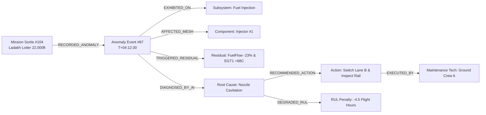

# DRDO PS-26054: Master End-to-End Build Guide
**AI-Enabled Real-Time Cyber-Physical Digital Twin & Health Monitoring System**  
*Target Propulsion Unit: Rotax 912 iS Sport Aero-Engine (MALE UAVs: TAPAS-BH-201 / Rustom-II)*

---

## 📌 Executive Architecture & System Blueprint

The system follows a **Dual-Plane Aerospace Architecture**:
1. **Real-Time Edge & ML Engine (10–50 Hz):** High-speed CAN telemetry ingestion, sensor sanity checks, 1D thermodynamic physics baseline, fast ML anomaly detection, fault classification, and 60 FPS 3D gauge streaming.
2. **Cognitive Agentic & Graph Layer (Event-Driven / Post-Flight):** Local LLM Orchestrator, Domain Sub-Agents, Vector RAG (Rotax Manuals), and an **Event-Driven Graph Knowledge Base** for post-flight debriefing, causality tracing, and fleet-wide wear analytics.

```
┌─────────────────────────────────────────────────────────────────────────────────────────────────┐
│                     LAYER 1: REAL ENGINE TELEMETRY / CAN ACQUISITION (10-50 Hz)                 │
│  [Rotax 912 iS Sensors] ──► [Dual FADEC Lane A/B] ──► [SocketCAN / Virtual CAN / Telemetry Engine]│
└───────────────────────────────────────────────┬─────────────────────────────────────────────────┘
                                                │
                                                ▼
┌─────────────────────────────────────────────────────────────────────────────────────────────────┐
│                     LAYER 2: SENSOR SANITY & VIRTUAL THERMODYNAMIC SHADOW (PINN)                │
│  • Sensor Validation: Drift vs Step Fault Check                                                 │
│  • 1D Physics Model: Computes theoretical baseline P(t), T(t) given Alt, OAT, RPM, TPS         │
│  • Residual Calculation: Residual(t) = Actual(t) - PhysicsBaseline(t)                           │
└───────────────────────────────────────────────┬─────────────────────────────────────────────────┘
                                                │
                                                ▼
┌─────────────────────────────────────────────────────────────────────────────────────────────────┐
│                     LAYER 3: FAST ML PREDICTIVE & PROGNOSTICS ENGINE (<20ms)                    │
│  • Unsupervised Anomaly Scoring (Autoencoder / Isolation Forest)                                │
│  • 8-Fault Classifier (XGBoost / 1D-CNN) mapping multi-sensor residual signatures               │
│  • Gearbox Vibration Spectral Analyzer (FFT 3rd Harmonic Peak Tracking)                         │
│  • Prognostics / RUL Estimator (LSTM / Degradation Tracking)                                    │
└───────────────────────┬─────────────────────────────────────────────────┬───────────────────────┘
                        │ Real-Time Stream (Normal Ops)                   │ Structured Event (Anomaly/Fault)
                        ▼                                                 ▼
┌──────────────────────────────────────────────┐  ┌──────────────────────────────────────────────┐
│  LAYER 5: DIGITAL TWIN PRESENTATION LAYER    │  │  LAYER 4: COGNITIVE AGENTIC & RAG LAYER     │
│  (Existing WebGL / Three.js / Blender HUD)   │  │  • Main Orchestrator Agent (Local LLM)       │
│  • 60 FPS Turntable & Smooth Orbit           │  │  • Diagnostic Reasoner (XAI + SOPs)          │
│  • Live HUD Telemetry Dials & Sparklines     │◄─┼── • Direct 3D Visualization Hook Dispatcher  │
│  • Dynamic Component Focus & Pulsing Shaders │  │  • "What-If" Simulation Sandbox Sub-Agent    │
└──────────────────────────────────────────────┘  │  • Vector RAG (Rotax Manuals, Checklists)   │
                                                  └──────────────────────┬───────────────────────┘
                                                                         │
                                                                         ▼
┌─────────────────────────────────────────────────────────────────────────────────────────────────┐
│             LAYER 6: POST-FLIGHT ANALYSIS & GRAPH KNOWLEDGE BASE (Debrief & FDR)                │
│  • Flight Data Recorder (FDR) Replay Scrubber                                                   │
│  • Graph Knowledge Base (Sortie ──► AnomalyEvent ──► Subsystem ──► Action ──► RUL Impact)       │
│  • Automated Mission Debriefing & Maintenance PDF Work Orders                                   │
└─────────────────────────────────────────────────────────────────────────────────────────────────┘
```

---

## 🗄️ 1. Complete Database & Knowledge Stores Architecture

To power real-time diagnostics, RAG reasoning, and post-flight graph analytics, the system requires **3 specific storage backends**:

```
┌─────────────────────────────────────────────────────────────────────────────────────────────────┐
│                                   THE 3 DATABASE STORES                                         │
├───────────────────────────────┬─────────────────────────────────┬───────────────────────────────┤
│ 1. Telemetry & Time-Series DB │ 2. Vector RAG Knowledge Base    │ 3. Graph Knowledge Base       │
│ (SQLite / Parquet / InfluxDB) │ (ChromaDB / FAISS Local Disk)   │ (NetworkX / Neo4j / JSON-L)   │
├───────────────────────────────┼─────────────────────────────────┼───────────────────────────────┤
│ Stores continuous 10-50 Hz raw│ Stores chunked & embedded       │ Stores relational causality:  │
│ telemetry, physics residuals, │ engineering documents:          │ • Mission sorties & contexts  │
│ and sensor timestamps for live│ • Rotax 912 iS Maintenance MM   │ • Anomalies & symptoms        │
│ HUD and mission replay logs.  │ • Illustrated Parts Catalog(IPC)│ • Root causes & SOP directives│
│                               │ • DRDO Flight Envelopes & SOPs  │ • Component wear propagation  │
└───────────────────────────────┴─────────────────────────────────┴───────────────────────────────┘
```

### A. Graph Knowledge Base Schema (For Post-Flight Debriefing)

The Post-Flight Graph Knowledge Base maps every mission event into a structured property graph:



* **Node Types:**
  * `MissionSortie`: ID, date, UAV airframe, flight profile (Ladakh/Thar), duration, operator.
  * `AnomalyEvent`: Timestamp, flight phase, severity (`CRITICAL`, `WARNING`), raw telemetry snapshot.
  * `Subsystem` & `Component`: Mechanical entity matching the 3D meshes (e.g., `Covers_Theme_M_PlasticTheme_0`).
  * `RootCause`: FMECA failure mechanism citation from Rotax Maintenance Manual.
  * `MaintenanceAction`: Executed or recommended corrective actions.
* **Why the Graph is Essential:** Allows queries like: *"Show all past sorties in high-altitude environments where Cylinder #2 exhibited thermal drift after loitering for > 4 hours."*

---

## 🛠️ 2. The 8 Canonical DRDO Fault Triggers & Hooks

| # | Fault State | 3D Mesh Target / Hook | Fast ML Trigger Signature | RAG Grounding Document | Pilot Prescriptive Action |
|---|---|---|---|---|---|
| **01** | **Cyl #2 CHT Overheat** | `Covers_Theme_M_PlasticTheme_0` | $\Delta \text{CHT}_2 > +25^\circ\text{C}$, Residual $> 0.85$ | Rotax MM 72-00-00 (Cooling Baffles) | Enrich fuel +12%, throttle back 15%, initiate RTB vector. |
| **02** | **Injector #1 Clog** | `Rotax_912i_Base_M_PlasticGreen_0` | Fuel Flow $-20\%$, $\Delta \text{EGT}_1 > 60^\circ\text{C}$ | Rotax MM 73-10-00 (Injection System) | Switch to Lane B ECU backup map, activate auxiliary boost pump. |
| **03** | **Ignition Misfire** | `Wiring_Harness_M_Copper_0` | RPM Jitter $\pm 180$, EGT drop on runner | Rotax MM 74-20-00 (Dual Ignition) | Switch to redundant Lane B ignition coil set. |
| **04** | **Oil Pressure Loss** | `Oil_Tank_M_Steel_0` | Oil Press $< 2.0\text{ bar}$, linear decay | Rotax MM 79-00-00 (Dry Sump Circuit) | Throttle back to 4,200 RPM, initiate precautionary landing. |
| **05** | **Gearbox Vibration** | `Gearbox_Type_2_M_Steel_0` | 3rd Harmonic Peak $> 3.45\text{ mm/s}$ | Rotax MM 72-10-00 (Reduction Gearbox) | Limit rapid throttle transients, schedule dog-clutch overhaul. |
| **06** | **Exhaust EGT Imbalance** | `Exhaust_System_M_SteelDark_0` | Runner #3 EGT Delta $> 65^\circ\text{C}$ | Rotax MM 78-10-00 (Exhaust Manifold) | Adjust individual cylinder fuel trim on Cyl #3. |
| **07** | **Alternator Voltage Sag** | `External_Alternator_...` | Bus Voltage $< 12.8\text{V}$ under load | Rotax MM 24-00-00 (Electrical Power) | Shed non-essential ISR payload sensors, engage backup battery. |
| **08** | **Dual FADEC ECU Drift** | `ECU_M_...` | MAP Lane A/B Delta $> 8\text{ kPa}$ | Rotax MM 76-00-00 (Engine Control) | Force FADEC arbitration to Lane B, flag ECU for bench calibration. |

---

## 🚀 3. Step-by-Step Implementation Roadmap

```
PHASE 1: Data & Grounding ──► PHASE 2: Physics & Fast ML ──► PHASE 3: Agentic Orchestrator ──► PHASE 4: Graph & Replay
```

### Phase 1: Data Acquisition & Grounding Foundation (Focus First)
1. **Telemetry Generator & CAN Parser:**
   - Create `backend/telemetry/can_streamer.py` to stream SocketCAN / JSON frames at 20 Hz.
   - Implement synthetic flight profile generator (Taxi $\rightarrow$ Climb $\rightarrow$ Loiter $\rightarrow$ Descent) with Gaussian thermocouple noise.
2. **Corpus Ingestion for Vector RAG:**
   - Extract & structure Rotax 912 iS technical manuals, DRDO flight limitations, and emergency checklists into `data/rag_docs/`.
   - Ingest into local ChromaDB with metadata tags (`subsystem`, `fault_id`, `manual_section`).

### Phase 2: Sensor Sanity, Thermodynamic Twin & ML Engine
1. **Sensor Sanity Validator:** Distinguishes instantaneous electrical sensor disconnects/drift from physical thermodynamic ramps.
2. **1D Thermodynamic Physics Baseline:** Calculates theoretical expected values ($CHT_{\text{exp}}, EGT_{\text{exp}}, OilP_{\text{exp}}$) in real-time.
3. **ML Classifier & RUL Estimator:**
   - Train lightweight XGBoost model on residual vectors to classify the 8 DRDO fault states in $<5\text{ms}$.
   - Train degradation RUL predictor (Weibull / LSTM) for remaining flight hour estimation.

### Phase 3: Agentic Orchestrator & 3D Visualization Bridge
1. **Main Orchestrator Agent (Local LLM / SLM):**
   - Coordinates state changes, invokes diagnostic sub-agents upon ML anomaly trigger, and enforces strict JSON tool schemas.
2. **Diagnostic & XAI Reasoner Sub-Agent:**
   - Combines ML detection payload + RAG lookup to produce human-verifiable root cause and step-by-step pilot directives.
3. **Real-Time WebSocket Bridge:**
   - Connect backend events to `apps/desktop_gcs/` and `apps/blender_twin/` to trigger camera zooming, mesh pulsing, and HUD badge updates.

### Phase 4: Graph Knowledge Base & Post-Flight Debriefing
1. **Graph Engine (`backend/graph/flight_graph.py`):**
   - Uses NetworkX / SQLite-Graph to record mission nodes, telemetry excursion events, and maintenance actions.
2. **Mission Scrubber & Replayer:**
   - Web UI timeline scrubber allowing operators to replay any past sortie at 1x/5x/10x speed.
3. **Automated Post-Flight PDF Generator:**
   - One-click export of structured maintenance work orders and engine health degradation summaries.

---

## 🔒 4. Production Air-Gapped Deployment Constraints

* **100% Offline Capability:** All LLM inference runs locally (via Ollama / llama.cpp / ONNX) and all embeddings run locally (via `all-MiniLM-L6-v2`).
* **Zero Cloud Dependency:** Vector DB, Graph DB, and Telemetry DB operate on local disk storage.
* **Deterministic Fail-Safe:** If the LLM agent is busy or delayed, the deterministic Fast ML and 3D visual alert fire immediately without waiting for natural language generation.
