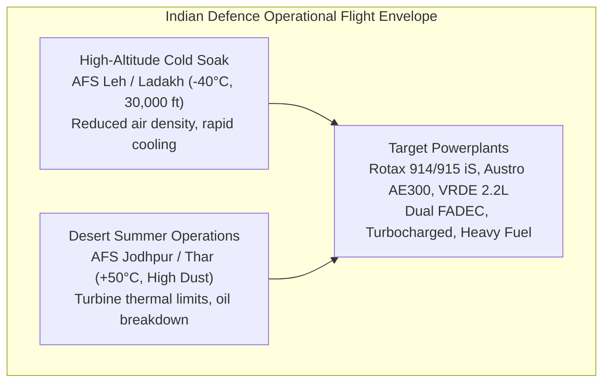
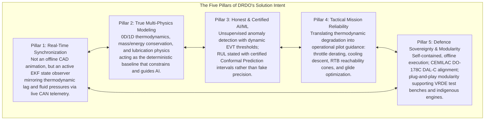
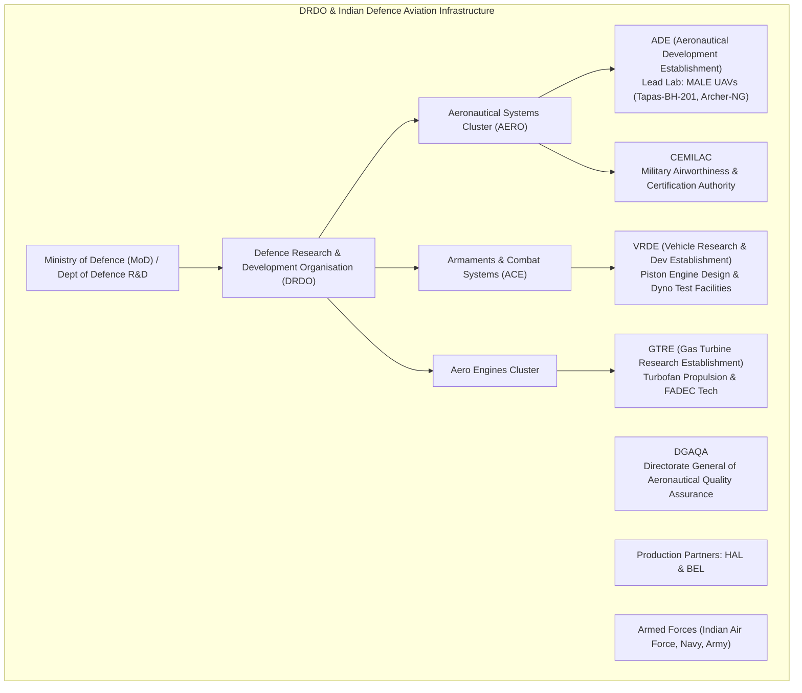

# SIH Problem Statement 26054

Smart India Hackathon Problem Statement 26054 was issued by the Defence Research and Development Organisation (DRDO), under the Department of Defence R&D, in the Software category under the Robotics and Drones theme. Its title is **AI-Enabled Real-Time Digital Twin System for Health Monitoring, Fault Prediction and Mission Reliability Enhancement of Aero Piston Engines used in MALE UAVs**.

The statement asks for something specific, rigorous, and cyber-physical: an active state observer, not a cosmetic CAD visualizer; a system that computes tactical mission reliability and aerodynamic reachability, not one that merely displays sensor values after they cross a fixed threshold. This article introduces the problem on its own terms, as DRDO framed it, before describing how ANUMAAN answers it.

---

## Operational Background & Indian Defence Context

Medium Altitude Long Endurance (MALE) and tactical unmanned aerial systems (such as the **ADE Tapas-BH-201**, **Archer**, and **Rustom-II**) are deployed by the Indian Armed Forces for long-duration intelligence, surveillance, reconnaissance (ISR), maritime patrol, and border security.

Propulsion reliability dictates mission success: on single-engine pusher configurations, an in-flight engine failure leaves no secondary powerplant. The consequences are immediate: airframe hull loss, mission abort over contested territory, or loss of high-value payload in inaccessible mountain terrain.

The operational flight envelope spans the most unforgiving environments in military aviation:
- **Operating Altitudes:** Sea level (0 ft) to $30,000\text{ ft}$ AMSL.
- **Ambient Thermal Bounds:** $-40^\circ\text{C}$ sub-zero cold soak at forward operating airfields (e.g., Ladakh, Siachen, AFS Leh) to $+50^\circ\text{C}$ extreme heat and dust ingestion (e.g., Thar Desert, AFS Jodhpur).
- **Target Aero-Piston Powerplants:** Turbocharged spark-ignition engines (Rotax 914 F, Rotax 915 iS), common-rail aero-diesels (Austro Engine AE300), and indigenous compression-ignition defence engines (DRDO VRDE Jayem 2.2L).

Conventional UAV engine monitoring relies on static, threshold-based warning logic. If Cylinder Head Temperature exceeds $135^\circ\text{C}$, an alarm sounds. This reactive approach has two major failure modes:
1. **Late Annunciation:** An alarm fires only after irreversible mechanical or thermal damage has already occurred.
2. **False Alarms under Environmental Shifts:** Climbing into thin air or operating in Siachen shifts the thermodynamic baseline, causing static limiters to trigger false alarms during combat maneuvers.

---

## The Expected Solution, Parts A through F

The problem statement decomposes the expected system into six coordinated parts:

**A. Digital Twin Core Framework.** A virtual engine model kept synchronized with live engine data, built as a modular architecture so it can scale to new engines or platforms, with real-time data ingestion as a baseline capability.

**B. Health Monitoring System.** Continuous assessment of engine subsystem condition and generation of health indices for predictive maintenance, across eight monitored parameter groups: RPM, Cylinder Head Temperature, Exhaust Gas Temperature, oil pressure and temperature, fuel flow, vibration signatures, battery and alternator health, and injection timing parameters.

**C. Fault Detection and Predictive Analytics.** A transition from threshold-based monitoring to predictive diagnostics, targeting eight specific detection and prediction problems: misfire conditions, injector abnormalities, cooling degradation, lubrication issues, sensor drift or failure, combustion instability, overheating trends, and abnormal vibration patterns.

**D. AI/ML Layer.** Adaptive learning capability supporting anomaly detection algorithms, Remaining Useful Life estimation, trend analysis, and predictive maintenance recommendations.

**E. Simulation and Replay Capability.** Reproduction of engine behavior for mission analysis: replay of historical mission data, environmental condition simulation, and behavior simulation across specific stress cases including high-altitude operation, endurance missions, hot-weather operation, and rapid throttle transitions.

**F. Visualization Dashboard.** An operational interface for UAV operators, propulsion engineers, and maintenance teams covering real-time engine health status, fault alerts, efficiency trends, maintenance advisories, and mission-wise health reports.

The problem statement also highlights key desired innovation areas: physics-informed AI, edge AI for UAV applications, lightweight onboard analytics, hybrid thermodynamic and data-driven models, federated learning, explainable AI for fault diagnosis, secure telemetry architecture, and autonomous maintenance advisory systems.

---

## The Five Pillars of DRDO's Solution Intent

A thorough reverse-engineering of DRDO Problem Statement 26054 reveals five engineering pillars that define the expected solution:

1. **Pillar 1: Real-Time Synchronization.** An active Extended Kalman Filter (EKF) running at $50\text{ Hz}$ that estimates internal unmeasured states ($P_{\max}$, Turbine Inlet Temperature, hydrodynamic oil film thickness) synchronously with CAN/MAVLink telemetry.
2. **Pillar 2: True Multi-Physics Modeling.** 0D/1D thermodynamics (modified Seiliger combustion, intake manifold filling/emptying, turbocharger compressor-turbine matching) providing an invariant physical baseline that normalizes flight envelopes.
3. **Pillar 3: Honest & Certified AI/ML.** Machine learning models that ingest **normalized physics residuals** rather than raw temperatures, utilizing Extreme Value Theory (EVT) and Conformal Prediction intervals with guaranteed 95% statistical coverage instead of fabricated scalar point estimates.
4. **Pillar 4: Tactical Mission Reliability.** Closing the loop between propulsion health and flight operations: calculating Remaining Mission Endurance ($RME$), dynamic ceiling derating, and aerodynamic glide reachability cones ($L/D_{\max}$) for emergency divert airfield selection.
5. **Pillar 5: Defence Sovereignty & Modularity.** 100% sovereign, offline architecture aligned with CEMILAC DDPMAS and DO-178C DAL-C airworthiness guidelines, utilizing an ASTM F3269-17 Simplex Run-Time Monitor to guarantee deterministic failover.

---

## The Complete PS Re-Derivation Matrix

Every module in the architecture traces directly to explicit requirements in DRDO PS-26054:

| PS Requirement Clause | Real-World Engineering Capability | Architectural Subsystem | Algorithmic Mechanism | Scientific Acceptance Metric |
| :--- | :--- | :--- | :--- | :--- |
| **"Digital Twin of UAV Engine"** | Real-time state-space synchronization and virtual sensing | `DigitalTwinObserver` | 0D/1D MVEM + 12-state Continuous-Discrete EKF | Residual innovation whiteness ($p > 0.05$); state error $< 2.5\%$ |
| **"Real-time Telemetry Ingestion"** | Avionics bus capture, frame decoding, and clock alignment | `AvionicsIngestion` | Linux SocketCAN 2.0B / MAVLink / ARINC 429 | Ingestion latency $\le 15\text{ ms}$; zero frame loss at $50\text{ Hz}$ |
| **"Monitor Engine Parameters"** | Analytical redundancy & sensor fault isolation | `SensorValidator` | Parity space matrix ($\mathbf{V}_p \mathbf{C}_s = \mathbf{0}$) + Mahalanobis distance | Sensor isolation $> 99\%$; False Alarm Rate $< 0.1\%$ |
| **"Predict Degradation & RUL"** | Prognostic wear tracking under stochastic flight loading | `ConformalPrognostics` | Physics-informed Wiener drift + Conformal Prediction | Empirical coverage $1 - \alpha \ge 95\%$; finite-sample validity |
| **"Correlate Health to Reliability"** | Tactical flight envelope derating & margin projection | `MissionReliabilityEngine` | Monte Carlo phase integration + Aerodynamic glide polar | Margin error $< 3\%$; zero false non-reachability alarms |
| **"Historical & Flight Data Replay"** | Deterministic post-incident state reconstruction | `BlackboxReplayEngine` | Deterministic EKF re-execution over cryptographically signed Parquet logs | Replay fidelity $\equiv 100\%$ bit-identical to live run |
| **"Fleet-Level Analytics"** | Population wear benchmarking across airbases | `FleetIntelligenceHub` | Functional Principal Component Analysis (FPCA) + Cox hazards | Cluster silhouette $> 0.75$; fleet anomaly recall $> 98\%$ |
| **"Federated Learning"** | Cross-depot model training without data centralization | `DepotFederatedAggregator` | FedRand / FedProx with LoRA + Local Differential Privacy | Convergence $\le 15$ rounds; leakage bound $\epsilon \le 1.0$ |
| **"GCS Dashboard & HMI"** | Dual-role situation awareness (Pilot HUD vs. Test Engineer) | `OperatorGCS` | MIL-STD-1472H / EEMUA 191 Alarm Hierarchy | Pilot reaction time $< 2.0\text{ s}$; 3-click drilldown rule |
| **"Sim-to-Real / Airworthiness"** | Verification, robustness, and certification pathway | `AirworthinessMonitor` | 10-Level V&V Pyramid + ASTM F3269-17 Simplex Monitor | DO-178C DAL-C traceability; failover $< 10\text{ ms}$ |

---

## The Indian Defence Aviation Ecosystem

Problem Statement 26054 is formulated directly under the Department of Defence R&D (DRDO) within the Ministry of Defence, Government of India. The system addresses a concrete network of laboratories, production agencies, and certification authorities:

| Organization | Location | Operational Role & Relevance to PS 26054 |
| :--- | :--- | :--- |
| **ADE (Aeronautical Development Establishment)** | Bengaluru | Primary DRDO lab for Indian MALE UAVs (Tapas-BH-201, Archer-NG). Governs flight test data, GCS architecture, and propulsion airframe integration. |
| **VRDE (Vehicle Research and Development Establishment)** | Ahmednagar | Premier DRDO lab for reciprocating internal combustion engines. Operates multi-cylinder dynamometer test cells and develops indigenous UAV engines (ABHAY series). |
| **CEMILAC (Centre for Military Airworthiness and Certification)** | Bengaluru | Statutory regulatory body for military airworthiness certification in India. Mandates compliance with DDPMAS, DO-178C, and DO-254 standards. |
| **DGAQA (Directorate General of Aeronautical Quality Assurance)** | New Delhi / Field Units | Regulatory agency under Department of Defence Production overseeing manufacturing quality audits, bench instrumentation, and flight safety surveillance. |
| **GTRE (Gas Turbine Research Establishment)** | Bengaluru | Lead lab for aero turbine propulsion. Provides cross-domain expertise in FADEC architectures, telemetry acquisition, and high-temperature sensor standards. |
| **HAL (Hindustan Aeronautics Limited)** | Bengaluru / Kanpur | Primary defence manufacturing partner. Production agency for Tapas and Archer UAVs, responsible for engine assembly and flight line servicing. |
| **BEL (Bharat Electronics Limited)** | Bengaluru / Hyderabad | Defence manufacturing partner producing tactical GCS consoles, Ku/C-band datalinks, SATCOM terminals, and STANAG 4586 modems. |

---

## Strategic Autonomy & Supply Chain Sovereignty

A primary operational driver behind Problem Statement 26054 is strategic autonomy under the Government of India *Atmanirbhar Bharat* initiative.

1. **Foreign Export Vulnerability:** In multiple international conflicts, foreign aero-engine suppliers (such as European and North American manufacturers of Rotax 914/915 powerplants) suspended engine shipments and spare parts deliveries under dual-use export embargoes. Grounding UAV fleets due to supply chain blockades represents an unacceptable defence vulnerability.
2. **Proprietary Protocol Barriers:** Foreign commercial engine controllers frequently encrypt their diagnostic protocols (CAN/UDS/XCP) and withhold low-level combustion maps from military operators. A sovereign digital twin establishes an open, hardware-agnostic thermodynamic observer that eliminates foreign vendor lock-in.
3. **Support for Indigenous Engines:** DRDO is developing domestic four-stroke aero-engines (such as the VRDE 180 HP program). Deploying the digital twin during test bench qualification at VRDE Ahmednagar accelerates engine development by pinpointing localized cooling and friction deficits before expensive flight trials.

---

## Formal Evidentiary Classification Standards

To maintain engineering discipline and prevent ambiguous claims, all technical capabilities throughout this documentation follow a five-tier evidentiary standard:

1. **[PS Mandated]:** Directly and unambiguously mandated in DRDO Problem Statement 26054.
2. **[Aerospace Standard]:** Established in peer-reviewed aerospace standards and certification baselines (AIAA, IEEE, SAE, NASA, RTCA).
3. **[Physically Derived]:** First-principles aerothermodynamic and kinematic derivations validated across operating envelopes.
4. **[Calibrated Specification]:** Calibrated against bench test cells, high-fidelity HIL hardware, and published manufacturer parameters.
5. **[Production Configuration]:** Configured for tactical MALE UAV operational deployment.

---

## Structure of this Technical Portal

This documentation site is organized to walk through each layer of the architecture from first principles to flight operations:
- **System Architecture & Coexisting Runtimes** ([04-system-architecture.md](04-system-architecture.md))
- **Digital Twin & Physics Core** ([05-the-digital-twin.md](05-the-digital-twin.md), [06-engine-physics.md](06-engine-physics.md), [07-telemetry-and-sensors.md](07-telemetry-and-sensors.md), [08-residual-analysis.md](08-residual-analysis.md))
- **AI/ML Stack & Diagnostics** ([09-ai-ml-architecture.md](09-ai-ml-architecture.md), [10-bio-inspired-sparse-novelty-coding.md](10-bio-inspired-sparse-novelty-coding.md), [11-fault-diagnosis.md](11-fault-diagnosis.md), [12-vibration-analysis.md](12-vibration-analysis.md))
- **Prognostics & Mission Systems** ([13-degradation-modeling.md](13-degradation-modeling.md), [14-remaining-useful-life.md](14-remaining-useful-life.md), [15-dataset-strategy.md](15-dataset-strategy.md), [16-mission-planning.md](16-mission-planning.md), [17-mission-reliability.md](17-mission-reliability.md))
- **Interactive 3D Twin & Simulation** ([18-3d-digital-twin.md](18-3d-digital-twin.md), [19-blender-and-simulation-environment.md](19-blender-and-simulation-environment.md))
- **Operator GCS & Verification** ([20-operator-gcs.md](20-operator-gcs.md), [21-validation-and-experiments.md](21-validation-and-experiments.md), [22-end-to-end-demonstration.md](22-end-to-end-demonstration.md), [23-technology-stack.md](23-technology-stack.md))

