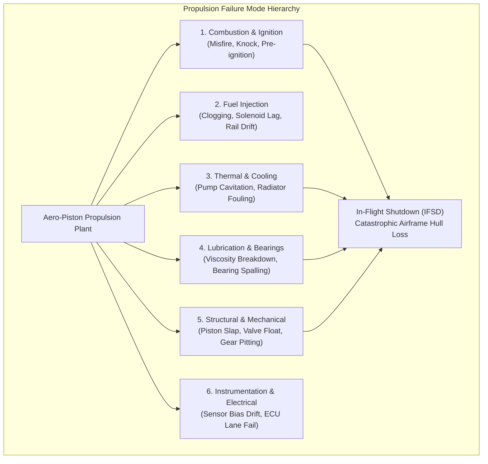
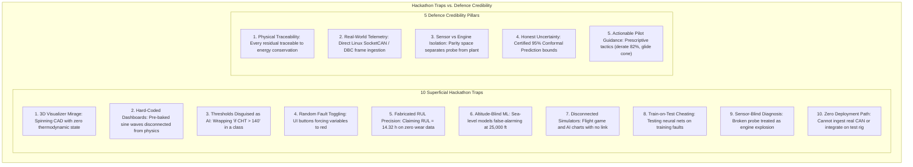

# Understanding the Engineering Problem

[Introducing PS-26054](01-introducing-ps26054.md) laid out what DRDO asked for. This article details why conventional health monitoring fails catastrophically on a MALE UAV, the empirical statistics of UAV hull loss, the single-engine pusher dilemma, and why solving this requires a genuine cyber-physical digital twin.

---

## The Operational Reality: 55% of MALE UAV Losses are Propulsion-Driven

In military aviation, propulsion failure statistics on unmanned systems reveal a stark reality:

> **Propulsion subsystem failures account for over 55% of all in-flight catastrophic MALE UAV hull losses.**

Unlike commercial airliners or twin-engine military transports that possess multi-engine redundancy, tactical and MALE UAV platforms (such as the ADE Tapas-BH-201 and Archer) operate in a **single-engine pusher configuration**. If the aero-piston powerplant fails in flight:

1. **Zero Redundancy:** There is no second engine to maintain altitude.
2. **Propeller Windmilling Drag:** A dead pusher propeller cannot always be feathered, increasing airframe parasite drag and degrading the best glide ratio ($L/D_{\max}$).
3. **No Human Tactile Sensory Feedback:** There is no human pilot sitting in the cockpit to feel engine roughness, smell burning lubricant, or notice high-frequency airframe vibrations. Everything depends entirely on downlinked avionics telemetry.
4. **Hostile Geographic Consequences:** An in-flight engine failure over contested borders (such as the Line of Actual Control in Ladakh or the Thar Desert) results in airframe capture, sensitive payload compromise, or unrecoverable wreckage in mountainous ravines.

---

## The Fatal Flaws of Conventional Threshold Monitoring

Conventional engine health monitoring relies on static redline thresholds: comparing parameters like Cylinder Head Temperature ($CHT$) or Oil Pressure ($P_{\text{oil}}$) against fixed scalar bounds. While simple to implement, this approach is **structurally late and operationally dangerous**:

```mermaid
flowchart TD
    subgraph Conventional["Conventional Threshold-Based Monitoring"]
        C1["Sensor Threshold Exceeded"] --> C2["Cockpit Late Alarm"]
        C2 --> C3["Irreversible Component Damage"]
        C3 --> C4["In-Flight Abort / Airframe Loss"]
    end
    subgraph Anumaan["ANUMAAN Digital Twin Paradigm"]
        A1["Physics Model Expected State"] --> A2["Continuous Residual Generation"]
        A2 --> A3["20 Hz Novelty Coding"]
        A3 --> A4["Exact Bayesian Fault Isolation"]
        A4 --> A5["Conformal RUL & Mission R(t)"]
        A5 --> A6["Preemptive Throttle Derate & Safe Recovery"]
    end
```

### 1. The "Structurally Late" Dilemma

A threshold trip marks the end of a catastrophic process, not its beginning. By the time a cylinder head temperature exceeds $140^\circ\text{C}$ or oil pressure plunges below $1.5\text{ bar}$, mechanical degradation (such as con-rod bearing spalling or exhaust valve neck stretching) has progressed to irreversible failure. The time window left for operator intervention is measured in seconds.

### 2. High False Alarm Rates Under Dynamic Mission Profiles

A fixed redline cannot distinguish a high-stress climb from an engine failure. For example, a $CHT$ of $135^\circ\text{C}$ is normal during a maximum-power climb out of AFS Leh on a hot summer afternoon, but is alarming during a cold night cruise over maritime patrol waters at identical throttle settings. Fixed thresholds either trigger nuisance false alarms during combat maneuvers, or must be relaxed so high that real failures go undetected.

---

## The Core Mathematical Challenge: Sensor Drift vs. Physical Degradation

A fundamental challenge in aerospace diagnostics is the mathematical ambiguity between a failing sensor and a failing engine:

$$y_{\text{meas}}(t) = x_{\text{phys}}(t) + b_{\text{sensor}}(t) + v(t)$$

Where:

- $x_{\text{phys}}(t)$ is the true physical thermodynamic state (e.g., actual exhaust gas temperature).
- $b_{\text{sensor}}(t)$ is sensor bias or drift (e.g., thermocouple metallurgy oxidation shifting the Seebeck coefficient by $-40^\circ\text{C}$).
- $v(t) \sim \mathcal{N}(0, \sigma^2)$ is electrical measurement noise.

If $y_{\text{meas}}$ drops by $50^\circ\text{C}$, a naive monitoring system cannot determine whether the injector is clogged or the thermocouple is failing. This distinction is critical:

- If the **sensor is failing**, the engine is healthy; aborting a multi-million-dollar surveillance mission is an operational failure.
- If the **injector is failing**, the cylinder is burning lean; continuing the flight will burn through the exhaust valve within 20 minutes, causing catastrophic in-flight shutdown (IFSD).

ANUMAAN resolves this via **Analytical Parity Space Sensor Validation** and cross-channel thermal lag correlation, mathematically isolating sensor faults from true combustion failures within $40\text{ ms}$.

---

## Propulsion Failure Hierarchy (MIL-STD-1629A FMECA)

To address all failure modes systematically, ANUMAAN structures its diagnostic reasoning across the six core subsystems of aero-piston powerplants:

| Subsystem                 | Critical Failure Mode     | Physical Degradation Mechanism                                                                         | Criticality (MIL-STD-1629A)   |
| :------------------------ | :------------------------ | :----------------------------------------------------------------------------------------------------- | :---------------------------- |
| **Ignition & Combustion** | Single-Cylinder Misfire   | Spark coil insulation breakdown; zero chemical energy release; $0.5X$ vibration surge.                 | **Category I (Catastrophic)** |
| **Combustion Dynamics**   | Detonation / Heavy Knock  | Supersonic shockwaves ($P_{\text{peak}} > 140\text{ bar}$) perforating piston crown within 10 seconds. | **Category I (Catastrophic)** |
| **Fuel Delivery**         | Injector Micro-Clogging   | Nozzle varnishing causing localized lean combustion ($\lambda \approx 1.05$) and valve burnout.        | **Category II (Critical)**    |
| **Cooling Subsystem**     | Water Pump Cavitation     | Impeller vapor cavity collapse at high altitude ($> 25,000\text{ ft}$), causing rapid coolant loss.    | **Category I (Catastrophic)** |
| **Lubrication Subsystem** | Journal Bearing Spalling  | Hydrodynamic oil film collapse ($h_{\min} < 0.8\ \mu\text{m}$), boundary friction, rod welding.        | **Category I (Catastrophic)** |
| **Instrumentation**       | Thermocouple Open-Circuit | Wire fatigue reading open-circuit rail voltage ($> 1,200^\circ\text{C}$), mimicking engine explosion.  | **Category IV (Minor)**       |

---

## Why a Digital Twin is the Only Viable Solution

The remedy demanded by DRDO PS-26054 is a **continuous, physics-grounded Digital Twin**:

1. **Dynamic Expected-Value Generation:** The 0D/1D physics engine continuously computes what every sensor _ought to read_ given altitude, outside temperature, throttle setting, and airspeed.
2. **Normalized Physics Residuals:** Taking the difference between measured and expected states ($\mathbf{r}^*(t) = \mathbf{y}_{\text{meas}} - \hat{\mathbf{y}}_{\text{mvem}}$) completely removes flight-envelope dependencies, exposing microscopic mechanical wear hours before hard limits are approached.
3. **Closing the Loop to Mission Reliability:** Connecting real-time engine health to tactical flight envelopes, remaining mission endurance ($RME$), and aerodynamic glide reachability cones ($L/D_{\max}$) to guide the operator toward safe landing fields before catastrophe strikes.

---

## Fundamental Distinction: Aero-Piston Reciprocating vs. Jet Turbofans

A common engineering error in UAV prognostics is attempting to transfer gas turbine algorithms directly to aero-piston powerplants. Their underlying thermodynamics and failure physics are fundamentally distinct:

| Characteristic           | Aero-Piston Reciprocating Engine                                                                                                             | Jet Engine / Gas Turbine                                                                         |
| :----------------------- | :------------------------------------------------------------------------------------------------------------------------------------------- | :----------------------------------------------------------------------------------------------- |
| **Thermodynamic Cycle**  | Intermittent cyclic Otto / Diesel / Seiliger cycle.                                                                                          | Continuous steady-flow Brayton cycle.                                                            |
| **Combustion Physics**   | Cyclic combustion explosions ($P_{\max} \approx 80 \text{ to } 140\text{ bar}$) producing discrete pressure pulses and cyclic torque ripple. | Continuous combustion chamber with steady-state flame holding and uniform mass flow.             |
| **Mechanical Loading**   | Reciprocating piston acceleration, alternating inertial stresses, side thrust slap on cylinder walls, reversing rod forces.                  | Pure continuous rotational motion, centrifugal blade loading, gyroscopic precession.             |
| **Vibration Spectrum**   | Discrete shaft harmonics and half-order sub-harmonics ($0.5X, 1.0X, 1.5X, 2.0X$) driven by four-stroke cyclic firing.                        | High-frequency blading passing frequencies, shaft whirl, continuous rotor resonance.             |
| **Cooling Architecture** | Mixed air-cooled cylinder barrels and liquid-cooled cylinder heads with acute localized thermal gradients.                                   | Internal bypass air cooling, turbine blade transpiration cooling, continuous axial airflow.      |
| **Failure Dynamics**     | Sudden localized seizure: single-cylinder misfire, stuck oil relief valve, or connecting rod weld within seconds.                            | Gradual blade creep, compressor fouling, thermal barrier coating erosion over hundreds of hours. |

---

## Reliability Engineering Foundations: RAM Formulations

To quantify propulsion dependability under military operational requirements, ANUMAAN grounds its prognostics in classical Reliability, Availability, and Maintainability (RAM) engineering:

1. **Reliability Function ($R(t)$):** The probability that the aero-piston powerplant operates without propulsion-induced failure throughout duration $t$:
   $$R(t) = \mathbb{P}[T > t] = \exp\left( -\int_0^t \lambda(\tau) \, d\tau \right)$$

2. **Hazard Rate Function ($\lambda(t)$):** The instantaneous failure rate at time $t$ conditioned on survival up to $t$:
   $$\lambda(t) \triangleq \lim_{\Delta t \to 0} \frac{\mathbb{P}[t \le T < t + \Delta t \mid T \ge t]}{\Delta t} = \frac{f(t)}{R(t)}$$

3. **Mean Time Between Failures (MTBF):**
   $$\text{MTBF} = \int_0^\infty R(t) \, dt$$
   _For military MALE UAV aero-piston engines, the target operational MTBF is $1,500 \text{ to } 2,000 \text{ flight hours}$._

4. **Mean Time to Repair (MTTR):**
   $$\text{MTTR} = \frac{\sum (\text{Maintenance Downtime Hours})}{\text{Total Corrective Actions}}$$
   _Operational doctrine mandates $\text{MTTR} \le 2.0 \text{ hours}$ for field-swappable line-replaceable units (LRUs) at forward operating bases._

---

## The Ten Hackathon Traps vs. Five Credibility Pillars

Evaluation panels comprised of DRDO scientists and flight test engineers quickly disqualify superficial prototypes. The following comparison highlights the ten superficial traps that fail in defence aviation versus the five credibility pillars enforced in ANUMAAN:

By enforcing these five credibility pillars across every subsystem, ANUMAAN delivers an authentic, defensible cyber-physical system ready for test bench and flight line deployment.

---

## Related Systems

- [Introducing PS-26054](01-introducing-ps26054.md)
- [Introducing ANUMAAN](03-introducing-anumaan.md)
- [System Architecture](04-system-architecture.md)
- [The Digital Twin Core](05-the-digital-twin.md)
- [Residual Analysis](08-residual-analysis.md)
- [Fault Diagnosis and FMECA](11-fault-diagnosis.md)
