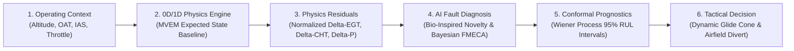

# Introducing ANUMAAN: Aero-Piston Cyber-Physical Digital Twin

ANUMAAN (Sanskrit and Hindi for *inference* or *deduction*) is an advanced cyber-physical digital twin system engineered for real-time health monitoring, fault prediction, and mission reliability enhancement of aero-piston powerplants deployed on Medium Altitude Long Endurance (MALE) and tactical unmanned aerial systems. Built by team **Midnight Ciphers** against **DRDO Smart India Hackathon Problem Statement 26054**, ANUMAAN closes the fatal gap left by conventional threshold-based warning systems.

Rather than treating digital twins as cosmetic 3D animations or generic telemetry dashboards, ANUMAAN implements an active **Continuous-Discrete Extended Kalman Filter (EKF) State Observer** coupled to a first-principles **0D/1D Mean Value Engine Model (MVEM)**. Running in-flight at $50\text{ Hz}$, the system estimates unmeasured internal thermodynamic states, generates normalized physics residuals, isolates microscopic degradation via bio-inspired sparse coding and Bayesian reasoning, and translates component health into tactical flight margins and dynamic glide reachability cones.

---

## The Three Core Architectural Axioms

ANUMAAN is architected around three foundational engineering principles demanded by DRDO:

1. **A Digital Twin is an Active State Observer, Not a CAD Animation:** A 3D CAD mesh rotating on a screen is visually appealing, but useless for aerospace airworthiness unless it represents internal unmeasured states ($P_{\max}, TIT, h_{\min}$) synchronized to microsecond-timestamped avionics telemetry.
2. **Physics Must Invariantly Anchor AI:** Pure data-driven deep learning collapses outside its training envelope and cannot achieve aerospace certification under DO-178C. ANUMAAN enforces 0D/1D thermodynamics (mass, momentum, and energy conservation) as an invariant baseline; AI operates strictly on **normalized physics residuals**, detecting subtle deviations without corrupting physical laws.
3. **Actionable Tactical Guidance Over Raw Data:** During high-stress combat maneuvers, an operator cannot decode multi-dimensional neural tensor activations. ANUMAAN translates thermodynamic degradation into concrete tactical directives: *derate throttle to 82%, adjust cruise altitude to maintain radiator cooling, or project 3D unpowered glide reachability cones for immediate airfield diversion*.

---

## Supported Engine Platforms

The digital twin architecture supports five distinct aero-piston powerplants across military and civilian MALE UAV configurations:

| Engine Platform | Architecture & Displacement | Induction & Boost System | Rated Power & Altitude | Operational Defence Application |
| :--- | :--- | :--- | :--- | :--- |
| **Rotax 912 iS Sport** | 4-Cylinder Boxer ($1,352\text{ cm}^3$) | Naturally Aspirated; Dual Electronic Injection | $100\text{ hp}$ @ 5,800 RPM | Tactical reconnaissance, target drones, line training. |
| **Rotax 914 F Turbo** | 4-Cylinder Boxer ($1,211\text{ cm}^3$) | Turbocharged with Automatic Wastegate TCU | $115\text{ hp}$ max; $1.35\text{ bar}$ boost | High-altitude tactical UAVs (Rustom-I, Searcher-II). |
| **Rotax 915 iS Turbo** | 4-Cylinder Boxer ($1,352\text{ cm}^3$) | Turbocharged with Charge Air Intercooler | $141\text{ hp}$ up to $15,000\text{ ft}$ | Long-endurance MALE surveillance (Archer, Rustom-II). |
| **Austro Engine AE300** | 4-Cylinder Inline ($1,991\text{ cm}^3$) | Common-Rail Diesel; High-Pressure Turbo | $168\text{ hp}$; Heavy Aviation Fuel (Jet-A1) | Heavy-fuel logistics and maritime patrol UAS. |
| **VRDE Jayem 2.2L** | 4-Cylinder Heavy-Fuel ($2,179\text{ cm}^3$) | Common-Rail Turbocharged Compression Ignition | $180\text{ hp}$ indigenized powerplant | Indigenous Indian MALE UAV platform (ADE Tapas-BH-201). |

---

## The Six-Stage Reasoning Chain

ANUMAAN resolves propulsion health through an unbroken, unidirectional six-stage computational pipeline:

1. **Operating Context Acquisition:** Ingests dynamic ambient flight parameters (altitude, outside air temperature, indicated airspeed, throttle position) to establish the true thermodynamic flight condition.
2. **Physics Expected Baseline:** Executes the 0D/1D Mean Value Engine Model in real time, calculating what cylinder pressures, torque pulses, and coolant temperatures should be under ideal nominal conditions.
3. **Normalized Residual Generation:** Subtracts physical predictions from sensor measurements ($\mathbf{r}^*(t) = \mathbf{y}_{\text{meas}} - \hat{\mathbf{y}}_{\text{mvem}}$), stripping away flight-envelope variations and isolating pure component wear.
4. **AI-Enabled Fault Diagnosis:** Evaluates residuals using Bio-Inspired Sparse Novelty Coding (FlyHash) and Bayesian belief networks, isolating root-cause failure modes within the MIL-STD-1629A FMECA taxonomy.
5. **Conformal RUL Prognostics:** Feeds degradation rates into a stochastic Wiener drift process, computing Remaining Useful Life ($RUL$) bounded by exact 95% Split Conformal Prediction intervals rather than false scalar precision.
6. **Tactical Decision Support:** Projects remaining engine life onto the operational flight plan: computing Remaining Mission Endurance ($RME$), dynamic ceiling derating, and 3D terrain-coupled glide reachability footprints ($L/D_{\max}$) for emergency recovery.

---

## What Makes ANUMAAN a Genuine Cyber-Physical Digital Twin

A conventional dashboard passively displays telemetry. A CAD viewer renders an external model. ANUMAAN is a **computational cyber-physical digital twin** defined by three strict capabilities:

* **Real-Time Dynamic State Observer:** Employs an Extended Kalman Filter (EKF) tracking 12 continuous state variables at $50\text{ Hz}$. It synthesizes internal unmeasured variables ($P_{\max}$, Turbine Inlet Temperature $TIT$, hydrodynamic oil film thickness $h_{\min}$) that have no physical sensors on production aircraft.
* **Separation of Generator & Observer Models:** To prevent circular self-validation, ANUMAAN maintains an independent plant simulation mode (G01) that verifies the digital twin observer against unknown operational deviations.
* **Physics-Grounded Fault Signatures:** A cylinder misfire is not an artificial signal toggle; it is simulated as a genuine absence of chemical heat release ($Q_{\text{total}} = 0$) during that $180^\circ$ power stroke. The resulting angular deceleration, half-order ($0.5X$) vibration surge, and exhaust temperature collapse emerge naturally from coupled kinematics and thermodynamics.

---

## Related Systems

- [Understanding the Engineering Problem](02-the-engineering-problem.md)
- [System Architecture](04-system-architecture.md)
- [The Digital Twin Core](05-the-digital-twin.md)
- [Engine Physics and Thermodynamics](06-engine-physics.md)
- [Residual Analysis](08-residual-analysis.md)
- [Fault Diagnosis and FMECA](11-fault-diagnosis.md)
