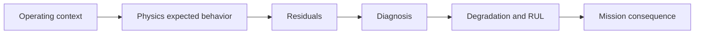

# Introducing ANUMAAN

ANUMAAN, Sanskrit and Hindi for inference or prediction, is a digital twin system for health monitoring, fault prediction, and mission reliability enhancement of aero piston engines used in Medium Altitude Long Endurance UAVs, built by team Midnight Ciphers against SIH Problem Statement 26054. It was built to answer the specific gap described in [Understanding the Engineering Problem](02-the-engineering-problem.md): threshold-based monitoring catches faults late and cannot reason about the mission ahead.

The system runs a physics model of the engine continuously, alongside the real or simulated telemetry stream, and reasons through a defined chain: from the engine's current operating context, to what its physics says should be happening, to the gap between expectation and observation, to a specific fault diagnosis, to how far that fault has progressed, to what it means for the mission still to be flown. Each stage in that chain is a distinct engineering problem, solved with a distinct method, rather than one model asked to do everything at once.

## The problem this system solves

Restated at the system level, the problem is this: a UAV operator or maintenance team needs to know, continuously and specifically, what condition a piston engine is in, what fault, if any, is developing, how much life remains before that fault becomes limiting, and whether the mission currently underway or currently planned can still be completed safely. Conventional instrumentation answers only the first question, and only in the crude form of "within limits" or "outside limits." ANUMAAN is built to answer all of them, from the same underlying physics and the same telemetry stream.

## Why it matters

A system that only reports raw values, however well visualized, is a dashboard. A system that computes expected behavior, detects genuine departures from it, attributes those departures to specific fault mechanisms, tracks how they accumulate over time, and translates the result into mission-relevant advisory, is a digital twin in the sense the problem statement asks for. The difference is not presentation. It is that every stage after the first is a computation grounded in engine physics and probability, not a lookup against a fixed limit.

## The core methodology

ANUMAAN's reasoning chain has six stages, each covered in depth by its own article in this corpus.

**Operating context.** Every judgment about the engine starts with knowing what it is currently being asked to do: altitude, outside air temperature, airspeed, throttle position, and flight phase. Flight context is treated as mandatory input, not a nice-to-have, because no parameter can be judged correct or anomalous in isolation from it. [Telemetry and Sensor Intelligence](07-telemetry-and-sensors.md) covers how this context and the engine's own parameters are acquired and validated.

**Expected behavior.** A physics core, built from published Rotax reference specifications and crank-angle combustion dynamics, computes what the engine's observable parameters should read at the current operating point. This is not a lookup table; it is a running simulation of cylinder pressure, torque, and crank angular velocity, described in [Engine Physics and Combustion Modeling](06-engine-physics.md).

**Residuals.** The difference between observed telemetry and physics-expected telemetry, computed continuously, per channel. A residual is the interface between raw physics and everything diagnostic that follows, and it is shielded from being fooled by a failing sensor rather than a failing engine. [The Digital Twin Core](05-the-digital-twin.md) and [Residual Analysis](08-residual-analysis.md) cover this in full.

**Diagnosis.** Residual evidence, including a novelty score from Bio-Inspired Sparse Novelty Coding, feeds a Bayesian network reasoning over a defined taxonomy of failure modes, producing a ranked fault hypothesis rather than a single flag, paired with a deterministic diagnostic agent that turns an identified fault into a concrete maintenance directive.

**Degradation and mission consequence.** Diagnosed faults and ongoing stress cycles feed damage accumulation and Remaining Useful Life estimation, which in turn feed a mission reliability computation: the probability that the currently planned sortie completes without a propulsion-induced abort, given current component health, the planned profile, and the forecast environment.

*Caption: the six-stage reasoning chain from flight context to mission-level advisory.*

## What makes this a genuine digital twin

A 3D visualization of an engine, however detailed, is a representation. It shows what the engine looks like and can be made to react to telemetry, but it does not itself compute anything about the engine's state. ANUMAAN's twin is a computational one: at its center is an independent physics model that produces its own prediction of engine behavior, and the system's diagnostic output depends on the gap between that prediction and reality, not on the visual model at all. The 3D environments described in this corpus render the result of that computation, they do not produce it.

Three properties distinguish a computational digital twin from a visualization layer sitting on top of a telemetry feed:

**State estimation, not just display.** The system maintains a running estimate of engine state, cylinder pressure, crank angular velocity, per-cylinder torque contribution, derived from physics rather than read directly off a sensor that does not exist on the real engine (there is no cylinder pressure sensor on an aero piston engine in service).

**Physical independence.** The model used to compute expected behavior is built and calibrated separately from the model used to generate or represent observed telemetry, wherever the deployment allows it. This matters because a twin that checks its own generator against itself cannot produce an honest residual, it can only ever agree with itself. This principle, and the specific model that embodies it, is detailed in [The Digital Twin Core](05-the-digital-twin.md).

**Physics-derived fault signatures.** A misfire in this system is not an authored event that switches a flag and adjusts an output waveform to match. It is a cylinder genuinely producing no heat release for one combustion cycle, propagated through the same slider-crank kinematics and torque equations used for every other cycle. The angular velocity dip, the rise in half-order vibration energy, and the drop in that cylinder's exhaust gas temperature all emerge from that single change to the physics, rather than being separately scripted. [Engine Physics and Combustion Modeling](06-engine-physics.md) covers this mechanism directly.

## Two coordinated workspaces

ANUMAAN is not a single monolithic application. It runs as two coordinated propulsion-health workspaces inside one ground control station: a multi-engine runtime spanning five engine platforms (Rotax 912 iS, Rotax 914, Rotax 915 iS, Austro AE300, and the VRDE Jayem 2.2L), and a Rotax-focused workspace offering the deepest single-engine diagnostic depth, including Bayesian diagnosis, RUL estimation, a conversational copilot, and full mission replay. Both are described in [System Architecture](04-system-architecture.md).

## Honest scope

Every claim in this system traces to either published engine specification, a defined method validated in simulation, or a stated engineering assumption labeled as such. Physics constants for the Rotax 912 iS and 914 come from manufacturer documentation. Detection and prognostics methods are validated through simulation, characterization testing, and public reference datasets where applicable. Real-aircraft integration and flight-hardware validation are the natural next phase of the project, not something claimed as already complete. This scope discipline is carried through every article in this corpus, and it is stated once here rather than repeated as a caveat on every page.

## Related systems

- [Understanding the Engineering Problem](02-the-engineering-problem.md)
- [System Architecture](04-system-architecture.md)
- [The Digital Twin Core](05-the-digital-twin.md)
- [Engine Physics and Combustion Modeling](06-engine-physics.md)
- [Residual Analysis](08-residual-analysis.md)
