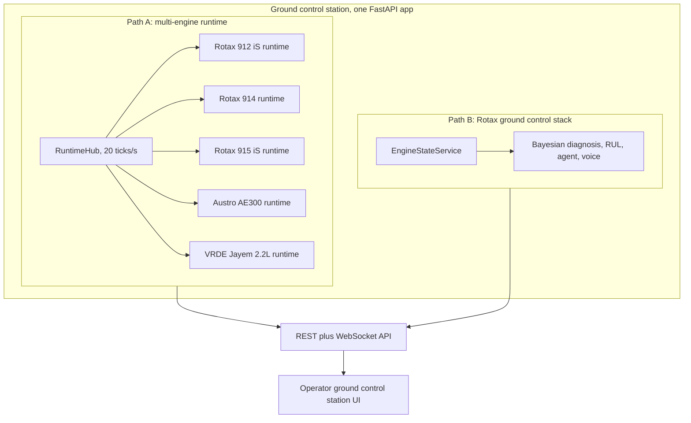
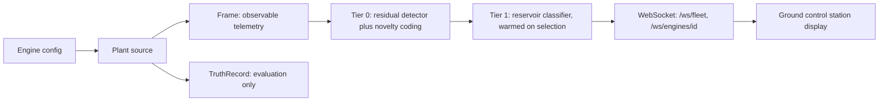
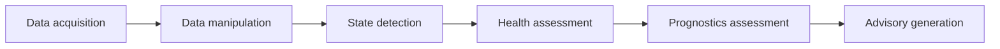
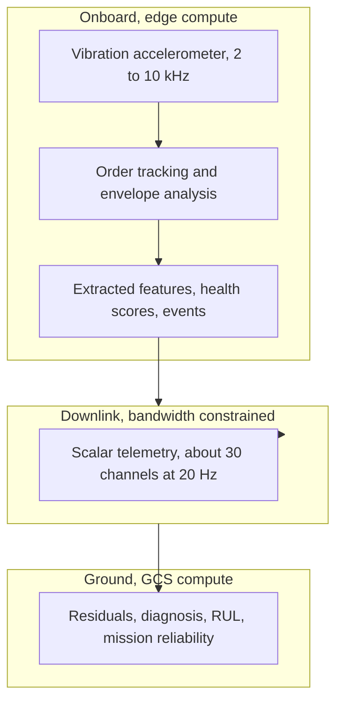

# System Architecture

ANUMAAN runs as one FastAPI application hosting two coordinated backend workspaces, a physics and detection core shared across both, and an operator-facing ground control station that renders their output in real time. This article describes how those pieces fit together: the two backend paths, the runtime data path from telemetry to operator display, the standards mapping the layering follows, and the edge-versus-ground compute split, before the deeper articles cover the physics core, the twin, and the AI stack individually.

## Two coordinated backend workspaces

**Path A: the multi-engine runtime.** `backend/server/engine_api.py` mounts a `RuntimeHub` that constructs one `EngineRuntime` per engine profile found under `configs/engines/`, five profiles in total: Rotax 912 iS, Rotax 914, Rotax 915 iS, Austro AE300, and the VRDE Jayem 2.2L. The hub runs at 20 ticks per second wall time, each tick advancing one simulated second across every engine simultaneously. Each engine runtime owns its own plant source, control levers, sensor levers, frame buffer, a per-tail residual detector running every tick, and an optional reservoir classifier that warms once that engine is selected by the operator. This path exposes `GET /api/engines` to list profiles and readiness, `GET /api/engines/{id}/state` for the latest frame, `GET /api/engines/{id}/schema` for channel and limit schema, `POST /api/engines/select` to select and warm the classifier, `POST` and `DELETE /api/engines/{id}/faults` to inject and clear faults, and `POST /api/engines/{id}/levers` to set throttle, altitude, and outside air temperature targets, reaching the frontend over `/ws/fleet` and `/ws/engines/{id}`.

**Path B: the Rotax ground control stack.** An `EngineStateService` runs during the FastAPI application lifespan, driving a telemetry streamer and a richer set of detection, RUL, and diagnostic agent services scoped specifically to the Rotax 912 iS, through `/api/state`, `/api/control`, and `/ws/telemetry`. This path also serves the Blender-based twin clients. It is the workspace with the deepest single-engine coverage: Bayesian-style diagnosis, RUL estimation, the deterministic diagnostic agent, a voice interface, and full mission replay for that one engine.

Both paths calibrate and run independently. They are described as two coordinated propulsion-health workspaces inside one ground control station, each suited to a different depth of coverage: the multi-engine runtime spans five platforms at once, and the Rotax workspace goes deeper on a single platform. An operator moves between them inside the same application rather than switching tools.

*Caption: the two backend workspaces that independently drive one shared operator interface.*

## Runtime data path

Within a single engine runtime, telemetry moves through a fixed sequence of stages on every tick. An engine configuration feeds a plant source, which produces two distinct outputs: a Frame, the observable telemetry contract that is the only thing ever sent to the client, and a separate TruthRecord, used only for internal evaluation and never transmitted. The Frame feeds a per-tail residual detector that runs every tick, including the Bio-Inspired Sparse Novelty Coding layer, and an optional reservoir classifier that only runs once that engine has been selected and warmed. The combined result reaches the operator over the WebSocket paths described above.

*Caption: how one telemetry tick moves from plant source to operator display, with the truth record kept out of the transmitted path.*

The separation between Frame and TruthRecord matters architecturally, not just as an implementation detail. It keeps the evaluation-side ground truth, used to measure detection accuracy, completely out of the path the detection and diagnosis logic can see, which is what makes a reported detection result meaningful rather than circular.

## The independent plant model

By default the twin validates against a synthetic generator built from its own equations. Setting the `ANUMAAN_USE_INDEPENDENT_PLANT` environment variable routes nominal flight and four of the eight fault modes through `backend/plant/VirtualEngine`, a physically independent model with its own build-to-build variation and its own sensor bias, lag, and noise, plus hidden fault injection the detection layer cannot see in advance. Running against this model means residuals reflect genuine model mismatch between two separately built physics implementations, rather than a generator being checked against itself. This design decision and its consequences for the honesty of the residual signal are covered in full in [The Digital Twin Core](05-the-digital-twin.md).

## OSA-CBM standards mapping

`backend/osacbm.py` maps the system's layering onto the ISO 13374 / OSA-CBM six-layer architecture: data acquisition, data manipulation, state detection, health assessment, prognostics assessment, and advisory generation. This gives ANUMAAN's internal layering a recognized standards anchor rather than an ad hoc pipeline, and it lines up directly with the six-stage reasoning chain described in [Introducing ANUMAAN](03-introducing-anumaan.md): operating context and telemetry acquisition map to data acquisition and manipulation, residual generation maps to state detection, diagnosis maps to health assessment, RUL maps to prognostics assessment, and mission advisory maps to advisory generation.

*Caption: ANUMAAN's pipeline stages mapped onto the OSA-CBM six-layer standard.*

## The edge and ground compute split

The split between what runs onboard and what crosses the downlink is not a design preference, it is forced by bandwidth. A single vibration accelerometer sampled at 10 kHz with 16-bit resolution produces roughly 160 kilobits per second raw, and a representative UAV Ku-band control link runs at approximately 122 kilobits per second or less. One raw vibration channel, on its own, exceeds the entire link budget, before any other telemetry, command, navigation, or payload traffic is considered. This is a structural constraint, not a tuning problem, and it is precisely why the problem statement lists edge AI and lightweight onboard analytics as desired innovation areas: the physics of the link makes onboard processing necessary rather than optional.

By contrast, the full set of scalar engine channels, roughly thirty parameters at 20 Hz, four bytes each, totals under 20 kilobits per second before framing overhead, comfortably inside the link budget. The consequence is a clean architectural rule: scalar telemetry crosses the link directly, while the one AC-waveform channel, vibration, is acquired, analyzed, and reduced to features onboard, and only those features, health scores, and event messages are transmitted to the ground.

*Caption: why vibration is processed onboard while scalar channels cross the downlink directly.*

## Validation

The runtime architecture and its API surface are exercised by a pytest-based test suite covering the runtime, detection, physics, and evaluation modules, including characterization tests that pin specific results, such as recovered misfire rates from the crank-angle chain, as regression tests so that a change breaking the underlying method is caught automatically. Automated browser-based verification captures dated screenshot sequences of the ground control station across its major workflows, including a complete mission simulation flow.

## Related systems

- [Introducing ANUMAAN](03-introducing-anumaan.md)
- [The Digital Twin Core](05-the-digital-twin.md)
- [Telemetry and Sensor Intelligence](07-telemetry-and-sensors.md)
- [Residual Analysis](08-residual-analysis.md)
