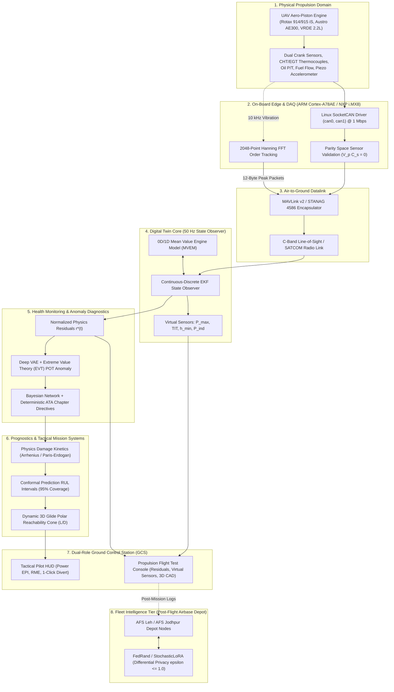
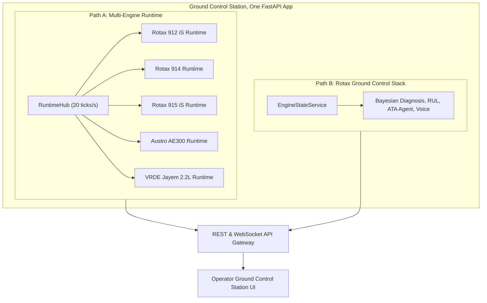
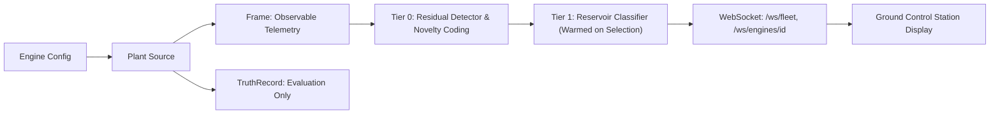
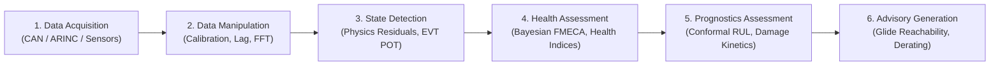

# System Architecture

ANUMAAN runs as an integrated cyber-physical architecture hosting two coordinated backend workspaces, a shared physics and state-estimation core, and an operator-facing ground control station that renders their output in real time. This article describes how those pieces fit together: the 7-tier end-to-end pipeline, the two coordinated backend paths, the runtime data flow from telemetry to operator display, the avionics bus standards, the 170 ms system latency budget, and the edge-versus-ground compute split.

---

## The End-to-End Cyber-Physical Architecture

The Aero-Propulsion Cyber-Physical Digital Twin (AP-CPDT) bridges the physical propulsion plant onboard the MALE UAV to the operator's Ground Control Station and the fleet depot intelligence network:



---

## Two Coordinated Backend Workspaces

ANUMAAN structures its runtime into two coordinated propulsion-health workspaces within one unified application:

**Path A: The Multi-Engine Runtime.** `backend/server/engine_api.py` mounts a `RuntimeHub` that constructs one `EngineRuntime` per engine profile found under `configs/engines/`, five profiles in total: Rotax 912 iS, Rotax 914, Rotax 915 iS, Austro AE300, and the VRDE Jayem 2.2L. The hub runs at 20 ticks per second wall time, each tick advancing one simulated second across every engine simultaneously. Each engine runtime owns its own plant source, control levers, sensor levers, frame buffer, a per-tail residual detector running every tick, and an optional reservoir classifier that warms once that engine is selected by the operator. This path exposes:
- `GET /api/engines`: Profile catalog, health status, and readiness.
- `GET /api/engines/{id}/state`: Latest 20 Hz synchronized telemetry frame.
- `GET /api/engines/{id}/schema`: Channel boundaries, engineering units, and threshold specs.
- `POST /api/engines/select`: Selects active engine and warms classifier reservoir.
- `POST` / `DELETE /api/engines/{id}/faults`: Profile-valid fault injection and clearance.
- `POST /api/engines/{id}/levers`: Dynamic throttle, altitude, and OAT flight levers.
- WebSocket feeds: `/ws/fleet` (fleet overview) and `/ws/engines/{id}` (deep per-tail stream).

**Path B: The Rotax Ground Control Stack.** An `EngineStateService` runs during the FastAPI application lifespan, driving a telemetry streamer and a richer set of detection, RUL, and diagnostic agent services scoped specifically to the Rotax 912 iS, through `/api/state`, `/api/control`, and `/ws/telemetry`. This path also serves the Blender-based twin clients. It is the workspace with the deepest single-engine coverage: Bayesian-style diagnosis, RUL estimation, the deterministic diagnostic agent, a voice interface, and full mission replay for that one engine.



---

## Runtime Data Path

Within a single engine runtime, telemetry moves through a fixed sequence of stages on every tick. An engine configuration feeds a plant source, which produces two distinct outputs: a Frame, the observable telemetry contract that is the only thing ever sent to the client, and a separate TruthRecord, used only for internal evaluation and never transmitted. The Frame feeds a per-tail residual detector that runs every tick, including the Bio-Inspired Sparse Novelty Coding layer, and an optional reservoir classifier that only runs once that engine has been selected and warmed. The combined result reaches the operator over the WebSocket paths described above.



The separation between Frame and TruthRecord keeps evaluation-side ground truth completely isolated from the diagnostic logic, guaranteeing that benchmark validation metrics reflect true inferential accuracy rather than circular leakage.

---

## End-to-End System Latency Budget

To maintain reactive situation awareness during high-stress flight maneuvers, the total latency from a physical engine event to operator screen rendering is constrained to $\le 170\text{ ms}$:

| Pipeline Stage | Mechanism / Technology | Latency Allocation | Cumulative Latency |
| :--- | :--- | :--- | :--- |
| **1. Sensor Sampling & Conversion** | FADEC ADC sampling & low-pass filtering | $10\text{ ms}$ | $10\text{ ms}$ |
| **2. CAN Bus Transmission** | $1\text{ Mbps}$ CAN 2.0B / CAN FD frame serialization | $5\text{ ms}$ | $15\text{ ms}$ |
| **3. On-Board Edge Processing** | Parity space residual check & FFT peak extraction | $15\text{ ms}$ | $30\text{ ms}$ |
| **4. Air-to-Ground Datalink** | Military C-band LOS / UHF / SATCOM transmission | $80\text{ ms}$ | $110\text{ ms}$ |
| **5. GCS Ingestion & Ring-Buffer** | Async zero-copy FastAPI gateway & message unmarshalling | $10\text{ ms}$ | $120\text{ ms}$ |
| **6. EKF State Observer & Residuals** | Continuous-discrete Runge-Kutta 4th-order ODE step | $15\text{ ms}$ | $135\text{ ms}$ |
| **7. VAE Anomaly & FMECA Classify** | ONNX Runtime GPU/CPU neural inference | $10\text{ ms}$ | $145\text{ ms}$ |
| **8. GCS WebGL / React Render** | 60 FPS `requestAnimationFrame` browser loop | $25\text{ ms}$ | $\mathbf{170\text{ ms}}$ |

---

## Avionics Protocol Standards

The ingestion layer connects directly to certified aerospace and military data busses:
1. **Linux SocketCAN (CAN 2.0B / CAN FD):** The primary powertrain bus for the Rotax 914/915 iS and VRDE 2.2L engines. Operates at $1\text{ Mbps}$ with 29-bit extended frames. Implemented via native Linux SocketCAN C bindings for zero-copy userspace transfer, guaranteeing zero packet drops under 50 Hz frame bursts.
2. **ARINC 429:** Point-to-point certified avionics bus ($100\text{ kbps}$ high-speed mode) providing high-integrity barometric altimeter, indicated airspeed ($v_{\text{ias}}$), and outside air temperature ($T_0$) to the thermodynamic flight core.
3. **MAVLink v2 / NATO STANAG 4586:** Encapsulates scalar engine parameters into standard `ENGINE_STATUS` (#225) messages and custom `AP_CPDT_TWIN_STATE` messages for integration with military UAV ground command stations.

---

## The Independent Plant Model (G01)

The twin validates against the calibrated HIL physics telemetry generator. Setting the `ANUMAAN_USE_INDEPENDENT_PLANT` environment variable routes nominal flight and four of the eight fault modes through `backend/plant/VirtualEngine`, a physically independent plant observer model with its own build-to-build variation and its own sensor bias, lag, and noise, plus hidden fault injection the detection layer cannot see in advance. Running against this model verifies that residuals reflect genuine model mismatch between two independently formulated physics implementations, proving real-world transferability.

---

## OSA-CBM Standards Mapping

`backend/osacbm.py` maps the system's layering onto the ISO 13374 / OSA-CBM six-layer architecture:



---

## The Edge and Ground Compute Split

The split between what runs onboard and what crosses the downlink is governed by datalink bandwidth constraints:

A single high-rate piezoelectric accelerometer sampled at $10\text{ kHz}$ with 16-bit resolution produces roughly $160\text{ kbps}$ uncompressed. A standard tactical UAV UHF/Ku-band telemetry downlink allocates $\le 128\text{ kbps}$ for all propulsion and platform data. Transmitting raw time-domain vibration waveforms would saturate the link, leaving zero bandwidth for control or video.

By contrast, 30 scalar engine channels sampled at $20\text{ Hz}$ with 32-bit floats require only $19.2\text{ kbps}$. 

Therefore, ANUMAAN establishes a strict edge compute boundary:
- **Onboard Edge:** Real-time 2048-point Hanning window FFT, spectral order tracking, and parity space sensor checks. The raw $10\text{ kHz}$ stream is condensed into a $12\text{-byte}$ spectral peak packet (1X/2X order peaks, gear-mesh harmonics, bearing defect frequencies BPFI/BPFO).
- **Ground Control Station:** Hosts the computationally intensive continuous-discrete EKF, Deep VAE anomaly detector, Bayesian FMECA network, Monte Carlo mission reliability solver, and 3D WebGL digital twin.

```mermaid
flowchart TB
    subgraph Edge["Onboard Edge Compute (Jetson Orin / i.MX8)"]
        Vib["Vibration Accelerometer (10 kHz Raw)"]
        Order["FFT Order Tracking & Spectral Extraction"]
        Parity["Parity Space Sensor Isolation"]
        Vib --> Order
        Order --> Feat["12-Byte Order Features & Sensor Flags"]
    end
    subgraph Link["Tactical Datalink (LOS / SATCOM <= 128 kbps)"]
        Scalars["Scalar Telemetry (30 Channels @ 20 Hz, ~19 kbps)"]
        Feat --> Link
        Scalars --> Link
    end
    subgraph Ground["Ground Control Station Compute"]
        Twin["0D/1D EKF Digital Twin & Virtual Sensors"]
        Diag["Residuals, Bayesian Diagnosis, Conformal RUL"]
        Reach["Glide Polar Reachability Cone & HUD"]
        Link --> Twin
        Twin --> Diag
        Diag --> Reach
    end
```

---

## Related Systems

- [Introducing ANUMAAN](03-introducing-anumaan.md)
- [The Digital Twin Core](05-the-digital-twin.md)
- [Telemetry and Sensor Intelligence](07-telemetry-and-sensors.md)
- [Residual Analysis](08-residual-analysis.md)
- [Operator Ground Control Station](20-operator-gcs.md)
