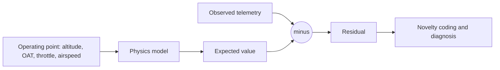
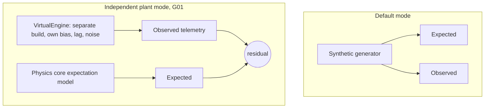

# The Digital Twin Core

A digital twin, in the sense the problem statement asks for, is not a 3D model that reacts to telemetry. It is a computational system that independently predicts what a physical engine should be doing, continuously, and measures the gap between that prediction and reality. This article covers the mechanism that makes ANUMAAN a digital twin in that sense: the residual concept, state estimation from physics rather than direct measurement, and the independent plant model that keeps the comparison honest.

## The problem

Any monitoring system that only displays sensor values, however well visualized, is fundamentally a passthrough. It shows what is happening but has no independent basis for judging whether what is happening is correct. To judge correctness, a system needs a second, independently derived answer to compare against, an expectation. Building and maintaining that expectation, continuously and at the same rate as incoming telemetry, is the core engineering problem a digital twin solves.

## The residual concept

A residual is the difference between an observed telemetry value and the value physics predicts for the engine's current operating point:

```
residual = observed - expected(operating_point)
```

This single idea is why raw sensor values are insufficient on their own. A cylinder head temperature reading of 130 degrees Celsius means nothing by itself. It is unremarkable during a hot-day climb at high power and genuinely concerning during a cold cruise at low power, because the physically correct CHT at those two operating points is different. A fixed threshold has no way to represent that difference; it only ever compares against one number. A residual does represent it, because "expected" is recomputed at every tick from the engine's actual altitude, outside air temperature, throttle setting, and airspeed. The raw value becomes meaningful only once it is placed against the physics-derived expectation for that exact moment.


*Caption: a residual is computed at every tick as observed telemetry minus the physics-expected value at the current operating point.*

## State estimation, not lookup

The expected-value side of that subtraction is not a lookup table. ANUMAAN maintains a running estimate of engine state, cylinder pressure, crank angular velocity, and per-cylinder torque contribution, computed from the physics core described in [Engine Physics and Combustion Modeling](06-engine-physics.md), rather than read directly off a sensor. This matters because several of these quantities are not measured on a real aero piston engine at all; there is no cylinder pressure sensor on an in-service Rotax installation. The twin's state estimate is the only place these quantities exist, and it is what allows the system to reason about combustion-level behavior, per-cylinder torque deficit, cycle-to-cycle instability, that raw telemetry alone cannot expose.

## The independent plant model

The honesty of a residual depends entirely on where the "expected" side comes from. If the model computing expected behavior and the model generating or representing observed telemetry share the same code, the same assumptions, and the same random seed, a residual will only ever measure the twin agreeing with itself. That is not a diagnostic signal, it is a tautology.

ANUMAAN addresses this directly with an independent plant model, `backend/plant/VirtualEngine`, referred to internally as G01. Setting the `ANUMAAN_USE_INDEPENDENT_PLANT` environment variable routes nominal flight and four of the eight fault modes through this model instead of the default synthetic generator. G01 is built and calibrated separately, with its own build-to-build variation and its own sensor bias, lag, and noise characteristics, and with hidden fault injection the detection layer has no advance knowledge of. Because the model producing telemetry and the model predicting telemetry are genuinely different implementations, a residual computed against G01 reflects real model mismatch, the same kind of mismatch that would exist between a physics model and a real physical engine, rather than a generator checking its own output.


*Caption: why routing telemetry through a physically independent plant model (G01) produces a residual that reflects genuine model mismatch rather than a generator comparing itself to itself.*

## Why physical independence matters for honest residuals

A digital twin's diagnostic credibility rests on the assumption that a residual near zero means the engine is behaving as expected, and a growing residual means something in the physical system is genuinely diverging from that expectation. That assumption only holds if the expectation was computed independently of the observation. Sharing a generator between the two sides would make every residual artificially small in the nominal case and would make fault injection artificially clean, because the detector would effectively know in advance what the generator was going to do. Running against G01 removes that shortcut. It is the same discipline a real deployment would require, where the physics model has no access whatsoever to what the physical engine is actually doing except through its sensors, and it is why the independent plant model is treated as a first-class part of the architecture rather than an optional test mode.

## Integration

The residual stream produced here feeds directly into Bio-Inspired Sparse Novelty Coding and the Bayesian diagnosis layer described in [Residual Analysis](08-residual-analysis.md), and the operating-point inputs that make the expected-value computation meaningful are acquired and validated as described in [Telemetry and Sensor Intelligence](07-telemetry-and-sensors.md). The physics computations behind the expected-value side, cylinder pressure, torque, and crank angular velocity, are covered in full in [Engine Physics and Combustion Modeling](06-engine-physics.md).

## Validation

The residual pipeline and the independent plant model are exercised through the project's pytest-based characterization suite, which pins specific detection and physics results as regression tests so that a change breaking the underlying method is caught automatically. The independent plant model's behavior under the four supported fault modes and nominal flight is part of that coverage. Real-aircraft validation of the residual approach against flight hardware is the natural next phase; the current validation basis is simulation against a physically independent model plus reference engine specification, not flight test data.

## Related systems

- [Introducing ANUMAAN](03-introducing-anumaan.md)
- [Engine Physics and Combustion Modeling](06-engine-physics.md)
- [Residual Analysis](08-residual-analysis.md)
- [System Architecture](04-system-architecture.md)
