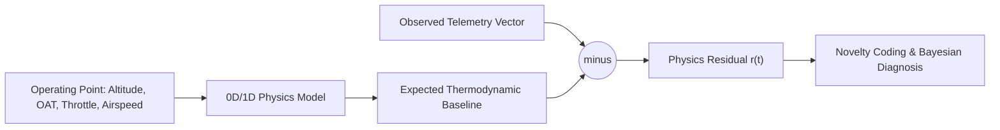
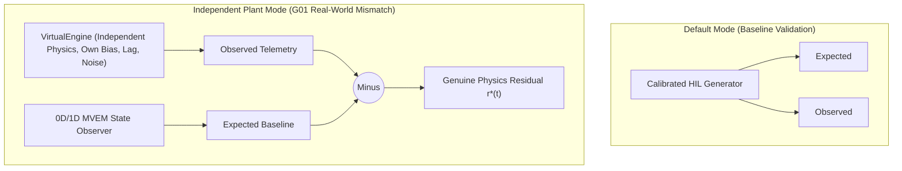

# The Digital Twin Core

A digital twin, in the sense the DRDO problem statement demands, is not a 3D CAD model that rotates on a screen, nor an offline simulator. It is an **active cyber-physical state observer** that runs continuously in real time, maintains an explicit dynamic state vector $\mathbf{x}_{\text{twin}}(t)$, tracks unmeasured internal physical quantities via virtual sensing, continuously computes physics residuals against physical telemetry, and adapts its internal health parameters $\boldsymbol{\theta}_{\text{deg}}(t)$ across the operational life of the engine.

---

## Definitive Taxonomy: Genuine Digital Twin vs. Surrogates

The aerospace industry frequently encounters systems marketed as "digital twins" that are merely visualizers or passive telemetry viewers. The table below delineates the strict boundary:

| Dimension | 3D Visualization / CAD | Offline Simulator | Telemetry Dashboard | Genuine AP-CPDT Digital Twin |
| :--- | :--- | :--- | :--- | :--- |
| **State Synchronization** | None (Static / kinematic transforms) | None (Runs *in silico* detached from flight) | Unidirectional push (Displays raw sensors) | **Bidirectional State Observer (50 Hz EKF)** |
| **Internal State Vector** | Mesh coordinates $(x, y, z)$ | Pre-computed state trajectories | Sensor scalar values only | **Physical + Wear States $(\mathbf{x}(t), \boldsymbol{\theta}(t))$** |
| **Virtual Sensing** | None | Synthetic offline traces | None | **Real-Time In-Flight ($P_{\max}, TIT, h_{\min}$)** |
| **Physics Residuals** | None | None | None | **Continuous $\mathbf{r}(t) = \mathbf{y}_{\text{meas}} - \mathbf{y}_{\text{mvem}}$** |
| **Model Adaptation** | None | Fixed parameters | None | **Parameter Estimation (Kalman Drift)** |
| **Compute Target** | GPU rasterizer | Workstation / cluster | Web browser | **Real-Time Edge / GCS Engine** |
| **Operational Authority**| Display only | Pre-flight conceptual design | Passive threshold alerts | **Active Flight-Margin Advisories** |

---

## The Residual Concept

A residual is the difference between an observed telemetry value and the value physics predicts for the engine's current operating point:

$$\mathbf{r}(t) = \mathbf{y}_{\text{meas}}(t) - \mathbf{y}_{\text{mvem}}(\hat{\mathbf{x}}(t), \mathbf{u}(t), t)$$

This single principle separates predictive diagnostics from thresholding. A cylinder head temperature reading of $130^\circ\text{C}$ means nothing in isolation. It is nominal during a full-power desert takeoff at AFS Jodhpur ($+48^\circ\text{C}$ ambient) and alarming during a loiter at $25,000\text{ ft}$ over Ladakh ($-35^\circ\text{C}$ ambient). A fixed threshold cannot distinguish between these operating conditions. The digital twin computes the exact physics-expected temperature for the instantaneous altitude, ambient temperature, airspeed, and throttle setting every tick. The residual isolates the true physical anomaly from normal operational shifts.

---

## Continuous-Discrete State Observer Formulation

The digital twin maintains a continuous state vector $\mathbf{x}(t) \in \mathbb{R}^{12}$ tracking high-frequency aerothermodynamic states and slowly drifting wear parameters:

$$\mathbf{x}(t) = \begin{bmatrix}
P_{\text{im}} & \text{Intake Manifold Absolute Pressure [Pa]} \\
T_{\text{im}} & \text{Intake Manifold Temperature [K]} \\
\omega_e & \text{Crankshaft Angular Velocity [rad/s]} \\
N_{\text{tc}} & \text{Turbocharger Rotor Velocity [rad/s]} \\
T_{\text{tit}} & \text{Turbine Inlet Temperature [K]} \\
T_{\text{oil}} & \text{Oil Sump Temperature [K]} \\
T_{\text{cht}, 1..4} & \text{Cylinder Head Temperatures 1 to 4 [K]} \\
\theta_{\text{blowby}} & \text{Piston Ring Pack Blow-by Degradation Parameter [nom = 1.0]} \\
\theta_{\text{fouling}} & \text{Compressor / Intercooler Fouling Parameter [nom = 1.0]}
\end{bmatrix}^T$$

**Input Vector $\mathbf{u}(t) \in \mathbb{R}^6$:**
$$\mathbf{u}(t) = \begin{bmatrix} \alpha_{\text{th}} & \dot{m}_{\text{fuel}} & u_{\text{wg}} & z_{\text{alt}} & T_0 & v_{\text{ias}} \end{bmatrix}^T$$

**Measurement Vector $\mathbf{y}(t) \in \mathbb{R}^8$:**
$$\mathbf{y}(t) = \begin{bmatrix} P_{\text{im,meas}} & \text{RPM}_{\text{meas}} & T_{\text{egt,meas}} & T_{\text{oil,meas}} & P_{\text{oil,meas}} & T_{\text{cht,meas}}^{\max} & \dot{m}_{f,\text{meas}} & \text{MAP}_{\text{meas}} \end{bmatrix}^T$$

---

## Virtual Sensors: In-Flight Unmeasured Quantities

A cornerstone capability of the genuine Digital Twin is synthesizing critical engineering quantities that are physically impossible or economically unviable to measure with production in-flight instrumentation:

| Virtual Sensor | Physics Synthesis Formulation | Operational Target |
| :--- | :--- | :--- |
| **Peak Cylinder Pressure ($P_{\max}$)** | Dual-combustion Seiliger constant-volume peak formula | Detonation margin & structural fatigue tracking |
| **Turbine Inlet Temperature ($TIT$)** | Exhaust manifold enthalpy balance ($1050^\circ\text{C}$ pre-turbine) | Turbocharger thermal limit & blade creep |
| **Hydrodynamic Oil Film ($h_{\min}$)** | Sommerfeld bearing lubrication equation ($S_0$) | Bearing scuffing & boundary friction warning |
| **Indicated Engine Power ($P_{\text{ind}}$)** | $\text{IMEP} \cdot V_d \cdot \omega_e / (4\pi)$ | True shaft power & aerodynamic thrust margin |
| **Compressor Surge Margin ($SM$)** | $(\Pi_c / \dot{m}_c)_{\text{surge}} / (\Pi_c / \dot{m}_c)$ | High-altitude compressor stall & flameout |

1. **Peak Cylinder Pressure ($P_{\max}$):** Production UAV engines cannot carry piezoelectric quartz pressure transducers in every cylinder head due to thermal cycling and short lifespans ($< 100\text{ hours}$). The twin provides continuous real-time $\hat{P}_{\max}(t)$, enabling knock detection and structural fatigue tracking without specialized hardware.
2. **Turbine Inlet Temperature ($TIT$):** Pre-turbine gas temperatures can exceed $1050^\circ\text{C}$ on full-power climb, destroying standard Type K thermocouples. The twin estimates TIT using the turbine expansion enthalpy balance.
3. **Hydrodynamic Oil Film Thickness ($h_{\min}$):** Minimum oil film thickness on crankshaft main journals (typically $1.8 - 3.2\ \mu\text{m}$). If $h_{\min} < 0.8\ \mu\text{m}$, an alert of imminent boundary friction is issued before bearing wipe occurs.

---

## The Independent Plant Model (G01)

The honesty of a residual depends entirely on where the "expected" baseline originates. If the model predicting expected behavior and the model generating observed telemetry share the same code, assumptions, and random seeds, the residual only measures the twin agreeing with itself: a tautology.

ANUMAAN resolves this with an independent plant model, `backend/plant/VirtualEngine` (internally designated G01). Setting `ANUMAAN_USE_INDEPENDENT_PLANT=1` routes telemetry and fault modes through this model instead of the default generator. G01 is built with:
- Independent build-to-build manufacturing tolerances ($\pm 2\%$ volumetric efficiency, $\pm 6\%$ mechanical friction).
- Sensor transfer functions exhibiting first-order thermal lag ($\tau_{\text{sensor}}$) and stochastic calibration drift.
- Hidden multi-fault injections that the detection layer has no advance knowledge of.

Running against G01 ensures that residuals reflect true physical model mismatch, identical to what an operational twin encounters when deployed on physical aircraft engines.

---

## Integration & Operational Execution

- **Update Rates:** The inner dynamic state observer executes at **50 Hz** ($20\text{ ms}$ step) matched to high-priority CAN frames, while slow wear parameters ($\theta_{\text{blowby}}, \theta_{\text{fouling}}$) update at **1 Hz**.
- **Downstream Feed:** The validated residual vector feeds directly into [Bio-Inspired Sparse Novelty Coding](10-bio-inspired-sparse-novelty-coding.md) and [Fault Diagnosis](11-fault-diagnosis.md).
- **Physics Equations:** Detailed mathematical formulations for manifold dynamics, Seiliger combustion, and bearing lubrication are covered in [Engine Physics and Thermodynamics](06-engine-physics.md).

---

## Related Systems

- [System Architecture](04-system-architecture.md)
- [Engine Physics and Thermodynamics](06-engine-physics.md)
- [Telemetry and Sensors](07-telemetry-and-sensors.md)
- [Residual Analysis](08-residual-analysis.md)
