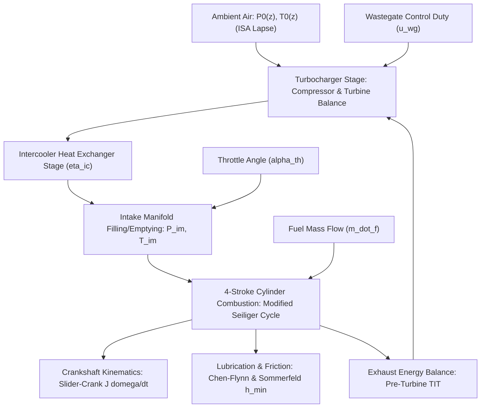
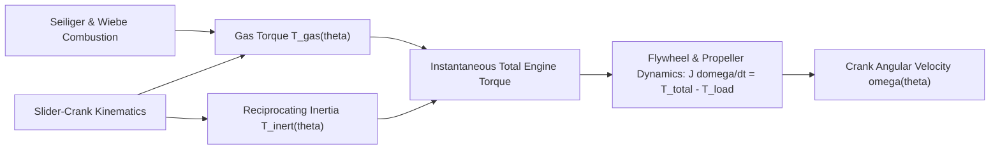

# Engine Physics and Thermodynamics

The expected-value baseline of every residual in ANUMAAN traces back to a first-principles aerothermodynamic and combustion physics core. Rather than treating engine behavior as empirical lookup tables or hand-painted signals, ANUMAAN simulates the complete **0D/1D Mean Value Engine Model (MVEM)** and in-cylinder thermodynamics down to the crank-angle domain. 

This article establishes the foundational physics: reference engine constants, the 0D/1D aerothermodynamics chain (turbocharger matching, manifold filling/emptying, modified Seiliger combustion, slider-crank kinematics, and lubrication film mechanics), and why multi-sensor fault signatures emerge naturally from physics rather than being synthetically authored.

---

## Reference Engine Constants & Indian Fleet Context

The physics core is built from published, verifiable manufacturer specifications and military UAV configurations:
- **Rotax 912 iS Sport:** Naturally aspirated, 4-cylinder horizontally opposed boxer, dual FADEC fuel injection. Bore: $84.0\text{ mm}$, stroke: $61.0\text{ mm}$, displacement: $1,352\text{ cm}^3$, compression ratio: $10.8:1$. Firing order: 1-4-2-3.
- **Rotax 914 F Turbo:** Turbocharged with automatic wastegate TCU. Bore: $79.5\text{ mm}$, stroke: $61.0\text{ mm}$, displacement: $1,211.2\text{ cm}^3$, compression ratio: $8.75:1$, maximum continuous boost: $1.35\text{ bar}$.
- **Rotax 915 iS Turbo Intercooled:** Turbocharged with intercooler, dual injector channels per cylinder. Displacement: $1,352\text{ cm}^3$, compression ratio: $8.2:1$, full take-off power: $141\text{ hp}$ up to $15,000\text{ ft}$.
- **Austro Engine AE300:** 2.0L turbocharged common-rail diesel ($168\text{ hp}$) utilizing heavy aviation fuel (Jet-A1 / JP-8).
- **VRDE Jayem 2.2L:** DRDO indigenized compression-ignition heavy-fuel aero-engine ($180\text{ hp}$) developed for tactical MALE UAV platforms (Tapas-BH-201).

---

## The 0D/1D Mean Value Engine Model (MVEM)

The propulsion plant consists of five synchronized thermodynamic stages executing at 50 Hz synchronously with incoming telemetry:

---

## 1. Atmospheric Lapse Dynamics (ISA Model)

The flight core computes ambient pressure $P_0$, temperature $T_0$, and density $\rho_0$ at geometric altitude $z$ (AMSL) according to the International Standard Atmosphere with non-standard temperature offsets $\Delta T_{\text{ISA}}$:

$$T_0(z) = (T_{\text{SL}} - L \cdot z) + \Delta T_{\text{ISA}}, \quad L = 0.0065\text{ K/m}, \quad T_{\text{SL}} = 288.15\text{ K}$$

$$P_0(z) = P_{\text{SL}} \cdot \left( 1 - \frac{L \cdot z}{T_{\text{SL}}} \right)^{\frac{g \cdot M}{R_0 \cdot L}}, \quad P_{\text{SL}} = 101.325\text{ kPa}$$

$$\rho_0(z) = \frac{P_0(z)}{R_{\text{air}} \cdot T_0(z)}, \quad R_{\text{air}} = 287.058\text{ J/(kg}\cdot\text{K)}$$

---

## 2. Turbocharger Aerothermodynamics

For turbocharged variants (Rotax 914, 915 iS), compressor pressure ratio $\Pi_c = P_{c,\text{out}} / P_0$ and mass flow $\dot{m}_c$ govern compressor exit temperature:

$$T_{c,\text{out}} = T_0 \cdot \left[ 1 + \frac{1}{\eta_c} \left( \Pi_c^{\frac{\gamma - 1}{\gamma}} - 1 \right) \right], \quad \gamma = 1.4$$

Compressor required power $\dot{W}_c$:
$$\dot{W}_c = \dot{m}_c \cdot c_{p,\text{air}} \cdot (T_{c,\text{out}} - T_0)$$

Turbine power $\dot{W}_t$ developed from exhaust enthalpy (where $u_{\text{wg}} \in [0, 1]$ is wastegate opening fraction):
$$\dot{m}_t = \dot{m}_{\text{exh}} \cdot (1 - u_{\text{wg}})$$
$$\dot{W}_t = \dot{m}_t \cdot c_{p,\text{exh}} \cdot T_{\text{tit}} \cdot \eta_t \cdot \left[ 1 - \left( \frac{P_0}{P_{\text{exh}}} \right)^{\frac{\gamma_e - 1}{\gamma_e}} \right]$$

Turbocharger rotor shaft dynamic state:
$$\frac{d N_{\text{tc}}}{dt} = \frac{1}{J_{\text{tc}} \cdot N_{\text{tc}} \cdot \left(\frac{2\pi}{60}\right)^2} \cdot (\dot{W}_t \cdot \eta_{\text{mech,tc}} - \dot{W}_c)$$

---

## 3. Intake Manifold Filling & Emptying Dynamics

Intake manifold pressure $P_{\text{im}}$ and temperature $T_{\text{im}}$ follow control-volume conservation laws:

$$\frac{d P_{\text{im}}}{dt} = \frac{\gamma \cdot R_{\text{air}} \cdot T_{\text{im}}}{V_{\text{im}}} \cdot \left( \dot{m}_{\text{th}} - \dot{m}_{\text{cyl}} \right)$$

Throttle mass flow $\dot{m}_{\text{th}}$ is computed via the isentropic compressible orifice equation with throttle discharge area $A_{\text{th}}(\alpha_{\text{th}})$:

$$\dot{m}_{\text{th}} = C_d \cdot A_{\text{th}}(\alpha_{\text{th}}) \cdot \frac{P_{c,\text{out}}}{\sqrt{R_{\text{air}} T_{c,\text{out}}}} \cdot \Psi\left(\frac{P_{\text{im}}}{P_{c,\text{out}}}\right)$$

$$\Psi(P_r) = \begin{cases} 
\sqrt{\gamma \left(\frac{2}{\gamma + 1}\right)^{\frac{\gamma + 1}{\gamma - 1}}} & \text{if } P_r \le \left(\frac{2}{\gamma+1}\right)^{\frac{\gamma}{\gamma-1}} \text{ (Choked Flow)} \\[8pt]
\sqrt{\frac{2\gamma}{\gamma - 1} \left( P_r^{\frac{2}{\gamma}} - P_r^{\frac{\gamma + 1}{\gamma}} \right)} & \text{if } P_r > \left(\frac{2}{\gamma+1}\right)^{\frac{\gamma}{\gamma-1}} \text{ (Subsonic Flow)}
\end{cases}$$

Cylinder induction aspiration mass flow:
$$\dot{m}_{\text{cyl}} = \eta_v(P_{\text{im}}, \omega_e) \cdot \frac{V_d \cdot \omega_e}{4\pi} \cdot \frac{P_{\text{im}}}{R_{\text{air}} \cdot T_{\text{im}}}$$

---

## 4. In-Cylinder Modified Seiliger & Wiebe Combustion

The combustion cycle is formulated as a dual-combustion Seiliger cycle to capture peak combustion pressure $P_{\max}$ without the computational penalty of 3D CFD:

$$P_{\text{comp}} = P_{\text{im}} \cdot r_c^{\kappa_c}, \quad T_{\text{comp}} = T_{\text{im}} \cdot r_c^{\kappa_c - 1}$$

Constant-volume pressure rise ratio $\alpha_p = P_3 / P_{\text{comp}}$ and constant-pressure cut-off ratio $\beta_v = V_4 / V_3$:

$$P_{\max} = \alpha_p \cdot P_{\text{comp}} = P_{\text{comp}} + \frac{\xi_v \cdot \eta_{\text{comb}} \cdot m_{\text{fuel}} \cdot Q_{\text{lhv}}}{c_v \cdot m_{\text{total}}}$$
$$T_{\max} = T_{\text{comp}} \cdot \alpha_p \cdot \beta_v$$

Where $\xi_v \approx 0.55$ is the fraction of fuel burned at constant volume, $Q_{\text{lhv}} = 43.5\text{ MJ/kg}$, and $\eta_{\text{comb}} = 0.98$.

At the crank-angle resolution, burn rate follows the Wiebe mass-fraction burned function:
$$x_b(\theta) = 1 - \exp\left(-a \left(\frac{\theta - \theta_0}{\Delta\theta}\right)^{m+1}\right), \quad \frac{dQ}{d\theta} = Q_{\text{total}} \cdot \frac{dx_b}{d\theta}$$

Turbine Inlet Temperature ($TIT$) dynamic lag equation:
$$\tau_{\text{egt}} \frac{d T_{\text{tit}}}{dt} + T_{\text{tit}} = T_{\max} \cdot \left(\frac{1}{r_c}\right)^{\kappa_e - 1} - \Delta T_{\text{blowdown}}$$

---

## 5. Lubrication Dynamics & Crankcase Friction

Friction Mean Effective Pressure ($FMEP$) and minimum hydrodynamic journal oil film thickness $h_{\min}$ follow the Chen-Flynn aero-piston friction formulation:

$$FMEP = c_0 + c_1 \cdot P_{\max} + c_2 \cdot \bar{S}_p + c_3 \cdot \bar{S}_p^2$$

Where $\bar{S}_p = \frac{2 \cdot S \cdot \omega_e}{60}$ is the mean piston speed ($S = 61\text{ mm}$ stroke).

Hydrodynamic journal bearing minimum oil film thickness via Sommerfeld number $S_0$:
$$S_0 = \frac{\mu_{\text{oil}}(T_{\text{oil}}) \cdot N_{\text{eng}}}{P_{\text{bearing}}} \cdot \left( \frac{R_{\text{journal}}}{C_{\text{radial}}} \right)^2$$

$$h_{\min} = C_{\text{radial}} \cdot \left( 1 - \epsilon(S_0) \right)$$

Oil dynamic viscosity follows the Vogel-Cameron thermal equation:
$$\mu_{\text{oil}}(T_{\text{oil}}) = A_\mu \cdot \exp\left( \frac{B_\mu}{T_{\text{oil}} + C_\mu} \right)$$

Crankcase oil sump thermal conservation:
$$m_{\text{oil}} \cdot c_{\text{oil}} \frac{d T_{\text{oil}}}{dt} = \dot{W}_{\text{friction}}(FMEP, \omega_e) + \dot{Q}_{\text{piston-underside}} - \dot{Q}_{\text{oil-cooler}}(v_{\text{ias}}, T_0)$$

---

## 6. Slider-Crank Kinematics & Crank Dynamics

Piston position $x(\theta)$ and swept volume $V(\theta)$ are derived from the slider-crank geometry:

$$x(\theta) = r(1 - \cos\theta) + l\left(1 - \sqrt{1 - \lambda^2 \sin^2\theta}\right), \quad \lambda = \frac{r}{l}$$

Gas torque $T_{\text{gas}}(\theta) = (p(\theta) - p_{\text{crankcase}}) A_p \cdot \frac{dx}{d\theta}$ and reciprocating inertial torque $T_{\text{inert}}(\theta)$ sum across all four cylinders phased by $180^\circ$ (1-4-2-3):

$$J \frac{d\omega}{dt} = \sum_{k=1}^4 \Big( T_{\text{gas}, k}(\theta - \phi_k) + T_{\text{inert}, k}(\theta - \phi_k) \Big) - T_{\text{load}}(\omega)$$

---

## Emergence of Multi-Channel Fault Signatures

Because all thermodynamic stages are coupled by physical conservation equations, an injected fault produces cross-correlated signatures across multiple physical channels naturally:

1. **Ignition Misfire:** Setting $Q_{\text{total}} = 0$ on Cylinder #2 eliminates gas torque for that $180^\circ$ interval, causing an immediate dip in $\omega(\theta)$. Simultaneously, EGT on Cylinder #2 decays exponentially, while order-tracking vibration reveals a surge in half-order ($0.5X$) energy.
2. **Wastegate Stuck Open:** Turbocharger boost pressure collapses ($\Delta MAP < 0$), manifold density drops, EGT rises due to late combustion timing, and indicated power derates by up to $35\%$.
3. **Oil Cooler Airflow Blockage:** Sump temperature $T_{\text{oil}}$ climbs past $125^\circ\text{C}$, viscosity $\mu_{\text{oil}}$ drops, reducing the Sommerfeld number $S_0$ and collapsing hydrodynamic oil film thickness $h_{\min}$ toward boundary friction scuffing ($h_{\min} < 0.8\ \mu\text{m}$).

---

## Related Systems

- [The Digital Twin Core](05-the-digital-twin.md)
- [Telemetry and Sensors](07-telemetry-and-sensors.md)
- [Residual Analysis](08-residual-analysis.md)
- [Vibration Analysis and Order Tracking](12-vibration-analysis.md)
