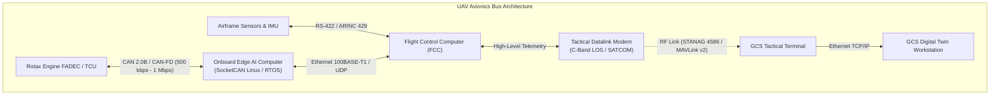
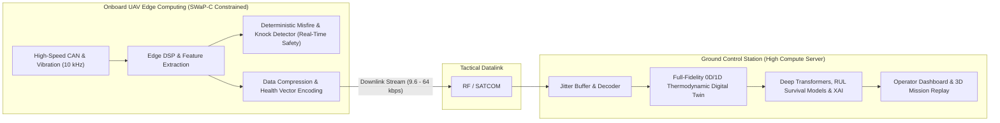

# Telemetry, Avionics Interfaces & Sensor Intelligence

Every judgment ANUMAAN makes rests on telemetry acquired deterministically from the engine, avionics data buses, and ambient flight context. In military MALE UAVs (such as ADE Tapas-BH-201 and Archer), the telemetry subsystem bridges the physical engine controller (FADEC / ECU) to the on-board edge computer and downlinks actionable health vectors across bandwidth-constrained tactical radio links.

This article details the avionics communication hierarchy, the **Minimum Viable Sensor Suite**, sensor integrity and analytical parity checking, **SWaP-C edge compute constraints**, in-situ edge vibration reduction, and **anti-spoofing cybersecurity protocols**.

---

## Avionics Data Communication Buses

Military UAVs utilize a tiered hierarchy of avionics data buses balancing deterministic timing, fault tolerance, noise immunity, and payload throughput:

### 1. The CAN Bus Protocol (ISO 11898-1/2 & SocketCAN)
The Controller Area Network (CAN) bus is the standard physical interface for aero-piston engine ECUs:
* **Physical Layer (ISO 11898-2):** Differential two-wire twisted pair (`CAN_H` and `CAN_L`) terminated with $120\ \Omega$ resistors at each end. High common-mode noise rejection, critical in aircraft where ignition spark coils generate massive electromagnetic interference (EMI).
* **Signaling:**
  * Dominant State (Bit 0): `CAN_H` driven to $3.5\text{ V}$, `CAN_L` pulled to $1.5\text{ V}$ ($\Delta V = 2.0\text{ V}$).
  * Recessive State (Bit 1): Both lines float at $2.5\text{ V}$ ($\Delta V = 0.0\text{ V}$).
* **Arbitration:** Non-destructive bitwise arbitration based on message identifiers. Lower numerical IDs have higher priority (e.g., `0x100` emergency engine shutdown preempts `0x350` oil temperature gauge).
* **CAN 2.0B vs. CAN-FD:**
  * *CAN 2.0B:* 11-bit standard or 29-bit extended ID; maximum payload of **8 bytes per frame**; fixed bit rate up to $1\text{ Mbps}$.
  * *CAN-FD (Flexible Data-rate):* Payload expanded up to **64 bytes per frame**; data phase can switch up to $5\text{ Mbps}$, drastically reducing bus load and latency.
* **The Linux SocketCAN Subsystem:**
  In modern Linux-based edge computers (Jetson Orin Nano / NXP i.MX8), CAN controllers are integrated into the Linux network protocol stack as network devices (`can0`, `can1`). Telemetry acquisition uses standard BSD socket APIs (`AF_CAN`, `SOCK_RAW`), providing zero-copy ring buffering, multi-threaded access, and DBC schema parsing via libraries such as `cantools`.

---

## Minimum Viable Sensor Suite

An engine fault cannot be diagnosed unless it produces a measurable disturbance in the sensor observability subspace. The following matrix details the definitive sensor suite for MALE UAV aero-piston engines:

| Sensor Type | Physical Parameter | Meas. Range | Sampling Rate | Precision | Physical Placement | Primary Fault Observability | Redundancy Architecture |
| :--- | :--- | :--- | :--- | :--- | :--- | :--- | :--- |
| **Hall-Effect / Variable Reluctance** | Engine Speed (RPM) & Crank Angle | 0 to 7,000 RPM | 60 pulses/rev (Trigger Wheel) | $\pm 1\text{ RPM}$ | Crankshaft flywheel nose | Misfire, torsional vibration, governor hunting, power loss. | **Dual Lane** (Independent Lane A / Lane B pick-up coils). |
| **Piezoresistive Transducer** | Manifold Absolute Pressure (MAP) | 0.2 to 2.5 bar abs | 10 to 50 Hz | $\pm 0.01\text{ bar}$ | Intake manifold plenum | Turbo wastegate failure, air filter clogging, induction leak. | Dual redundant sensors with cross-plausibility checking. |
| **Type-J / RTD Thermocouple** | Cylinder Head Temperature (CHT 1 to 4) | $-40^\circ\text{C}$ to $+200^\circ\text{C}$ | 1 to 5 Hz | $\pm 1.5^\circ\text{C}$ | Cylinder head spark plug well / coolant jacket | Thermal runaway, cooling pump cavitation, localized boiling. | 4 independent channels (1 per head); analytical observer fallback. |
| **Type-K Inconel Thermocouple** | Exhaust Gas Temperature (EGT 1 to 4) | $+200^\circ\text{C}$ to $+1,000^\circ\text{C}$| 5 to 10 Hz | $\pm 3.0^\circ\text{C}$ | Exhaust runner (75 mm from exhaust port) | Injector clogging, lean/rich misfire, valve burning, ignition slip. | 4 independent channels (1 per runner); cross-cylinder parity. |
| **Piezoresistive Isolated Transducer**| Oil Pressure | 0 to 10 bar | 10 to 50 Hz | $\pm 0.05\text{ bar}$ | Main crankcase oil gallery | Journal bearing failure, relief valve sticking, pump aeration. | Critical safety redline; dual sensor channels recommended. |
| **NTC Thermistor / PT100** | Oil Temperature | $-20^\circ\text{C}$ to $+150^\circ\text{C}$ | 1 to 5 Hz | $\pm 0.5^\circ\text{C}$ | Oil tank exit / main gallery inlet | Thermal oxidation, oil cooler thermostat failure, bearing heat. | Single primary channel + cross-correlation with CHT trend. |
| **Pelton Turbine / Coriolis** | Fuel Flow Rate | 2 to 50 L/hr | 5 to 10 Hz | $\pm 0.5\%$ | In-line fuel feed before fuel rail | Fuel pump degradation, vapor lock, systemic leak, BSFC drift. | In-line flowmeter backed by ECU injector pulse-width integrator. |
| **Tri-Axial High-Temp Piezoelectric**| Structural Vibration (Accelerometry)| $\pm 50\text{ g}$ | 5 kHz to 20 kHz | $\pm 2.0\%$ | Crankcase top spine & reduction gearbox casing | Propeller unbalance ($1\times$), bearing spalling, piston slap, gear pitting.| Onboard edge processing (FFT/Kurtosis extraction); raw bursts. |
| **Hall Current Sensor / Voltage Divider**| Battery Voltage & Alternator Current | 0 to 32 V / $\pm 50\text{ A}$ | 10 to 20 Hz | $\pm 0.1\text{ V} / \pm 0.5\text{ A}$| Main avionics DC bus & alternator stator feed | Alternator rectifier failure, battery cell degradation, brownout. | Dual battery bus monitoring. |

---

## Sensor Integrity: Telling a Broken Sensor from a Broken Engine

A separate validation layer sits ahead of the residual pipeline, checking each incoming reading for physical plausibility and analytical parity before allowing that reading to influence a diagnosis.

### 1. Electrical & Rate-of-Change Checks
* **Open-Circuit Detection:** Thermocouple leads that fatigue and snap read open-circuit rail voltages ($> 1,200^\circ\text{C}$) or instantaneous negative saturations. These are rejected immediately by rate-of-change checks ($\frac{dT}{dt} > 100^\circ\text{C/s}$ violates head thermal inertia).
* **Current-Loop Integrity:** 4 to 20 mA industrial transmitters output $0\text{ mA}$ only during line breakage, cleanly separating "zero pressure" (which reads $4\text{ mA}$) from "sensor disconnection" ($0\text{ mA}$).

### 2. Analytical Parity Space Redundancy
When redundant physical sensors are unavailable due to weight constraints, ANUMAAN evaluates algebraic parity relations:
$$\mathbf{r}_p(t) = \mathbf{V}_p \mathbf{y}_{\text{sensor}}(t) = \mathbf{V}_p (\mathbf{C}_s \mathbf{x}(t) + \mathbf{f}_s(t) + \mathbf{v}(t))$$
Where $\mathbf{V}_p \mathbf{C}_s = \mathbf{0}$. If a sensor develops bias $\mathbf{f}_s(t) \ne \mathbf{0}$, the residual vector $\mathbf{r}_p$ deviates along a known signature axis, isolating the faulty transducer within 2 sample cycles ($40\text{ ms}$).

---

## Edge Computing vs. GCS Allocation (SWaP-C Optimization)

Propulsion health monitoring requires processing both low-rate thermodynamic parameters ($10\text{ to } 50\text{ Hz}$) and high-rate mechanical vibration ($5\text{ to } 20\text{ kHz}$). Transmitting raw $10\text{ kHz}$ accelerometer streams over tactical radio links ($< 64\text{ kbps}$ bandwidth) is physically impossible. ANUMAAN optimizes the system across Size, Weight, Power, and Cost (SWaP-C):

### The SWaP-C Allocation Matrix
* **Onboard Edge Constraints:**
  * Weight: $\le 1.5\text{ kg}$ (avionics bay allocation).
  * Power: $\le 25\text{ W}$ continuous DC draw (drawn from $28\text{ V}$ aircraft bus).
  * Cooling: Conduction cooling via aluminum casing mounted to aircraft bulkhead; zero cooling fans (cooling fans fail at high altitudes due to low air density).
  * Hardware: NVIDIA Jetson Orin Nano, NXP i.MX8M Plus, or Xilinx Zynq UltraScale+ MPSoC.
* **Onboard Edge Tasks:**
  1. High-frequency vibration spectral analysis (2048-point Hanning FFT and spectral kurtosis calculated in-situ).
  2. Immediate, deterministic misfire and knock protection (sub-50 ms intervention).
  3. Feature extraction and lossy compression of telemetry vectors for downlink.
* **GCS Server Tasks:**
  1. Full-fidelity 0D/1D thermodynamic digital twin execution.
  2. Multi-hour RUL degradation modeling using deep temporal networks and survival models.
  3. Interactive 3D mission replay and human-machine interface rendering.
  4. Fleet-level multi-engine aggregation and historical trend databases.

---

## Edge AI Model Optimization: INT8 Affine Quantization

To execute deep anomaly autoencoders and 1D-CNN feature extractors on the embedded edge computer without violating real-time deadlines, models undergo INT8 post-training quantization:

$$q = \text{clamp}\left( \text{round}\left( \frac{x}{S} \right) + Z, \; -128, 127 \right)$$

* **Impact:** Reduces model memory footprint by **$75\%$** (e.g., from 120 MB down to 30 MB) and enables execution on hardware Tensor Cores in $< 10\text{ ms}$.
* **Accuracy Preservation:** By using Kullback-Leibler (KL) divergence minimization during calibration on representative flight profiles, diagnostic classification accuracy drops by less than $0.4\%$.

---

## Tactical Datalinks & Cybersecurity Protection

### 1. Datalink Bandwidth Management (STANAG 4586)
In military MALE UAVs, the primary datalink bandwidth is monopolized by high-definition video feeds (FLIR/EO/IR turrets) and SAR radar streams. The bandwidth allocated for flight control and propulsion telemetry is strictly throttled to **$9.6\text{ kbps to } 64\text{ kbps}$**.

Telemetry frames are serialized using Google Protocol Buffers (Protobuf), compressing multi-channel sensor vectors down to **64 bytes per packet at 10 Hz**, consuming only **$5.12\text{ kbps}$** of channel capacity.

### 2. Cybersecurity & Anti-Spoofing Protocols
In contested electronic warfare environments, propulsion telemetry is a prime target for hostile electronic interception, jamming, and false message injection:
* **Sensor Spoofing Defense via Physical Plausibility:** If an adversary injects false CAN messages claiming normal oil pressure while the physical engine is seizing, the digital twin detects this immediately: injected false sensor states violate thermodynamic conservation laws ($P_{\text{oil}}$ cannot remain at 5.0 bar if $T_{\text{oil}} = 150^\circ\text{C}$ and RPM is decaying).
* **Cryptographic Integrity:** Telemetry packets transmitted over RF datalinks are authenticated using **HMAC-SHA256** and encrypted with **AES-256-GCM**, preventing packet injection or man-in-the-middle manipulation.

---

## Related Systems

- [The Digital Twin Core](05-the-digital-twin.md)
- [Engine Physics and Thermodynamics](06-engine-physics.md)
- [Residual Analysis](08-residual-analysis.md)
- [System Architecture](04-system-architecture.md)
- [Vibration Analysis and Order Tracking](12-vibration-analysis.md)
