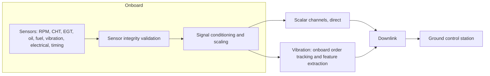

# Telemetry and Sensor Intelligence

Every judgment ANUMAAN makes rests on telemetry acquired from the engine and the flight context around it. This article covers the parameters the system monitors, how it tells a genuinely faulty engine from a merely faulty sensor, and how telemetry moves from the engine to the operator without the vibration channel overwhelming the link.

## The monitored parameters

The problem statement's Health Monitoring System component specifies eight parameter groups, and ANUMAAN instruments all of them, each with distinct physical origins and sampling behavior.

**RPM.** A magnetic or Hall-effect pickup reads a toothed wheel or flywheel ring gear; on the Rotax 912 iS this is handled inside the ECU, which publishes RPM on the CAN bus. As a 20 Hz averaged scalar it is sufficient for trend monitoring but not for misfire detection: at 5,000 RPM a four-cylinder four-stroke engine fires roughly 167 times per second, and a 20 Hz sampler cannot resolve a single missing firing event. That is precisely why the physics core described in [Engine Physics and Combustion Modeling](06-engine-physics.md) works with crank-angle-resolved angular velocity rather than the averaged scalar for misfire and instability detection.

**CHT.** Cylinder head temperature, one channel per cylinder, measured by thermocouple or RTD. A cylinder head has large thermal mass, so genuine thermal events are gradual; an instantaneous jump is physically implausible for a metal mass of that size and is a strong indicator of a sensor or wiring fault rather than an engine fault. Per-cylinder instrumentation matters more than a single averaged CHT reading, because one cylinder running hot while its neighbors stay normal points to a localized fault, while all four rising together points to a system-level cooling problem.

**EGT.** Exhaust gas temperature, one K-type thermocouple per cylinder, is the richest single diagnostic channel on the engine. A sharp drop on one cylinder points to a combustion problem on that cylinder specifically, misfire, injector, or ignition. A rise on one cylinder suggests a lean mixture or advanced timing. EGT rising while CHT falls on the same cylinder is a recognizable late-combustion signature, heat leaving through the exhaust rather than the head. Read together, EGT and CHT on the same cylinder distinguish far more fault conditions than either channel alone.

**Oil pressure and oil temperature.** Oil pressure depends strongly on both engine speed and oil temperature through viscosity, which means the raw pressure reading is a poor fault indicator on its own; pressure relative to what physics expects at the current RPM and oil temperature is what carries diagnostic information, which is exactly the residual approach described in [The Digital Twin Core](05-the-digital-twin.md). A slow pressure decline over hours at constant RPM and temperature suggests pump or bearing wear, a genuine degradation trend suited to RUL estimation. A sharp transient drop suggests oil starvation or foaming during a maneuver.

**Fuel flow.** Measured by a turbine flowmeter as a pulse frequency. Beyond revealing injector faults directly, fuel flow relative to power output gives specific fuel consumption, and a slow rise in that ratio at matched operating conditions over many flight hours is one of the cleanest whole-engine degradation indicators available, and a strong RUL input.

**Vibration.** Acceleration of the engine structure, measured by a piezoelectric accelerometer, is fundamentally different from every other channel here. A single instantaneous vibration value carries no information; the diagnostic content lives entirely in the pattern across frequency, and two very different fault conditions, a healthy bearing and one with a spalled outer race, can share identical RMS amplitude while differing completely in where their energy sits in the spectrum. This is why the physics core's order-tracking and envelope analysis methods, described in [Engine Physics and Combustion Modeling](06-engine-physics.md), operate on the full spectral content rather than a reduced RMS scalar.

**Battery and alternator health.** Bus voltage from a voltage divider, alternator current from a Hall-effect sensor. On an aircraft with electronic engine control, electrical failure is engine failure, so this channel group is treated as a propulsion-critical input rather than an auxiliary one. An alternator failure starts a countdown set by remaining battery capacity, a distinct and directly actionable form of Remaining Useful Life.

**Injection timing.** Commanded injector pulse width and ignition timing are ECU-internal values, reported rather than independently measured. Their diagnostic power comes from comparing what was commanded against what the physics model expects the resulting fuel flow, EGT, and RPM to be: if the ECU commands a certain pulse width and the resulting engine behavior does not match the physics expectation for that command, the injector itself becomes the suspect. This closed-loop consistency check is a direct application of the residual concept to a commanded rather than a directly sensed quantity.

**Flight context.** Pressure altitude, outside air temperature, airspeed, throttle position, manifold pressure, and flight phase are acquired from the flight computer rather than the engine, and they are non-negotiable inputs to every other judgment the system makes. The same CHT reading of 130 degrees Celsius is unremarkable during a hot-day climb and genuinely concerning during a cold cruise at the same throttle setting; without altitude and outside air temperature as inputs, a monitoring system either raises constant false alarms or gets desensitized into uselessness. This mirrors standard practice in the field: the NASA C-MAPSS benchmark, referenced in the project's dataset strategy, explicitly includes operational settings such as altitude and throttle resolver angle alongside its sensor channels for exactly this reason.

## Sensor integrity: telling a broken sensor from a broken engine

A separate validation layer sits ahead of the residual pipeline, checking each incoming reading for physical plausibility, a rate-of-change or physical-consistency violation, before that reading is allowed to influence a diagnosis. The CHT thermal-mass argument above is the clearest example of the principle: an instantaneous jump in a metal head's temperature is not physically possible, so a jump that large is evidence of an open circuit or ADC fault, not a genuine thermal event. Current-loop sensors such as the oil pressure transducer build a related distinction directly into their electrical design: a 4 to 20 milliamp loop uses 4 milliamps, not zero, as its minimum valid reading, so a reading of exactly zero milliamps is unambiguously a broken wire rather than a legitimate minimum pressure. This kind of built-in distinguishability, making "no data" different from "zero," is a design pattern the software validation layer mirrors deliberately.

The same discrimination applies across channels, not just within one. When the crank-angle torque deficit method described in [Engine Physics and Combustion Modeling](06-engine-physics.md) flags a deficit on one cylinder, the system checks whether that cylinder's EGT also falls, on the expected five-to-twenty-second thermal lag. If it does, the two independent channels corroborate a genuine misfire. If the torque deficit appears but every EGT channel stays unchanged, the evidence points toward the crank sensor or the detection logic itself, not the engine. This shielding is what keeps a failing instrument from being reported to the operator as a failing engine, and it is a direct instance of the residual pipeline's protection against sensor faults, covered further in [Residual Analysis](08-residual-analysis.md).

## How telemetry moves from engine to operator

Signal families differ in how they must be acquired. Analog-level sensors (thermocouples, RTDs, pressure transducers) and pulse or frequency sensors (RPM pickups, fuel flow turbines) reduce cleanly to scalar values at modest rates, commonly 1 to 50 Hz depending on the channel's physical response time. Vibration, an AC dynamic signal, does not reduce to a scalar without losing the information that makes it useful, and it must be sampled far faster, in the low kilohertz range, to resolve firing-frequency and bearing-defect content.

That difference in nature produces a difference in transport. Roughly thirty scalar channels at 20 Hz total under 20 kilobits per second, comfortably inside a representative UAV control-link budget. A single raw vibration channel at 10 kHz, by contrast, approaches 160 kilobits per second on its own, exceeding a representative link budget before any other telemetry is considered. The architectural consequence, covered at the system level in [System Architecture](04-system-architecture.md), is that vibration is acquired and analyzed onboard, with only extracted features, health scores, and event messages crossing the downlink, while scalar channels cross directly.

*Caption: sensor signals validated and conditioned onboard, with scalar channels crossing the link directly and vibration reduced to features first.*

## Integration

Every channel described here feeds the residual pipeline in [The Digital Twin Core](05-the-digital-twin.md) and the physics expectation model in [Engine Physics and Combustion Modeling](06-engine-physics.md). Flight context specifically is what makes the physics model's expected-value computation meaningful at all, without it the operating point the physics model needs cannot be established.

## Related systems

- [The Digital Twin Core](05-the-digital-twin.md)
- [Engine Physics and Combustion Modeling](06-engine-physics.md)
- [Residual Analysis](08-residual-analysis.md)
- [System Architecture](04-system-architecture.md)
