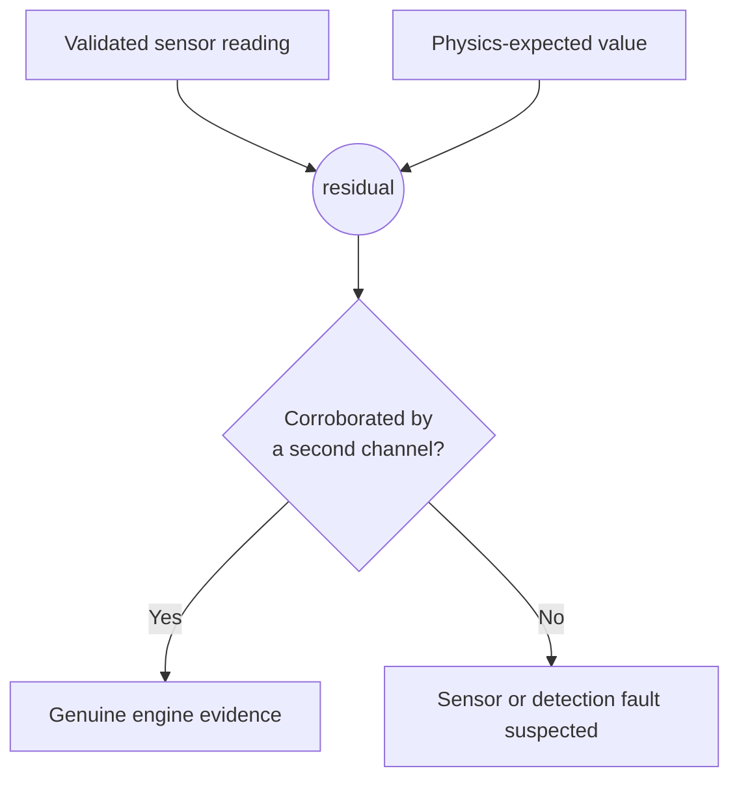

# Residual Analysis

The residual is the single value that connects ANUMAAN's physics core to its diagnostic reasoning. [The Digital Twin Core](05-the-digital-twin.md) introduced the concept; this article treats it as the subject in its own right, the interface between physics and diagnostics, how it is generated, and how it is protected from being misled by a failing sensor rather than a failing engine.

## What a residual is

A residual is the difference between an observed telemetry value and the value the physics core predicts for the engine's current operating point:

```
residual = observed - expected(operating_point)
```

Every term on the right side matters. "Observed" is a validated sensor reading, already checked for physical plausibility as described in [Telemetry and Sensor Intelligence](07-telemetry-and-sensors.md). "Expected" is not a static limit or a lookup table; it is the output of the crank-angle physics chain described in [Engine Physics and Combustion Modeling](06-engine-physics.md), recomputed at every tick from the engine's actual altitude, outside air temperature, throttle position, and airspeed. The residual is what remains once the physically explainable part of a reading has been subtracted out.

## Why raw sensor values are insufficient

A raw value carries no information about whether it is correct, because correctness is entirely dependent on context. A CHT reading of 130 degrees Celsius is unremarkable at the top of a hot-day climb and genuinely concerning during a cold cruise at the same throttle setting, because the physically correct value at those two operating points is different. A fixed threshold, discussed at length in [Understanding the Engineering Problem](02-the-engineering-problem.md), can only compare against one number regardless of context, so it either misses the early stage of a real fault or fires constantly on ordinary flight regimes. A residual solves this by making the comparison context-aware at every tick: the same 130-degree reading produces a residual near zero in the climb and a meaningfully positive residual in the cruise, because the two operating points have different physics-expected values.

This is also why a residual, not a raw value, is the correct object to feed forward into diagnosis. A diagnostic method built on raw thresholds inherits every one of the threshold's blind spots. A diagnostic method built on residuals inherits none of them, because the operating-point dependence has already been removed before diagnosis ever sees the number.

## How residuals are generated

Residual generation runs continuously, once per tick, for every monitored channel on every active engine. The physics core computes an expected value for each channel from the current operating point; the validated sensor stream supplies the observed value; the difference is passed forward. This happens at tier 0 of the detection pipeline described in [System Architecture](04-system-architecture.md), running at the same 20 ticks per second as the rest of the runtime, so that residual evidence is always as current as the telemetry it is computed from.

Because the physics core is built from published reference constants and first-principles combustion dynamics rather than curve-fit approximations, a residual reflects a genuine physical mismatch when one exists, a misfiring cylinder failing to produce expected torque, a cooling path failing to carry away expected heat, rather than an artifact of an approximate or overfit expectation model. Where the deployment enables the independent plant model described in [The Digital Twin Core](05-the-digital-twin.md), the observed side is generated by a physically separate implementation with its own bias, lag, and noise characteristics, which is what keeps the residual from measuring the physics core against itself.

## Shielding residuals from sensor faults

A residual computed from a faulty sensor reading is not evidence of an engine fault, it is evidence of a sensor fault, and treating the two as interchangeable would make the entire diagnostic layer unreliable. This is why sensor integrity validation runs ahead of residual generation rather than after it: a reading that fails a physical plausibility check, an implausible rate of change, a value outside what the underlying physics permits, is flagged before it can produce a residual that gets mistaken for engine evidence.

Cross-channel corroboration reinforces this at the residual level itself. When the crank-angle torque-deficit method flags a deficit on one cylinder, the system checks whether that cylinder's exhaust gas temperature residual also moves negative, on the physically expected thermal lag. Agreement between two independently derived residuals is what turns a single anomalous reading into a defensible diagnosis; disagreement, a torque deficit with no corresponding EGT movement, points back at the sensor or the detection chain rather than at the engine. This corroboration logic is detailed alongside the physics that makes it possible in [Engine Physics and Combustion Modeling](06-engine-physics.md).


*Figure 1: Sensor validation shielding: uncorroborated RPM sensor jitter isolated as a suspect gauge without triggering false propulsion alarms.*


*Figure 2: Residual validation logic: a residual only becomes diagnostic evidence once it survives sensor plausibility checks and cross-channel corroboration.*

## From residual to diagnosis

Once generated, a residual stream feeds two things at once: Bio-Inspired Sparse Novelty Coding, which asks whether the current pattern of residuals across channels is unusual relative to previously seen nominal behavior, and, once a novelty is flagged, a Bayesian network that reasons over a defined fault taxonomy to determine which specific fault hypothesis best explains the observed residual pattern. That reasoning chain, the novelty layer, the Bayesian diagnosis, RUL estimation, and the mission-level consequence of a diagnosed fault, is the subject of the articles that follow this one in the corpus rather than being duplicated here. What matters at this stage is only that the residual is the object diagnosis operates on, computed continuously, context-aware by construction, and shielded from sensor artifacts before it ever reaches that reasoning layer.

## Integration

Residual generation sits at the exact center of ANUMAAN's reasoning chain described in [Introducing ANUMAAN](03-introducing-anumaan.md): it is fed by the physics core and validated telemetry, and it feeds everything diagnostic that follows. Nothing downstream of this point, novelty detection, fault diagnosis, degradation tracking, mission reliability, ever looks at a raw sensor value directly; all of it operates on residuals.

## Validation

Residual generation is exercised by the project's characterization test suite, which pins expected physics outputs and recovered fault signatures, including misfire rates recovered from the crank-angle chain, as regression tests. This ensures that a change to the physics core or the detection pipeline that breaks the underlying residual computation is caught automatically rather than only noticed downstream in diagnosis output.

## Related systems

- [The Digital Twin Core](05-the-digital-twin.md)
- [Engine Physics and Combustion Modeling](06-engine-physics.md)
- [Telemetry and Sensor Intelligence](07-telemetry-and-sensors.md)
- [Introducing ANUMAAN](03-introducing-anumaan.md)
- [System Architecture](04-system-architecture.md)
