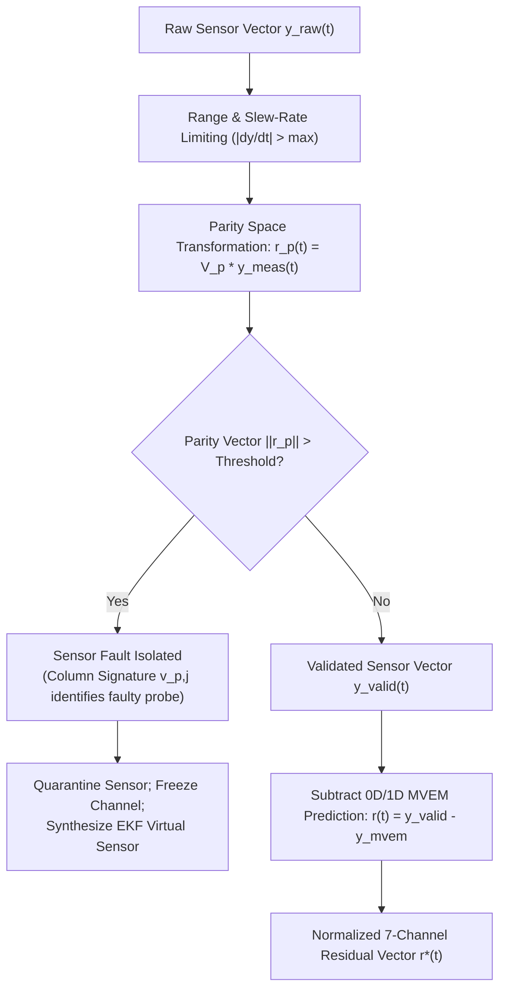

# Residual Analysis

The residual is the single mathematical quantity that bridges ANUMAAN's physics core to its diagnostic reasoning. [The Digital Twin Core](05-the-digital-twin.md) introduced the concept; this article treats it as the core subject in its own right: the interface between physics and diagnostics, the analytical parity space that isolates sensor drift from mechanical engine failure, and the normalized 7-channel residual vector that drives downstream machine learning.

---

## What a Residual Is

A residual is the difference between a validated observed telemetry value and the value the 0D/1D physics core predicts for the engine's current operating point:

$$\mathbf{r}_{\text{phys}}(t) = \mathbf{y}_{\text{valid}}(t) - \mathbf{h}_{\text{mvem}}(\hat{\mathbf{x}}_{\text{twin}}(t), \mathbf{u}(t))$$

Every term on the right side matters:
- **$\mathbf{y}_{\text{valid}}(t)$:** A validated sensor reading that has already passed through range limiters, rate-of-change filters, and analytical parity space checks.
- **$\mathbf{h}_{\text{mvem}}(\hat{\mathbf{x}}(t), \mathbf{u}(t))$:** Not a static threshold or a lookup table, but the instantaneous output of the 0D/1D Mean Value Engine Model and slider-crank kinematics, recomputed continuously from altitude, outside air temperature, throttle position, and airspeed.

The residual is what remains once the physically explainable part of a reading has been subtracted out.

---

## Telemetry Deviation Discrimination Matrix

In airborne propulsion monitoring, deviations occur for very different reasons. The system mathematically discriminates between four distinct sources of telemetry deviation before raising alarms:

| Phenomenon | Physical & Mathematical Signature | Classification & Action |
| :--- | :--- | :--- |
| **Environmental Lapse** (e.g., Climb to 25,000 ft, Leh Cold) | All cylinders shift uniformly with ambient lapse; $\text{MAP}$ residual $r_{\text{map}} \approx 0$; EKF state whiteness preserved. | **Normal Aerothermal Shift** No alarm; baseline automatically tracks. |
| **Normal Throttle Step** (e.g., Combat Break / Full Boost) | Transient dynamic lag in MAP and RPM matching engine inertia $J_{\text{eng}}$; thermodynamic conservation satisfied. | **Normal Dynamic Variation** Transient lag window masked; no alarm. |
| **Sensor Hardware Fault** (e.g., Thermocouple Open / Drift) | Single sensor jumps step-wise or drifts; analytical parity residual $\mathbf{r}_p$ spikes; thermodynamic residuals remain flat. | **Sensor Degradation** Isolate faulty sensor; switch to EKF virtual sensor; warn GCS. |
| **Real Engine Failure** (e.g., Piston Ring Blow-by) | Multiple cross-correlated residuals violate limits; $\Delta P_{\text{crankcase}} > 0, \Delta T_{\text{oil}} > 0, P_{\max}$ drops. | **Confirmed Mechanical Fault** Escalate to Bayesian diagnosis & FMECA classification. |

---

## Analytical Redundancy & Parity Space Formulation

A residual computed from a failed sensor is not evidence of engine degradation: it is a sensor fault. Blindly feeding corrupted sensor data into machine learning models triggers dangerous false alarms that could needlessly abort critical missions.

To solve this, ANUMAAN implements **Parity Space Residual Analysis**:

For a sensor measurement model $\mathbf{y}_s(t) = \mathbf{C}_s \mathbf{x}(t) + \mathbf{f}_s(t) + \mathbf{v}(t)$, the parity transformation matrix $\mathbf{V}_p$ is constructed such that:

$$\mathbf{V}_p \mathbf{C}_s = \mathbf{0}$$

Applying this transformation eliminates the unmeasured state dynamics:

$$\mathbf{r}_p(t) = \mathbf{V}_p \cdot \mathbf{y}_s(t) = \mathbf{V}_p \cdot \mathbf{f}_s(t) + \mathbf{V}_p \cdot \mathbf{v}(t)$$

Under healthy sensor conditions, $\mathbb{E}[\mathbf{r}_p(t)] = \mathbf{0}$. If sensor $j$ experiences a bias or open-circuit fault $f_{s,j}(t)$, the parity vector points along the dedicated column signature $\mathbf{v}_{p,j}$, isolating the faulty sensor within $40\text{ ms}$ before any engine diagnostic model is evaluated.

*Figure 1: Sensor validation shielding: uncorroborated RPM sensor jitter isolated as a suspect gauge without triggering false propulsion alarms.*

---

## The 7-Channel Normalized Residual Vector

Once sensor validity is confirmed, the system calculates the **Normalized Physics Residual Vector** $\mathbf{r}^*(t) \in \mathbb{R}^7$:

$$\mathbf{r}^*(t) = \begin{bmatrix}
r_1^*(t) \\[4pt]
r_2^*(t) \\[4pt]
r_3^*(t) \\[4pt]
r_4^*(t) \\[4pt]
r_5^*(t) \\[4pt]
r_6^*(t) \\[4pt]
r_7^*(t)
\end{bmatrix} = \begin{bmatrix}
\frac{EGT_{\text{meas}} - \widehat{EGT}_{\text{mvem}}}{\sigma_{\text{egt}}} & \text{Exhaust Gas Temperature Residual} \\[6pt]
\frac{CHT_{\text{meas}}^{\max} - \widehat{CHT}_{\text{mvem}}^{\max}}{\sigma_{\text{cht}}} & \text{Cylinder Head Temperature Residual} \\[6pt]
\frac{P_{\text{oil,meas}} - \widehat{P}_{\text{oil,mvem}}}{\sigma_{\text{poil}}} & \text{Oil Pressure Residual} \\[6pt]
\frac{T_{\text{oil,meas}} - \widehat{T}_{\text{oil,mvem}}}{\sigma_{\text{toil}}} & \text{Oil Sump Temperature Residual} \\[6pt]
\frac{MAP_{\text{meas}} - \widehat{MAP}_{\text{mvem}}}{\sigma_{\text{map}}} & \text{Manifold Absolute Pressure Residual} \\[6pt]
\frac{\dot{m}_{f,\text{meas}} - \widehat{\dot{m}}_{f,\text{mvem}}}{\sigma_{\text{fuel}}} & \text{Fuel Flow Consumption Residual} \\[6pt]
\frac{\Delta CHT_{\text{cyl1-4}}}{\sigma_{\text{spread}}} & \text{Inter-Cylinder Thermal Imbalance Residual}
\end{bmatrix}$$

Because the 0D/1D MVEM model explicitly accounts for altitude derating, ram-air dynamic pressure, ambient temperature lapse, and throttle dynamics, **these normalized residuals remain zero-mean Gaussian noise under all healthy flight regimes**. Any sustained deviation ($\|\mathbf{r}^*(t)\| > \tau$) represents true thermodynamic degradation.

---

## Cross-Channel Corroboration

A single anomalous channel is required to show physical cross-coupling before an alarm is confirmed:
- When the crank-angle torque-deficit observer flags a combustion drop on Cylinder #2, the system checks whether Cylinder #2's EGT residual also decreases over its characteristic thermal lag ($\tau \approx 5 - 15\text{ s}$).
- Agreement between these independent channels confirms genuine combustion failure.
- Disagreement (e.g. torque drop with zero EGT change) quarantines the crank pickup sensor rather than declaring an engine emergency.

---

## Downstream Pipeline Feeding

The normalized residual vector $\mathbf{r}^*(t)$ is the sole input forwarded to downstream intelligence:
1. **Bio-Inspired Sparse Novelty Coding:** Projects $\mathbf{r}^*(t)$ through a random expansion matrix into a sparse Kenyon cell representation to detect novel anomalies without requiring labeled failure datasets.
2. **Bayesian Diagnosis & FMECA Network:** Evaluates residual directional signatures ($\text{sign}(\mathbf{r}^*)$) to isolate the failure mode (e.g., injector clog vs. wastegate stuck open).
3. **Extreme Value Theory (EVT) Anomaly Gate:** Dynamically evaluates reconstruction errors against a Generalized Pareto Distribution to guarantee false-alarm rates $\le 10^{-4}$.

---

## Related Systems

- [The Digital Twin Core](05-the-digital-twin.md)
- [Engine Physics and Thermodynamics](06-engine-physics.md)
- [Bio-Inspired Sparse Novelty Coding](10-bio-inspired-sparse-novelty-coding.md)
- [Fault Diagnosis and Isolation](11-fault-diagnosis.md)
