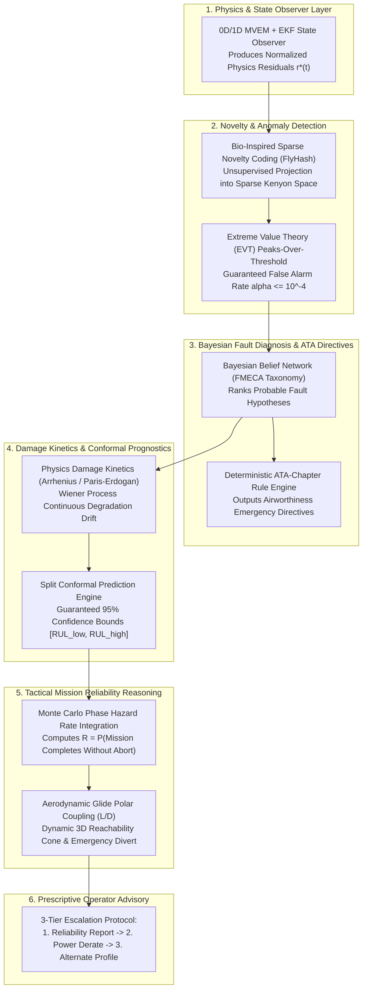
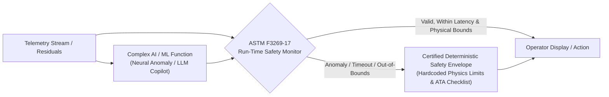

# The AI and ML Architecture

ANUMAAN's intelligence layer is not one monolithic neural network asked to solve every problem. In aviation propulsion health monitoring, attempting to answer *"is this normal?"*, *"which component is failing?"*, *"how much life remains?"*, and *"what should the pilot do?"* with a single black-box classifier leads to unexplainable, uncertifiable decisions.

Instead, ANUMAAN structures its intelligence as a **disciplined cyber-physical stack of distinct engineering stages**. Every layer sits directly on top of the digital twin's 0D/1D physics core, where first-principles thermodynamic conservation equations constrain and guide downstream machine learning.

---

## Algorithmic Benchmarking: Why Hybrid Physics + AI?

A foundational question in aerospace condition monitoring is whether to use pure physics, pure deep learning, or a hybrid approach. The table below benchmarks the paradigms:

| Feature / Dimension | Pure Physics-Based Model | Pure Data-Driven AI/ML | Proposed Hybrid Digital Twin (Physics + AI) |
| :--- | :--- | :--- | :--- |
| **Governing Principle** | First principles (Mass, momentum, energy conservation). | Statistical pattern recognition and deep learning. | **Physics observer as baseline; AI learns residual discrepancies.** |
| **Training Data Requirement**| Very Low (Requires physical dimensions and dyno maps). | Massive (Requires thousands of hours of labeled data). | **Moderate (Calibrated on modest healthy data + synthetic HIL).** |
| **Generalization Capability**| High (Extrapolates well across flight envelopes). | Poor (Fails completely outside training distribution). | **Superior (Physics bounds constrain extrapolation).** |
| **Unmodeled Dynamics Tracking**| Very Poor (Rigid equations ignore mechanical wear). | High (Captures subtle multi-variable correlations). | **High (AI residual captures wear without violating physics).** |
| **Computational Overhead** | Low to Moderate (Real-time ODE integration). | Low to High (Depends on neural architecture). | **Moderate (Optimized INT8 runtime + lightweight EKF).** |
| **Explainability to Pilot** | 100% Transparent (Direct physical state variables). | Opaque / Black-Box (Abstract tensor weights). | **High (SHAP attribution tied to physical thermodynamic states).** |
| **DO-178C Certifiability** | High (Deterministic mathematics). | Extremely Difficult (Non-deterministic, data-dependent). | **High (Certified via Run-Time Monitor architecture).** |
| **Early Fault Detection** | Moderate (Requires significant thermodynamic deviation). | Very High (Detects subtle micro-correlations). | **Superior (Combines statistical sensitivity with physical validation).** |
| **RUL Uncertainty Bounds** | Heuristic / Rule-based. | Overconfident point estimates. | **Mathematically Guaranteed (Conformal Prediction intervals).** |

---

## The Six-Stage Cyber-Physical AI Stack

ANUMAAN decomposes propulsion intelligence into six sequential, auditable layers:

1. **Physics Residual Generation:** The 0D/1D MVEM model computes the expected physical state at every tick. Subtracting expected from observed produces the normalized 7-channel residual vector $\mathbf{r}^*(t)$, removing flight regime dependence before AI models ever evaluate the data.
2. **Bio-Inspired Sparse Novelty Coding:** Modeled on the fruit fly olfactory circuit (FlyHash), roughly 50 input features project onto an expanded population of sparse Kenyon cells with winner-take-all inhibition. Runs every tick without requiring labeled training data.
3. **Bayesian Diagnosis & Deterministic ATA Agent:** Evaluates residual directional signatures against the FMECA taxonomy to calculate posterior fault probabilities $P(F_k \mid \mathbf{r}^*)$. The deterministic ATA rule engine converts top hypotheses into FAA/EASA-compliant maintenance directives without invoking non-deterministic language models.
4. **Degradation Modeling & Conformal RUL:** Arrhenius thermal reaction kinetics and Paris-Erdogan fatigue crack equations model damage accumulation. Split conformal prediction outputs calibrated 95% confidence intervals $[RUL_{\text{lower}}, RUL_{\text{upper}}]$, strictly rejecting fake scalar precision.
5. **Tactical Mission Reliability:** Evaluates mission completion probability $R$ across remaining flight phases using Monte Carlo hazard integration, and computes aerodynamic glide reachability cones ($L/D$) over local terrain.
6. **Prescriptive Advisory Escalation:** Escalates through a defined operational sequence: a component reliability report, a calculated throttle derate recommendation with endurance trade-offs, and an alternative achievable flight profile.

---

## Safety Architecture: ASTM F3269-17 Simplex Run-Time Monitor

To bridge modern AI/ML with aerospace DO-178C DAL-C airworthiness certification, non-deterministic machine learning components (such as neural encoders and RAG copilots) are supervised by an **ASTM F3269-17 Simplex Run-Time Monitor**:

- **Execution Bound:** The monitor verifies that AI outputs arrive within the $15\text{ ms}$ processing deadline.
- **Physical Plausibility Gate:** The monitor cross-checks neural predictions against first-principles thermodynamic conservation. If an AI model hallucinated a negative fuel burn or impossible RPM surge, the monitor rejects the output within $10\text{ ms}$.
- **Deterministic Failover:** If the complex model fails or times out, control immediately reverts to a certified deterministic lookup envelope, ensuring the aircraft is never placed in an unmonitored state.

---

## Related Systems

- [Bio-Inspired Sparse Novelty Coding](10-bio-inspired-sparse-novelty-coding.md)
- [Fault Diagnosis and Isolation](11-fault-diagnosis.md)
- [Vibration Analysis and Order Tracking](12-vibration-analysis.md)
- [Degradation Modeling and Wear Kinetics](13-degradation-modeling.md)
- [Remaining Useful Life Estimation](14-remaining-useful-life.md)
- [Mission Reliability Enhancement](17-mission-reliability.md)
