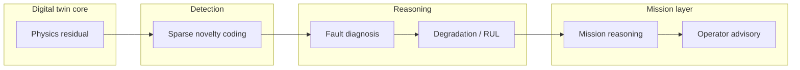

# The AI and ML Architecture

ANUMAAN's intelligence layer is not one model asked to do everything. It is a stack of distinct engineering problems, each with its own question, its own evidence requirements, and its own method. A system that tries to answer "is this normal," "which part is failing," "how much life is left," and "what should the operator do" with a single classifier will do all four badly. ANUMAAN separates them, and lets each layer draw on the reasoning that genuinely fits its question.

This article is the map of that stack. It does not go deep on any single layer. The five articles that follow it each take one layer and explain the biology, the mathematics, or the domain reasoning behind it in full: Bio-Inspired Sparse Novelty Coding, fault diagnosis, vibration analysis, degradation modeling, and remaining useful life estimation.

The stack sits directly on top of the digital twin's physics core. Every layer above the first consumes something the layer below it produced, and every layer's output becomes the input the next layer needs. That dependency chain is the architecture.

## The problem

A propulsion health system has to answer several genuinely different questions, and they do not share a method:

- Is the current engine state unusual at all, compared to everything seen before it?
- If it is unusual, which specific fault mode is consistent with the evidence?
- Given that fault, how is damage accumulating, and how much operating life remains?
- Given the remaining life and the planned sortie, does the mission still complete?
- Given all of that, what should the operator actually do right now?

Collapsing these into one model produces a system that cannot explain itself. A single opaque score cannot tell a maintainer whether the concern is a misfire, a cooling problem, or a sensor gone bad, and it cannot tell a mission commander whether ten more minutes of climb is survivable. Each question needs its own evidence and its own answer.

## Why it matters

SIH Problem Statement 26054 asks for anomaly detection, fault prediction, RUL estimation, trend analysis, and maintenance recommendations as distinct deliverables under its AI/ML layer. That structure is not incidental. Anomaly detection, diagnosis, and prognosis are different problems in the reliability engineering literature for a reason: they have different failure costs, different data requirements, and different validation criteria. A missed anomaly is a different kind of failure than a misdiagnosed fault, which is different again from an RUL estimate that arrives too late to act on. Treating them separately is what makes each one auditable on its own terms.

## Our approach

ANUMAAN structures the AI layer as six sequential stages, each owned by a distinct method chosen for what that stage specifically needs:

1. **Physics residual generation.** The digital twin's thermodynamic and crank-angle models predict what every sensor channel should read at the current operating point. The residual, observed minus expected, is the input every downstream layer works from. This is not itself an AI method; it is what makes every AI method downstream regime-independent rather than reactive to raw values that naturally change with altitude, throttle, and temperature.
2. **Bio-Inspired Sparse Novelty Coding.** A sparse random-projection method modeled on the fruit fly olfactory circuit asks the first and cheapest question: does this pattern of residuals and vibration features resemble anything in the memory of nominal operation, or not. It runs every tick, requires no labeled fault data, and produces a novelty score with no training step.
3. **Fault diagnosis.** Once something is flagged as unusual, a Bayesian network reasons over the FMECA failure-mode taxonomy and channel-level isolability signatures to rank which specific fault is consistent with the evidence, paired with a deterministic diagnostic agent that turns a ranked fault into a concrete ATA-chapter maintenance directive.
4. **Degradation and RUL.** Rainflow cycle counting and Miner's linear damage rule track how thermal and mechanical stress cycles accumulate into wear over operating hours, feeding a dual-path remaining useful life estimate, physics-of-failure and data-driven, calibrated with split conformal prediction.
5. **Mission reasoning.** The mission reliability engine takes component health and RUL and asks what they mean for the sortie actually being flown: does it complete, and which component is the limiting factor.
6. **Operator advisory.** The prescriptive layer turns a degrading reliability picture into a defined escalation: a reliability report, a throttle derate recommendation, and, if needed, an alternative achievable mission profile.

Each stage answers a narrower, better-posed question than the one before it, and each stage's output is legible on its own: a novelty score, a ranked fault hypothesis, an RUL interval, a reliability probability, an advisory. Nothing downstream depends on a single black-box judgment upstream.

## How it works

Data flows in one direction through the stack, tick by tick, for whichever engine platform is currently selected in the runtime. The physics core computes the frame's expected values; the residual detector computes the departure; the novelty layer scores that departure against its memory of nominal codes; if the score crosses its threshold, the diagnostic layer is engaged to rank fault hypotheses; the degradation and RUL layer updates its accumulated damage estimate and remaining-life interval on every tick regardless of whether a fault is currently flagged, since damage accrues continuously; the mission reliability engine folds the current health picture into the Monte Carlo hazard simulation for the active sortie profile; and the advisory layer only speaks when the reliability picture actually changes the operator's options.

## Architecture

The layer sequence, from raw physics mismatch to an operator-facing recommendation.

*Each stage answers one narrower question than the last: unusual, which fault, how much life, what it means for the sortie, what to do.*

## Example

Consider a slow rise in cylinder 2 cylinder head temperature that stays within its absolute limit throughout. A threshold system never fires, because no value is ever exceeded. In ANUMAAN's stack: the physics residual against the thermodynamic CHT model starts to grow even while the absolute reading is legal. The novelty layer's sparse code for that residual pattern drifts away from the memory of nominal codes and the novelty score crosses threshold. The diagnostic Bayesian network checks the evidence against the FMECA signature set and finds it consistent with cooling degradation rather than, say, an injector fault, because the correlated pattern across cylinders and coolant temperature matches that mode's isolability signature. The degradation layer folds the sustained thermal residual into its damage accumulation and produces an RUL interval. The mission reliability engine checks whether the current sortie's remaining duration still fits inside that interval with margin, and if it does not, the advisory layer escalates from a reliability report to a throttle derate recommendation.

## Integration

This article is the entry point to five deeper ones. Bio-Inspired Sparse Novelty Coding covers the encoding pipeline and its honest positioning against the published literature it draws on. Fault Diagnosis covers the Bayesian network and the deterministic diagnostic agent in detail. Vibration Analysis covers the order-domain and envelope features that both the novelty layer and the diagnostic layer consume. Degradation Modeling covers rainflow counting and Miner's rule. Remaining Useful Life Estimation covers the dual-path RUL approach and split conformal prediction.

## Validation

Each layer is validated on its own terms, described in the article that covers it: the novelty layer's positioning is checked directly against the published sparse-coding and hyperdimensional-computing literature it belongs to; the diagnostic network's fault ranking is checked against the FMECA taxonomy's isolability analysis; RUL's conformal intervals are checked against empirical coverage on held-out missions. A pytest-based characterization suite pins specific method-level results, such as conformal coverage figures and recovered misfire rates from the crank-angle chain, as regression tests, so a change that breaks the underlying method is caught automatically.

## Related systems

- [Bio-Inspired Sparse Novelty Coding](10-bio-inspired-sparse-novelty-coding.md)
- [Fault Diagnosis](11-fault-diagnosis.md)
- [Vibration Analysis](12-vibration-analysis.md)
- [Degradation Modeling](13-degradation-modeling.md)
- [Remaining Useful Life Estimation](14-remaining-useful-life.md)
