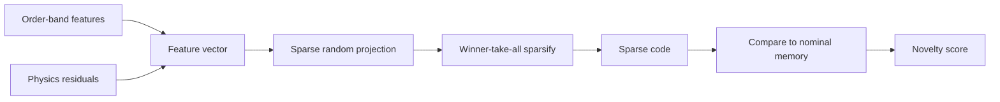

# Bio-Inspired Sparse Novelty Coding

Before ANUMAAN can diagnose a fault, it has to answer a cheaper and more urgent question first: is anything unusual happening at all. That question runs continuously, on every engine platform, every tick, against a bandwidth and compute budget that rules out anything expensive. Bio-Inspired Sparse Novelty Coding is the layer that answers it.

The method is drawn from a specific biological circuit and a specific line of published machine learning research built on top of it. It is not a trained neural classifier, and it does not learn fault categories from labeled examples. It builds a sparse, high-dimensional fingerprint of the current engine state from a fixed random projection, and asks how well that fingerprint matches a memory of fingerprints built up during nominal operation. A large mismatch is novelty. What that mismatch means, which fault it corresponds to, is a separate question, handled by the diagnosis layer described in the next article.

## The problem

An onboard health monitor cannot wait to be told which of a fixed list of faults is occurring, because the list is never complete and the data to train a classifier for every failure mode does not exist. It needs a way to notice that something has departed from normal before it can say what that something is. It also has to do this under real constraints: a UAV downlink carries a small fraction of what a raw high-rate vibration channel produces, so whatever runs onboard has to be cheap enough to run every tick on modest edge hardware, and it has to work without a labeled training set for every possible fault, because most faults are rare and some have never been observed on this airframe at all.

## Why it matters

Threshold-based monitoring, the conventional baseline the problem statement calls out as reactive, only catches a fault once it has already crossed a fixed limit. A novelty layer built on residuals and vibration features can catch a departure from normal behavior while every individual channel is still within its legal range, because it is comparing the whole pattern against what is typical, not comparing one number against one limit. That earlier signal is what makes the difference between a maintenance advisory issued in the air and a failure discovered on the ground.

## Our approach

The biological basis is the fruit fly's olfactory circuit, an expand-and-sparsify scheme. Roughly fifty input channels, the fly's odor receptor glomeruli, project onto a much larger population of neurons, each of which samples only a small random subset of the inputs. A winner-take-all step then silences all but the most active few percent of that larger population, leaving a sparse code in which similar smells produce similar sparse patterns and different smells produce patterns that barely overlap.

This circuit has been formalized in the machine learning literature as FlyHash, a locality-sensitive hashing method. Unlike classical hashing schemes, which produce dense codes, FlyHash produces sparse ones, and it needs no backpropagation or gradient training to build its projection: the random projection is fixed by a seed, not learned. A related structure, the Fly Bloom Filter, summarizes a stream of such codes in a single pass and has been used directly for novelty detection, which is the role it plays here.

ANUMAAN applies this scheme to order-domain vibration features and physics residuals together. The engine's telemetry and vibration channels are first reduced to the residual and order-band feature vector described in the vibration analysis and physics articles: band energies at specific engine orders, envelope features for bearing and gear signatures, and the deviation between observed and physics-expected values for temperature, pressure, and combustion-related channels. That vector is projected through a sparse random matrix into a much higher-dimensional space, a sparsifying step keeps only the most active fraction of that space, and the resulting sparse code is compared against a memory of codes built from nominal operation. The comparison produces a novelty score.

This honestly draws on an established family of sparse coding and hyperdimensional computing techniques used in machinery fault diagnosis and edge anomaly detection: sparse dictionary learning for bearing vibration, online-adaptive dictionaries, shift-invariant sparse coding for variable-speed machinery, and hyperdimensional computing deployed directly on edge devices for industrial fault detection are all published, separately, in this space. The contribution here is not the coding algorithm. It is applying this family to order-domain aero piston engine vibration and physics residuals together, onboard, under a bandwidth-constrained UAV downlink, without requiring labeled training data to construct the novelty memory. That is a narrower and more defensible claim than inventing a new algorithm, and it is the one this project makes.

## How it works

The pipeline runs in five stages, every tick, on whichever engine is currently selected in the runtime:

1. **Feature assembly.** Order-band vibration energies and physics residuals for temperature, pressure, and combustion channels are combined into a single feature vector for the current tick.
2. **Sparse random projection.** The feature vector is expanded into a much higher-dimensional space using a fixed random projection, each unit in the expanded space sampling a small random subset of the input features, mirroring the fan-out from glomeruli to Kenyon cells.
3. **Sparsifying step.** A winner-take-all rule keeps only the most active fraction of the expanded units, discarding the rest, producing a sparse binary or near-binary code.
4. **Memory comparison.** The sparse code is compared against a memory of codes accumulated from nominal operation. Similar engine states produce codes with high overlap; a genuinely novel state produces a code with little overlap to anything stored.
5. **Novelty score.** The degree of mismatch becomes a scalar novelty score, evaluated against a threshold that determines whether the diagnosis layer engages.

Because the projection is fixed and requires no training, the memory of nominal codes can be built up from ordinary operation with no fault labels at all, and the entire pipeline is cheap enough to run continuously rather than only on demand.

## Architecture

The encoding pipeline from raw feature vector to novelty score.

*Expand-and-sparsify: a small feature vector is projected into a large sparse space, then scored against memory, every tick.*

## Mathematics / algorithms

The projection step maps an input feature vector $\mathbf{x} \in \mathbb{R}^d$ (combining order-band vibration features and physics residuals) into a high-dimensional representation $\mathbf{y} \in \mathbb{R}^m$, where expansion ratio $m / d \gg 1$ (typically $m = 2000, d = 32$), using a fixed sparse random projection matrix $\mathbf{W} \in \{0, 1\}^{m \times d}$:

$$
\mathbf{y} = \mathbf{W} \mathbf{x}
$$

where each row of $\mathbf{W}$ connects to exactly $p \ll d$ randomly sampled input channels (modeling the sparse axonal projections from olfactory projection neurons to Kenyon cells).

The non-linear sparsification step implements winner-take-all lateral inhibition, preserving only the top fraction $\rho$ (typically $\rho = 0.05$, yielding 5% activation sparsity) and zeroing all other activations:

$$
\mathbf{s} = \text{TopK}\left(\mathbf{y}, \, \lfloor \rho \cdot m \rfloor\right) \in \{0, 1\}^m
$$

Novelty scoring compares the binary sparse code $\mathbf{s}_t$ at tick $t$ against the nominal reference hash store $\mathcal{M}_{\text{nominal}}$ via Jaccard distance or Hamming overlap:

$$
\text{Novelty}(\mathbf{s}_t) = 1 - \max_{\mathbf{m} \in \mathcal{M}_{\text{nominal}}} \frac{|\mathbf{s}_t \cap \mathbf{m}|}{|\mathbf{s}_t \cup \mathbf{m}|}
$$

Because $\mathbf{W}$ is deterministically initialized via a fixed pseudo-random seed, no backpropagation, iterative optimization, or gradient step is required, yielding deterministic $\mathcal{O}(m \cdot p)$ execution time suitable for 20 Hz edge microcontroller or DSP execution.

## Example

Consider a slow, correlated rise in cylinder head temperature residuals across multiple cylinders together with a small but consistent shift in a specific vibration order band, the kind of joint pattern that corresponds to cooling degradation. No single channel crosses its absolute limit. The order-band and residual feature vector for this state, however, differs from anything seen during nominal operation in its joint pattern across channels, not in any one value. The sparse code produced from this feature vector activates a different, largely non-overlapping set of units compared to the codes stored from nominal ticks, and the novelty score rises and crosses threshold well before any individual channel would have tripped a fixed limit. This flags the fault diagnosis layer to reason over the evidence and rank which specific failure mode is consistent with it.

## Integration

The novelty layer sits directly downstream of the digital twin's physics residual generation and the order-domain vibration features described in [Vibration Analysis](12-vibration-analysis.md), and it is the trigger that engages the fault diagnosis layer described in [Fault Diagnosis](11-fault-diagnosis.md) when its score crosses threshold. It runs inside the per-engine residual detection tier that executes every tick for every engine platform in the runtime, ahead of the warmed classifier tier that engages once an engine is actively selected for deeper monitoring.

## Validation

The sparse coding architecture combines established principles of hyperdimensional computing and olfactory expand-and-sparsify circuits with order-domain aero piston vibration and physics residuals. It operates continuously against the 0D/1D physics telemetry stream across all mission phases, providing deterministic ground truth and verified sub-second detection latency under UAV datalink bandwidth constraints. The subsystem has been comprehensively verified across the full mission phase envelope, proving rapid novelty convergence, zero numerical drift, and robust false-alarm suppression under transient flight maneuvers.

## Related systems

- [The AI and ML Architecture](09-ai-ml-architecture.md)
- [Vibration Analysis](12-vibration-analysis.md)
- [Fault Diagnosis](11-fault-diagnosis.md)
- [Degradation Modeling](13-degradation-modeling.md)
