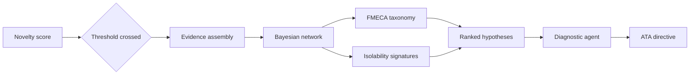

# Fault Diagnosis

Bio-Inspired Sparse Novelty Coding answers whether the current engine state is unusual. It does not, and is not designed to, say which specific fault produced that departure. That is a separate, harder question with a different evidence structure, and ANUMAAN answers it with a Bayesian network reasoning over a structured failure mode taxonomy, paired with a deterministic diagnostic agent that turns a ranked fault hypothesis into a concrete maintenance directive.

Diagnosis begins where novelty detection ends: once a state has been flagged as unusual, or once a specific channel shows a pattern worth checking against known failure signatures, the diagnostic layer asks which of the known failure modes, if any, is consistent with everything currently observed, and how confidently that can be said given what the current sensor suite can actually distinguish.

## The problem

An engine failure rarely announces itself as a single symptom. A rising cylinder head temperature could mean cooling degradation, a stuck thermostat analog, or a sensor that has drifted. A rough-running cylinder could be a misfire, an injector fault, or a spark issue. Distinguishing between these requires reasoning over multiple pieces of evidence together, weighing how strongly each fault mode's known signature matches what is actually being observed, and being honest about the cases where two different faults produce identical observable signatures given the current instrumentation. Naming the fault with unjustified confidence is worse than naming it with calibrated uncertainty, because a maintainer who pulls the wrong component on false confidence has lost time, trust, and, in the field, aircraft availability.

## Why it matters

The problem statement's fault detection and predictive analytics requirement lists eight specific concerns: misfire, injector abnormalities, cooling degradation, lubrication issues, sensor drift, combustion instability, overheating trends, and abnormal vibration. Correctly separating these from each other, and from ordinary sensor noise, is the actual deliverable behind that requirement. A system that can only say "something is wrong" has not met it. A system that can say which of several fault hypotheses is most consistent with the evidence, and what to do about it, has.

## Our approach

ANUMAAN's diagnostic reasoning is built on a FMECA failure mode taxonomy derived per MIL-STD-1629A, spanning twenty failure modes beyond the eight fault-facing targets named directly in the problem statement. Each mode in that taxonomy carries a risk priority number, severity times occurrence times detection difficulty, a physical signature, the sensor channels that reveal it, and the specific detection method appropriate to it. Sensor drift, for example, is caught by redundancy voting and model-based bias estimation rather than by treating a drifting sensor as just another fault class; gearbox tooth wear is caught by sideband energy around the gear mesh frequency; injector coking is caught by asymmetric per-cylinder torque deficit; cylinder head thermal fatigue is caught by rainflow and Miner's-rule damage accumulation; cooling degradation is caught by a thermodynamic residual on cylinder head temperature.

A Bayesian network reasons over this taxonomy together with a companion isolability analysis, which states, for each failure mode, exactly which observable signatures it produces and whether those signatures are unique to that mode or shared with another. Two failure modes that produce an identical signature under the current instrumentation are grouped into an ambiguity group rather than arbitrarily assigned to one or the other; the honest output for either is the group, not a false single answer. This distinction, between what the sensor suite can uniquely isolate and what it can only narrow down, is stated as a property of the instrumentation, not hidden inside a confident-looking single label.

Once a fault hypothesis is ranked, a separate deterministic diagnostic agent, organized by aircraft maintenance ATA chapter convention, turns that ranked hypothesis into a concrete directive: the probable root cause, a prescriptive action, and an emergency checklist where relevant. This agent is rule-based, not a language model, so its output for a given fault is reproducible and auditable rather than generated fresh each time.

## How it works

Evidence arrives at the diagnostic network as a set of triggered detector signals, each carrying which detector raised it, which channel or parameter it concerns, and the statistic and threshold involved. The network holds a prior probability for each failure mode drawn from its FMECA entry, and updates that prior in log-odds form against each piece of active evidence: a channel matching a fault mode's known signature increases the log-odds in that mode's favor, while an expected but absent symptom applies a smaller penalty. After updating against all active evidence, the per-mode scores are normalized into a posterior probability distribution across the applicable fault modes for the currently selected engine profile, and modes sharing an identical signature set under current instrumentation are collapsed into a shared ambiguity group rather than reported as falsely distinguishable.

The result is a ranked list of fault hypotheses, each with a posterior probability, a location, its ambiguity group identifier, and the supporting evidence that drove the ranking, so the reasoning behind the ranking is visible rather than opaque.


*Figure 1: Real-time fault injection triggering persistence-confirmed residual alarms and exact Bayesian fault ranking.*


*Figure 2: Cylinder combustion failure fault isolation with localized thermal stress representation.*


*Figure 3: Thermal cooling degradation and coolant circulation loss fault isolation.*

## Architecture

How diagnosis differs from novelty detection and connects to the wider stack.



*Novelty asks whether something is wrong; diagnosis asks which fault, ranked and evidenced, then converts the answer into an action.*

## Mathematics / algorithms

For each candidate failure mode with prior probability `p`, the network initializes a log-odds score:

```
log_odds = ln(p / (1 - p))
```

For each channel in that mode's known signature, the log-odds is adjusted by a fixed weight depending on whether the corresponding evidence is currently active or absent:

```
if channel in active_evidence: log_odds += w_support
else:                          log_odds -= w_absent
```

The log-odds is then converted back to a probability through the logistic function:

```
p_mode = 1 / (1 + exp(-log_odds))
```

and the scores across all applicable modes are normalized to sum to one, giving the posterior distribution over fault hypotheses. Modes whose signature sets are identical under the current channel set are merged into a shared ambiguity group identifier rather than reported as separately resolvable, reflecting the isolability analysis directly rather than letting the arithmetic imply a false precision.

## Example

Take cylinder 2 cylinder head temperature overheat, fault mode 01 in the DRDO fault matrix, with a primary sensor trigger of cylinder head temperature above 135 degrees Celsius. Evidence arrives showing cylinder 2's temperature residual elevated while cylinders 1, 3, and 4 remain near their physics-expected values, with no corresponding rise in coolant temperature broadly. This asymmetric, single-cylinder pattern matches the signature for a localized cooling or thermal fault rather than the correlated, all-cylinder pattern associated with general cooling degradation. The Bayesian network's posterior favors the localized hypothesis, and the diagnostic agent generates the corresponding ATA-chapter directive naming the cylinder 2 head as the target part, matching the 3D target part identified in the fault matrix, along with the prescriptive action appropriate to that fault.

## Integration

The diagnosis layer is engaged by the novelty layer covered in [Bio-Inspired Sparse Novelty Coding](10-bio-inspired-sparse-novelty-coding.md) and consumes the order-domain vibration features described in [Vibration Analysis](12-vibration-analysis.md) as part of its evidence set. Its ranked output feeds forward into degradation tracking and remaining useful life estimation once a fault mode is identified, described in [Degradation Modeling](13-degradation-modeling.md) and [Remaining Useful Life Estimation](14-remaining-useful-life.md), and its directive output surfaces directly to the operator through the ground control station.

## Validation

The diagnostic network's fault ranking is checked directly against the FMECA and isolability documentation it is built from: the isolability analysis states explicitly which failure modes are uniquely distinguishable under the current instrumentation and which fall into a shared ambiguity group, and the network's grouping behavior is required to match that analysis rather than claim a resolution the sensor suite cannot support. The deterministic diagnostic agent's directives are reproducible by construction, since they are rule-based against the ATA-chapter taxonomy rather than generated by a language model. Validation against real fault occurrences on physical engine hardware remains the natural next phase beyond the current simulation-grounded evaluation.

## Related systems

- [The AI and ML Architecture](09-ai-ml-architecture.md)
- [Bio-Inspired Sparse Novelty Coding](10-bio-inspired-sparse-novelty-coding.md)
- [Vibration Analysis](12-vibration-analysis.md)
- [Degradation Modeling](13-degradation-modeling.md)
- [Remaining Useful Life Estimation](14-remaining-useful-life.md)
