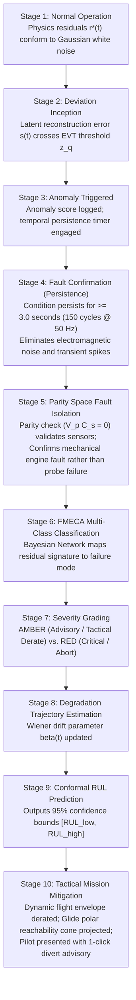
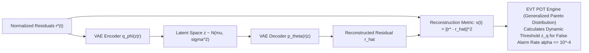
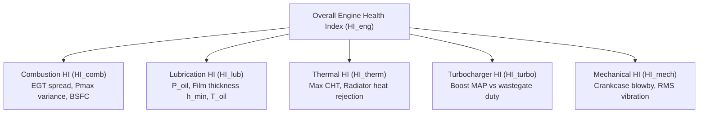

# Fault Diagnosis and Isolation

Bio-Inspired Sparse Novelty Coding answers whether the current engine state is unusual. It does not, and is not designed to, isolate which specific subsystem or component produced that departure. Fault isolation is an inferential problem requiring structured causal reasoning: ANUMAAN solves it through a **Bayesian Belief Network** evaluated against an aerothermal FMECA failure taxonomy, supervised by an **Extreme Value Theory (EVT) anomaly detector**, and paired with a **deterministic ATA-chapter diagnostic agent** that generates certified maintenance directives.

---

## The 10-Stage Fault Management Pipeline

When sensor telemetry or physics residuals diverge, ANUMAAN executes a deterministic 10-stage protocol:

---

## Anomaly Detection: Deep VAE + Extreme Value Theory (EVT)

Traditional fixed thresholding ($3\sigma$) produces unacceptable false alarms under dynamic flight maneuvers. ANUMAAN implements a **Deep Variational Autoencoder (VAE) + Extreme Value Theory (EVT) Peaks-Over-Threshold (POT)** anomaly detection engine:

### Extreme Value Theory POT Mathematical Formulation
Reconstruction errors $s(t) = \sum_{j=1}^7 w_j (r_j^*(t) - \hat{r}_j^*(t))^2$ are evaluated against an extreme value threshold. According to the Pickands-Balkema-de Haan theorem, exceedances $y = (s - u)$ over an initial threshold $u$ converge asymptotically to the **Generalized Pareto Distribution (GPD)**:

$$G_{\xi, \sigma}(y) = 1 - \left( 1 + \frac{\xi \cdot y}{\sigma} \right)^{-\frac{1}{\xi}}, \quad y > 0$$

Where $\xi$ is the shape parameter and $\sigma$ is the scale parameter, fitted via Maximum Likelihood Estimation (MLE). For a specified operational False Alarm Rate $\alpha = 10^{-4}$ (corresponding to $\le 1$ false alarm per $2.77\text{ flight hours}$ at $10\text{ Hz}$), the exact anomaly threshold $z_q$ is calculated dynamically:

$$z_q = u + \frac{\sigma}{\xi} \cdot \left[ \left( \frac{N_{\text{total}}}{N_u} \cdot \alpha \right)^{-\xi} - 1 \right]$$

This provides mathematically bounded false-alarm rates without ad-hoc heuristic tuning.

---

## Subsystem Composite Health Indices (ISO 13374 / OSA-CBM)

Following ISO 13374 standards, condition monitoring telemetry is synthesized into normalized subsystem health indices $HI \in [0.0, 1.0]$:

### Mathematical Formulations:
1. **Combustion Health Index ($HI_{\text{comb}}$):**
   $$HI_{\text{comb}}(t) = \exp\left( -w_1 \cdot \frac{|\Delta EGT_{\text{cyl}}^{\text{spread}}|}{\Delta EGT_{\text{limit}}} - w_2 \cdot \left(\frac{BSFC(t) - BSFC_{\text{nominal}}}{BSFC_{\text{nominal}}}\right)^2 \right)$$

2. **Lubrication Health Index ($HI_{\text{lub}}$):**
   $$HI_{\text{lub}}(t) = \min\left( 1.0, \; \max\left( 0.0, \; \frac{P_{\text{oil}}(t) - P_{\text{oil,critical}}}{P_{\text{oil,nominal}} - P_{\text{oil,critical}}} \right) \right) \cdot \Phi\left( \frac{h_{\min}(t) - h_{\text{crit}}}{\sigma_h} \right)$$

3. **Overall Engine Health Index ($HI_{\text{eng}}$):**
   $$HI_{\text{eng}}(t) = \min\Big( HI_{\text{comb}}, HI_{\text{lub}}, HI_{\text{therm}}, HI_{\text{turbo}}, HI_{\text{mech}} \Big)^{0.4} \cdot \left( \prod_{k=1}^5 HI_k \right)^{\frac{0.6}{5}}$$

*(The blended minimum-geometric product guarantees that severe failure of a single critical subsystem immediately drops overall engine health while avoiding numerical cliffing).*

---

## Aerothermal & Mechanical FMECA Classification Matrix

ANUMAAN's Bayesian network reasons over ten core Failure Mode, Effects, and Criticality Analysis (FMECA) modes derived per MIL-STD-1629A:

| Subsystem | Failure Mode | Primary Sensor Trigger | Diagnostic Residual Signature | Prognostic Horizon | Criticality (MIL-STD-1629A) |
| :--- | :--- | :--- | :--- | :--- | :--- |
| **Ignition / Comb** | **01: Total Single-Cylinder Misfire** | Missing tooth pulse / RPM dip | Sudden EGT drop ($> 200^\circ\text{C}$ in 2 s); $0.5X$ vibration surge; $\Delta \omega(\theta) < 0$ at $180^\circ$ window | $< 30\text{ s}$ | **Category I (Catastrophic)** |
| **Combustion** | **02: Detonation / Knock** | High-frequency block acoustic | High-frequency accelerometry (5 to 8 kHz); rapid CHT derivative ($\frac{dT}{dt} > 2^\circ\text{C/s}$) | $< 5\text{ s}$ | **Category I (Catastrophic)** |
| **Fuel Delivery** | **03: Injector Micro-Clogging** | Rail pressure ripple | Divergent EGT rise on affected cylinder (lean peak $\lambda \approx 1.05$); CHT elevation; torque deficit $> 18\%$ | $15 \text{ to } 60\text{ min}$ | **Category II (Critical)** |
| **Fuel Delivery** | **04: Injector Solenoid Lag** | Injection timing register | Asymmetric EGT transients during acceleration; crank-angle current lag | $5 \text{ to } 30\text{ min}$ | **Category II (Critical)** |
| **Cooling** | **05: Coolant Pump Cavitation** | Radiator $\Delta T < 8^\circ\text{C}$ | All CHTs trending upward ($> 135^\circ\text{C}$); coolant pressure drop across pump; $\Delta T_{\text{rad}}$ collapse | $10 \text{ to } 25\text{ min}$ | **Category I (Catastrophic)** |
| **Cooling** | **06: Radiator Matrix Fouling** | Gradual CHT creep vs IAS | Convective thermal model residual tracking; slow thermal creep at loiter | $2 \text{ to } 10\text{ h}$ | **Category III (Marginal)** |
| **Lubrication** | **07: Journal Bearing Spalling** | $1X, 2X$ order vibration spike | Spectral kurtosis surge; decaying oil pressure at cruise; oil temperature creep; $h_{\min} < 0.8\ \mu\text{m}$ | $1 \text{ to } 5\text{ h}$ | **Category I (Catastrophic)** |
| **Lubrication** | **08: Relief Valve Jam Open** | $P_{\text{oil}} < 1.5\text{ bar}$ | Instantaneous oil pressure plunge across all RPMs; $T_{\text{oil}}$ rising rapidly | $< 60\text{ s}$ | **Category I (Catastrophic)** |
| **Sensor Subsystem** | **09: Thermocouple Oxidation Drift** | Inconel probe bias | Parity residual $\|\mathbf{r}_p\| \gg 0$; individual EGT divergence while engine torque and peer CHTs remain flat | $10 \text{ to } 50\text{ h}$ | **Category IV (Minor)** |
| **Mechanical** | **10: Piston Slap / Skirt Wear** | $1.5 \text{ to } 3\text{ kHz}$ acoustic impact | Angular synchronous vibration averaging at TDC expansion onset; high-frequency impact bursts | $50 \text{ to } 100\text{ h}$ | **Category III (Marginal)** |

*Figure 1: Real-time fault injection triggering persistence-confirmed residual alarms and exact Bayesian fault ranking.*

---

## Physical Verification of Core Failure Dynamics

### 1. Combustion Misfire Dynamics
When Cylinder $k$ misfires:
- **Thermodynamic Loss:** Fuel chemical energy $\dot{m}_f Q_{\text{LHV}}$ is not converted into expansion work. Indicated work drops from $+350\text{ J}$ to $-40\text{ J}$ (net negative pumping work).
- **Thermal Collapse:** Cold intake charge enters the exhaust runner, causing an immediate plunge in exhaust temperature:
  $$\left. \frac{d T_{\text{egt}, k}}{dt} \right|_{\text{misfire}} \approx -\frac{T_{\text{egt}, k} - T_{\text{charge}}}{\tau_{\text{probe}}} \approx -150^\circ\text{C/s to } -250^\circ\text{C/s}$$
- **Rotational Deceleration:** Zero expansion torque momentarily slows down the crankshaft. By sampling crank-angle pulses via a 60-2 Hall-effect sensor, the digital twin detects angular velocity drops during specific cylinder expansion windows:
  $$\Delta \omega_k = \omega(\theta_{\text{TDC}, k} + 90^\circ) - \omega(\theta_{\text{TDC}, k}) < 0$$
  This isolates the failing cylinder within a single four-stroke engine cycle ($22.2\text{ ms}$ at 5,400 RPM).

### 2. Lubrication Breakdown & Journal Seizure Cascade
Hydrodynamic journal bearings require an unbroken fluid wedge:
- **Minimum Film Thickness:** $h_{\min} = c \cdot (1 - \epsilon)$, where $c \approx 35\ \mu\text{m}$ is radial clearance and $\epsilon \in [0, 1)$ is eccentricity ratio.
- **The Thermal Failure Cascade:**
  1. Excessive thermal load thins lubricant: dynamic viscosity $\mu$ drops below $4\text{ mPa}\cdot\text{s}$.
  2. Sommerfeld number $S \to 0$, forcing eccentricity $\epsilon \to 1.0$.
  3. Minimum film thickness $h_{\min}$ falls below combined composite surface roughness ($R_q \approx 0.8\ \mu\text{m}$), triggering metal-to-metal asperity contact.
  4. Friction coefficient surges from hydrodynamic levels ($\mu_f \approx 0.005$) to dry boundary friction ($\mu_f \approx 0.15$), representing a 30-fold thermal dissipation spike.
  5. Localized flash temperatures exceed $350^\circ\text{C}$, melting the Babbitt overlay, welding the connecting rod to the crank journal, and causing catastrophic crankshaft seizure within seconds.

---

## Explainable AI (XAI) Diagnostic Attribution

For every classified fault, the system outputs SHAP (Shapley Additive Explanations) feature attributions. When `TURBO_WASTEGATE_STUCK_OPEN` is signaled to the propulsion engineer, the console displays:
- $+44\%$ attribution from `MAP_Deficit_vs_Target`
- $+28\%$ attribution from `Elevated_EGT_Post_Turbine`
- $+19\%$ attribution from `Zero_Wastegate_PWM_Response`
- $+9\%$ attribution from `Barometric_Altitude_Lapse`

This gives propulsion engineers physical, audit-ready justification for the diagnosis rather than an unexplainable confidence score.

---

## Deterministic ATA-Chapter Diagnostic Directives

Once a fault hypothesis is ranked, the deterministic diagnostic agent converts the finding into an airworthiness-compliant directive organized by standard ATA chapters:
- **ATA 72-00 (Engine General):** Thermal overload: Derate throttle to 4,600 RPM, enrich fuel trim $+12\%$, initiate cooling descent by $3,000\text{ ft}$.
- **ATA 73-10 (Engine Fuel & Control):** Injector imbalance: Verify fuel rail pressure, command FADEC Lane B backup schedule, engage auxiliary boost pump.
- **ATA 74-00 (Ignition):** Misfire detection: Isolate failing cylinder via crank phase, switch ignition circuit to secondary coil pack.
- **ATA 79-00 (Engine Oil):** Critical lubrication loss: Immediate audio warning, feather propeller or reduce power to minimum glide setting, declare emergency divert.

---

## Related Systems

- [The AI and ML Architecture](09-ai-ml-architecture.md)
- [Bio-Inspired Sparse Novelty Coding](10-bio-inspired-sparse-novelty-coding.md)
- [Vibration Analysis and Order Tracking](12-vibration-analysis.md)
- [Degradation Modeling and Wear Kinetics](13-degradation-modeling.md)
- [Remaining Useful Life Estimation](14-remaining-useful-life.md)
