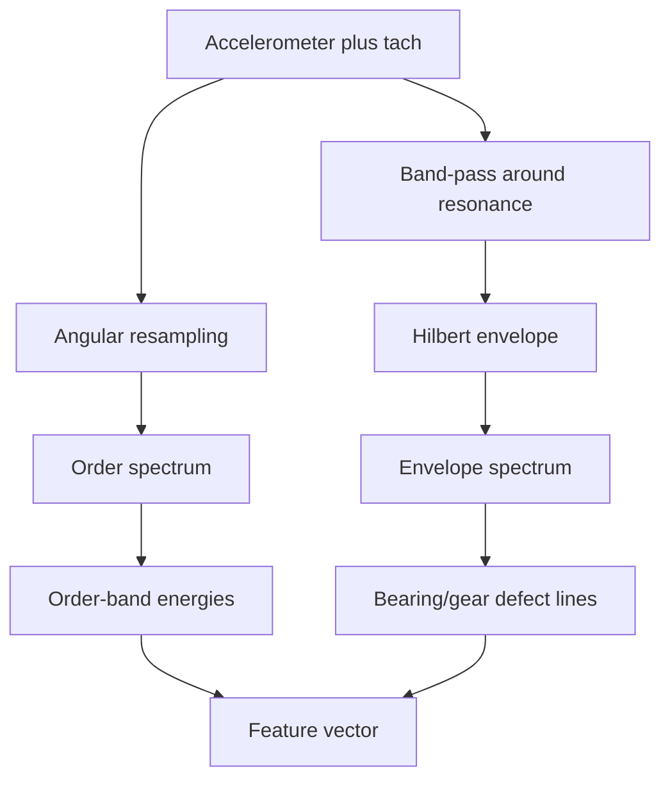
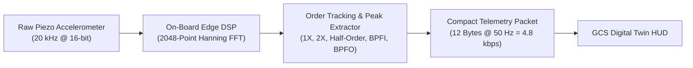

# Vibration Analysis

Vibration is one of the richest signals a piston engine produces, and one of the most underused in conventional monitoring. Every combustion event, every gear mesh, every bearing rotation writes itself into the vibration signature at a frequency determined by engine geometry and speed. Most threshold-based systems ignore this entirely and watch only slow scalar channels like temperature and pressure. ANUMAAN treats vibration as a primary detection channel, but doing so correctly on a UAV engine requires solving a problem that a fixed-speed industrial machine does not have to face: the engine's shaft speed changes continuously with throttle.

## The problem

A rotating or reciprocating machine produces vibration at frequencies tied to its geometry and speed: a firing event at a certain multiple of shaft rotation, a gear mesh at the tooth count times shaft speed, a bearing defect at a frequency set by its geometry. A plain frequency-domain analysis, a Fourier transform against a fixed time window, assumes the machine's speed is constant during that window. On a UAV engine it is not. Throttle changes continuously through climb, cruise, loiter, and dash, and a fault signature that would sit at a sharp spectral line at constant speed instead smears across many frequency bins as speed varies during the analysis window. The fault can be genuinely present and still be invisible to a naive spectrum.

A second problem compounds the first: reciprocating engines are not steady rotating machines even at constant speed. A turbine's vibration is broadly continuous; a piston engine's is fundamentally cyclic and impulsive, a train of discrete combustion events, valve impacts, and piston reversals locked to crank angle rather than a steady tone. Bearing-fault intuitions built on constant-speed rotating machinery transfer only partially to this signal.

## Why it matters

Two of the problem statement's eight fault targets, misfire and abnormal vibration patterns, and a third, combustion instability, cannot be reliably detected without vibration data analyzed correctly. A scalar RMS energy channel, the simplest possible vibration feature, can miss a real fault entirely: a single misfiring cylinder can leave overall RMS essentially unchanged while a specific half-order energy band rises by more than an order of magnitude, because the misfire breaks cycle-to-cycle symmetry without changing the total energy much at all. Getting this analysis right is not a refinement on top of the detection pipeline. It is the difference between catching a real fault and reporting a clean bill of health while it develops.

## Our approach

ANUMAAN uses tach-synchronous order tracking rather than fixed-frequency analysis. Instead of comparing vibration content against absolute frequency bins in hertz, the signal is resampled against shaft rotation angle rather than time, using a synchronized tachometer or crank signal. An order is a multiple of shaft rotational frequency: order one is once per revolution, order two is twice per revolution, and so on, with half-integer orders meaningful for a four-stroke engine because one full combustion cycle spans two revolutions. In the order domain, a given fault sits at the same order regardless of engine speed, because the resampling has already removed the speed dependence that would otherwise smear it. This is what makes vibration comparable across a flight in which throttle, and therefore shaft speed, never stops changing.

For faults that produce weak, impulsive signatures buried under the much larger combustion and gear-mesh energy, principally early bearing and gear defects, ANUMAAN uses Hilbert envelope demodulation on top of order tracking. A defect strikes a small impact that excites a structural resonance, which rings at a much higher frequency than the defect rate itself. That ringing is amplitude-modulated at the defect's characteristic frequency, and a plain spectrum shows only a hump at the resonance, not the defect rate. Demodulating the envelope of the resonance band and taking its spectrum reveals the defect frequency directly, often while the overall vibration amplitude still looks entirely normal.

## How it works

The acquisition requirement comes first: the vibration channel must be sampled synchronously with a tachometer or crank angle signal, because order tracking cannot be reconstructed after the fact from an unsynchronized recording. From there the pipeline runs in two parallel branches feeding a shared feature vector.

The order-tracking branch converts the time-domain vibration signal into the angle domain by interpolating shaft angle against time from the tach signal and resampling the vibration waveform onto a uniform angle grid. A Fourier transform of that angle-domain signal produces an order spectrum in which combustion, imbalance, and gear-mesh energy sit at fixed order lines independent of instantaneous RPM. Specific order bands are extracted as features: the half-order band associated with cycle-to-cycle asymmetry and misfire, the firing-frequency order and its harmonics, and the gear mesh frequency together with its sidebands, since sideband growth around the mesh frequency is a more sensitive wear indicator than the mesh amplitude itself.

The envelope branch selects a frequency band around a structural resonance, typically found empirically or through a kurtosis-based search, band-pass filters the raw vibration signal around that band, takes the magnitude of its Hilbert transform to recover the envelope, and computes the spectrum of that envelope. Peaks in the envelope spectrum at non-integer orders, characteristic of bearing defect frequencies which by their geometry are not integer multiples of shaft speed, are strong evidence of a bearing fault specifically, because they do not coincide with any shaft harmonic that combustion or imbalance would also produce.

Both branches also feed simple time-domain statistics, root mean square for overall energy and kurtosis for impulsiveness, since kurtosis rises early as isolated impacts appear and only falls again once a defect has advanced to a near-continuous rattle, making it most useful paired with RMS rather than read alone.

*Figure 1: Propeller reduction gearbox assembly isolating gear mesh interfaces and accelerometer probe installation locations.*

## Architecture

Two branches from a common synchronized signal, feeding one feature vector.

*Order tracking exposes combustion and gear-mesh signatures at fixed orders; envelope demodulation exposes weak impulsive bearing and gear defects hidden under them.*

## Mathematics & Spectral Algorithms

### 1. Shaft Kinematics & Angular Resampling
The fundamental shaft rotational frequency $f_{\text{shaft}}$ in hertz is derived continuously from the crankshaft trigger wheel:

$$f_{\text{shaft}} = \frac{\text{RPM}}{60}$$

An engine order $O_n$ represents a synchronous multiple of shaft rotational frequency:

$$f_n = n \cdot f_{\text{shaft}}$$

Because the UAV's throttle and shaft speed vary continuously through climb, cruise, loiter, and descent, fixed-frequency Fourier bins suffer from severe spectral smearing. ANUMAAN resolves this via **tach-synchronous angular resampling**:

$$\theta(t) = \int_0^t \omega(\tau) d\tau, \quad x(\theta) = \mathcal{I}\left( x(t), \; \theta(t) \right)$$

Where $\mathcal{I}$ is a cubic spline interpolator mapping non-uniform time samples to an equidistant angular grid $\Delta\theta = \frac{2\pi}{N_{\text{pts}}}$. Computing the Discrete Fourier Transform (DFT) over the angular domain yields an **order spectrum** in which spectral peaks remain strictly fixed at invariant engine orders regardless of speed fluctuations:

| Engine Order | Physical Source & Harmonic Significance | Fault Signature Indicator |
| :--- | :--- | :--- |
| **$0.5X$ (Half-Order)** | 4-Stroke Camshaft & Sub-Harmonic Combustion Asymmetry | Single-cylinder ignition misfire or injector fouling. |
| **$1.0X$ (First-Order)** | Fundamental Crankshaft Rotational Speed | Propeller / flywheel static or dynamic mass unbalance. |
| **$2.0X$ (Second-Order)** | 4-Cylinder Firing Frequency ($2\times \text{rev}$) & Reciprocating Inertia | Cylinder power imbalance or connecting rod journal wear. |
| **$2.43X$ (Gear Ratio)** | Propeller Reduction Gearbox Input-to-Output Ratio ($i = 2.43$) | Gearbox quill shaft misalignment or damper spring degradation. |
| **$GMF$ ($N_t \cdot X$)** | Gear Mesh Frequency ($GMF = N_{\text{teeth}} \cdot f_{\text{shaft}}$) | Gear tooth pitting, root cracking, or excessive backlash. |

---

### 2. Kinematic Bearing Defect Frequencies

Localized spalling on rolling-element bearing surfaces generates high-frequency impact pulse trains. Based on bearing pitch diameter $D$, roller diameter $d$, number of rolling elements $n_b$, and contact angle $\phi$:

* **Ball Pass Frequency Outer Race ($BPFO$):**
  $$BPFO = \frac{n_b}{2} \cdot f_{\text{shaft}} \cdot \left( 1 - \frac{d}{D} \cos\phi \right)$$

* **Ball Pass Frequency Inner Race ($BPFI$):**
  $$BPFI = \frac{n_b}{2} \cdot f_{\text{shaft}} \cdot \left( 1 + \frac{d}{D} \cos\phi \right)$$

* **Ball Spin Frequency ($BSF$):**
  $$BSF = \frac{D}{2d} \cdot f_{\text{shaft}} \cdot \left[ 1 - \left( \frac{d}{D} \cos\phi \right)^2 \right]$$

* **Fundamental Train Frequency ($FTF$ / Cage Speed):**
  $$FTF = \frac{1}{2} \cdot f_{\text{shaft}} \cdot \left( 1 - \frac{d}{D} \cos\phi \right)$$

Because $BPFO$, $BPFI$, and $BSF$ are irrational, non-integer multiples of shaft speed, energy appearing at these exact orders in the demodulated envelope spectrum provides unassailable diagnostic proof of rolling-element fatigue, entirely decoupled from combustion harmonics.

---

### 3. Fast Kurtogram & Hilbert Envelope Demodulation

Early bearing impacts excite high-frequency structural resonances ($2\text{ to } 10\text{ kHz}$) with low energy. To isolate the optimal carrier band without manual tuning, ANUMAAN evaluates the **Spectral Kurtosis ($SK$)**:

$$SK(f) = \frac{\langle |X(t, f)|^4 \rangle}{\langle |X(t, f)|^2 \rangle^2} - 2$$

Where $X(t, f)$ is the Short-Time Fourier Transform (STFT) computed via a 1/3-binary tree filterbank. The center frequency $f_c$ and bandwidth $\Delta f$ maximizing $SK(f)$ isolate the resonant ringing. The analytical signal $z(t)$ is formed via the Hilbert transform:

$$z(t) = x_{\text{filtered}}(t) + j \cdot \mathcal{H}\{x_{\text{filtered}}(t)\}$$
$$e(t) = |z(t)| = \sqrt{x_{\text{filtered}}^2(t) + \hat{x}_{\text{filtered}}^2(t)}$$

The Fourier spectrum of envelope $e(t)$ cleanly exposes $BPFO$ and $BPFI$ impact frequencies even when buried under $20\text{ dB}$ of combustion noise.

---

## On-Board In-Situ Edge Processing

Rather than transmitting high-bandwidth raw vibration ($20\text{ kHz} \times 16\text{ bits} = 320\text{ kbps}$) across tactical radio links, the on-board edge processor (ARM Cortex-M7 / Jetson Orin) executes order tracking and peak extraction locally:

## Related Systems

- [The AI and ML Architecture](09-ai-ml-architecture.md)
- [Engine Physics and Thermodynamics](06-engine-physics.md)
- [The Digital Twin Core](05-the-digital-twin.md)
- [Bio-Inspired Sparse Novelty Coding](10-bio-inspired-sparse-novelty-coding.md)
- [Fault Diagnosis](11-fault-diagnosis.md)
- [Degradation Modeling](13-degradation-modeling.md)
