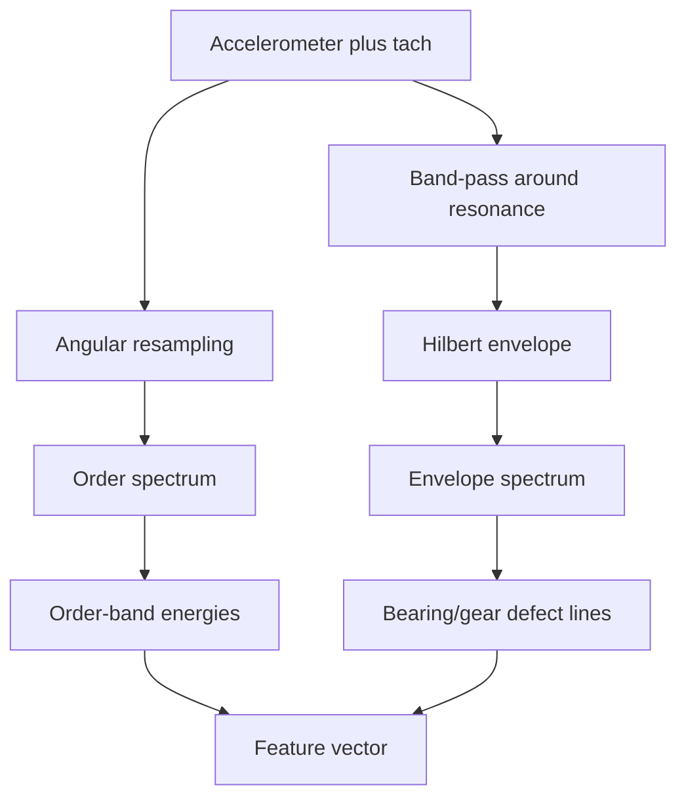

# Vibration Analysis

Vibration is one of the richest signals a piston engine produces, and one of the most underused in conventional monitoring. Every combustion event, every gear mesh, every bearing rotation writes itself into the vibration signature at a frequency determined by engine geometry and speed. Most threshold-based systems ignore this entirely and watch only slow scalar channels like temperature and pressure. ANUMAAN treats vibration as a primary detection channel, but doing so correctly on a UAV engine requires solving a problem that a fixed-speed industrial machine does not have to face: the engine's shaft speed changes continuously with throttle.

## The problem

A rotating or reciprocating machine produces vibration at frequencies tied to its geometry and speed: a firing event at a certain multiple of shaft rotation, a gear mesh at the tooth count times shaft speed, a bearing defect at a frequency set by its geometry. A plain frequency-domain analysis, a Fourier transform against a fixed time window, assumes the machine's speed is constant during that window. On a UAV engine it is not. Throttle changes continuously through climb, cruise, loiter, and dash, and a fault signature that would sit at a sharp spectral line at constant speed instead smears across many frequency bins as speed varies during the analysis window. The fault can be genuinely present and still be invisible to a naive spectrum.

A second problem compounds the first: reciprocating engines are not steady rotating machines even at constant speed. A turbine's vibration is broadly continuous; a piston engine's is fundamentally cyclic and impulsive, a train of discrete combustion events, valve impacts, and piston reversals locked to crank angle rather than a steady tone. Bearing-fault intuitions built on constant-speed rotating machinery transfer only partially to this signal.

## Why it matters

Two of the problem statement's eight fault targets, misfire and abnormal vibration patterns, and a third, combustion instability, cannot be reliably detected without vibration data analyzed correctly. A scalar RMS energy channel, the simplest possible vibration feature, can miss a real fault entirely: a single misfiring cylinder can leave overall RMS essentially unchanged while a specific half-order energy band rises by more than an order of magnitude, because the misfire breaks cycle-to-cycle symmetry without changing the total energy much at all. Getting this analysis right is not a refinement on top of the detection pipeline. It is the difference between catching a real fault and reporting a clean bill of health while it develops.

## Our approach

ANUMAAN uses tach-synchronous order tracking rather than fixed-frequency analysis. Instead of comparing vibration content against absolute frequency bins in hertz, the signal is resampled against shaft rotation angle rather than time, using a synchronized tachometer or crank signal. An order is a multiple of shaft rotational frequency: order one is once per revolution, order two is twice per revolution, and so on, with half-integer orders meaningful for a four-stroke engine because one full combustion cycle spans two revolutions. In the order domain, a given fault sits at the same order regardless of engine speed, because the resampling has already removed the speed dependence that would otherwise smear it. This is what makes vibration comparable across a flight in which throttle, and therefore shaft speed, never stops changing.

For faults that produce weak, impulsive signatures buried under the much larger combustion and gear-mesh energy, principally early bearing and gear defects, ANUMAAN uses Hilbert envelope demodulation on top of order tracking. A defect strikes a small impact that excites a structural resonance, which rings at a much higher frequency than the defect rate itself. That ringing is amplitude-modulated at the defect's characteristic frequency, and a plain spectrum shows only a hump at the resonance, not the defect rate. Demodulating the envelope of the resonance band and taking its spectrum reveals the defect frequency directly, often while the overall vibration amplitude still looks entirely normal.

## How it works

The acquisition requirement comes first: the vibration channel must be sampled synchronously with a tachometer or crank angle signal, because order tracking cannot be reconstructed after the fact from an unsynchronized recording. From there the pipeline runs in two parallel branches feeding a shared feature vector.

The order-tracking branch converts the time-domain vibration signal into the angle domain by interpolating shaft angle against time from the tach signal and resampling the vibration waveform onto a uniform angle grid. A Fourier transform of that angle-domain signal produces an order spectrum in which combustion, imbalance, and gear-mesh energy sit at fixed order lines independent of instantaneous RPM. Specific order bands are extracted as features: the half-order band associated with cycle-to-cycle asymmetry and misfire, the firing-frequency order and its harmonics, and the gear mesh frequency together with its sidebands, since sideband growth around the mesh frequency is a more sensitive wear indicator than the mesh amplitude itself.

The envelope branch selects a frequency band around a structural resonance, typically found empirically or through a kurtosis-based search, band-pass filters the raw vibration signal around that band, takes the magnitude of its Hilbert transform to recover the envelope, and computes the spectrum of that envelope. Peaks in the envelope spectrum at non-integer orders, characteristic of bearing defect frequencies which by their geometry are not integer multiples of shaft speed, are strong evidence of a bearing fault specifically, because they do not coincide with any shaft harmonic that combustion or imbalance would also produce.

Both branches also feed simple time-domain statistics, root mean square for overall energy and kurtosis for impulsiveness, since kurtosis rises early as isolated impacts appear and only falls again once a defect has advanced to a near-continuous rattle, making it most useful paired with RMS rather than read alone.


*Figure 1: Propeller reduction gearbox assembly isolating gear mesh interfaces and accelerometer probe installation locations.*

## Architecture

Two branches from a common synchronized signal, feeding one feature vector.



*Order tracking exposes combustion and gear-mesh signatures at fixed orders; envelope demodulation exposes weak impulsive bearing and gear defects hidden under them.*

## Mathematics / algorithms

Shaft frequency in hertz follows directly from RPM:

```
f_shaft = RPM / 60
```

An order is a multiple of that shaft frequency, so order two, the four-stroke firing frequency for a four-cylinder engine, sits at twice shaft frequency regardless of what RPM currently is:

```
order_n_frequency = n * f_shaft
```

Order tracking resamples the vibration signal from uniform time spacing to uniform angle spacing by interpolating the angle-versus-time curve built from tachometer edges, then resampling the waveform onto a uniform angle grid before taking its Fourier transform. This is what fixes each fault's energy to a constant order line across a flight in which RPM never stops changing, rather than letting it smear across a moving band of frequencies.

Bearing defect frequencies follow from bearing geometry, the number of rolling elements `n`, ball diameter `d`, pitch diameter `D`, and contact angle `phi`, all as multiples of shaft frequency:

```
BPFO = (n/2) * f_shaft * (1 - (d/D) cos(phi))     outer race
BPFI = (n/2) * f_shaft * (1 + (d/D) cos(phi))     inner race
```

Because these are non-integer multiples of shaft speed, energy appearing at BPFO or BPFI in the envelope spectrum, rather than at an integer shaft order, is specific evidence of a bearing defect rather than imbalance or combustion, since imbalance and combustion always sit at integer or half-integer orders.

## Example

At a steady cruise RPM with a healthy engine, the order spectrum shows the firing frequency at order two as the dominant line, a small residual imbalance at order one, and negligible energy at the half-order band, since a healthy engine's combustion cycles are symmetric between cylinders. Once cylinder 2 begins misfiring, the half-order band rises sharply, reflecting broken cycle-to-cycle symmetry, while the order-two firing frequency line drops somewhat, since one cylinder is contributing less. Overall RMS barely moves, because the total vibration energy has simply redistributed rather than grown. A bearing outer-race defect produces almost no change in the order spectrum at all, since the defect frequency does not align with any shaft harmonic, but the envelope spectrum develops a clear line at the outer-race defect frequency, and kurtosis rises noticeably while RMS again stays close to its baseline. These are two different fault mechanisms, each invisible to a scalar RMS channel, each clearly visible in the feature designed to expose it.

## Integration

Vibration features feed directly into the sparse random projection described in [Bio-Inspired Sparse Novelty Coding](10-bio-inspired-sparse-novelty-coding.md), where order-domain energies and envelope features form part of the vector encoded into a sparse novelty code every tick. They also feed the evidence set used by [Fault Diagnosis](11-fault-diagnosis.md), since several entries in the FMECA taxonomy, including misfire, gearbox tooth wear, and bearing defects, are specifically identified through vibration signatures rather than through slower scalar channels. The underlying crank-angle combustion dynamics that produce the firing-order signature in the first place are computed by the physics core described in [Engine Physics and Combustion Modeling](06-engine-physics.md); a misfire in that model is a cylinder genuinely producing no heat release for one cycle, and the half-order vibration growth described above emerges from that physics rather than being authored directly into the signal.

## Validation

The order-domain feature pipeline is exercised against the project's own physics-based synthetic telemetry generator, in which a misfire is modeled as a genuine absence of heat release for one cylinder's cycle rather than an authored signal, so the resulting half-order vibration signature emerges from the same crank-angle dynamics that would produce it on real hardware rather than being written directly into the output. A pytest-based characterization suite pins specific recovered misfire rates from this crank-angle chain as a regression test. Validation of order tracking and envelope analysis against real accelerometer data from an instrumented engine remains the natural next phase.

## Related systems

- [The AI and ML Architecture](09-ai-ml-architecture.md)
- [Engine Physics and Combustion Modeling](06-engine-physics.md)
- [The Digital Twin Core](05-the-digital-twin.md)
- [Bio-Inspired Sparse Novelty Coding](10-bio-inspired-sparse-novelty-coding.md)
- [Fault Diagnosis](11-fault-diagnosis.md)
- [Degradation Modeling](13-degradation-modeling.md)
