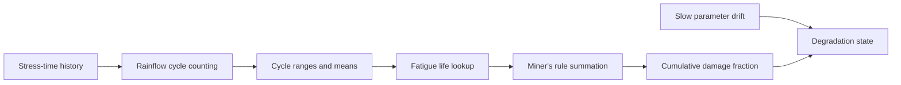

# Degradation Modeling

A fault diagnosis tells the operator what is wrong right now. Degradation modeling answers a different question: how has this component been wearing, cycle by cycle, hour by hour, well before anything crossed a threshold at all. This is the layer that turns a stream of thermal and mechanical stress cycles into a running measure of accumulated damage, and it is the foundation that remaining useful life estimation, the next article, builds on. Without a credible damage accumulation model, an RUL number has nothing underneath it.

## The problem

Mechanical and thermal fatigue do not happen in a single event. They accumulate. A cylinder head does not crack the first time it gets hot; it accumulates microscopic damage over thousands of thermal cycles of varying severity, and eventually that accumulated damage reaches a critical fraction and a crack initiates. The engineering challenge is that operating history is not a clean sequence of uniform cycles. Real telemetry produces an irregular sequence of peaks and valleys, small thermal fluctuations superimposed on large ones, partial cycles that never fully reverse, and the question of how to count all of that irregular variation into a meaningful measure of cumulative damage is genuinely non-trivial. Counting cycles naively, by simply counting how many times a signal crosses its mean, throws away exactly the information that determines how damaging each cycle actually was.

## Why it matters

Several entries in ANUMAAN's FMECA taxonomy are fundamentally cumulative rather than instantaneous: cylinder head thermal fatigue cracking, cylinder bore and ring wear from abrasive ingestion, gearbox tooth wear and micro-pitting. None of these announce themselves as a sudden departure from normal. Each is a slow accumulation that only becomes visible in aggregate, over hours of operating history, which is precisely the kind of trend a threshold-based system, watching only the current instantaneous value, is structurally unable to see. Tracking accumulated damage directly, rather than waiting for a symptom to appear, is what turns a degradation model into an early warning rather than a post-hoc explanation.

## Our approach

ANUMAAN counts stress cycles using rainflow cycle counting, the standard method in fatigue analysis for extracting a meaningful set of stress reversal cycles from an irregular load or temperature history, and combines them using Miner's linear damage rule, which sums the fractional damage contributed by each counted cycle against the number of cycles a component could withstand at that stress amplitude before failing. This pairing, rainflow counting followed by Miner's rule, is the established approach in fatigue and prognostics and health management practice for turning an irregular real-world stress history into a single cumulative damage fraction, and ANUMAAN applies it to the thermal and mechanical stress cycles a piston engine's components actually experience: cylinder head temperature excursions, combustion pressure cycling, and comparable stress-relevant channels.

Degradation tracking runs continuously, independent of whether a fault is currently flagged, because damage accrues whether or not anything is currently unusual. A component operating entirely within normal limits is still accumulating fatigue damage with every thermal cycle it experiences, and the whole point of tracking it directly is to know how much margin remains before that accumulation becomes a problem, rather than discovering the problem only once a threshold is finally crossed.

## How it works

The pipeline takes a stress-relevant channel's history, most directly cylinder head temperature or an equivalent mechanical stress proxy, and processes it in three stages.

Rainflow cycle counting first identifies the full and partial stress reversal cycles hidden inside the irregular history. The method works by treating the stress-time history as a sequence of peaks and valleys and extracting closed hysteresis loops from it, the way rain would flow down a sequence of pagoda roofs formed by the signal, giving the method its name. Each extracted cycle carries a range, the difference between its peak and valley, and a mean level. A large thermal swing from a rapid throttle transition counts as a more damaging cycle than a small fluctuation during steady cruise, and rainflow counting is what correctly separates the two rather than treating every mean crossing as equally significant.

Each counted cycle is then converted into a fractional damage contribution using Miner's rule. A material's fatigue life curve specifies how many cycles at a given stress range it can withstand before failure; a single cycle at that range therefore consumes one over that number as its fractional share of the component's total fatigue life. Summing that fraction across every counted cycle, across the component's entire operating history, gives a cumulative damage fraction between zero, undamaged, and one, the point at which the linear damage model predicts failure.

Slow parameter drift, changes in efficiency, oil condition, or baseline operating parameters that develop gradually over many operating hours rather than in discrete stress cycles, is tracked separately as a trend against operating hours, complementing the cycle-counted damage fraction with a second, slower-moving indicator of the same underlying wear process. Together, the cumulative damage fraction and the tracked parameter drift form the degradation state that the remaining useful life layer extrapolates forward.

## Architecture

From irregular stress history to a cumulative damage fraction.



*Rainflow counting extracts meaningful cycles from an irregular history; Miner's rule turns each into a fractional damage contribution that sums toward the critical limit.*

## Mathematics / algorithms

For a stress history broken into `k` counted cycles by rainflow counting, each cycle `i` having a stress range that permits `N_i` cycles to failure at that range according to the component's fatigue life curve, Miner's linear damage rule sums the fractional damage:

```
D = sum over i of (n_i / N_i)
```

where `n_i` is the number of cycles actually counted at that stress range, typically one for each rainflow-extracted cycle unless repeated ranges are grouped. Failure is predicted when the cumulative damage fraction reaches the critical limit:

```
D >= 1.0   predicted failure
```

The rainflow algorithm itself proceeds by identifying successive peak-valley-peak triplets in the stress history and extracting a closed cycle whenever an interior range is fully enclosed by a larger surrounding range, discarding the extracted portion and continuing until only the largest, unclosed residual swings remain. This is what allows the method to correctly handle a small fluctuation superimposed on a larger one, counting the small one as its own cycle rather than letting it distort the range of the larger cycle it rides on.

## Example

Consider a cylinder head temperature history across a mission profile that includes taxi, a high-power climb, a long cruise segment with minor throttle adjustments, a loiter phase, and a descent. Rainflow counting extracts a small number of large-range cycles corresponding to the major phase transitions, taxi to climb, climb to cruise, cruise to descent, and a larger number of small-range cycles from the minor throttle adjustments during cruise and loiter. Each large-range cycle, occurring at a higher stress amplitude, consumes a proportionally larger share of the fatigue life curve's cycles-to-failure at that range than each small cycle does. Miner's rule sums both populations into a single cumulative damage fraction for that sortie, added to the damage fraction already accumulated from prior operating hours, giving a running total that the remaining useful life layer uses directly as its physics-of-failure input.

## Integration

Degradation modeling sits between fault diagnosis and prognosis in ANUMAAN's AI stack. It consumes stress-relevant channels derived from the digital twin's physics core and, where relevant, from the vibration features described in [Vibration Analysis](12-vibration-analysis.md), and its cumulative damage fraction feeds directly into the physics-of-failure path of the dual-path remaining useful life estimator described in [Remaining Useful Life Estimation](14-remaining-useful-life.md). It also informs the fault diagnosis layer described in [Fault Diagnosis](11-fault-diagnosis.md), since cylinder head thermal fatigue and comparable cumulative failure modes in the FMECA taxonomy are specifically identified through this damage accumulation signature rather than through an instantaneous residual.

## Validation

Rainflow counting and Miner's rule are established, standard methods in fatigue analysis and prognostics and health management practice, applied here against the thermal and mechanical stress cycles produced by ANUMAAN's physics-based synthetic telemetry generator, which provides full operating histories across the complete mission phase model with known ground truth by construction. Validation of the specific fatigue life curves used against real material test data for the reference engine platforms, and against real operating histories rather than simulated ones, remains the natural next phase.

## Related systems

- [The AI and ML Architecture](09-ai-ml-architecture.md)
- [Fault Diagnosis](11-fault-diagnosis.md)
- [Vibration Analysis](12-vibration-analysis.md)
- [Remaining Useful Life Estimation](14-remaining-useful-life.md)
