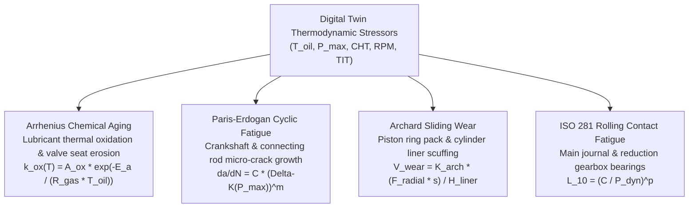
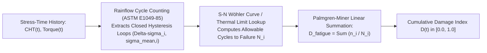

# Degradation Modeling and Wear Kinetics

A fault diagnosis tells the operator what component is abnormal right now. Degradation modeling answers a different, more fundamental question: **how is the powerplant accumulating irreversible physical damage across operational hours, well before an overt threshold is crossed?**

Without a first-principles damage accumulation model, any Remaining Useful Life (RUL) figure is an ungrounded guess. ANUMAAN combines **thermodynamic damage physics kinetics** (Arrhenius aging, Paris-Erdogan mechanical fatigue, Archard wear, and ISO 281 bearing fatigue) with **Rainflow cycle counting** and a **continuous-time stochastic Wiener drift process**.

---

## Thermodynamic Stressors to Damage Kinetics

Damage does not accumulate as a linear function of flight hours. An hour of low-power loiter in cool air causes negligible fatigue, whereas twenty minutes of full-boost climb at high ambient temperature ($+48^\circ\text{C}$ in Rajasthan) exponentially accelerates oil breakdown and cylinder head micro-cracking.

ANUMAAN feeds internal thermodynamic stressors from the digital twin into four coupled damage kinetics models:

---

## Mathematical Formulations of Damage Kinetics

### 1. Lubricant Thermal Oxidation & Valve Aging (Arrhenius Kinetics)
Thermal breakdown of lubricating oil and exhaust valve seat thermal erosion follow Arrhenius reaction kinetics:

$$k_{\text{ox}}(T) = A_{\text{ox}} \cdot \exp\left( -\frac{E_a}{R_{\text{gas}} \cdot T_{\text{oil}}} \right)$$

Cumulative thermal dosage $D_{\text{therm}}(t)$ over flight duration $t$:
$$D_{\text{therm}}(t) = \int_0^t \exp\left( \frac{E_a}{R_{\text{gas}}} \cdot \left[ \frac{1}{T_{\text{ref}}} - \frac{1}{T_{\text{oil}}(\tau)} \right] \right) d\tau$$

When oil sump temperature exceeds nominal ($T_{\text{oil}} > 115^\circ\text{C}$), lubricant thermal degradation accelerates exponentially, thinning the oil and degrading minimum hydrodynamic film thickness $h_{\min}$.

---

### 2. Crankshaft & Connecting Rod High-Cycle Fatigue (Paris-Erdogan Law)
For mechanical components subjected to cyclic peak combustion pressures $P_{\max}$, micro-crack growth rate per engine revolution $N_{\text{rev}}$ follows the Paris-Erdogan law:

$$\frac{da}{dN_{\text{rev}}} = C \cdot \left( \Delta K(P_{\max}, a) \right)^m, \quad \Delta K = Y \cdot \Delta \sigma(P_{\max}) \cdot \sqrt{\pi a}$$

Where $m \approx 3.2$ for high-strength forged alloy steel connecting rods, and stress range $\Delta \sigma$ is proportional to peak indicated combustion pressure $P_{\max}$ synthesized by the digital twin virtual sensor.

---

### 3. Piston Ring Pack & Cylinder Liner Wear (Archard Adhesive Law)
Piston ring sliding wear volume $V_{\text{wear}}$ over swept distance $s$:

$$V_{\text{wear}} = K_{\text{archard}} \cdot \frac{F_{\text{radial}}(P_{\text{im}}, P_{\max}) \cdot s}{H_{\text{liner}}}$$

As ring face wear accumulates, blow-by clearance widens, increasing crankcase pressure and updating the digital twin state observer wear parameter $\theta_{\text{blowby}}(t)$.

---

## Cycle Extraction: Rainflow Counting & Miner's Rule

Real flight operations produce complex, irregular thermal and torque profiles. ANUMAAN processes stress histories using **ASTM E1049-85 Rainflow Cycle Counting**:

Miner's linear damage rule sums fractional damage:
$$D_{\text{fatigue}} = \sum_{i=1}^k \frac{n_i}{N_i}$$

Failure occurs when cumulative damage fraction reaches the critical threshold:
$$D(t) \ge D_{\text{crit}} \approx 1.0$$

---

## Continuous-Time Stochastic Wiener Degradation Process

Because flight turbulence, pilot throttle adjustments, and environmental gust loading are stochastic, cumulative degradation $X(t) = 1.0 - HI(t)$ is modeled as a continuous-time **Wiener process with state-dependent drift**:

$$X(t) = X(0) + \int_0^t \mu\big(\mathbf{u}(\tau), \mathbf{x}_{\text{twin}}(\tau)\big) d\tau + \sigma_B \cdot B(t)$$

Where:
- $\mu(\cdot)$ is the physical drift rate driven by instantaneous engine load, temperature, and wear kinetics.
- $\sigma_B$ is the diffusion coefficient capturing ambient turbulence and vibration noise.
- $B(t)$ is standard Brownian motion.

### First Hitting Time & Remaining Useful Life Distribution
The Remaining Useful Life $T_{\text{RUL}} = \inf\{ t > 0 : X(t_0 + t) \ge D_{\text{crit}} \}$ follows the **Inverse Gaussian Distribution**:

$$f_{\text{RUL}}(t \mid X(t_0)) = \frac{D_{\text{crit}} - X(t_0)}{\sqrt{2\pi \sigma_B^2 t^3}} \cdot \exp\left( -\frac{\left( D_{\text{crit}} - X(t_0) - \bar{\mu} \cdot t \right)^2}{2 \sigma_B^2 t} \right)$$

This distribution provides the formal stochastic foundation for the Conformal Prediction intervals described in [Remaining Useful Life Estimation](14-remaining-useful-life.md).

---

## Related Systems

- [The Digital Twin Core](05-the-digital-twin.md)
- [Engine Physics and Thermodynamics](06-engine-physics.md)
- [Remaining Useful Life Estimation](14-remaining-useful-life.md)
- [Mission Reliability Enhancement](17-mission-reliability.md)
