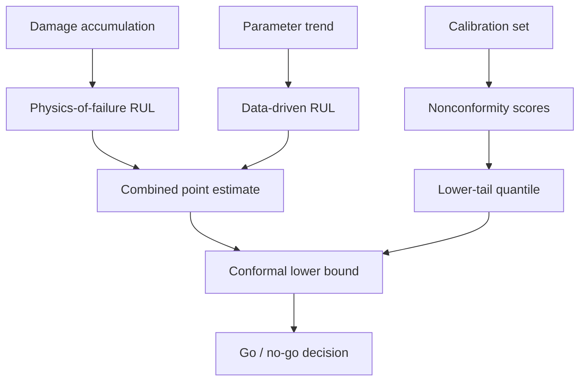

# Remaining Useful Life Estimation

Knowing that a component is degrading is not the same as knowing how much operating time remains before it should be pulled. Remaining useful life estimation is where ANUMAAN turns a damage accumulation trend into an actionable number, and it is also where the project takes its most deliberate stance on honesty: an RUL estimate is only useful to the degree that its uncertainty is quantified correctly, and a bare point estimate, or an interval with no guarantee behind it, is not good enough for a decision that affects whether an aircraft completes its sortie.

## The problem

Remaining useful life extrapolates a trend into the future, and extrapolation is inherently more fragile than describing the present. A small error in the estimated rate of degradation compounds over the length of the extrapolation horizon, so a modest slope error can translate into a large error in the predicted time to failure. Reporting a single number, "twelve hours remaining," invites an operator to plan against that number as if it were exact, which it is not and cannot be. The harder problem is not producing an estimate. It is producing an uncertainty bound around that estimate that actually means what it claims to mean, rather than a number with a percent sign attached to it that has never been checked against reality.

## Why it matters

The consequence of getting this wrong is asymmetric. Under-predicting remaining life costs an unnecessary early inspection. Over-predicting it risks continuing to fly a component past the point it can safely operate. An RUL system that reports an interval without ever verifying that the interval actually contains the true remaining life the claimed fraction of the time is reporting a number that looks rigorous and is not. The only way to know whether a stated confidence level is honest is to measure it directly against held-out data and report the result, which is the standard this article's method is built to meet.

## Our approach

ANUMAAN produces remaining useful life through two independent paths computed together. The physics-of-failure path extrapolates the cumulative damage fraction from the degradation model described in the previous article forward to its critical limit, using the current damage accumulation rate. The data-driven path extrapolates the observed trend in a relevant parameter, such as an efficiency or a degradation-indicating channel, forward to its own defined failure limit using a fitted trend on the parameter's recent history. The two paths are combined into a single estimate, and when they diverge by more than a defined threshold, that disagreement is itself surfaced as an alarm, because two independently derived estimates disagreeing is meaningful information in its own right, not something to silently average away.

The genuine methodological contribution sits in how the uncertainty around that estimate is produced: split conformal prediction, calibrated to give a one-sided lower confidence bound on remaining life with a formal, testable coverage guarantee. This stands in sharp contrast to the common alternative in this field, where a reported confidence interval is scaled heuristically from some auxiliary signal, such as sensor trust or trend stability, with no verification that the claimed coverage is ever actually achieved. A conformal interval, by construction, comes with a mathematical guarantee about how often it will contain the true value, and that guarantee can be checked empirically against held-out data, producing a number a competitor's uncalibrated interval cannot produce: a measured coverage rate to compare against the claimed one.

## How it works

Split conformal prediction, also called inductive conformal prediction, works by holding out a calibration set that plays no role in fitting the underlying RUL model. The data available for evaluation is split by mission, not by time within a mission, into a set used to fit the model and a separate calibration set used only to measure how wrong the model's predictions tend to be. For each sample in the calibration set, a nonconformity score is computed, the signed difference between the true remaining life and the model's predicted remaining life. Because remaining life estimation carries a specific operational asymmetry, over-predicting life remaining is far more dangerous than under-predicting it, the calibration uses this signed score and takes only the lower tail of its distribution, producing a one-sided correction that can be subtracted from any future point prediction to produce a lower bound with a guaranteed probability of holding.

This calibration step is what separates a conformal interval from an ordinary statistical confidence interval. An ordinary interval typically assumes a particular error distribution, often Gaussian, which RUL errors are not; a conformal interval makes no such assumption. It is distribution-free, meaning it works regardless of the true shape of the error distribution, and it is a finite-sample guarantee, meaning it holds at the actual size of the calibration set used, not only as that size grows toward infinity, which is the more common and weaker kind of guarantee. It is also model-agnostic: it wraps the existing dual-path RUL estimator without requiring any change to how that estimator computes its point prediction. The calibration is a layer added on top, not a replacement for the underlying physics-of-failure and data-driven reasoning.

The resulting lower bound is the number that should drive a go or no-go decision for a planned sortie, compared directly against the sortie's remaining planned duration, rather than comparing the planned duration against the raw point estimate or the interval's center, since the lower bound is the quantity the coverage guarantee actually protects.

## Architecture

Split conformal prediction wrapped around the dual-path RUL estimate.



*Two independent RUL paths produce a point estimate; a calibration set held out from model fitting produces the correction that turns it into a bound with a coverage guarantee.*

## Mathematics / algorithms

Given a calibration set of `n` samples, each with a true remaining life `RUL_true` and a model prediction `RUL_pred`, the signed nonconformity score for calibration sample `j` is:

```
s_j = RUL_true_j - RUL_pred_j
```

The one-sided lower-bound correction at miscoverage level `alpha` is the appropriate lower-tail quantile of these scores, using the finite-sample correction rather than the plain empirical quantile, since the plain quantile under-covers at small calibration set sizes:

```
q_lo = Quantile({s_j}, alpha)
```

For a new prediction, the calibrated lower bound is:

```
RUL_lower = RUL_pred + q_lo
```

with the guarantee:

```
P(RUL_true >= RUL_lower) >= 1 - alpha
```

This guarantee rests on an exchangeability assumption between the calibration data and the data the bound is later applied to. Because consecutive samples within a single mission's degradation trajectory are correlated rather than independent, the correct exchangeable unit is the mission itself, not the individual sample, which is why the calibration split is performed by mission rather than by time step within a mission. A genuinely novel fault, one that violates the assumption that test conditions resemble calibration conditions, breaks this guarantee outright, which is part of why the novelty layer described in Bio-Inspired Sparse Novelty Coding exists as a separate check: conformal prediction states how wrong the model usually is under conditions it has effectively seen before, not how wrong it might be on something genuinely unprecedented.

Because RUL predictability is not uniform, a nearly new component and one near end of life do not carry the same prediction error, a normalized variant scales the nonconformity score by a difficulty estimate specific to the current state before taking the quantile, which keeps the coverage guarantee while allowing the bound to be tighter when the estimate is more reliable and wider when it is less.

## Example

Consider a component with a physics-of-failure path estimating ten hours of remaining life from its current damage accumulation rate, and a data-driven path extrapolating a comparable trend from a degrading efficiency parameter to its own failure limit, arriving at a similar point estimate. The combined point estimate sits close to ten hours. A calibration set of held-out missions produces a lower-tail correction reflecting how far actual remaining life has fallen below predicted remaining life historically at a ninety percent target coverage. Applying that correction to the ten-hour point estimate produces a calibrated lower bound below the raw point estimate, and it is this lower, conservative number that is compared against a planned eighteen-hour endurance sortie. If the lower bound falls short of the planned duration, the mission reliability engine and prescriptive advisory layer engage, rather than the system waiting until the point estimate itself, unadjusted, falls below the planned duration.

## Integration

Remaining useful life estimation consumes the cumulative damage fraction produced by [Degradation Modeling](13-degradation-modeling.md) as its physics-of-failure input, and it can be engaged by fault hypotheses ranked in [Fault Diagnosis](11-fault-diagnosis.md) when a diagnosed fault carries a degradation-relevant signature. Its calibrated lower bound feeds directly into ANUMAAN's mission reliability computation, where the limiting component's remaining life is weighed against the planned sortie's remaining duration and forecast environment, and from there into the prescriptive advisory escalation that recommends a throttle derate or an alternative mission profile when margin narrows.

## Validation

The credibility of a conformal RUL interval rests entirely on measuring its coverage empirically rather than asserting it. The correct validation artifact is a coverage curve: nominal coverage plotted against empirically observed coverage on held-out test missions, where a well-calibrated method tracks the diagonal closely. Empirical coverage below the nominal target indicates an over-confident, unsafe interval and calls for checking calibration and test set isolation; empirical coverage above the nominal target indicates a conservative but safe interval. Reporting the interval's mean width alongside its coverage matters as well, since a trivially wide interval can achieve any coverage target while providing no operational value. A pytest-based characterization suite pins specific coverage results as regression tests, so a change to the underlying model or calibration procedure that would silently break the guarantee is caught automatically. Because coverage is measured against the project's own synthetic generator's ground truth, it demonstrates that the intervals are calibrated with respect to that simulator; extending the same coverage measurement to a public run-to-failure benchmark and to real engine data remains the natural next phase for strengthening the claim further.

## Related systems

- [The AI and ML Architecture](09-ai-ml-architecture.md)
- [Degradation Modeling](13-degradation-modeling.md)
- [Fault Diagnosis](11-fault-diagnosis.md)
- [Bio-Inspired Sparse Novelty Coding](10-bio-inspired-sparse-novelty-coding.md)
