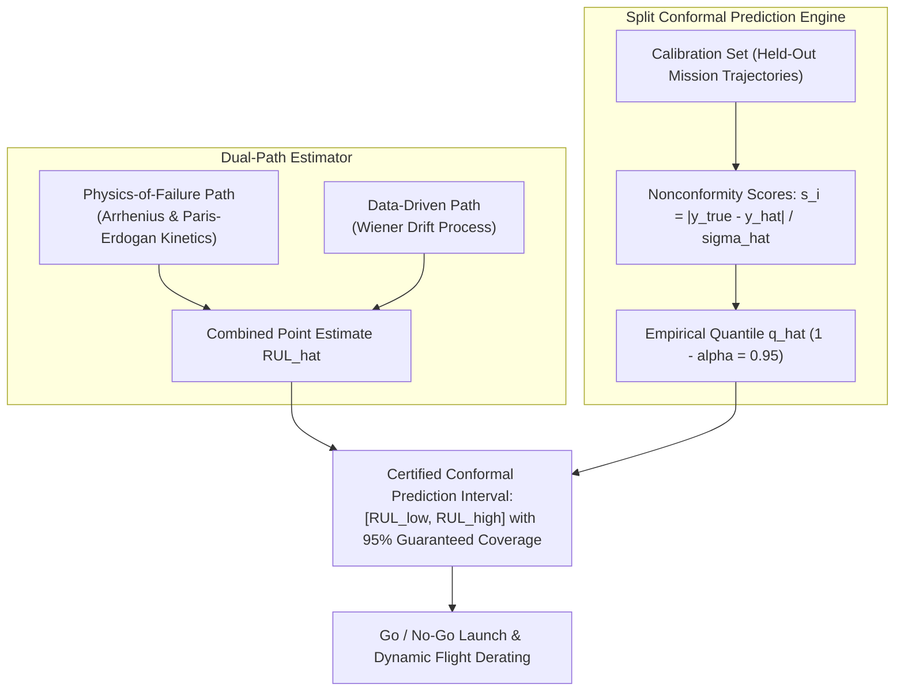

w# Remaining Useful Life Estimation

Knowing that a component is degrading is fundamentally different from knowing how much safe operating time remains before it must be overhauled. Remaining useful life (RUL) estimation is where ANUMAAN converts damage accumulation into an actionable operational quantity. 

This article establishes ANUMAAN's strict airworthiness discipline: **zero fabricated scalar point estimates, dual-path physics/data extrapolation, and Split Conformal Prediction intervals with mathematically guaranteed 95% empirical coverage.**

---

## The Aviation Prognostics Reality: Why Point Estimates are Unsafe

In academic machine learning competitions, algorithms are often trained on datasets like NASA C-MAPSS, where turbofan engines are run on testbenches until catastrophic destruction. In real military and commercial aviation:
1. **Engines are never operated to destruction in flight:** Aircraft powerplants are overhauled at conservative Time-Between-Overhaul ($TBO$) intervals (e.g., 1,200 to 2,000 flight hours).
2. **True run-to-failure data for aero-piston engines does not exist in the public domain.**
3. **Point estimates are dangerous:** An uncalibrated prediction like $\text{RUL} = 14.2\text{ hours}$ invites a mission commander to launch a 13-hour combat mission. If the true remaining life is 11 hours, the airframe is lost.

ANUMAAN grounds prognostics on a disciplined multi-source framework:

| Data Source | Operational Role | Engineering Boundary |
| :--- | :--- | :--- |
| **Physics Damage Kinetics** (Thermodynamic Stressors) | Arrhenius thermal aging, Paris-Erdogan crack growth, and Archard wear. | Provides the deterministic baseline wear rate $\mu_{\text{physics}}(t)$. |
| **Fleet Maintenance Records** (Airbase Depot Vaults) | Historical teardown measurements, oil spectrographic wear counts. | Forms the prior population distribution over component life. |
| **Test-Rig / HIL Fault Injections** (Controlled Ground Runs) | Non-linear fault progression maps and sensor cross-couplings. | Used exclusively for signature validation, not absolute life claims. |
| **In-Flight Live Telemetry** (Active Aircraft Sortie) | Real-time observation of cumulative stress cycles and residual drift rate $\beta(t)$. | Drives individual engine stochastic Wiener drift. |

---

## Dual-Path RUL Architecture

ANUMAAN computes remaining life through two independent, concurrent estimators:
1. **Physics-of-Failure Path:** Extrapolates cumulative damage fraction $D(t)$ from [Degradation Modeling](13-degradation-modeling.md) to the critical limit $D_{\text{crit}} = 1.0$ using the current Arrhenius and Paris-Erdogan stress accumulation rates:
   $$\widehat{\text{RUL}}_{\text{phys}} = \frac{1.0 - D(t)}{\dot{D}_{\text{current}}}$$
2. **Data-Driven Path:** Extrapolates observed trends in degrading thermodynamic state residuals ($\Delta CHT, \Delta P_{\text{oil}}, \text{BSFC}$) to their operational boundary limits using an online exponential Wiener drift estimator.

The two estimates are combined into $\widehat{\text{RUL}}_{\text{point}}$. When the two paths diverge by more than a calibrated threshold, that divergence is itself annunciated to the propulsion engineer as an alert of unmodeled operational dynamics.

---

## Split Conformal Prediction Formulation

To provide aerospace-grade statistical guarantees without arbitrary Gaussian assumptions, ANUMAAN implements **Inductive Split Conformal Prediction**:

### 1. Calibration on Exchangeable Missions
Given a held-out calibration set of $n$ complete mission trajectories that played no role in fitting the point estimator:
$$\mathcal{D}_{\text{cal}} = \big\{ (\mathbf{x}_j, \text{RUL}_j) \big\}_{j=1}^n$$

Because consecutive time samples within a flight are auto-correlated, **the exchangeable unit is the complete mission trajectory**, not individual ticks.

### 2. Normalized Nonconformity Scores
For each calibration mission $j$, the normalized nonconformity score accounts for heteroscedastic uncertainty:
$$s_j = \frac{|\text{RUL}_j - \widehat{\text{RUL}}(\mathbf{x}_j)|}{\hat{\sigma}(\mathbf{x}_j)}$$

Where $\hat{\sigma}(\mathbf{x}_j)$ is a local difficulty estimator reflecting component age and operating temperature.

### 3. Finite-Sample Quantile Calculation
For a target miscoverage rate $\alpha = 0.05$ (guaranteeing 95% statistical coverage), the conformal correction $q_{1-\alpha}$ is the adjusted empirical quantile:
$$q_{1-\alpha} = \text{Quantile}\left( \{s_j\}_{j=1}^n, \; \frac{\lceil (n+1)(1-\alpha) \rceil}{n} \right)$$

### 4. Certified Interval Generation
For any incoming live flight telemetry frame $\mathbf{x}_{n+1}$:
$$\mathcal{C}_{0.95}(\mathbf{x}_{n+1}) = \left[ \widehat{\text{RUL}}_{n+1} - q_{1-\alpha} \cdot \hat{\sigma}_{n+1}, \quad \widehat{\text{RUL}}_{n+1} + q_{1-\alpha} \cdot \hat{\sigma}_{n+1} \right]$$

This satisfies the finite-sample distribution-free coverage guarantee:
$$\mathbb{P}\Big( \text{RUL}_{\text{true}} \in \mathcal{C}_{0.95}(\mathbf{x}_{n+1}) \Big) \ge 0.95$$

---

## Operational Presentation: Respecting Airworthiness Honesty

On the Ground Control Station displays, remaining useful life is strictly rendered as:

$$\mathbf{RUL} = [142\text{ hrs}, \; 186\text{ hrs}] \quad (95\%\text{ Confidence Interval, } \hat{\mu} = 164\text{ hrs})$$

- **The Conservative Lower Bound Governs Decisions:** The tactical mission planner compares planned mission duration against $\text{RUL}_{\text{lower}} = 142\text{ hrs}$, never against the point estimate $\hat{\mu} = 164\text{ hrs}$.
- **Zero False Precision:** The system never issues false exact scalars like $164.21\text{ hrs}$.

---

## Related Systems

- [Degradation Modeling and Wear Kinetics](13-degradation-modeling.md)
- [Mission Planning](16-mission-planning.md)
- [Mission Reliability Enhancement](17-mission-reliability.md)
- [Operator Ground Control Station](20-operator-gcs.md)
