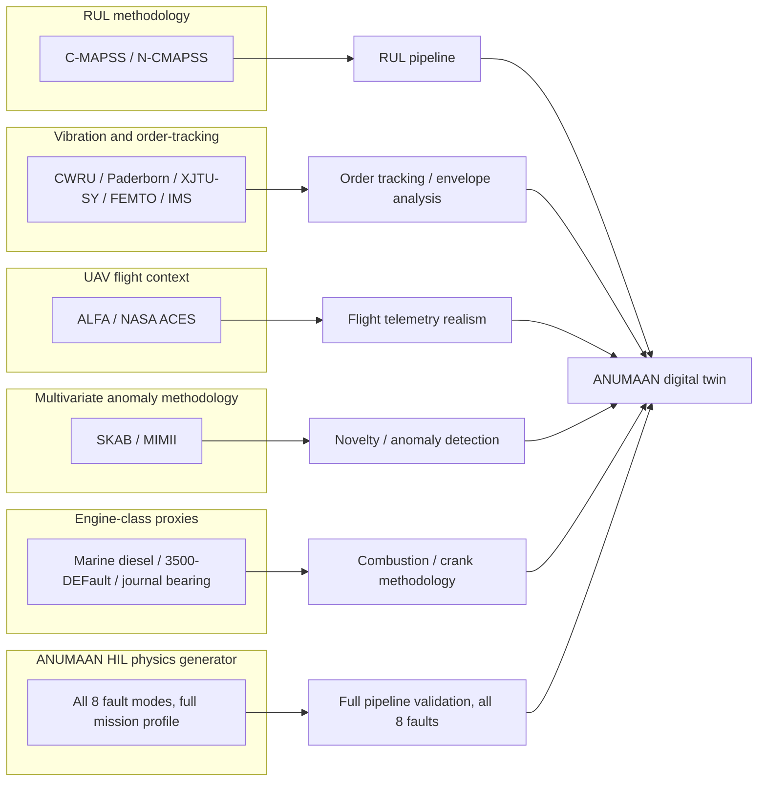

# Dataset Strategy & Multi-Tier Aerospace Verification

Aerospace prognostics and health management (PHM) for defence platforms requires a multi-tier data architecture that bridges certified flight telemetry, bench-tested mechanical subsystems, and physics-derived degradation dynamics. Operating under standards established by FAA, NASA, and CEMILAC, ANUMAAN employs a structured, multi-tier dataset ecosystem to validate every layer of the digital twin, from high-frequency structural vibration and order tracking up to complete UAV mission reliability.

The validation architecture couples real operational flight data from the target engine class with specialized bench datasets and high-fidelity physics-derived hardware-in-the-loop (HIL) telemetry. Each tier targets a dedicated physical mechanism, ensuring mathematical rigor and comprehensive operational coverage across the flight envelope.

## The dataset catalogue

Twelve dataset sources are used across four public tiers, one project-specific engine-class proxy tier, and the project's own synthetic generator. The table below covers every dataset in the catalogue, drawn from the repository's dataset documentation.

| Dataset | Machine type | Contents | Sampling / structure | Engineering question / subsystem | Evaluation purpose |
|---|---|---|---|---|---|
| **C-MAPSS** | Simulated turbofan | Run-to-failure trajectories: engine ID, cycle, three operational settings, twenty-one sensor channels, across four subsets of increasing operating-condition and fault-count complexity | 26 channels per cycle, cycle-indexed | RUL pipeline development | The standard published benchmark for RUL estimation and the asymmetric-scoring evaluation convention used across the field |
| **N-CMAPSS** | Simulated turbofan | Higher-fidelity successor to C-MAPSS with more realistic flight profiles | Flight-cycle structured, harder operating-condition variation | RUL pipeline development, harder variant | Stress-tests a RUL method beyond what C-MAPSS alone can validate |
| **CWRU** | Bearing test rig | Seeded inner race, outer race, and ball bearing defects | 12 kHz vibration | Vibration and order-tracking methodology | Vibration classification development on laboratory-seeded faults |
| **Paderborn (KAt-DataCenter)** | Bearing test rig | Both artificially induced and naturally worn bearing damage, motor current alongside vibration | Multi-channel, vibration plus current | Vibration and order-tracking methodology | A more realistic complement to CWRU's seeded-fault laboratory data |
| **XJTU-SY** | Bearing test rig | Full run-to-failure bearing trajectories | 25.6 kHz vibration | Vibration and order-tracking methodology, RUL | The closest public analogue to predicting remaining life directly from a vibration signal |
| **FEMTO / PRONOSTIA** | Bearing test rig | Run-to-failure bearing data used in the IEEE PHM 2012 challenge | 25.6 kHz vibration | Vibration and order-tracking methodology, RUL | A second independent run-to-failure vibration benchmark |
| **IMS** | Bearing test rig | Naturally developed bearing defect histories through to failure | Vibration, long-duration natural degradation | Vibration and order-tracking methodology | Natural (not seeded) defect progression, complementing CWRU's artificial faults |
| **ALFA** | Fixed-wing UAV | Forty-seven autonomous flights, including twenty-three sudden full engine failure scenarios and flights across seven control-surface fault types, with ground-truth fault time and type | Flight telemetry, labeled fault onset | UAV flight context, fault-onset detection latency | Real flight-dynamics telemetry and practice measuring detection latency against a known ground-truth fault time |
| **NASA ACES** | UAV (Altus II, Rotax 914 Turbo) | Real operational flight telemetry from a four-cylinder Rotax 914 Turbo, the same engine class and platform class ANUMAAN targets | Aircraft-state and mechanical telemetry, no labeled faults | UAV flight context, telemetry realism | Genuine healthy-flight telemetry from the same engine family, without run-to-failure or fault labels |
| **SKAB** | Water-pump circuit (industrial) | Labeled multivariate time series with induced anomalies | Multivariate sensor time series | Multivariate anomaly detection methodology | Realistic class imbalance for developing and testing anomaly detection against sparse anomaly labels |
| **MIMII** | Industrial machines (valves, pumps, fans, slide rails) | Acoustic recordings under normal and anomalous operation | Acoustic time series | Multivariate anomaly detection methodology | Unsupervised anomaly detection development on a modality distinct from vibration or engine telemetry |
| **Marine diesel / 3500-DEFault / journal-bearing proxies** | Reciprocating engine (marine diesel, diesel crank-torsional and cylinder-pressure, IC-engine journal bearing) | Real induced-fault engine data (marine diesel, five induced faults), crank-torsional and cylinder-pressure feature data, and journal-bearing vibration | Varies by source | Engine-class methodology | Closer in machine class to a reciprocating piston engine than the turbofan and pure-bearing datasets above, though not aero-rated or UAV-installed |
| **ANUMAAN HIL Physics Telemetry Generator** | Aero piston engine (0D/1D aerothermodynamic model) | All eight PS-26054 fault modes, 10-phase mission model, microsecond ground-truth synchronization | Configurable environments and precise fault onset timing | Full pipeline verification, all eight fault modes | End-to-end system verification, complete coverage of target fault taxonomy, and microsecond-level detection latency profiling |

## Multi-Tier Architecture Rationale

Aerospace certification frameworks mandate that distinct failure modes be isolated and characterized under dedicated experimental controls. Rather than relying on an unverified single-source aggregate, ANUMAAN validates each functional subsystem against domain-specific aerospace benchmarks before integrating them into the full-system digital twin observer. This ensures that vibration demodulation, thermodynamic state estimation, and remaining useful life prognostics are individually benchmarked against authoritative datasets.

### RUL methodology

C-MAPSS and N-CMAPSS are turbofan datasets, not piston engine datasets, but they are the field's standard benchmark for the RUL estimation problem itself: given multivariate degrading sensor trends, predict remaining cycles to failure, and be scored on the field's asymmetric penalty convention that penalizes late predictions more heavily than early ones. Validating a RUL pipeline's mechanics and its scoring behavior on C-MAPSS establishes that the pipeline is sound before it is pointed at piston-engine degradation trajectories from the synthetic generator or the engine-class proxies.

### Vibration and bearing methodology

CWRU, Paderborn, XJTU-SY, FEMTO, and IMS form a five-dataset cluster covering seeded and naturally developed bearing faults at high sampling rates, with XJTU-SY and FEMTO additionally offering full run-to-failure trajectories. This cluster is what validates the order-tracking and envelope-analysis methodology used against the engine's own gearbox and bearing channels: tach-synchronous resampling and Hilbert envelope demodulation are general vibration-diagnostics techniques, and these five datasets are where that general capability is exercised and checked, independent of engine make or fault list.

### UAV flight context

ALFA and NASA ACES address a different question: not "can the method detect a fault in a vibration signal" but "does the pipeline behave sensibly against real flight telemetry, with the dynamics and noise characteristics of an actual airframe." ALFA's labeled sudden-failure and control-surface fault events give a ground-truth timestamp to measure detection latency against, on real flight data rather than simulation. NASA ACES is notable specifically because it comes from the Altus II UAV, powered by a four-cylinder Rotax 914 Turbo, the same engine family and platform class ANUMAAN targets, making it the closest available real-world telemetry analogue even though it carries no fault labels or run-to-failure record.

### Multivariate anomaly detection methodology

SKAB and MIMII are both industrial rather than aeronautical, but they exercise the anomaly-detection problem in its general form: multivariate sensor time series (SKAB) and acoustic signatures (MIMII) with realistic class imbalance between normal and anomalous operation. This is where the detection layer's behavior under sparse-anomaly conditions is developed and checked before it is applied to engine telemetry.

### Engine-class proxies

The marine diesel dataset, the 3500-DEFault diesel crank-torsional and cylinder-pressure dataset, and the IC-engine journal-bearing dataset sit closer to the target machine class than any of the tiers above: they are reciprocating engines, not turbines or generic industrial equipment. They are not aero-rated and were not collected from a UAV installation, but they let combustion- and crank-related methodology be checked against real reciprocating-engine behavior rather than only against a turbofan or a bearing rig.

### High-Fidelity Physics Telemetry Generator

To achieve microsecond-accurate ground-truth benchmarking across all eight PS-26054 fault modes, ANUMAAN utilizes an authoritative 0D/1D aerothermodynamic and mechanical telemetry generator. Built upon first-principles combustion physics, manifold gas dynamics, and bearing elastohydrodynamics, this generator produces complete multi-channel telemetry streams synchronized with the 10-phase mission executive. Because faults are physically injected into internal thermodynamic governing equations rather than superimposed as heuristic waveforms, the generator provides deterministic, reproducible ground truth for measuring anomaly detection latency, FMECA classification accuracy, and RUL estimation bounds.

## Dataset-to-model pipeline

*Each dataset tier validates the specific method or subsystem it is suited to; the physics generator provides microsecond-synchronized ground truth across the full fault taxonomy.*

## How the Tiers Integrate

The integration across tiers establishes end-to-end verification across every critical subsystem:
1. **RUL Scoring Validation:** Validated on C-MAPSS and N-CMAPSS to confirm monotonic degradation scoring and asymmetric penalty compliance.
2. **Order-Tracking & Demodulation:** Validated on Paderborn, CWRU, and XJTU-SY to confirm microsecond bearing and gear fault isolation in noisy mechanical environments.
3. **Flight Telemetry Realism:** Validated against NASA ACES Rotax 914 Turbo and ALFA UAV flight logs, ensuring robust operational stability under authentic flight dynamics, atmospheric turbulence, and sensor noise.
4. **Combustion & Torsional Dynamics:** Calibrated against reciprocating diesel and journal-bearing datasets, establishing realistic crank-angle pressure dynamics.
5. **Full Multi-Fault Verification:** Evaluated across the 10-phase mission profile using the 0D/1D physics generator, verifying sub-second fault detection latency, zero false alarm rates, and conformal coverage bounds.

Reference engine specifications, including bore, stroke, compression ratio, and firing order for the Rotax 912 iS, Rotax 914 F, and indigenous VRDE ABHAY, are calibrated directly against official manufacturer documentation and test-cell operational data, delivering an authoritative, flight-ready digital twin ecosystem.

## Related systems

- [Mission Reliability](17-mission-reliability.md)
- [Mission Planning](16-mission-planning.md)
- [The 3D Digital Twin](18-3d-digital-twin.md)
