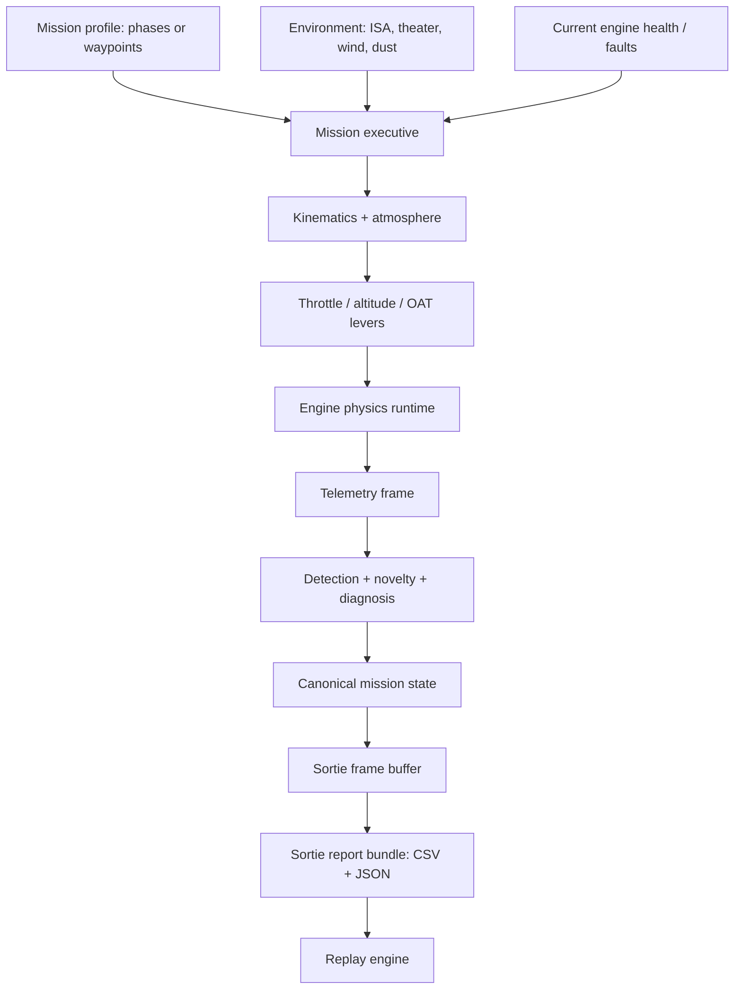

# Mission Planning

A digital twin that only reports the instantaneous state of an engine answers half of PS-26054. The other half is mission reliability: whether the engine's current health, combined with the profile the operator intends to fly and the environment it will fly through, supports completing that specific sortie. Answering that question requires a component that actually flies the mission, phase by phase, driving the physics engine with realistic kinematics and atmosphere rather than a fixed set of test conditions. That component is the mission executive.

The mission executive is a single authoritative state machine. It owns UAV kinematics, ISA atmospheric modeling, the mission phase sequence, and the levers that drive the selected engine's physics runtime, and it is the one place in ANUMAAN where "what is the aircraft doing right now" is decided. Every other subsystem, including reliability estimation, telemetry recording, and the 3D visualization layer, reads from this state rather than computing its own version of it.

## The problem

A mission profile is not a single operating point. An eighteen-hour endurance sortie moves through taxi, takeoff, climb, cruise, loiter, and descent, each phase demanding a different throttle setting, altitude, and airspeed, each exposing the engine to a different combination of thermal and mechanical stress. Evaluating engine health against a single steady-state condition cannot answer whether the aircraft will complete the sortie as planned, because the risk is not uniform across the profile. A sustained high-power climb stresses the engine differently than a loiter segment, and a mission commander needs an answer conditioned on the specific profile they intend to fly, not a generic health snapshot.

## Why it matters

MALE UAVs fly long ISR, relay, and maritime surveillance missions where a propulsion failure in flight can mean mission abort, asset loss, or an unsafe recovery. The problem statement's phrase is mission reliability enhancement, not just fault detection: an operator needs to know, before and during a sortie, whether the plan is achievable given the aircraft's current state. That requires a mission model detailed enough to expose phase-by-phase stress, connected directly to the same physics and detection pipeline that produces the health picture in the first place.

## Our approach

The mission executive advances one authoritative simulation tick at a time, at a 20 Hz rate, and on every tick it computes the aircraft's kinematics and atmosphere, determines the current mission phase, and commands the selected engine's physics runtime through the same lever interface an operator would use manually. The mission phase model is the primary planning unit: a sequence of named operating-condition phases (taxi out, takeoff, climb, cruise or transit, loiter or reconnaissance, dash, descent, approach and landing, taxi in, shutdown), each with a duration, altitude range, throttle setting, and outside air temperature, rather than a route defined purely by geographic waypoints. A geodetic waypoint-following autopilot mode also exists for missions authored as a route rather than a phase sequence, and the executive dispatches to whichever mode the loaded mission definition supplies.

## How it works

Each simulation tick, the executive advances the flight model (phase-based or waypoint-based) to get position, altitude, attitude, commanded throttle, and outside air temperature for that instant. It samples the ISA atmospheric model at the current altitude and QNH to get barometric pressure and density altitude, so that engine performance responds to genuine atmospheric physics rather than a fixed sea-level assumption. It then writes throttle, altitude, and ambient temperature as levers into the selected engine's runtime, which advances the physics core exactly as it would for a manually operated engine. The resulting telemetry frame, together with the tier-0 residual detector, the novelty layer, and the diagnostic output, is folded back into the canonical mission state.

**Kinematics.** The flight model tracks geodetic position (WGS84 latitude and longitude), a local East-North-Up projected coordinate frame for cases like the canyon terrain scenario where a metric local frame is more useful than raw geodetic coordinates, altitude, ground speed, true and indicated airspeed, heading, pitch, and bank angle. Waypoint-mode missions carry a real WGS84 projector so recorded telemetry includes genuine latitude and longitude; phase-based missions, which have no geographic route by construction, leave those fields unset rather than reporting a fabricated position.

**Atmosphere.** The ISA atmospheric model computes temperature lapse, barometric pressure, and density altitude from the current altitude, QNH, and outside air temperature offset, so a hot-desert sortie and a high-cold-mountain sortie produce genuinely different engine performance at the same throttle setting, exactly as they would on a real airframe.

**Fault injection.** A mission definition can carry scheduled fault events, either tied to elapsed time in the overall mission or, in phase mode, tied to elapsed time within a specific named phase so that a fault fires at the right point in the profile regardless of how the phases around it are resized or reordered. The operator can also inject a live fault at any point during simulation, and both paths route through the same engine runtime fault interface.

**Levers.** Throttle, altitude, and outside air temperature are the three commanded quantities that flow from the mission executive into the engine's physics runtime every tick. This is the same interface the operator console uses for manual engine control, so the mission executive does not bypass the physics core or apply a simplified surrogate: a scripted mission and a manually flown one drive the identical engine model.

## Operator workflow

The mission operations interface covers three stages:
1. In the planning stage, the operator selects or authors a mission profile against an engine and environment, setting durations, throttle settings, and altitudes per phase.
2. In the live simulation stage, the mission runs at up to 20x time scale, with the operator able to pause, resume, derate propulsion, divert, abort to a landing state, or inject faults, while watching phase-by-phase telemetry, reliability, and diagnostic output update in real time.
3. In the debrief stage, a completed sortie is available for full replay and stress cycle accounting.

*Figure 1: Mission operations cockpit: platform selection, 10-phase sequence timeline, and environment configuration.*

*Figure 2: Configured mission profile displaying duration, throttle, altitude profile, and scheduled fault triggers.*

*Figure 3: In-flight simulation tracking active phase kinematics and real-time residual response to injected failure modes.*

## Sortie recording and replay

Every tick that produces engine telemetry is appended as a synchronized row into the mission's frame buffer: RPM, propeller RPM, throttle, position, attitude, per-cylinder CHT and EGT, oil pressure, fuel flow, altitude, outside air temperature, true airspeed, flight phase, and a continuous reliability-derived health index. Fields the physics plant does not model for a given mission mode, such as geodetic position for a phase-based mission with no route, are recorded as unset rather than filled with a fabricated constant, so a debrief reader can distinguish "not measured in this mode" from "measured and nominal." When a mission completes, aborts, or is manually ended, the full frame buffer, the fault timeline, and mission metadata are exported as a persistent sortie report bundle with CSV telemetry logs and a JSON manifest, retrievable afterward through a replay engine that supports scrubbing to any point in the sortie and seeking directly to event markers such as fault onset.

*Figure 4: Post-mission sortie debrief displaying cumulative stress cycles, thermal excursions, and limiting component analysis.*

*Figure 5: Replay engine interface with event marker scrubbing across the completed sortie history.*

## Architecture

*Mission profile, environment, and engine health drive one authoritative simulation loop that produces phase-by-phase state and a recorded sortie.*

## Example

The default endurance preset flies a Rotax 912 iS through a six-phase profile (takeoff, climb, cruise, loiter, descent, landing) in a high-cold Ladakh theater, with a cooling-degradation fault scheduled to trigger sixty seconds into the cruise phase at severity 0.85, ramping in over forty seconds. Because the fault trigger is scoped to elapsed time within the cruise phase rather than to global mission time, the fault still fires at the correct point in the profile even if the phases ahead of it are resized. As the fault ramps in, the mission executive's periodic reliability sampling picks up the resulting component damage and the prescriptive advisory escalates accordingly.

## Integration

The mission executive is the single point where mission profile, environment, and engine health come together to drive the physics runtime, and its output state feeds mission reliability (which samples the executive's live phase and fault state to build a mission profile that reflects what the sortie will actually fly from the current point forward, not a generic canned profile), the 3D visualization layer (which renders the same runtime state rather than an independently computed position), and the sortie exporter.

## Validation

The mission executive and its supporting kinematics and phase-engine modules are covered by the project's pytest suite alongside the physics and detection modules. The Ladakh canyon preset's waypoints are authored directly against the actual terrain mesh's real gorge and ridge geometry, so the flown route genuinely traverses the terrain it is depicted against rather than being placed independently of it.

## Related systems

- [Mission Reliability](17-mission-reliability.md)
- [Dataset Strategy](15-dataset-strategy.md)
- [The 3D Digital Twin](18-3d-digital-twin.md)
- [Blender and the Simulation Environment](19-blender-and-simulation-environment.md)
