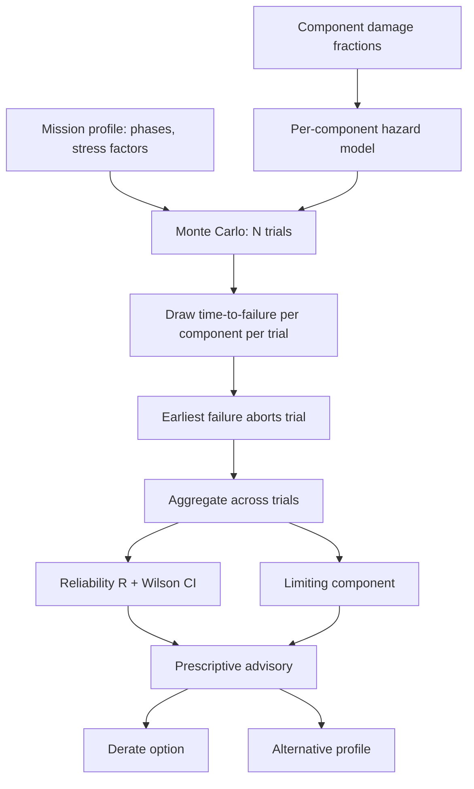

# Mission Reliability

PS-26054's title names three outcomes: health monitoring, fault prediction, and mission reliability enhancement. The first two are answered by the detection and prognostics layers. The third is easy to answer badly: reduce engine condition to a single dimensionless health index, threshold it, and show a coloured badge. That approach is common across implementations of this problem, and it does not actually answer the question a mission commander is asking, which is whether this specific sortie, flown by this specific aircraft in its current condition, will complete without a propulsion-induced abort.

ANUMAAN treats mission reliability as a defined, computable quantity rather than a badge:

```
R = P(the planned sortie completes without a propulsion-induced abort |
      current component health, planned profile, forecast environment)
```

This is computed by Monte Carlo simulation over per-component hazard models, phase by phase through the mission profile, and reported with a confidence interval and a limiting component: the specific part actually driving mission risk, which is the quantity a mission commander can act on.

## The problem

A health index is dimensionless, and any threshold placed on it is arbitrary. A hazard rate, by contrast, has units of failures per hour, and units matter here because they let risk compose correctly with exposure time. An eighteen-hour ISR sortie is genuinely riskier than a two-hour transit at identical engine health, because the engine is exposed to failure risk for nine times as long. A sustained high-power climb carries more risk per minute than a loiter segment, because hazard rate depends on the stress the component is under, not only on its condition. A threshold on a health index cannot express either fact: it treats a healthy engine on an eighteen-hour sortie the same as a healthy engine on a two-hour transit, and it treats a climb the same as a loiter, because a health index carries no notion of accumulating exposure or phase-varying stress.

## Why it matters

The distinction is not cosmetic. A go/no-go badge tells an operator whether the engine looks fine right now. A computed reliability number, conditioned on the actual planned profile and environment, tells the operator whether the specific mission ahead is likely to be completed, and which component is the reason it might not be. That is the difference between a system that reports engine status and one that supports an actual launch decision, and it is what allows the prescriptive layer to reason about trade-offs (derate power, shorten the loiter, fly a lower altitude) rather than only issue a warning.

## Our approach

Every component on the powerplant (cylinder heads, turbocharger, injectors, fuel pump, oil pump, main bearings, reduction gearbox, alternator, ECU lanes, air filter) carries its own hazard model: a base hazard rate for a healthy component, a damage fraction between zero (new) and one (life consumed), and a damage exponent controlling how sharply hazard rises as that damage fraction approaches one. This is a wear-out model, not a constant-failure-rate model for every part: a component with a high damage exponent stays close to its base hazard rate until damage is substantial, then rises very sharply, which matches how real wear-out failure mechanisms behave, an electrical connector's largely random failure mode sits at a low exponent, a bearing's progressive wear-out sits at a high one.

A mission profile is a sequence of phases, each with its own duration, altitude, power fraction, outside air temperature, and dust density. Each phase carries a stress factor computed from those conditions: power dominates, entering the formula to a power greater than one because hazard is strongly superlinear in load, with altitude and heat contributing through reduced cooling margin and sustained turbocharger pressure ratio. The hazard for a given component in a given phase is its base hazard rate, scaled by a wear multiplier from its current damage fraction, scaled again by that phase's stress factor.

## How it works

The reliability engine offers two computation paths built on the same hazard model. The analytic path computes reliability in closed form, the product across components of the exponential of negative integrated hazard over the mission's phases, exact under the model's own assumption that component failures are independent. The Monte Carlo path exists because it is where dependence between components and phase-conditional abort behavior can be added later without changing the interface, and it is the path used for reporting: for each of many trials, each component's time to failure is drawn from its phase-varying hazard by inverse transform, the earliest failure across all components aborts that trial, and the phase in which it happened is recorded. That is what turns "this is a risky sortie" into "this is risky specifically during the twelve-hour loiter segment."

Reliability is the fraction of trials that complete without a critical-component failure. Because reporting a bare point estimate risks being read as more certain than the sample size supports, the engine also reports a confidence interval using the Wilson score method rather than a normal approximation, which matters specifically because reliability values close to one are common for a healthy engine, and a normal approximation collapses to a zero-width interval when every trial in the sample succeeds, falsely reporting certainty the sample does not actually contain. The limiting component is the one responsible for the largest share of first failures across all failed trials, ranked directly from the simulation rather than guessed at.

Live mission execution feeds this engine directly. As faults are injected during a sortie, whether scheduled or operator-commanded, their severity and elapsed-since-onset ramp are translated into real damage fractions on the matching component category through a keyword-to-component mapping that is matched against the actual component roster of the engine currently flying, so the same logic works across all five engine platforms without hardcoding component names for one engine family. The mission executive samples reliability periodically during flight, building a mission profile from the sortie's actual remaining phases (the current phase truncated to what remains of it, plus every phase still ahead) rather than falling back to a generic canned profile, so the reported number reflects what this specific sortie will actually fly from this point forward.

## Prescriptive advisory escalation

Predictive maintenance tells an operator what will fail. Prescriptive maintenance tells them what to do about it now, on this sortie, and ANUMAAN's advisory layer escalates through three outputs in ascending order of actionability:

1. **Reliability report.** The current sortie's computed reliability with its confidence interval and its limiting component, for example a reliability of 0.87 with the cylinder 2 injector identified as the limiting part.
2. **Derate recommendation.** A candidate reduced power setting, reporting the resulting change in damage rate, the new reliability figure, and the endurance penalty in minutes, so the operator sees the actual trade-off rather than just an instruction. A derate to full power reports as reassurance, not as a contradictory instruction, when the mission already meets its target without reducing power.
3. **Alternative achievable profile.** When no derate at the planned altitude and duration meets the required reliability, the system searches the profile space, reducing power, reducing altitude, shortening the loiter, for the closest achievable plan that meets the reliability requirement, reporting the specific achievable duration, altitude, and resulting reliability.


*Figure 1: Prescriptive advisory panel issuing throttle derate recommendation with mission reliability impact projection.*

The overall verdict (GO, MARGINAL, or NO-GO) is driven by the lower confidence bound, not the point estimate, deliberately: committing an airframe on a number whose uncertainty interval straddles the reliability requirement is exactly the decision this system exists to prevent. Every output of this layer is advisory. Nothing in the prescriptive system commands the aircraft directly, which keeps it at a materially lower design assurance level than a system that closes a control loop, and that distinction is what separates a system that could plausibly be fielded from one that could not.

## Architecture



*Per-component hazard models, combined with the live mission profile, feed a Monte Carlo simulation that produces reliability, its confidence interval, and the limiting component driving mission risk.*

## Mathematics

The hazard for component `c` at damage fraction `d` and stress factor `s` is:

```
hazard(c) = base_hazard_per_hour(c) * (1 / (1 - d) ** damage_exponent(c)) * s
```

Survival probability for a component over a phase of duration `h` hours is `exp(-hazard(c) * h)`. The closed-form analytic reliability across the full mission is the product over mission-critical components of the exponential of negative integrated hazard across all phases:

```
R = prod_c exp( -sum_phases hazard(c, phase) * duration_hours(phase) )
```

Expected remaining useful life of a component under its current damage and stress is the mean of an exponential distribution with that hazard rate, `1 / hazard(c)`, the standard reliability-engineering definition, derived from the same hazard model used for the mission reliability computation rather than a separately fitted estimator. A phase's stress factor is:

```
stress = power_fraction ** 2.2
         * (1 + 0.35 * max(0, (altitude_ft - 16000) / 10000))
         * (1 + 0.30 * max(0, (oat_c + 10) / 45))
         * (1 + 0.25 * min(2.0, dust_mg_m3 / 6.0))
```

with power entering superlinearly because hazard is strongly superlinear in load, and altitude, heat, and dust contributing through reduced cooling margin, sustained turbocharger pressure ratio, and particulate ingestion respectively.

## Example

A cooling-degradation fault injected during the cruise phase of a Ladakh endurance sortie ramps up over forty seconds. As the ramp progresses, the fault's severity is translated into a rising damage fraction on the matching cylinder-head components. Because the wear multiplier is centred so that a fault severity in the realistic 0.7 to 0.9 range for injected faults lands on the steep part of the wear-out curve, this damage change is visible in the reported reliability and limiting-component output within the executive's next periodic reliability sample, even over a comparatively short remaining-mission window, rather than only becoming apparent once the fault has caused an outright failure.

## Integration

The reliability engine consumes the mission executive's live phase and fault state to build its mission profile, and consumes the same component damage bookkeeping that live fault injection writes into during a sortie. Its output, the reliability figure, confidence interval, and limiting component, is written back into the canonical mission state every sampling interval and drives the prescriptive advisory text shown to the operator, including the recommendation returned when the operator commands a manual derate.

## Validation

The base hazard rates in the default component set are explicitly documented in the module's own source as order-of-magnitude starting values, chosen so that a healthy engine completes a representative eighteen-hour sortie with high probability, and are labelled as the weakest part of the model until replaced by fleet MTBUR data or FMECA criticality analysis. What the model does establish reliably under its own stated assumptions is the ranking of limiting components and the relative effect of a derate, which is the actionable output the prescriptive layer depends on; the absolute probability figure is honestly scoped as dependent on future fleet reliability data. The reliability and prescriptive modules are exercised by the project's pytest suite alongside the mission executive.

## Related systems

- [Mission Planning](16-mission-planning.md)
- [Dataset Strategy](15-dataset-strategy.md)
- [The 3D Digital Twin](18-3d-digital-twin.md)
