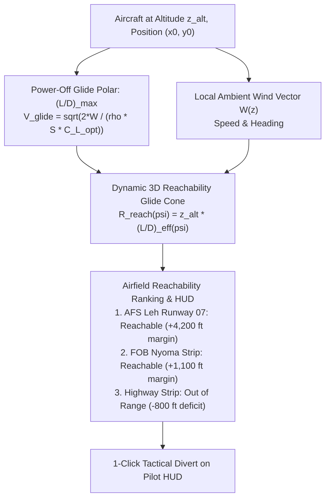
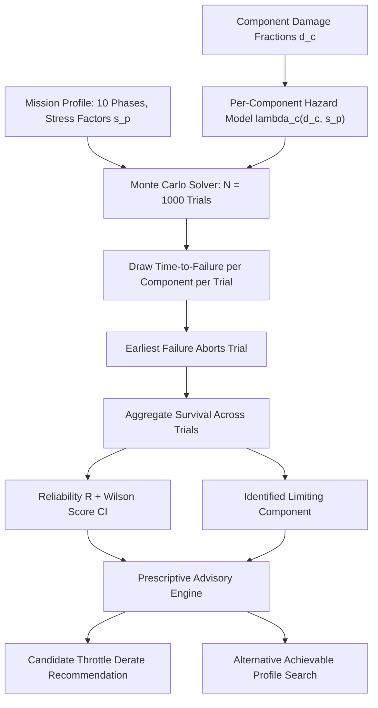

# Mission Reliability Enhancement

PS-26054's title names three specific outcomes: health monitoring, fault prediction, and **mission reliability enhancement**. The first two are answered by the detection and prognostics layers. The third is where ANUMAAN closes the operational loop: translating internal thermodynamic degradation into **tactical flight envelope derating**, **Remaining Mission Endurance ($RME$)**, and an **aerodynamic glide polar reachability cone ($L/D_{\max}$)** with emergency divert airfield ranking.

ANUMAAN treats mission reliability as a mathematically defined, computable probability rather than an arbitrary green/yellow badge:

$$R = \mathbb{P}\Big(\text{Planned Mission Completes Without a Propulsion-Induced Abort} \mid \text{Health, Profile, Environment}\Big)$$

---

## Tactical Flight Envelope Derating Mechanics

When mechanical wear or an amber fault is confirmed, ANUMAAN dynamically recalculates the safe operational boundaries of the aircraft:

| Engine Health State | Aerodynamic & Tactical Derating Impact | Operational Action / Limit |
| :--- | :--- | :--- |
| **Pristine Condition** ($HI_{\text{eng}} > 0.85$) | Full flight envelope available: $30,000\text{ ft}$ ceiling, $115\%$ boost climb rating. | Unrestricted ISR Mission |
| **Turbo Wastegate Stuck Open** ($\Delta MAP \approx -18\text{ kPa}, HI_{\text{turbo}} = 0.54$) | Altitude ceiling derated to $17,200\text{ ft}$ AMSL; max continuous power capped at $82\%$. | High-Altitude Dash Prohibited; Loiter at Medium Altitude |
| **Elevated Oil Sump Temperature** ($T_{\text{oil}} = 128^\circ\text{C}, HI_{\text{lub}} = 0.42$) | Cruise throttle capped at $75\%$ MCP; high-speed dash ($> 110\text{ kts}$) inhibited to prevent bearing wipe. | Abort to Orbit; Return to Base (RTB) Advisory |
| **Cylinder Compression Loss** ($HI_{\text{comb}} = 0.28$, Severe Blowby) | Rate of climb limited to $V_y \le 350\text{ ft/min}$; thermal runaway predicted in 18 minutes. | **Critical:** Immediate Divert to Nearest Airfield |

---

## Remaining Mission Endurance ($RME$)

Rather than estimating raw flight hours detached from fuel burn, the system evaluates Remaining Mission Endurance as a constrained optimization problem balancing fuel consumption against thermal damage accumulation:

$$RME(t) = \min \left( \frac{M_{\text{fuel,rem}}(t)}{\dot{m}_{f,\text{cruise}}(t)}, \; \inf\{ \tau > 0 : HI_{\text{critical}}(t + \tau) \le HI_{\text{abort}} \} \right)$$

If an engine suffers an oil leak or rapid ring wear, $RME$ transitions from being fuel-limited to being component-health-limited, alerting the tactical pilot with the exact time remaining before structural failure occurs.

---

## Aerodynamic Coupling: Glide Polar Reachability Cone Engine

If propulsion health degrades to critical levels ($HI_{\text{eng}} < 0.20$ or impending loss of power), the system instantly transitions from passive monitoring to active **Aircraft Reachability Decision Support**:

### 1. Unpowered Aerodynamic Glide Equations
For a fixed-wing MALE UAV (e.g., Tapas-BH-201 with wing area $S$, aspect ratio $AR$, and zero-lift drag coefficient $C_{D0}$):

$$C_L = \frac{2 \cdot W_{\text{uav}}}{\rho_0(z) \cdot v_{\text{tas}}^2 \cdot S}, \quad C_D = C_{D0} + \frac{C_L^2}{\pi \cdot AR \cdot e}$$

The maximum lift-to-drag glide ratio is:
$$\left(\frac{L}{D}\right)_{\max} = \frac{1}{2 \cdot \sqrt{C_{D0} \cdot \frac{1}{\pi \cdot AR \cdot e}}}$$

Under an ambient wind vector $\mathbf{W} = [W_x, W_y]^T$, the maximum glide ground range along bearing $\psi$ is:
$$R_{\text{glide}}(\psi) = z_{\text{alt}} \cdot \left(\frac{L}{D}\right)_{\max} \cdot \left( 1 + \frac{W_x \cos\psi + W_y \sin\psi}{V_{\text{best-glide}}} \right)$$

### 2. Emergency Airfield Reachability Ranking
The engine evaluates all designated airbases, forward operating strips, and emergency landing zones within $150\text{ km}$:

$$\Delta z_{\text{margin}, i} = z_{\text{alt}} - \frac{d_i}{\left(\frac{L}{D}\right)_{\text{eff}}(\psi_i)} - z_{\text{runway}, i}$$

Airfields with positive arrival altitude margin ($\Delta z_{\text{margin}, i} > 500\text{ m}$ / $1,640\text{ ft}$) are highlighted in green on the pilot's tactical HUD, offering an instantaneous 1-click divert routing vector.

---

## Monte Carlo Mission Reliability Solver

To evaluate whether the planned flight profile can be completed safely, ANUMAAN executes a 10-phase Monte Carlo hazard integration over $N = 1,000$ iterations:

$$\lambda_c(d_c, s_p) = \lambda_{0, c} \cdot \left(\frac{1}{1 - d_c}\right)^{\gamma_c} \cdot s_p$$

The operational stress factor $s_p$ synthesizes throttle demand, density altitude, ambient temperature, and particulate ingestion:

$$s_p = \left(P_{\text{frac}}\right)^{2.2} \times \left(1 + 0.35 \max\left(0, \frac{h_{\text{ft}} - 16000}{10000}\right)\right) \times \left(1 + 0.30 \max\left(0, \frac{T_{\text{OAT}} + 10}{45}\right)\right) \times \left(1 + 0.25 \min\left(2.0, \frac{\rho_{\text{dust}}}{6.0}\right)\right)$$

Confidence bounds are calculated using the Wilson score interval:
$$w = \frac{\hat{p} + \frac{z^2}{2N} \pm z \sqrt{\frac{\hat{p}(1-\hat{p})}{N} + \frac{z^2}{4N^2}}}{1 + \frac{z^2}{N}}, \quad \hat{p} = \frac{K}{N}$$

---

## Prescriptive Advisory Escalation

When reliability degrades mid-mission, ANUMAAN escalates through three actionable levels:
1. **Reliability Report:** Identifies the limiting component and states mission survival probability (e.g., $R = 0.82 \pm 0.04$, limiting part: Cylinder #2 cooling jacket).
2. **Throttle Derate Recommendation:** Calculates a candidate reduced power setting, reporting the resulting change in hazard accumulation rate, the restored reliability figure ($R = 0.94$), and the endurance penalty in minutes.
3. **Alternative Achievable Mission Profile:** If no throttle derate at the current altitude can meet the safety threshold, the system searches profile space (reducing altitude, shortening loiter duration) to return the closest achievable flight plan that satisfies $R \ge 0.90$.

*Figure 1: Prescriptive advisory panel issuing throttle derate recommendation with calculated mission reliability recovery.*

---

## Related Systems

- [Mission Planning](16-mission-planning.md)
- [Degradation Modeling and Wear Kinetics](13-degradation-modeling.md)
- [Operator Ground Control Station](20-operator-gcs.md)
- [Validation and Experiments](21-validation-and-experiments.md)
