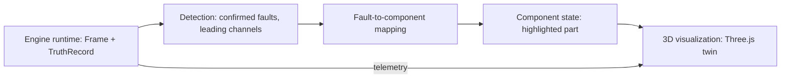

# The 3D Digital Twin

A fault report is a set of numbers: a channel name, a threshold ratio, a confidence figure. An operator inspecting a real engine does not think in channel names, they think in parts: this cylinder, this injector, this bearing. The 3D digital twin closes that gap by rendering the engine currently selected in the ground control station as an inspectable model, with the specific component associated with an active fault visually distinguished from the rest of the assembly, synchronized live to the same telemetry the operator console displays as numbers.

Three visualization tracks exist in ANUMAAN: a browser-based Three.js engine twin used inside the ground control station itself, a Blender-based master twin used for high-fidelity desktop visualization, and a terrain-based flight simulation environment. All three consume one authoritative runtime state rather than each computing its own physics independently. The engine physics, the fault state, and the telemetry are produced once, by the backend runtime, and every visualization track renders that same state rather than re-deriving it.

## The problem

Rendering an engine model is not the hard part. The hard part is making that render mean something: a viewer needs to be able to look at the model and know, without cross-referencing a table, which physical part an active fault actually concerns, and needs that view to update the moment the underlying telemetry changes, not on a manual refresh. A model that looks correct but has no live connection to the detection pipeline is a static render, not a digital twin.

## Why it matters

The problem statement calls specifically for a visualization dashboard showing real-time health status and fault alerts. A 3D twin is the form of that visualization best suited to an engineering audience: it lets an evaluator see the actual mechanical relationship between a fault (an EGT delta on cylinder 2, an accelerometer third-harmonic rise on the gearbox) and the physical location on the engine that fault concerns, which a numeric table alone does not convey as directly.

## Our approach

Every visualization track binds named mesh components to the same fault-target and telemetry schema the backend detection pipeline already uses. The eight PS-26054 fault modes each carry a designated 3D target part (for example, cylinder #2 head for the cylinder overheat fault, the propeller reduction gearbox for the gearbox vibration fault, the dual-lane ECU module for the FADEC drift fault), and that mapping is what lets an active fault drive a specific mesh element rather than a generic engine-wide indicator. Because all three visualization tracks read this same mapping and the same live runtime state, an engineer sees consistent behavior whether they are looking at the browser twin during a live session or the Blender master twin during a desktop review.

## How it works

**The Three.js twin.** Running in the browser as part of the ground control station, the Three.js twin renders Draco-compressed GLB models for each of the five supported engine platforms (Rotax 912 iS, Rotax 914, Rotax 915 iS, Austro AE300, VRDE Jayem 2.2L). Draco compression keeps these models small enough to load quickly over a browser connection while preserving the mesh detail needed for component-level identification. The twin subscribes to the same WebSocket path the operator telemetry console uses, so its rendered state updates on the same cadence as the numeric readouts rather than through a separate polling or refresh mechanism. When a fault is active, the target component identified in the fault matrix is highlighted directly on the model, and the camera transitions to it with eased motion rather than a hard cut, so an operator's attention is drawn to the part in question without losing spatial context of the surrounding assembly.

### The Five-Engine Propulsion Fleet

The ANUMAAN digital twin supports five distinct aero piston propulsion platforms, each with dedicated physics kinematics, sensor mappings, and Draco-compressed 3D mesh representations:

#### 1. Rotax 912 iS Sport (Baseline Naturally Aspirated)
Four-cylinder, horizontally opposed four-stroke with redundant electronic fuel injection and dual ignition (FADEC). 1,352 cc displacement, 100 hp at 5,800 RPM. Designated primary evaluation engine for DRDO PS-26054.

*Figure: Rotax 912 iS Draco GLB twin rendered in the Three.js viewport with component hierarchy targeting.*

#### 2. Rotax 914 F Turbo (Turbocharged High-Altitude Patrol)
Four-cylinder boxer with turbocharger and automatic wastegate control unit (TCU). 1,211 cc displacement, 115 hp max continuous at 5,800 RPM. Designed for sustained MALE UAV operations up to 25,000 ft service ceiling.

*Figure: Rotax 914 Turbo twin with turbocharger subassembly and wastegate actuator rigging.*

#### 3. Rotax 915 iS (Turbocharged Intercooled High-Altitude Sprint)
Four-cylinder boxer combining forced induction, air-to-air intercooling, and redundant dual digital injection. 1,352 cc displacement, 141 hp takeoff rating. Provides full power up to 15,000 ft critical altitude.

*Figure: Rotax 915 iS 3D model displaying dual intercooler and pressurized intake ducting.*

#### 4. Austro Engine AE300 (Heavy-Fuel Turbo Diesel)
Four-cylinder in-line liquid-cooled common rail diesel engine running on Jet-A1 or kerosene (F-34). 1,991 cc displacement, 168 hp at 3,880 RPM with reduction gearbox. High thermal efficiency and maritime logistics compatibility.

*Figure: Austro Engine AE300 common-rail heavy-fuel diesel twin with high-pressure fuel rail targeting.*

#### 5. VRDE Jayem 2.2L (Indigenized Two-Stroke Heavy Fuel)
Indian indigenous defense UAV engine platform designed by VRDE (DRDO) and Jayem Automotives. Multi-fuel heavy oil operation, 180 hp rating, lightweight crankcase optimized for long-endurance tactical UAV platforms.

*Figure: VRDE Jayem 2.2L indigenized UAV engine 3D twin rendered from the authoritative engineering CAD model.*

**Runtime state to component state to visualization.** The flow is deliberately one-directional and single-sourced. The backend engine runtime produces one authoritative Frame of telemetry and one TruthRecord of active faults each tick. That frame feeds the detection pipeline, which determines confirmed anomalies and their leading channels. The fault-to-component mapping translates an active, confirmed fault into a specific named mesh element and a highlight state. The Three.js twin then renders that component state, nothing upstream of it is computed independently inside the visualization layer itself.

**The Blender master twin and canyon flight simulation** are covered in depth in the companion article on the simulation environment; both read from the same underlying runtime state as the browser twin rather than maintaining separate physics.

## Architecture

*Runtime state produces detected faults, which map to a specific component, which drives what the 3D visualization highlights, keeping one authoritative state behind every rendered view.*

## Example

If the ignition misfire fault mode is active on cylinder 3, its primary sensor trigger is RPM jitter and an EGT drop, and its designated 3D target part is the ignition harness and spark leads. Once the detection layer confirms this fault from the telemetry, the Three.js twin highlights the ignition harness component on the rendered engine model and eases its camera toward that region, while the operator console simultaneously shows the RPM jitter and EGT drop on the numeric telemetry panel, both views driven from the same confirmed detection event.

## Integration

The 3D twin reads its telemetry and fault state over the same WebSocket path (`/ws/engines/{id}` for the multi-engine runtime, or the Rotax-specific telemetry stream for the ground control workspace scoped to that engine) that the rest of the operator console uses. It consumes the fault matrix defined for the eight PS-26054 fault modes to resolve which mesh component an active fault should highlight, and it shares its underlying GLB assets and component naming convention with the Blender-authored scenes described in the simulation environment article, so a component identified in the browser twin corresponds to the same named part in the higher-fidelity desktop model.

## Validation

The Three.js twin is exercised as part of the ground control station's operator workflows, including automated browser-based verification of the mission simulation flow. The honest scope boundary here is straightforward: what is demonstrated is a visually and functionally consistent twin driven by simulated telemetry and physics, validated through the same simulation and testing regime as the rest of the system; connecting this visualization layer to instrumentation on a real airframe is the natural next deployment step rather than something already exercised against flight hardware.

## Related systems

- [Blender and the Simulation Environment](19-blender-and-simulation-environment.md)
- [Mission Planning](16-mission-planning.md)
- [Mission Reliability](17-mission-reliability.md)
- [Dataset Strategy](15-dataset-strategy.md)
