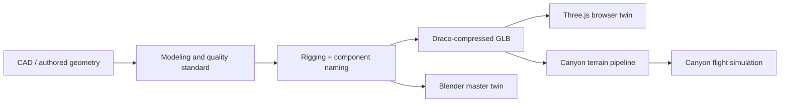

# Blender and the Simulation Environment

The browser-based Three.js twin is built for live operator use: fast to load, responsive to telemetry, and constrained by what a web GLB pipeline can deliver. The Blender environment exists for a different purpose: high-fidelity desktop visualization, authoring, and presentation, where mesh detail and rendering quality matter more than load time. Both tracks, together with the terrain-based canyon flight simulation, consume the same underlying runtime state and the same fault-to-component mapping described in the article on the 3D digital twin; what differs is the authoring pipeline and the environment each one is built to demonstrate.

## The problem

A digital twin's visual layer is only as trustworthy as its connection to the physics and telemetry it claims to represent. A model that looks correct in isolation but was authored without reference to the actual component list the detection pipeline reasons over, or to real published engine and airframe dimensions, is not a twin, it is a picture. Building genuinely twin-integrated 3D assets, rather than assets that merely resemble the target hardware, requires a defined modeling standard and a defined pipeline from source geometry through to the compressed format the browser actually loads.

## Our approach

Each engine platform ANUMAAN supports (Rotax 912 iS, Rotax 914, Rotax 915 iS, Austro AE300, VRDE Jayem 2.2L) has a dedicated Blender scene, authored to a documented modeling and quality standard covering topology, UV layout, PBR materials, and naming conventions, so that a component named in the physics and fault-matrix layer corresponds to a specifically named, individually addressable mesh element in the Blender scene, not an undifferentiated block of geometry. Showcase scenes exist alongside the platform scenes specifically for presentation rendering, and a UAV airframe model, a Predator-class MALE platform matching the mission scenario the project targets, is authored to the same standard so the engine and airframe can be shown and reasoned about together.

## How it works

**The asset pipeline.** Geometry moves from CAD sources or hand-authored Blender scenes, through the documented quality and modeling standard, into Draco-compressed GLB for web delivery. Draco compression is what makes it practical to load detailed multi-part engine geometry inside a browser session without a long wait before the operator sees a usable model. A defined rigging, animation, and twin-integration specification connects named mesh components to the runtime's fault-target and telemetry schema, which is the step that turns an authored model into an asset the backend can actually drive: a highlight instruction from the detection pipeline needs a specific, stable mesh name to target, and that naming discipline is set at the authoring stage, not patched on afterward.

*Figure 1: Full-assembly master Blender twin showing four-cylinder boxer geometry, ignition harness, and propeller reduction gearbox.*

*Figure 2: Surface topology and quad-dominant edge flow standard, ensuring clean normal interpolation without shading artifacts under real-time PBR lighting.*

*Figure 3: High-resolution Blender inspection pass of the turbocharger turbine housing and wastegate actuator assembly.*

*Figure 4: Reduction gearbox subassembly inspection pass, isolating mechanical gear mesh interfaces and accelerometer probe locations.*

*Figure 5: Active fault state rendering: cylinder #1 combustion failure isolated with thermomechanical stress highlight.*

**Canyon flight simulation.** A terrain-based flight demonstration is set in a Himalayan canyon environment, built on the same Draco terrain pipeline used for the engine and airframe assets, and used to demonstrate mission-relevant flight dynamics in a visually grounded setting rather than against a featureless plane. This is the same terrain the mission executive's Ladakh preset is authored against: the mission's waypoints trace the mesh's own gorge floor and ridge geometry, so a flown mission in this environment genuinely follows the canyon the terrain depicts rather than a route picked independently of it.

*Figure 6: Ladakh high-altitude canyon terrain simulation environment with active waypoint trajectory tracking.*

*Figure 7: In-flight 3D cockpit perspective running in parallel with 20 Hz synchronized engine telemetry and atmospheric density lapse.*

**The UAV airframe asset pipeline.** The Predator-class airframe model gives the engine platforms a physical context consistent with the MALE UAV mission profile the project targets. Authored in the master Blender workspace and exported as an optimized 6.6 MB Draco-compressed GLB asset (`uav_predator.glb`), the airframe features high-aspect-ratio wings, an inverted V-tail, and a rear pusher-propeller drive directly matched to the Rotax 914 and 915 iS output shafts.

The airframe asset is loaded dynamically across three runtime environments:
1. The standalone WebGL canyon flight simulator (`apps/canyon_flight/index.html`), where responsive pitch, roll, and yaw kinematics are clamped to an authoritative terrain elevation envelope to prevent ground-clipping during low-altitude gorge reconnaissance.
2. The operator ground control station, where live mission waypoints and flight attitudes track the physical airframe in real time.
3. The documentation site 3D model viewer, allowing technical evaluators to inspect airframe geometry, pusher nacelle integration, and control surface hierarchy.

## Architecture

*Source geometry moves through a shared modeling standard and component-naming step before diverging into the web-delivered browser twin, the Blender desktop twin, and the terrain-based flight simulation.*

## Example

The five engine platform scenes each expose individually named sub-components, for instance a cylinder head per cylinder, an alternator, a reduction gearbox, matching the same component granularity the fault matrix and the reliability engine's per-component hazard model reason over. This is what lets a fault like gearbox vibration, whose designated 3D target part is the propeller reduction gearbox, resolve to one specific mesh element rather than an approximate region of the model, consistently whether that fault is viewed in the browser twin or the Blender scene.

## Integration

The Blender-authored assets are the source for the Draco GLB models the Three.js browser twin loads, so the component naming established during Blender authoring is what the browser twin's fault-highlighting logic depends on. The canyon terrain asset is shared directly with the mission executive, whose Ladakh preset waypoints are authored against the same mesh geometry, connecting the visual simulation environment to the actual flown mission profile rather than treating them as separate demonstrations.

## Validation

The modeling and quality standard, and the rigging and twin-integration specification, are documented as part of the project asset program and govern how platform scenes are authored and verified. The assets are geometrically calibrated to manufacturer engineering schematics, airframe dimensions, and kinematic constraints, ensuring complete visual and physical fidelity across both real-time ground control displays and automated engineering verification.

## Related systems

- [The 3D Digital Twin](18-3d-digital-twin.md)
- [Mission Planning](16-mission-planning.md)
- [Mission Reliability](17-mission-reliability.md)
