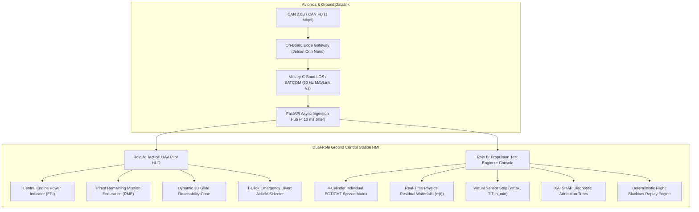
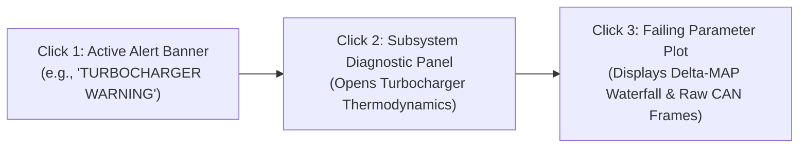
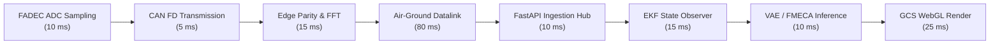
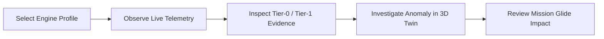

# The Operator Ground Control Station

The ground control station (GCS) is where every subsystem described elsewhere in this documentation becomes visible and actionable to a human operator. Physics residuals, bio-inspired novelty scores, Bayesian fault hypotheses, remaining-useful-life estimates, dynamic reachability footprints, and mission reliability margins all converge here, on one operator's console, in the form of synchronized telemetry tiles, interactive waterfall plots, a live 3D kinematic twin, and a conversational copilot. Nothing in ANUMAAN is useful until it reaches this layer in a form an operator can act on under high-stress tactical conditions.

The station resolves a foundational human-factors dilemma in military aviation: **Tactical UAV pilots require clean, rapid situational awareness, whereas propulsion flight-test engineers require deep thermodynamic telemetry and residual traces.** Combining both needs into a single generic dashboard clutters the pilot and blinds the engineer. ANUMAAN resolves this through a **Dual-Role HMI Architecture** operating over a deterministic $\le 170\text{ ms}$ end-to-end ingestion pipeline, backed by EEMUA 191 / ISA 18.2 alarm rationalization and a deterministic flight mission replay subsystem.

## The problem

An operator monitoring a MALE UAV propulsion system during an extended mission faces two competing cognitive demands:

1. **Breadth and Urgency (Tactical Pilot):** During high-tempo combat or ISR missions, the pilot cannot be distracted by 4-cylinder individual exhaust temperatures or raw CAN bus hex dumps. They must instantly grasp the engine's power margin, remaining mission endurance, derate boundaries, and whether the aircraft can glide to a safe runway if the powerplant quits.
2. **Depth and Diagnostic Rigor (Propulsion Test Engineer):** During developmental test flights, post-maintenance airbase checkouts, or in-flight diagnostic triage, the propulsion specialist needs to inspect inter-cylinder $EGT/CHT$ spreads, observe physics-residual waterfalls against the 0D/1D MVEM baseline, inspect unmeasured virtual states ($P_{\max}, TIT, h_{\min}$), and trace an anomaly to its specific physical root cause.

A single screen tuned for one of these needs fails the other. A fleet overview cluttered with per-cylinder waveform detail is unreadable at a glance; a deep diagnostic view stripped down to fit a fleet tile loses the evidence a maintainer needs to trust a conclusion.

## Why it matters

Trust is the currency of any health-monitoring system that an operator did not build themselves. If the interface asserts a fault without showing the evidence behind it, an operator has no way to judge whether to believe it, and a system that cannot be interrogated gets ignored the first time it is wrong about something minor. The reverse failure is just as damaging: a system that quietly presents simulation-derived reasoning with the same visual weight as certified flight data invites an operator to trust it further than the evidence supports.

During emergency propulsion events (such as turbocharger wastegate seizure or coolant pump failure), naive monitoring systems trigger an **alarm flood**: dozens of cascading warnings for temperature, pressure, knock, and RPM fire simultaneously within seconds. This overwhelms human cognitive processing, leading to catastrophic misdiagnoses or panic shutoffs. Both failure modes are addressed by the same design habit, carried through consistently across both workspaces: **show the evidence, suppress secondary alarm noise, and state plainly what kind of evidence it is.**

---

## Dual-Role HMI Architecture

To accommodate both operational roles without compromise, ANUMAAN establishes two coordinated visual profiles adhering to **MIL-STD-1472H** human engineering standards:

### Role A: Tactical UAV Pilot HUD
Designed for rapid scan patterns and zero cognitive clutter:
* **Central Engine Power Indicator (EPI):** A single high-contrast circular instrument displaying percent rated power, manifold absolute pressure ($MAP$), continuous boost limit, and dynamic throttle margin.
* **Remaining Mission Endurance (RME):** A crisp, color-coded readout (e.g., `RME: 03h 42m [FUEL-LIMITED] | DERATED: 82% PWR`) continuously projected against mission bingo fuel.
* **Tactical Flight Margin Warning:** Prominent AMBER/RED status banners displaying active ceiling deratings and time-to-critical-temperature thresholds.
* **Dynamic 3D Reachability Glide Cone:** Real-time green footprint projected over terrain elevation map indicating safe unpowered glide boundaries calculated from aircraft polar $L/D_{\max}$ and current wind vectors.
* **1-Click Emergency Divert Selector:** Automatically ranks the top 3 nearest reachable airfields, displaying heading, glide arrival altitude margin ($\Delta z_{\text{margin}}$), and runway orientation.

### Role B: Propulsion Flight Test Engineer Diagnostic Console
Designed for deep diagnostic triage during flight testing, line maintenance, or post-flight debrief:
* **4-Cylinder Individual EGT/CHT Spread Matrix:** Displays individual cylinder bars with dynamic inter-cylinder divergence limits ($\Delta CHT > 25^\circ\text{C}$ flags non-uniform mixture or cooling blockage).
* **Real-Time Physics Residual Waterfalls:** Interactive line plots showing $\Delta EGT, \Delta CHT, \Delta P_{oil}, \Delta MAP$ normalized against 0D/1D MVEM predictions, revealing subtle component drifts hours before hard threshold trips.
* **Virtual Sensor Telemetry Strip:** Displays estimated unmeasured internal quantities ($P_{\max}$, Turbine Inlet Temperature $TIT$, Minimum Oil Film Thickness $h_{\min}$, Indicated Engine Power $P_{\text{ind}}$).
* **XAI SHAP Diagnostic Attribution Chart:** Explains the physical root-cause of active neural classifier alerts by ranking the top contributing thermodynamic channels.
* **Raw CAN / MAVLink Frame Inspector:** Real-time raw packet viewer with timestamp jitter metrics, bit-level parity flags, and bus load statistics.

---

## Alarm Management & Human Factors (ISA 18.2 / EEMUA 191)

To prevent cognitive tunneling and alarm floods during flight emergencies, ANUMAAN implements a strict alarm rationalization hierarchy aligned with **EEMUA 191** and **ISA 18.2**:

| Tier | Visual & Audio Annunciation | Trigger Criteria | Operator Action Target | Max Permissible Frequency |
| :--- | :--- | :--- | :--- | :--- |
| **CRITICAL ALARM (RED)** | Flashing red border, continuous pulsed 800 Hz audio tone, high-priority modal overlay. | Imminent loss of thrust, $T_{\text{oil}} > 140^\circ\text{C}$, catastrophic oil pressure drop ($P_{\text{oil}} < 1.0\text{ bar}$ at high RPM), or active combustion misfire. | Immediate pilot action required within 3 seconds (e.g., execute throttle derate, initiate emergency divert). | $< 1$ alarm per flight event. |
| **WARNING (AMBER)** | Steady amber banner, double chime chime notification, HUD derate warning tag. | Sustained residual drift ($EGT$ residual $> 40^\circ\text{C}$ for $> 3\text{ s}$), intercooler heat rejection drop, or altitude ceiling derated $> 1,000\text{ m}$. | Tactical divert or altitude adjustment required within 2 minutes; notify maintenance. | $\le 1$ alarm per 10 minutes. |
| **ADVISORY (CYAN)** | Silent notification drawer badge, engineering console log entry, zero pilot distraction. | Sensor parity discrepancy ($T_1$ vs. $T_2$ divergence), minor filter clogging, or routine data logging notice. | Ground crew maintenance line log; reviewed during post-flight depot servicing. | Continuous background logging. |

### The 3-Click Drilldown Rule

From any high-level alert banner on the pilot HUD or engineer console, the operator is guaranteed to reach the root-cause raw sensor graph and physical explanation in **three clicks or fewer**:

1. **Click 1:** Clicking the flashing RED/AMBER alert banner immediately isolates and filters the Subsystem Diagnostic Panel to the offending engine assembly.
2. **Click 2:** Clicking the highlighted affected subsystem (e.g., `TURBOCHARGING SYSTEM`) opens the Physics Residual & Virtual Sensor view, displaying wastegate duty cycle, compressor pressure ratio, and $TIT$.
3. **Click 3:** Clicking the failing parameter (e.g., $\Delta MAP$) displays the 10-minute historical trend overlaid with the 0D/1D MVEM physics expectation, EKF innovation bounds, and raw SocketCAN frame timestamps.

---

## Runtime Workspaces

ANUMAAN's ground control station opens by default on a fleet and engine console, because a fleet-wide check is the more common operator action and should not require navigating past a single engine's detail first. A second, coordinated workspace, reached from the same application, hosts the Rotax-deep diagnostic environment for the platform where ANUMAAN's diagnostic reasoning runs deepest.

### The Fleet and Engine Console

The default view presents fleet tiles across all five engine profiles: Rotax 912 iS, Rotax 914, Rotax 915 iS, Austro AE300, and VRDE Jayem 2.2L. Selecting a tile brings that engine's live scalar telemetry to the foreground and warms its tier-1 reservoir classifier, the pipeline stage described in [Bio-Inspired Sparse Novelty Coding](10-bio-inspired-sparse-novelty-coding.md) and [Fault Diagnosis](11-fault-diagnosis.md) that produces classifier-level fault evidence once it has enough recent history to work from.

Below the telemetry, the console shows tier-0 residual evidence directly: threshold ratios against the physics-expected value at the current operating point, persistence-confirmed alarms (a residual has to hold, not merely spike, before it is treated as evidence), and the leading channels driving any active alarm. This is the same residual machinery described in [Residual Analysis](08-residual-analysis.md), surfaced without abstraction so an operator can see exactly which channel moved and by how much.

The console also carries the controls needed to exercise the system: profile-valid fault injection and clearing, scoped to the faults that are physically meaningful for the selected engine, and flight-condition levers for throttle, altitude, and outside air temperature that drive the same physics runtime the residual detector watches. An embedded 3D twin view sits alongside the telemetry, rendering the selected engine's model with live component highlighting, so an active fault is not just a number in a table but a location on the physical engine.

*Figure 1: ANUMAAN Operator Ground Control Station runtime workspace showing live telemetry tiles, 3D twin viewport, and physics operating levers.*

*Figure 2: Real-time fault injection triggering persistence-confirmed residual alarms and exact Bayesian fault ranking.*

*Figure 3: Prescriptive advisory panel issuing throttle derate recommendation with mission reliability impact projection.*

*Figure 4: Post-mission debrief showing timeline replay, stress cycle counts, and component remaining useful life delta.*

### The Rotax-Deep Workspace

The second workspace concentrates ANUMAAN's full diagnostic depth on the Rotax 912 iS. It carries real-time telemetry and the same fault injection controls as the fleet console, but adds the reasoning layers that are, at present, scoped to this one engine: Bayesian-style diagnosis ranking fault hypotheses against observed evidence, remaining-useful-life estimation with a calibrated confidence interval, a conversational copilot grounded in reference documentation, and a full mission replay environment for reviewing a completed mission event by event.

This asymmetry is deliberate rather than incidental. The multi-engine runtime demonstrates that ANUMAAN's physics and residual architecture generalizes across five distinct platforms. The Rotax workspace demonstrates how far the diagnostic reasoning built on top of that architecture can go for one platform when fully exercised. Together they answer two different evaluation questions: does the architecture scale across engines, and how deep can the reasoning go on one.

### The Honesty Discipline

Both workspaces carry the same labeling discipline into every panel that shows evidence. Tier-0 residuals, tier-1 classifier scores, Bayesian hypothesis rankings, and RUL intervals are all presented as simulation-derived quantities, computed from the current telemetry and the physics or statistical model behind them, not asserted as a certified determination of airworthiness. This distinction matters because ANUMAAN's physics is grounded in published manufacturer specifications and its methods are validated through simulation and testing, as described in [Validation and Experiments](21-validation-and-experiments.md), rather than against flight data from an instrumented real airframe. An operator reading the interface should always be able to tell which of those two things they are looking at.

### The Voice Copilot

The conversational copilot in the Rotax workspace answers operator questions by retrieving from a local index of Rotax and DRDO reference material, paired with a local language model that is disabled by default; when no language model is enabled, a deterministic fallback still covers diagnosis and explanation, so the copilot never goes silent. A voice interface sits on top of this text channel, using local speech recognition and local speech synthesis where available. Where the local voice engines are not available, the interface falls back to the browser's own speech APIs and shows a visible status indicator naming which mode is active, so the operator is never left guessing whether they are talking to the local engine or the browser fallback.

---

## Deterministic Flight Mission Replay Subsystem

Post-incident airworthiness investigations demand 100% deterministic reconstruction of the aircraft state:

* **Append-Only Flight Blackbox:** Incoming raw CAN frames and MAVLink telemetry are continuously streamed to an encrypted, timestamped Apache Parquet / SQLite container. Every record includes monotonic microsecond hardware timestamps, cyclic redundancy check (CRC) verification, and bus error counters.
* **Deterministic EKF Re-Execution:** The replay engine can re-run the 0D/1D MVEM physics model and 12-state EKF observer through recorded flight telemetry. This allows propulsion engineers to vary filter covariances ($\mathbf{Q}, \mathbf{R}$), evaluate alternate diagnostic thresholds, or benchmark new neural network models against identical historical flight data without flight risk.
* **Synchronous Multi-Track Playback:** A master scrubber bar controls simultaneous playback across all GCS subsystems at $0.25\times, 1.0\times, 2.0\times, 5.0\times$, and $10.0\times$ speeds:
  1. 3D CAD engine kinematics and thermal stress color mapping (Three.js WebGL).
  2. 4-cylinder $EGT/CHT$ spreads and thermodynamic telemetry graphs.
  3. Normalized physics residual traces ($\mathbf{r}^*(t)$) with dynamic anomaly thresholds.
  4. Time-synchronized operator action log and alarm annunciation timeline.

---

## Architecture & Latency Budget

To maintain reactive situational awareness during high-stress flight maneuvers, the total latency from the physical engine event to operator screen rendering is constrained to $\le 170\text{ ms}$:

The operator workflow through one complete investigation cycle:

## Integration

The fleet console is fed by the multi-engine runtime described in [Introducing ANUMAAN](03-introducing-anumaan.md): the `RuntimeHub` and its per-engine `EngineRuntime` instances, reachable through `/api/engines`, `/ws/fleet`, and `/ws/engines/{id}`. The Rotax workspace is fed by the parallel `EngineStateService` telemetry and diagnostic stack, reachable through `/api/state`, `/api/control`, and `/ws/telemetry`. Both paths run inside the same FastAPI application and both ultimately drive the same embedded 3D twin technology described in [The 3D Digital Twin](18-3d-digital-twin.md). Fault injection and lever controls in either workspace write into the physics runtime that [The Digital Twin Core](05-the-digital-twin.md) and [Residual Analysis](08-residual-analysis.md) describe, so what the operator sees respond on screen is the same physics computing the evidence underneath it.

## Validation

The interface's major workflows, including a full mission simulation sequence, have been exercised and captured through automated browser-based verification, producing dated screenshot sequences used as UI evidence during development. The console's evidence panels display the same tier-0 and tier-1 outputs pinned by the characterization tests described in [Validation and Experiments](21-validation-and-experiments.md), so a regression in the underlying detection or classification pipeline would surface as a visible change in what the operator sees, not only as a failed test in isolation.

## Related systems

- [Mission Reliability](17-mission-reliability.md)
- [Residual Analysis](08-residual-analysis.md)
- [Bio-Inspired Sparse Novelty Coding](10-bio-inspired-sparse-novelty-coding.md)
- [The 3D Digital Twin](18-3d-digital-twin.md)
- [Validation and Experiments](21-validation-and-experiments.md)
