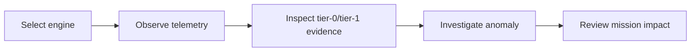

# The Operator Ground Control Station

The ground control station is where every subsystem described elsewhere in this documentation becomes visible to a human. Physics residuals, novelty scores, Bayesian fault hypotheses, remaining-useful-life estimates, and mission reliability numbers all converge here, on one operator's screen, in the form of tiles, plots, a live 3D twin, and a conversational copilot. Nothing in ANUMAAN is useful until it reaches this layer in a form an operator can act on.

The station is not one screen but two coordinated workspaces inside a single application. One gives the operator command of an entire fleet across five engine platforms. The other gives the operator the deepest available diagnostic depth on a single engine, the Rotax 912 iS. Both draw on the same underlying telemetry and physics, and both observe the same rule: everything shown is labeled by its evidentiary basis, and nothing is presented as a certified airworthiness judgment.

## The problem

An operator monitoring a MALE UAV propulsion system during a long sortie needs two things that pull in different directions. They need breadth, a sense of the whole fleet's condition at a glance, so that attention goes to the aircraft that needs it. They also need depth, the ability to drop into one engine's full diagnostic picture, trace a specific anomaly to a specific component, and understand why the system believes what it believes. A single screen tuned for one of these needs is poorly suited to the other. A fleet overview cluttered with per-cylinder waveform detail is unreadable at a glance; a deep diagnostic view stripped down to fit a fleet tile loses the evidence a maintainer needs to trust a conclusion.

## Why it matters

Trust is the currency of any health-monitoring system that an operator did not build themselves. If the interface asserts a fault without showing the evidence behind it, an operator has no way to judge whether to believe it, and a system that cannot be interrogated gets ignored the first time it is wrong about something minor. The reverse failure is just as damaging: a system that quietly presents simulation-derived reasoning with the same visual weight as certified flight data invites an operator to trust it further than the evidence supports. Both failure modes are addressed by the same design habit, carried through consistently across both workspaces: show the evidence, and say plainly what kind of evidence it is.

## Our approach

ANUMAAN's ground control station opens by default on a fleet and engine console, because a fleet-wide check is the more common operator action and should not require navigating past a single engine's detail first. A second, coordinated workspace, reached from the same application, hosts the Rotax-deep diagnostic environment for the platform where ANUMAAN's diagnostic reasoning runs deepest. Neither workspace is described or treated as a fallback for the other. They serve different operator intents and are named for what they do.

## How it works

### The fleet and engine console

The default view presents fleet tiles across all five engine profiles: Rotax 912 iS, Rotax 914, Rotax 915 iS, Austro AE300, and VRDE Jayem 2.2L. Selecting a tile brings that engine's live scalar telemetry to the foreground and warms its tier-1 reservoir classifier, the pipeline stage described in [Bio-Inspired Sparse Novelty Coding](10-bio-inspired-sparse-novelty-coding.md) and [Fault Diagnosis](11-fault-diagnosis.md) that produces classifier-level fault evidence once it has enough recent history to work from.

Below the telemetry, the console shows tier-0 residual evidence directly: threshold ratios against the physics-expected value at the current operating point, persistence-confirmed alarms (a residual has to hold, not merely spike, before it is treated as evidence), and the leading channels driving any active alarm. This is the same residual machinery described in [Residual Analysis](08-residual-analysis.md), surfaced without abstraction so an operator can see exactly which channel moved and by how much.

The console also carries the controls needed to exercise the system: profile-valid fault injection and clearing, scoped to the faults that are physically meaningful for the selected engine, and flight-condition levers for throttle, altitude, and outside air temperature that drive the same physics runtime the residual detector watches. An embedded 3D twin view sits alongside the telemetry, rendering the selected engine's model with live component highlighting, so an active fault is not just a number in a table but a location on the physical engine.

*Figure 1: ANUMAAN Operator Ground Control Station runtime workspace showing live telemetry tiles, 3D twin viewport, and physics operating levers.*

*Figure 2: Real-time fault injection triggering persistence-confirmed residual alarms and exact Bayesian fault ranking.*

*Figure 3: Prescriptive advisory panel issuing throttle derate recommendation with mission reliability impact projection.*

*Figure 4: Post-mission sortie debrief showing timeline replay, stress cycle counts, and component remaining useful life delta.*

### The Rotax-deep workspace

The second workspace concentrates ANUMAAN's full diagnostic depth on the Rotax 912 iS. It carries real-time telemetry and the same fault injection controls as the fleet console, but adds the reasoning layers that are, at present, scoped to this one engine: Bayesian-style diagnosis ranking fault hypotheses against observed evidence, remaining-useful-life estimation with a calibrated confidence interval, a conversational copilot grounded in reference documentation, and a full mission replay environment for reviewing a completed sortie event by event.

This asymmetry is deliberate rather than incidental. The multi-engine runtime demonstrates that ANUMAAN's physics and residual architecture generalizes across five distinct platforms. The Rotax workspace demonstrates how far the diagnostic reasoning built on top of that architecture can go for one platform when fully exercised. Together they answer two different evaluation questions: does the architecture scale across engines, and how deep can the reasoning go on one.

### The honesty discipline

Both workspaces carry the same labeling discipline into every panel that shows evidence. Tier-0 residuals, tier-1 classifier scores, Bayesian hypothesis rankings, and RUL intervals are all presented as simulation-derived quantities, computed from the current telemetry and the physics or statistical model behind them, not asserted as a certified determination of airworthiness. This distinction matters because ANUMAAN's physics is grounded in published manufacturer specifications and its methods are validated through simulation and testing, as described in [Validation and Experiments](21-validation-and-experiments.md), rather than against flight data from an instrumented real airframe. An operator reading the interface should always be able to tell which of those two things they are looking at.

### The voice copilot

The conversational copilot in the Rotax workspace answers operator questions by retrieving from a local index of Rotax and DRDO reference material, paired with a local language model that is disabled by default; when no language model is enabled, a deterministic fallback still covers diagnosis and explanation, so the copilot never goes silent. A voice interface sits on top of this text channel, using local speech recognition and local speech synthesis where available. Where the local voice engines are not available, the interface falls back to the browser's own speech APIs and shows a visible status indicator naming which mode is active, so the operator is never left guessing whether they are talking to the local engine or the browser fallback.

## Architecture

The operator workflow through one investigation cycle:

*One operator investigation cycle, from engine selection to the mission-level consequence of what was found.*

An operator enters at either workspace, selects an engine, watches its live telemetry, drops into the residual and classifier evidence behind any alarm, follows that evidence into the diagnostic and 3D twin views to localize the fault, and finally checks what the finding means for the current sortie through the mission reliability and prescriptive advisory panels covered in [Mission Reliability](17-mission-reliability.md).

## Integration

The fleet console is fed by the multi-engine runtime described in [Introducing ANUMAAN](03-introducing-anumaan.md): the `RuntimeHub` and its per-engine `EngineRuntime` instances, reachable through `/api/engines`, `/ws/fleet`, and `/ws/engines/{id}`. The Rotax workspace is fed by the parallel `EngineStateService` telemetry and diagnostic stack, reachable through `/api/state`, `/api/control`, and `/ws/telemetry`. Both paths run inside the same FastAPI application and both ultimately drive the same embedded 3D twin technology described in [The 3D Digital Twin](18-3d-digital-twin.md). Fault injection and lever controls in either workspace write into the physics runtime that [The Digital Twin Core](05-the-digital-twin.md) and [Residual Analysis](08-residual-analysis.md) describe, so what the operator sees respond on screen is the same physics computing the evidence underneath it.

## Validation

The interface's major workflows, including a full mission simulation sequence, have been exercised and captured through automated browser-based verification, producing dated screenshot sequences used as UI evidence during development. The console's evidence panels display the same tier-0 and tier-1 outputs pinned by the characterization tests described in [Validation and Experiments](21-validation-and-experiments.md), so a regression in the underlying detection or classification pipeline would surface as a visible change in what the operator sees, not only as a failed test in isolation.

## Related systems

- [Mission Reliability](17-mission-reliability.md)
- [Residual Analysis](08-residual-analysis.md)
- [Bio-Inspired Sparse Novelty Coding](10-bio-inspired-sparse-novelty-coding.md)
- [The 3D Digital Twin](18-3d-digital-twin.md)
- [Validation and Experiments](21-validation-and-experiments.md)
