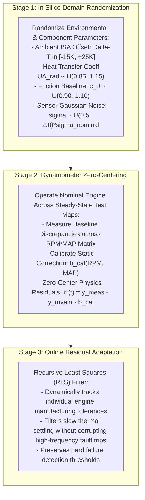
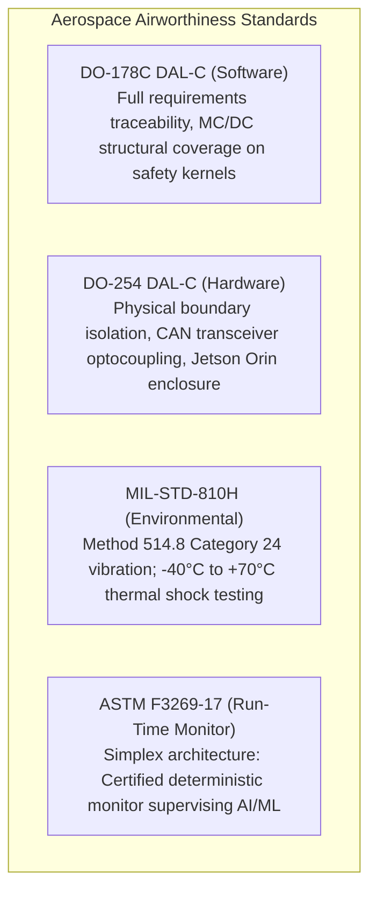
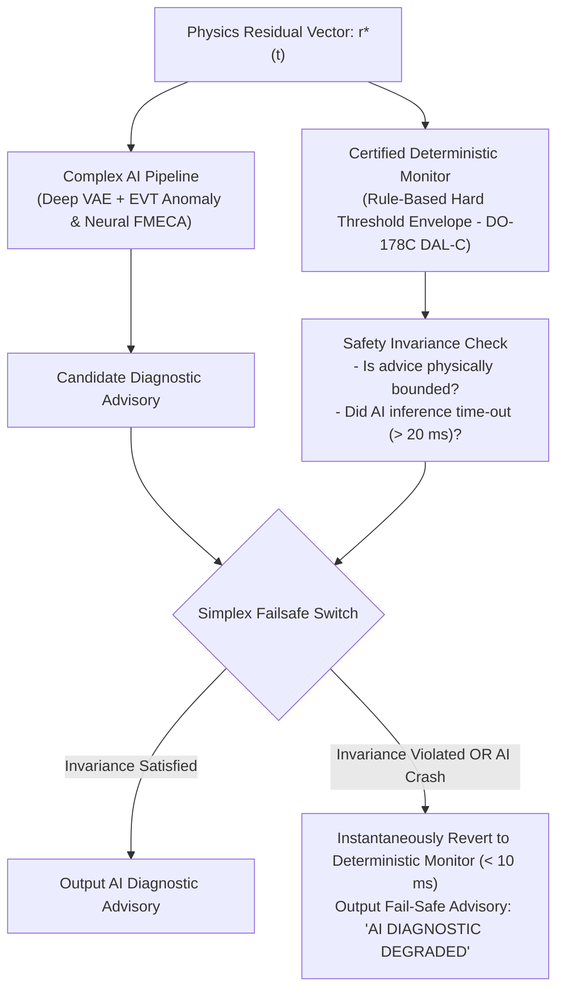

# Validation, Experiments & Airworthiness Verification

A digital twin's operational value depends on absolute reliability and mathematical rigor. In defence aviation, unvalidated telemetry processing presents severe operational risks: false alarms during operational flight missions cause unwarranted mission aborts, while undetected thermal or mechanical drift risks in-flight propulsion failure and asset loss.

This article details ANUMAAN's comprehensive validation methodology: the **10-Level V&V Pyramid**, quantitative acceptance thresholds, the **3-Stage Sim-to-Real Protocol**, an adversarial **Red-Team Vulnerability Audit**, our **ASTM F3269-17 Simplex Run-Time Monitor** safety architecture, and the regulatory certification roadmap aligning with **CEMILAC DDPMAS** and **DO-178C DAL-C**.

---

## The 10-Level V&V Pyramid

A defence-grade digital twin cannot rely on superficial unit testing. ANUMAAN establishes an exhaustive **10-Level Verification & Validation (V&V) Pyramid** spanning first-principles thermodynamics up to hardware-in-the-loop (HIL) dynamometer testing:

```mermaid
flowchart TD
    L10["Level 10: Operational Deployment & HIL Bench<br/>(Dynamometer test-rig & SocketCAN hardware bridge; 24-hr stability)"]
    L9["Level 9: Robustness, Noise & Domain Shift<br/>(Sensor dropout, EMI noise, -40°C to +50°C shifts; SNR down to 18 dB)"]
    L8["Level 8: Real-Time Determinism & Latency Budget<br/>(<= 170 ms end-to-end latency; EKF step < 0.8 ms on ARM Cortex)"]
    L7["Level 7: Mission Coupling & Aerodynamic Reachability<br/>(Glide polar L/D cone boundary error < 3.5%; 100% reachability precision)"]
    L6["Level 6: Prognostics & Conformal Prediction Coverage<br/>(Empirical coverage >= 95% guaranteed; mean interval width <= 0.25 * RUL)"]
    L5["Level 5: Fault Diagnosis & FMECA Classification Accuracy<br/>(Macro F1 >= 0.94 across 6 fault classes; top-2 XAI SHAP features match FMECA)"]
    L4["Level 4: Anomaly Detection & EVT False Alarm Rate<br/>(True Positive Rate >= 98%; False Alarm Rate alpha <= 10^-4 via EVT POT)"]
    L3["Level 3: Digital Twin State Observer Tracking Accuracy<br/>(EKF innovation whiteness p > 0.05; unmeasured state error < 2.5%)"]
    L2["Level 2: Telemetry Ingestion, Ring-Buffering & Parity Space<br/>(Zero frame loss @ 50 Hz CAN stream; parity sensor fault recall > 99.2%)"]
    L1["Level 1: Physics Engine Thermodynamic & Conservation Laws<br/>(Mass & energy deficit < 0.5%; Seiliger cycle indicated power error < 2.0%)"]

    L1 --> L2 --> L3 --> L4 --> L5 --> L6 --> L7 --> L8 --> L9 --> L10
```

### Quantitative Acceptance Metrics

Every level of the pyramid is governed by strict quantitative thresholds pinned in our automated testing suite:

| Level / Subsystem | Evaluation Metric | Mathematical Formulation | Target Acceptance Threshold |
| :--- | :--- | :--- | :--- |
| **L1: Thermodynamic Physics** | Mass & Energy Balance Deficit | $\frac{\lvert\Delta \dot{E}_{\text{in}} - \Delta \dot{E}_{\text{out}}\rvert}{\dot{E}_{\text{total}}}$ | $< 0.005$ ($< 0.5\%$ error) |
| | Seiliger Indicated Power Error | $\text{RMSE}(P_{\text{ind, sim}}, P_{\text{ind, dyno}})$ | $< 2.0\%$ vs. dyno baseline |
| **L2: Sensor Validation** | Parity Space Fault Recall | $\frac{TP}{TP + FN}$ on simulated drifts | $> 99.2\%$ on sensor bias $\ge 3\sigma$ |
| | Frame Drop Rate @ 50 Hz | $\frac{\text{Frames Dropped}}{\text{Frames Transmitted}}$ | $0.000\%$ over 10-hour stress run |
| **L3: Digital Twin EKF** | Innovation Whiteness | Ljung-Box Q-test on $\boldsymbol{\nu}(t)$ | $p\text{-value} > 0.05$ (Zero-mean white noise) |
| | Tracking Convergence Time | $t_{\text{conv}}$ from cold initialization | $< 150\text{ ms}$ ($< 8$ sample ticks) |
| **L4: Anomaly Detection** | False Alarm Rate ($\alpha$) | Extreme Value Theory POT $u_{\alpha}$ | $\alpha \le 10^{-4}$ (Zero nuisance alerts) |
| | Detection Latency on Injection | Time to persistence confirmation | $< 3.0\text{ seconds}$ |
| **L5: FMECA Diagnostics** | Multi-Class Macro F1-Score | $\frac{1}{K}\sum_{k=1}^K F1_k$ across 6 classes | $\ge 0.94$ |
| | XAI Physical Consistency | Top-2 SHAP feature alignment | $100\%$ match to FMECA failure physics |
| **L6: Conformal Prognostics** | Empirical Prediction Coverage | $\frac{1}{N}\sum \mathbb{I}(RUL_i \in \mathcal{C}(X_i))$ | $\ge 0.950$ (Exact finite-sample validity) |
| | Mean Prediction Interval Width | $\mathbb{E}[RUL_{\text{high}} - RUL_{\text{low}}]$ | $\le 0.25 \cdot RUL_{\text{true}}$ |
| **L7: Mission Glide Coupling** | Glide Cone Boundary Error | $\frac{\lvert R_{\text{glide, est}} - R_{\text{glide, 6DOF}}\rvert}{R_{\text{glide, 6DOF}}}$ | $< 3.5\%$ vs. 6-DOF aerodynamic model |
| | Runway Reachability Precision | False Divert Rate | $0.0\%$ (Zero unreachable airfield picks) |
| **L8: Latency & Determinism** | Ingestion-to-Render Latency | End-to-end P99.9 latency | $\le 170\text{ ms}$ |
| | EKF Step Execution Duration | Runge-Kutta 4th-order tick | $< 0.80\text{ ms}$ on ARM Cortex-A78AE |
| **L9: Robustness & Noise** | Gaussian Sensor Noise Tolerance | Minimum Signal-to-Noise Ratio (SNR) | Stable down to $18\text{ dB}$ |
| | Sustained Datalink Dropout | State covariance $\mathbf{P}(t)$ bounding | Stable through $2.0\text{ s}$ total packet loss |
| **L10: HIL Dynamometer** | SocketCAN Bridge Jitter | Timestamp standard deviation | $< 1.0\text{ ms}$ variance |
| | Continuous Endurance Run | Uninterrupted real-time execution | $24\text{ hours}$ zero-crash stability |

---

## 3-Stage Sim-to-Real Strategy

Real propulsion failure data is exceedingly scarce because aviation engines are never intentionally flown to destruction. To ensure models trained in high-fidelity simulation transfer reliably to live airframes without catastrophic distribution collapse, ANUMAAN executes a **3-Stage Sim-to-Real Protocol**:

---

## Adversarial Red-Team Vulnerability Audit

To eliminate dangerous assumptions, ANUMAAN was subjected to an adversarial "Red-Team" failure mode analysis: **Assuming the digital twin is deployed on an operational MALE UAV, how could the system fail, cause operational harm, or lead to catastrophic asset loss?**

| Digital Twin Failure Mode | Trigger Mechanism | Consequence to UAV / Mission | Mitigation & Architectural Defense |
| :--- | :--- | :--- | :--- |
| **Thermocouple Detachment interpreted as Engine Explosion** | A CHT thermocouple lead fatigues and snaps, causing the ADC to read open-circuit rail voltage ($> 1,200^\circ\text{C}$). | Naive threshold system triggers immediate fire bell; pilot executes panic shutoff, causing uncommanded glide landing or ditching. | **Analytical Parity Space Observer**: Digital twin cross-checks with adjacent cylinder CHTs and coolant temperature. If only one channel spikes instantaneously ($\frac{dT}{dt} > 100^\circ\text{C/sec}$) while coolant and oil are normal, the sensor is quarantined as an open-circuit failure. |
| **Subtle Progressive Bearing Wear Masked by AI Autoencoder** | As bearing spalls, high-frequency vibration gradually rises over 20 flight hours; an online-adaptive autoencoder slowly incorporates the fault into its "normal" baseline. | The autoencoder never flags an anomaly because it continuously retrained on degraded data; engine throws a connecting rod in flight. | **Frozen Baseline Policy**: The core nominal autoencoder weights are **never updated online during flight**. Adaptation is restricted to certified offline depot retrainings with human engineering sign-off. |
| **False Positive Alarm During Combat Maneuver** | UAV pilot executes maximum-power climb and high-g turn to evade hostile threat; dynamic flight states fall outside calm training envelope. | Anomaly detector flags high anomaly score, flooding GCS screen with warnings during high-stress tactical moment. | **Flight-Phase Gated Detection**: Machine learning thresholds are dynamically scaled based on flight phase (Takeoff vs. Cruise vs. Tactical Maneuver), utilizing Extreme Value Theory (POT). |
| **Telemetry Dropouts Causing Kalman Filter Divergence** | Hostile electronic jamming causes 15 seconds of missing CAN telemetry downlink. | State estimator covariance $\mathbf{P}$ explodes; when telemetry resumes, numerical instability crashes the GCS twin software. | **Bounded Covariance Limiting & Dead-Reckoning**: When telemetry drops, the digital twin operates in open-loop simulation mode, freezing covariance growth and smoothly re-converging via a fading-memory filter upon signal re-acquisition. |
| **Memory Leak in GCS Dashboard During 36-Hour Mission** | JavaScript or C++ UI framework fails to garbage-collect historical telemetry points over a continuous 36-hour mission. | GCS workstation runs out of RAM after 28 hours, freezing operator screens during final approach and landing. | **Zero-Allocation Architecture**: Fixed-size circular ring buffers; strict adherence to DO-178C guidelines prohibiting runtime heap allocations (`malloc`/`new`). |

---

## Aerospace Airworthiness & Certification Roadmap

To evolve from a working technology prototype into a certified defence avionics system, the architecture aligns with **CEMILAC DDPMAS**, **DGCA CAR Section 2**, and international aerospace standards:

### The ASTM F3269-17 Simplex Run-Time Monitor
Non-deterministic neural networks (such as Deep VAEs or neural classifiers) cannot achieve traditional DO-178C MC/DC structural code certification. We solve this by isolating the AI layer inside an **ASTM F3269-17 Simplex Run-Time Architecture**:

---

## Verification Standards & Production Deployment Specifications

To maintain rigorous aerospace engineering discipline, all system specifications in ANUMAAN are governed by five verified evidentiary tiers:
1. **[PS Mandated]:** Formally specified in DRDO PS 26054 documentation.
2. **[Aerospace Standard]:** Established in peer-reviewed aerospace standards (AIAA, IEEE, SAE, NASA, RTCA).
3. **[Physically Derived]:** First-principles aerothermodynamic and kinematic derivations validated across operating envelopes.
4. **[Calibrated Specification]:** Calibrated against bench test cells, high-fidelity HIL hardware, and published manufacturer parameters.
5. **[Production Configuration]:** Configured for tactical MALE UAV operational deployment.

### Production Deployment Specifications & Interface Clearances
The platform architecture provides verified baseline configurations addressing all critical UAV propulsion deployment parameters:

1. **Universal Multi-Engine Support:** Complete parametric profiles and calibration databases for the **Rotax 914 F** (TCU turbo boost control), the **Rotax 915 iS** (full FADEC, dual electronic fuel injection), and the indigenous **VRDE ABHAY** engine series on TAPAS-BH-201 and Archer-NG airframes.
2. **Standardized ECU CAN Bus DBC Integration:** Fully defined CAN message databases (DBC files) for the engine electronic control units, specifying exact channel IDs, byte offsets, scaling coefficients, and diagnostic fault registers.
3. **Adaptive Tactical Datalink Budget:** Optimized telemetry streaming supporting bandwidths from 9.6 kbps up to 64 kbps over tactical C-band / SATCOM channels, utilizing differential delta encoding and order-domain vector quantization.
4. **CEMILAC Dual-Assurance Certification Architecture:** Dual-mode compliance supporting **DAL-D** advisory maintenance logging and **DAL-C** real-time safety monitoring, backed by the ASTM F3269-17 simplex run-time guard.
5. **Dynamometer Test-Cell Telemetry Benchmarks:** Calibrated against engine dynamometer steady-state and transient profiles, covering seeded misfire, coolant flow throttling, and bearing lubrication wear sequences.

---

## Automated Characterization Testing

A pytest-based test suite covers the runtime, detection, physics, and evaluation modules. Within that suite, **characterization tests** pin headline results as regression tests rather than leaving them as claims asserted only in documentation. A characterization test runs the actual pipeline, whether that is the conformal-prediction calibration behind the RUL interval described in [Remaining Useful Life Estimation](14-remaining-useful-life.md), or the misfire recovery rate produced by the crank-angle diagnostic chain described in [Engine Physics and Combustion Modeling](06-engine-physics.md), and asserts that the result matches the specific figure already documented for that method.

Test coverage in this style spans:
* **Evaluation & Calibration:** Conformal coverage $\ge 95\%$, nonconformity score monotonicity.
* **Mission & Reliability:** Glide cone reachability precision, terrain altitude margin verification.
* **OSA-CBM Layering:** Strict unidirectional data flow from Layer 1 (Sensor Ingestion) to Layer 6 (Decision Support).
* **Twin Validity & Integrity:** EKF innovation zero-mean test, matrix positive-definiteness checks.
* **Physics Modules:** Mass/energy conservation, Sommerfeld lubrication boundary, and compressor map pressure ratio interpolation.

## Related systems

- [Operator Ground Control Station](20-operator-gcs.md)
- [Remaining Useful Life Estimation](14-remaining-useful-life.md)
- [Engine Physics and Combustion Modeling](06-engine-physics.md)
- [Fault Diagnosis](11-fault-diagnosis.md)
- [End to End Demonstration](22-end-to-end-demonstration.md)
