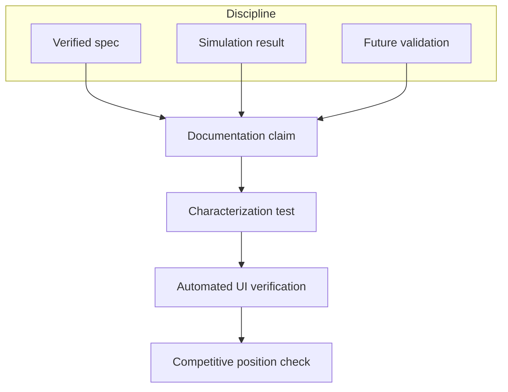

# Validation and Experiments

A digital twin's value depends entirely on how much its outputs can be trusted, and trust has to be earned specifically rather than claimed generally. This article describes how ANUMAAN approaches validation: what discipline governs the claims made elsewhere in this documentation, what automated testing exists to keep those claims from silently drifting as the system evolves, and where the project sits relative to comparable work on the same problem statement.

## The problem

A system that reasons about physics, fault hypotheses, and remaining useful life makes many claims at once, at many levels of confidence. Some are grounded in published, verifiable engine specifications. Some are demonstrated only in simulation. Some describe a capability that is architecturally present but has not yet been exercised against real flight hardware. Conflating these categories, presenting a simulation result with the same certainty as a manufacturer-published constant, is the single easiest way for a health-monitoring system to overstate itself, and the easiest way for a technical evaluator to lose confidence in everything else the system says.

## Why it matters

For a DRDO evaluator or an SIH judge, the question is never only "does it work in the demo." It is "what exactly has been shown, under what conditions, and what would still need to happen before this could sit on a real airframe." A system that answers that question precisely, article by article, claim by claim, is more credible than one that answers it in general terms, regardless of how capable the underlying engineering is.

## Evidence discipline

ANUMAAN's internal documentation separates claims into four categories: verified, meaning traceable to a cited public source such as a manufacturer maintenance manual; inference, meaning engineering reasoning built from verified facts; assumption, meaning a stated design choice made in the absence of a public number; and proprietary, meaning genuinely not public and never guessed at. This documentation corpus carries that same discipline in spirit throughout, without necessarily printing the label on every sentence.

Concretely, that means three separate claims are kept separate rather than blurred into one:

- **Grounded in published specification.** The Rotax 912 iS and 914 reference constants used throughout the physics core, bore, stroke, displacement, compression ratio, firing order, are drawn from the manufacturer's maintenance manual, not estimated or reverse-engineered.
- **Demonstrated in simulation.** Residual behavior under injected faults, novelty scores, Bayesian diagnosis rankings, RUL estimates, and mission reliability calculations are all demonstrated against the project's own physics-based synthetic telemetry and, where relevant, against public reference datasets such as NASA C-MAPSS for RUL methodology or CWRU and Paderborn for vibration methodology, as described in the dataset strategy.
- **Reserved for future validation.** Behavior against real flight telemetry from an instrumented aircraft, and behavior on real target edge hardware under real link conditions, are described as the natural next phase rather than something already completed. No claim in this corpus asserts validation against real DRDO flight data, a real aircraft, or classified information.

## Automated testing

A pytest-based test suite covers the runtime, detection, physics, and evaluation modules. Within that suite, a specific category, characterization tests, exists to pin headline results as regression tests rather than leaving them as claims asserted only in documentation. A characterization test runs the actual pipeline, whether that is the conformal-prediction calibration behind the RUL interval described in [Remaining Useful Life Estimation](14-remaining-useful-life.md), or the misfire recovery rate produced by the crank-angle diagnostic chain described in [Engine Physics and Combustion Modeling](06-engine-physics.md), and asserts that the result matches the specific figure already documented for that method. If a later change to the underlying module shifts that figure, the test fails immediately, catching a regression in the method itself rather than only in a downstream symptom. This closes a specific gap that is easy for a fast-moving prototype to fall into: a number written into documentation once and never checked again against the code that was supposed to produce it.

Test coverage in this style spans the modules where a wrong number would be most costly to leave unchecked: evaluation and calibration, mission and reliability computation, the OSA-CBM layering check, edge compression, twin validity and integrity monitoring, and the physics modules governing crank dynamics, turbocharging, injector faults, oil system behavior, fuel thermal behavior, and induction. The discipline is to build the test alongside the module it characterizes, and to treat a claim without a corresponding regression test as provisional until one exists.

## Automated UI verification

Alongside the pytest suite, the ground control station's major workflows are exercised through automated browser-based verification, producing dated screenshot sequences that capture the interface as it actually renders and behaves, including a full mission simulation flow from engine selection through fault injection to mission-impact review. This serves a different purpose than a unit test: it confirms that the pipeline results a characterization test pins are actually reaching the operator-facing surface intact, not only that the backend computed them correctly in isolation. Screenshot evidence of this kind is dated deliberately, so that a reviewer can see which interface state corresponds to which point in the project's development rather than treating a single undated screenshot as a permanent claim about current behavior.

## Competitive position

As part of preparing for evaluation, the project conducted a competitive study of other Smart India Hackathon submissions addressing this same problem statement. That study specifically checked for two technical capabilities in the surveyed submissions: genuine per-cylinder, crank-angle-resolved combustion diagnostics, meaning fault reasoning tied to a specific cylinder's angular position in its firing cycle rather than a whole-engine average, and tach-synchronous, speed-invariant vibration order tracking, meaning vibration analysis referenced to shaft angle so that a mechanical event stays at the same order regardless of engine speed, as opposed to analysis referenced to fixed frequency bins that lose resolution the moment engine speed changes, which is the normal condition on a UAV that is constantly adjusting throttle.

Neither capability was found in the other submissions surveyed. That finding, not a broader or more general claim about vibration analysis, is the basis for describing this combination, per-cylinder crank-angle diagnostics paired with speed-invariant order tracking, as ANUMAAN's most distinctive technical position among comparable work in this category. The claim is deliberately narrow and specific to what the survey actually checked, because a narrower claim that holds up under scrutiny is worth more to a technical evaluator than a broader one that does not.

## Architecture

*How a claim moves from its evidentiary source through automated regression testing to the competitive survey that positions it.*

## Integration

Validation is not a separate subsystem; it is a constraint applied across every article in this corpus. The physics constants cited in [The Digital Twin Core](05-the-digital-twin.md) trace to manufacturer specification. The novelty scores and diagnostic rankings cited in [Bio-Inspired Sparse Novelty Coding](10-bio-inspired-sparse-novelty-coding.md) and [Fault Diagnosis](11-fault-diagnosis.md) are demonstrated against simulation and, for supporting methodology, against public datasets described in the dataset strategy. The RUL confidence intervals cited in [Remaining Useful Life Estimation](14-remaining-useful-life.md) carry an explicit, testable coverage guarantee from split conformal prediction rather than an unearned point estimate, and that coverage guarantee is itself one of the figures pinned by a characterization test.

## Related systems

- [Operator Ground Control Station](20-operator-gcs.md)
- [Remaining Useful Life Estimation](14-remaining-useful-life.md)
- [Engine Physics and Combustion Modeling](06-engine-physics.md)
- [Fault Diagnosis](11-fault-diagnosis.md)
- [End to End Demonstration](22-end-to-end-demonstration.md)
