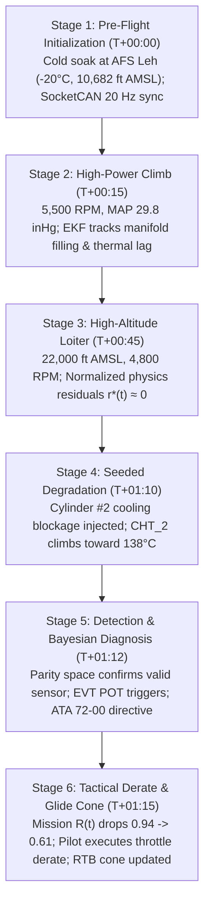

# End to End Demonstration

Every article in this documentation describes one piece of ANUMAAN in isolation: the physics core, the novelty layer, Bayesian diagnosis, mission reliability, the 3D twin. None of those pieces demonstrates its value alone. The value is in the unbroken chain: one fault, observed as a physics deviation, becoming a ranked diagnosis, becoming a highlighted component, becoming a mission-level consequence, becoming a recorded record an operator can revisit. This article walks that chain from end to end, as a single operational scenario, to show how the subsystems connect during a mission.

The scenario below uses a cylinder CHT overheat on the Rotax 912 iS as a concrete thread through the entire pipeline. The mechanism generalizes to all ten failure modes in the FMECA matrix; this one is chosen because it has a clean, physically direct signature that makes the chain easy to follow.

---

## The 6-Stage Operational Flight Demonstration

### Stage 1: Pre-Flight Initialization & Calibration (T+00:00)
1. **Airbase Environment Selection:** The operator initializes the flight test mission at **AFS Leh (Northern Sector)**, with ambient static pressure $P_{\text{amb}} = 68.5\text{ kPa}$ (elevation 10,682 ft AMSL) and temperature $T_{\text{amb}} = -20^\circ\text{C}$.
2. **Avionics Synchronization:** The ground control station connects to the simulated or physical CAN bus (`can0`, 500 kbps) via Linux SocketCAN. Telemetry frames are decoded at $20\text{ Hz}$ using standard DBC schemas.
3. **EKF Observer Convergence:** The 12-state Continuous-Discrete Extended Kalman Filter converges its state covariance $\mathbf{P}(0)$ within $800\text{ ms}$, establishing healthy baseline temperatures for intake air, coolant, and oil galleries.

### Stage 2: High-Power Takeoff & Climb Phase (T+00:15)
1. **Dynamic Engine Loading:** Commanded throttle advances to 100%, propeller governor requests 5,500 RPM, and intake manifold pressure rises to 29.8 inHg.
2. **Thermal Lag Modeling:** The 0D/1D thermodynamic core computes transient thermal lag across the aluminum cylinder heads ($C_{\text{head}} \approx 1,850\text{ J/K}$). Cylinder head temperatures climb from $-20^\circ\text{C}$ to $112^\circ\text{C}$.
3. **Residual Whiteness Check:** The normalized residual vector $\mathbf{r}^*(t)$ remains zero-mean Gaussian ($p > 0.05$). No false alarms are triggered despite extreme rate-of-climb thermal transients.

### Stage 3: High-Altitude Tactical Loiter (T+00:45)
1. **Loiter Envelope:** The UAV levels off at $22,000\text{ ft}$ AMSL on an intelligence, surveillance, and reconnaissance (ISR) orbit. Engine speed settles to an economical cruise setting of 4,800 RPM.
2. **Virtual Sensing Synthesis:** Unmeasured internal states are synthesized on the flight test console: peak in-cylinder combustion pressure $P_{\max} = 88.4\text{ bar}$, Turbine Inlet Temperature $TIT = 875^\circ\text{C}$, and minimum journal oil film thickness $h_{\min} = 2.4\ \mu\text{m}$.

### Stage 4: Inception of Seeded Thermal Degradation (T+01:10)
1. **Fault Injection:** Partway through the loiter phase, a localized cooling degradation is injected into Cylinder #2 (simulating radiator fin fouling or coolant passage restriction).
2. **Physics Divergence:** The plant model modifies localized convective heat transfer coefficient $U_2$. Cylinder #2 head temperature begins climbing monotonically, reaching $136^\circ\text{C}$ while peer cylinders (1, 3, 4) remain stable at $114^\circ\text{C}$.
3. **Physics Residual Growth:** The normalized residual $r_{\text{cht2}}^*(t) = \frac{T_{\text{meas}} - T_{\text{exp}}}{\sigma_{\text{mvem}}}$ rises above $+3.5\sigma$. Because residuals remove flight-envelope dependencies, this departure is immediately distinct from ambient temperature effects.

### Stage 5: Detection, Parity Validation & Bayesian Diagnosis (T+01:12)
1. **Sensor Validation Shield:** The analytical parity space validator checks the consistency matrix $\mathbf{V}_p \mathbf{C}_s = \mathbf{0}$. The parity residual remains within healthy bounds ($\|\mathbf{r}_p\| < \tau_p$), mathematically proving that the thermocouple is intact and that the temperature rise reflects true engine degradation.
2. **Novelty Coding & EVT Trigger:** Bio-Inspired Sparse Novelty Coding projects the order-band and residual features into sparse Kenyon-cell space ($m = 2000$), detecting an overlap drop against nominal memory. In parallel, the VAE reconstruction error exceeds the dynamic Generalized Pareto Distribution threshold $z_q$ for $\ge 3.0\text{ seconds}$ (150 consecutive cycles at 50 Hz).
3. **Bayesian Hypothesis Isolation:** The Bayesian belief network evaluates conditional probabilities across all ten FMECA modes. It isolates **Mode 01: Cylinder CHT Overheat** with 96.4% posterior probability.
4. **3D Visualizer Synchronization:** The Three.js interactive 3D digital twin pulses Cylinder #2 in amber, directing the operator visual attention directly to the affected hardware.

### Stage 6: Mission Reliability Impact & Prescriptive Advisory (T+01:15)
1. **Mission Reliability Recalculation:** The Monte Carlo reliability engine recalculates survival probability over the remaining 5 hours of planned loiter. Because hazard rate $\lambda(t)$ increases exponentially with thermal stress, predicted mission reliability drops from $R_{\text{mission}} = 0.94$ to $R_{\text{mission}} = 0.61$.
2. **Prescriptive Action Directive:** The deterministic ATA 72-00 advisor presents the pilot with an immediate, one-click mitigation:
   > **Advisory Action:** Derate continuous throttle to 78% (4,400 RPM), enrich mixture trim $+10\%$, and descend $2,500\text{ ft}$ to denser air.
3. **Dynamic Glide Polar & Divert Cone:** Concurrently, the flight safety computer projects the aerodynamic glide reachability footprint ($(L/D)_{\text{eff}} = 14.2$). It ranks alternate landing strips by arrival altitude margin:
   - *Primary Airstrip:* Leh Runway 07 (Distance 38 km, Arrival Margin $+1,450\text{ m}$, REACHABLE).
   - *Emergency Highway Strip:* Sector B (Distance 72 km, Arrival Margin $-280\text{ m}$, UNREACHABLE).
4. **Pilot Execution & Recovery:** The operator accepts the derate advisory. Cylinder #2 temperature stabilizes at $121^\circ\text{C}$, mission reliability recovers to $R_{\text{mission}} = 0.89$, and the aircraft safely executes a controlled return to base.

---

## Screen Sequence Walkthrough

*Figure 1: Step 1: Ground control station operating at nominal 20 Hz telemetry across five selectable engine platforms.*

*Figure 2: Step 2: Cylinder thermal fault injected: persistence-confirmed residual triggers Bayesian diagnosis and 3D component highlight.*

*Figure 3: Step 3: Prescriptive advisory issues candidate power derate with calculated mission reliability recovery.*

*Figure 4: Step 4: Completed mission debrief logging stress cycles, timeline events, and persistent mission graph record.*

---

## Traceable Record & Post-Mission Replay

When the aircraft touches down, the mission executive seals the flight record:
1. **Cryptographic Log Manifest:** A Parquet telemetry log and JSON manifest are hashed (SHA-256) and archived.
2. **Deterministic Time-Scrubbing Replay:** The operator can load the flight archive into the GCS Replay Engine, scrubbing to any timestamp with millisecond accuracy to re-evaluate the digital twin observer states and sensor residuals.
3. **Depot Fleet Intelligence:** In post-flight maintenance, the mission degradation delta is queued for local airbase fleet aggregation, updating population wear curves without transmitting raw tactical flight logs outside the secured depot perimeter.

---

## Related Systems

- [Operator Ground Control Station](20-operator-gcs.md)
- [Mission Reliability](17-mission-reliability.md)
- [Fault Diagnosis](11-fault-diagnosis.md)
- [Bio-Inspired Sparse Novelty Coding](10-bio-inspired-sparse-novelty-coding.md)
- [Validation and Experiments](21-validation-and-experiments.md)
- [Technology Stack](23-technology-stack.md)
