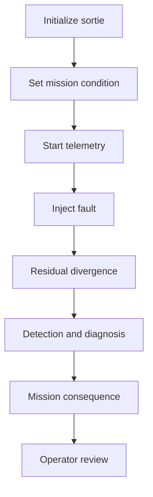

# End to End Demonstration

Every article in this documentation describes one piece of ANUMAAN in isolation: the physics core, the novelty layer, Bayesian diagnosis, mission reliability, the 3D twin. None of those pieces demonstrates its value alone. The value is in the chain, one fault, observed as a physics deviation, becoming a ranked diagnosis, becoming a highlighted component, becoming a mission-level consequence, becoming a recorded record an operator can revisit. This article walks that chain from end to end, as a single operational scenario, to show how the subsystems actually connect during a sortie.

The scenario below uses one fault from the DRDO fault matrix, a cylinder CHT overheat on the Rotax 912 iS, as a concrete thread through the entire pipeline. The mechanism generalizes to any of the eight fault modes; this one is chosen because it has a clean, physically direct signature that makes the chain easy to follow.

## The scenario

An operator opens the ground control station and selects the Rotax 912 iS from the fleet console described in [Operator Ground Control Station](20-operator-gcs.md). They set a mission profile, an endurance sortie spanning taxi, climb, a cruise transit, an extended loiter for reconnaissance, and a return, using the phase model described in [Mission Reliability](17-mission-reliability.md). The mission executive begins advancing the sortie tick by tick: UAV kinematics, ISA atmospheric conditions for the current altitude, and the throttle, altitude, and ambient targets appropriate to whichever phase the sortie is currently in, all driving into the selected engine's physics runtime.

Telemetry begins streaming over the engine's WebSocket channel. On the fleet console, the operator watches RPM, cylinder head temperatures, EGT, oil pressure, and the rest of the scalar channels settle into the pattern expected for a climb, then a cruise, then a loiter. The tier-0 residual detector is running every tick underneath this display, comparing each observed channel against what the physics model expects at the current operating point, and reporting nothing unusual because there is, so far, nothing unusual to report.

Partway through the loiter phase, the operator injects a fault: cylinder #2 CHT overheat, fault mode 01 in the DRDO fault matrix, triggered when CHT on that cylinder exceeds 135 degrees Celsius. This can be injected manually through the fault injection lever on the console, or scheduled as a phase event in the mission definition, as the endurance phase preset does when it introduces a cooling-degradation fault partway through cruise. Either path drives the same physics.

### Residual divergence

The physics runtime does not receive an instruction to report a high temperature. It receives a change to the plant model, specifically to the thermal or cooling parameters at cylinder #2, and it propagates that change through the same equations governing every other cylinder. Cylinder #2's head temperature begins to climb above what the physics model expects for the current altitude, outside air temperature, and throttle setting. Because the twin's central concept is residual, observed telemetry minus physics-expected telemetry at the current operating point, this climb is visible immediately as a growing residual on the CHT_2 channel, not as a raw number the operator has to compare against a fixed limit themselves.

### Detection

The tier-0 residual detector, running every tick, picks up the growing CHT_2 residual and requires it to persist before treating it as evidence rather than noise, the same persistence-confirmed alarm behavior described in [Residual Analysis](08-residual-analysis.md). In parallel, [Bio-Inspired Sparse Novelty Coding](10-bio-inspired-sparse-novelty-coding.md) projects the current residual and order-domain vibration features into its sparse code space and finds that the resulting code no longer matches the memory of previously seen nominal codes well. Both signals point the same direction: something about cylinder #2's thermal behavior has left the envelope of normal operation.

### Diagnosis

Once tier-0 evidence and the novelty score cross their thresholds, the tier-1 reservoir classifier and the Bayesian fault diagnosis network, described in [Fault Diagnosis](11-fault-diagnosis.md), take the accumulated evidence, the leading channel (CHT_2), the pattern of the residual's growth, and the FMECA isolability signature it matches, and rank fault hypotheses against it. Cylinder CHT overheat, consistent with a cooling-path degradation, ranks as the leading hypothesis. The deterministic ATA-chapter diagnostic agent turns that ranked hypothesis into a concrete directive: root cause, prescriptive action, and an emergency checklist, generated without invoking a language model for the diagnosis itself.

### Visualization

The 3D twin, running in the same browser session and synchronized over the same telemetry channel the operator console uses, highlights the fault's target part per the fault matrix: cylinder #2's head. The operator does not have to translate a channel name into a physical location themselves. The component that the diagnosis points to is the component that lights up on the model.

### Mission consequence

The mission reliability engine, computing R, the probability the planned sortie completes without a propulsion-induced abort, recalculates against the degraded component health. Because hazard rates carry units of failures per hour and compose with exposure time, an extended loiter at degraded cylinder health carries more accumulated risk than the same degradation would during a short transit, and the reliability figure reflects that directly rather than through a static health-index badge. The engine identifies cylinder #2's cooling path as the limiting component, the specific part actually driving the drop in mission risk.

### Prescriptive escalation

As reliability drops, the prescriptive advisor escalates through its defined sequence. First, a reliability report naming the limiting component. If the degradation is severe enough, a throttle derate recommendation, reducing damage accumulation rate at the cost of an endurance penalty, computed and stated together rather than as a bare instruction. If the planned sortie is no longer achievable at the required reliability even with a derate, an alternative achievable mission profile: a shorter loiter, a lower altitude, or both, found by searching the profile space for the nearest plan that restores the required reliability.

### Record and review

Throughout, the mission executive is logging telemetry. When the sortie ends, whether completed as planned, completed under a derated profile, or aborted, it is written as a persistent report bundle: a CSV telemetry log and a JSON manifest, retrievable afterward through the replay engine described in [Operator Ground Control Station](20-operator-gcs.md), which supports scrubbing to any point in the sortie and seeking directly to the fault-injection event marker. The sortie is also indexed into the mission knowledge graph, alongside the fleet's other recorded sorties, anomalies, and maintenance history, so this cylinder #2 event becomes part of that tail's traceable history rather than a one-off observation.

*Figure 1: Step 1: Ground control station operating at nominal 20 Hz telemetry across five selectable engine platforms.*

*Figure 2: Step 2: Cylinder thermal fault injected: persistence-confirmed residual triggers Bayesian diagnosis and 3D component highlight.*

*Figure 3: Step 3: Prescriptive advisory issues candidate power derate with calculated mission reliability recovery.*

*Figure 4: Step 4: Completed sortie debrief logging stress cycles, timeline events, and persistent mission graph record.*

## Architecture

*The demonstration chain from sortie initialization through operator review, with each stage feeding the next.*

## Why this chain matters

No individual subsystem in this chain is interesting in isolation. A residual detector that never reaches a diagnosis is a statistics exercise. A Bayesian diagnosis that never reaches mission reliability is a classification exercise with no operational meaning. A mission reliability number that never reaches an operator, in a form they can inspect and act on, is a figure with no consumer. What makes ANUMAAN a system rather than a collection of components is that the chain above runs unbroken: one injected fault, one physics deviation, one detection, one diagnosis, one visualized location, one recalculated mission risk, one prescriptive action, one persistent record. Each subsystem documented elsewhere in this corpus is one link the scenario above actually exercises.

## Integration

This scenario touches nearly every subsystem in the corpus: the physics core and plant model from [The Digital Twin Core](05-the-digital-twin.md), residual computation from [Residual Analysis](08-residual-analysis.md), novelty scoring from [Bio-Inspired Sparse Novelty Coding](10-bio-inspired-sparse-novelty-coding.md), hypothesis ranking from [Fault Diagnosis](11-fault-diagnosis.md), reliability and prescriptive logic from [Mission Reliability](17-mission-reliability.md), rendering from [The 3D Digital Twin](18-3d-digital-twin.md), and the operator-facing surface from [Operator Ground Control Station](20-operator-gcs.md).

## Validation

The mission simulation flow described in this scenario, from engine and profile selection through fault injection to mission-impact review, is among the workflows captured by the project's automated browser-based verification, described in [Validation and Experiments](21-validation-and-experiments.md), as a dated screenshot sequence. The individual pipeline stages the scenario exercises, residual computation, misfire and thermal fault recovery in the crank-angle chain, and the mission reliability computation itself, are each covered by characterization tests that pin their headline behavior as a regression check.

## Related systems

- [Operator Ground Control Station](20-operator-gcs.md)
- [Mission Reliability](17-mission-reliability.md)
- [Fault Diagnosis](11-fault-diagnosis.md)
- [Bio-Inspired Sparse Novelty Coding](10-bio-inspired-sparse-novelty-coding.md)
- [Validation and Experiments](21-validation-and-experiments.md)
