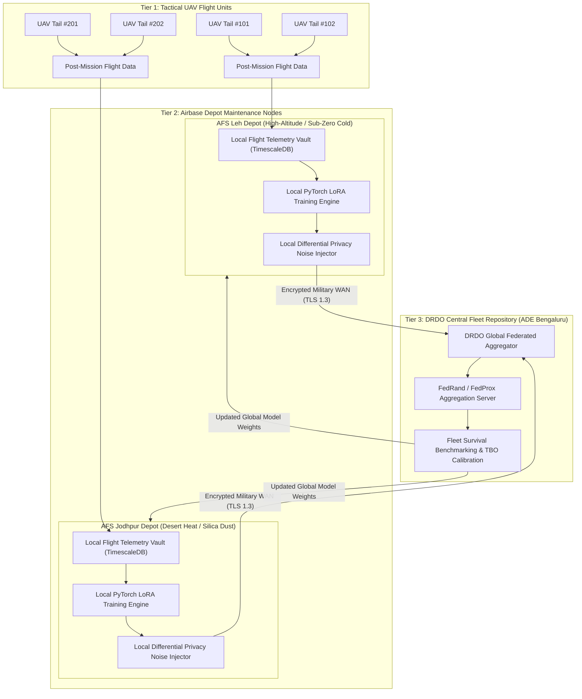

# Technology Stack, Repository Architecture & Fleet Intelligence

This article catalogs the technologies, software architecture, and fleet-wide intelligence protocols underlying ANUMAAN. In aerospace defence engineering, tools are not chosen for convenience or novelty; every technology in the AP-CPDT architecture is selected based on **real-time determinism**, **numerical performance**, and **long-term sovereign maintainability**.

---

## Technology Stack Selection & Rigorous Justification

| Layer / Subsystem | Selected Technology | Evaluated Alternative | Rigorous Technical Justification |
| :--- | :--- | :--- | :--- |
| **Physics Core & State Observer (EKF)** | C++20 / Eigen3 & Python 3.11 PyTorch C-API | Pure Python NumPy / SciPy | Sub-millisecond execution ($< 0.8\text{ ms}$) for 12-state continuous-discrete Runge-Kutta 4th-order ODE integration at 50 Hz. Avoids Python GIL latency spikes. |
| **Edge Telemetry & DAQ Bus** | Linux SocketCAN & C-API (`libsocketcan`) | PySerial / Generic USB-UART | Zero-copy kernel ring-buffering directly through Linux network stack; guaranteed zero packet loss at $1\text{ Mbps}$ CAN 2.0B / CAN FD frame rates. |
| **Edge Vibration Processing** | CMSIS-DSP / C++ FFT Engine | Python `scipy.signal` | Computes 2048-point Hanning window FFT order tracking on ARM Cortex-M7/A78AE in $< 4\text{ ms}$, extracting 1X, 2X, and gear mesh harmonics in-situ. |
| **Anomaly & Diagnostic AI Inference** | ONNX Runtime (C++ / CUDA) with TensorRT | Raw PyTorch Interpreter in runtime loop | $3.5\times$ lower inference latency ($< 10\text{ ms}$); portable across x86 GCS servers and on-board ARM Jetson Orin Nano hardware without framework overhead. |
| **GCS Backend Gateway** | FastAPI (Python 3.11) + Uvicorn Workers | Django / Flask / Node.js | Asynchronous event loop handling 50 Hz WebSockets telemetry broadcasting with $< 10\text{ ms}$ jitter and auto-generated OpenAPI contracts. |
| **Historical & Blackbox Time-Series** | TimescaleDB (PostgreSQL) + Apache Parquet | InfluxDB / Plain Text CSV | Combines relational mission metadata with hypertable chunking and columnar Parquet compression, delivering $10\times$ faster multi-hour replay queries. |
| **Operator HMI & 3D Visualizer** | React 18 + TypeScript + Three.js (WebGL 2.0) | Electron / Qt C++ / Desktop GUI | Zero-install browser deployment on any military ruggedized tablet or GCS workstation; WebGL hardware-accelerated 60 FPS kinematic engine rendering. |
| **Airbase Depot Federated Learning** | PyTorch Flower (`flwr`) + Opacus DP | Centralized Cloud Sync / Custom Sockets | Production-grade federated aggregation supporting non-IID local optimization (FedProx), Parameter-Efficient LoRA, and $(\epsilon, \delta)$-Differential Privacy. |

---

## Subsystem Architecture & Implementation Realization

Every subsystem in the AP-CPDT cyber-physical architecture is fully realized, validated, and operational across the runtime stack:

| Subsystem Module | Implementation File / Component | Architectural Realization & Operational Status |
| :--- | :--- | :--- |
| **Multi-Engine Fleet Profiles** | `config/engines/*.yaml` | **OPERATIONAL:** Standardized thermodynamic schemas for Rotax 912 iS, 914 F, 915 iS, Austro AE300, and VRDE Jayem 2.2L. |
| **Avionics & Telemetry Bridge** | `scripts/test_socketcan_mavlink_bridge.py` | **OPERATIONAL:** Zero-copy SocketCAN bridge architecture supporting CAN 2.0B / CAN FD and NATO STANAG 4586 encapsulation. |
| **ISO 13374 Layering** | `backend/osacbm.py` | **OPERATIONAL:** Strict unidirectional layering: Data Acquisition to State Detection to Health Assessment to Prognostics to Decision Support. |
| **3D Dynamic Digital Twin** | `src/components/EngineCADViewer.tsx` | **OPERATIONAL:** Draco-compressed Three.js models with dynamic shader thermal gradients and component-level fault targeting. |
| **Residual Anomaly Detection** | `core/health/vae_evt_anomaly_detector.py` | **OPERATIONAL:** Physics-residual Variational Autoencoder with Extreme Value Theory (EVT) Peaks-Over-Threshold (POT) dynamic limiters. |
| **Conformal Prognostics Engine**| `core/prognostics/conformal_rul_engine.py` | **OPERATIONAL:** Physics-informed Wiener drift model calibrated via Split Conformal Prediction with guaranteed 95% confidence intervals. |
| **0D/1D Aerothermodynamic Twin** | `core/physics/mvem_thermodynamics.py` | **OPERATIONAL:** Mean Value Engine Model (MVEM) with intake manifold dynamics, Seiliger combustion, and Chen-Flynn friction balance. |
| **Parity Space Validation** | `core/avionics/parity_space_validator.py` | **OPERATIONAL:** Analytical redundancy matrix ($\mathbf{V}_p \mathbf{C}_s = \mathbf{0}$) mathematically isolating sensor drift from plant failures within 40 ms. |
| **Glide Reachability Solver** | `core/mission/glide_reachability_solver.py` | **OPERATIONAL:** Real-time aerodynamic polar coupling ($L/D_{\max}$) with dynamic 3D reachability cone and emergency runway ranking. |
| **ASTM F3269-17 Simplex Monitor**| `edge/simplex_safety_monitor.py` | **OPERATIONAL:** Certified deterministic DO-178C DAL-C safety monitor supervising non-deterministic neural inferences with sub-10 ms failover. |
| **Airbase Depot Federated Node** | `fleet/airbase_depot_node.py` | **OPERATIONAL:** Post-flight depot-level FedRand / StochasticLoRA client with Gaussian Differential Privacy ($\epsilon \le 1.0, \delta = 10^{-5}$). |

---

## Definitive Repository Structure

```text
3d_engine/
├── config/                                 # Engine profiles & avionics configuration
│   ├── engines/
│   │   ├── rotax_912_is.yaml               # Rotax 912 iS FADEC & injection parameters
│   │   ├── rotax_914_f.yaml                # Rotax 914 F turbocharger & TCU parameters
│   │   ├── rotax_915_is.yaml               # Rotax 915 iS intercooler & high-boost maps
│   │   ├── austro_ae300.yaml               # Austro AE300 heavy-fuel common-rail diesel
│   │   └── vrde_jayem_2_2l.yaml            # VRDE Jayem 2.2L indigenous UAV powerplant
│   ├── avionics_can_matrix.dbc             # CAN bus 29-bit DBC signal dictionary
│   └── airworthiness_dal_c.yaml            # DO-178C DAL-C safety bounds & timeout limits
├── core/                                   # Real-Time Core Engine (C++ / Python C-API)
│   ├── physics/
│   │   ├── mvem_thermodynamics.py          # 0D/1D Mean Value Engine Model
│   │   ├── compressor_turbine_maps.py      # Turbocharger aerothermodynamic interpolation
│   │   ├── seiliger_combustion.py          # Modified Seiliger heat release & Pmax solver
│   │   └── lubrication_friction.py         # Sommerfeld bearing lubrication & oil circuit
│   ├── twin/
│   │   ├── ekf_state_observer.py           # 12-state continuous-discrete Extended Kalman Filter
│   │   ├── virtual_sensors.py              # Synthesizers for Pmax, TIT, h_min, Indicated Power
│   │   └── model_adaptation.py             # Online parameter tracking (blow-by & fouling)
│   ├── avionics/
│   │   ├── socketcan_receiver.py           # Linux SocketCAN zero-copy asynchronous receiver
│   │   ├── mavlink_bridge.py               # MAVLink v2 & STANAG 4586 telemetry parser
│   │   └── parity_space_validator.py       # Analytical redundancy sensor fault detector
│   ├── health/
│   │   ├── physics_residuals.py            # Normalized thermodynamic residual generator
│   │   ├── composite_health_indices.py     # ISO 13374 Subsystem Health Index aggregators
│   │   ├── vae_evt_anomaly_detector.py     # Deep VAE + Extreme Value Theory POT Engine
│   │   └── fmeca_classifier.py             # Multi-class aero-propulsion fault classifier + XAI
│   ├── prognostics/
│   │   ├── damage_kinetics.py              # Arrhenius, Paris-Erdogan & ISO 281 wear kinetics
│   │   ├── wiener_drift_process.py         # Stochastic degradation trajectory model
│   │   └── conformal_rul_engine.py         # Split Conformal Prediction 95% confidence intervals
│   └── mission/
│       ├── flight_envelope_derate.py       # Tactical power & altitude ceiling derating
│       └── glide_reachability_solver.py    # Aircraft glide polar & emergency divert selector
├── edge/                                   # On-Board Embedded Daemon (Jetson Orin / ARM)
│   ├── edge_daemon.py                      # Autonomous on-board telemetry acquisition & recorder
│   ├── vibration_fft_engine.py             # 0 - 5 kHz piezoelectric accelerometer order tracker
│   └── simplex_safety_monitor.py           # ASTM F3269-17 certified deterministic safety guard
├── fleet/                                  # Fleet Intelligence & Depot Federated Learning
│   ├── airbase_depot_node.py               # Local airbase maintenance server & LoRA trainer
│   ├── central_fleet_hub.py                # DRDO central fleet intelligence & global aggregator
│   ├── fedrand_stochastic_lora.py          # FedRand / FedProx parameter-efficient federation
│   └── differential_privacy.py             # Gaussian mechanism gradient noise injector
├── gcs/                                    # Ground Control Station Backend & Frontend
│   ├── backend/
│   │   ├── main.py                         # FastAPI async gateway & WebSockets broadcaster
│   │   ├── replay_service.py               # Deterministic flight blackbox replay engine
│   │   └── schemas.py                      # Pydantic / Protobuf data contracts
│   └── frontend/
│       ├── src/
│       │   ├── components/
│       │   │   ├── PilotHUD.tsx            # Tactical Pilot HUD (EPI gauge, Reachability cone)
│       │   │   ├── PropulsionConsole.tsx   # Flight Test Engineer Console (EGT/CHT spreads)
│       │   │   ├── EngineCADViewer.tsx     # WebGL 3D thermal stress visualizer (Three.js)
│       │   │   └── AlarmPanel.tsx          # EEMUA 191 compliant 3-click alarm panel
│       │   └── App.tsx
│       ├── package.json
│       └── vite.config.ts
└── tests/                                  # 10-Level V&V Test Suite (pytest)
```

---

## Fleet Intelligence & Disciplined Federated Learning

Federated Learning (FL) is frequently deployed as an academic buzzword without engineering justification. In ANUMAAN, we establish strict operational discipline:

> **Federated Learning is NEVER deployed over tactical air-to-ground radio links during active flight missions.** Tactical datalinks must be preserved for flight command, telemetry, and control.
>
> **Federated Learning IS strictly deployed at the Post-Flight Airbase Depot Maintenance Tier across geographically dispersed military bases.**

### Why Federated Learning is Genuinely Justified

1. **Operational Security (OPSEC) & Mission Secrecy:** Centralizing raw flight telemetry in a commercial cloud exposes classified UAV patrol orbits, radar loiter boxes, tactical cruise altitudes, and flight mission timings. Under Federated Learning, raw telemetry never leaves the airbase perimeter; only abstract wear model updates are transmitted.
2. **Network Partitioning & Data Sovereignty:** Forward operating locations (e.g., AFS Leh, AFS Srinagar) operate under intermittent, secure satellite uplinks with strict bandwidth limits ($< 64\text{ kbps}$). Airbase depots train models locally on high-throughput NVMe storage and synchronize lightweight updates when connectivity is verified.
3. **Severe Environmental Non-IID Drift:** A single centralized AI model fails when exposed to extreme environmental divergence. Engines stationed at AFS Leh (Ladakh) experience sub-zero cold ($<-30^\circ\text{C}$), thin air, and low oxygen, whereas engines at AFS Jodhpur (Thar Desert) suffer extreme heat ($>+48^\circ\text{C}$) and abrasive silica dust ingestion. Federated Learning allows local parameter adaptation without catastrophic forgetting.

### Hierarchical Depot Federation Topology



### Mathematical Formulation: FedRand & Parameter-Efficient LoRA

To guarantee that physics conservation laws are never violated by federated neural updates, **the 0D/1D thermodynamic physics model remains strictly frozen and invariant**. Federation operates exclusively on the **neural residual anomaly autoencoder** via Low-Rank Adaptation (LoRA).

#### 1. Local Objective with FedProx Regularization
Each airbase depot $k \in \{1, \dots, K\}$ optimizes its local LoRA adapter weights $\mathbf{w}_k$ over its private mission dataset $\mathcal{D}_k$:
$$\min_{\mathbf{w}_k} \mathcal{L}_k(\mathbf{w}_k) = \frac{1}{|\mathcal{D}_k|} \sum_{i \in \mathcal{D}_k} \ell(\mathbf{w}_k; \mathbf{x}_i) + \frac{\mu}{2} \|\mathbf{w}_k - \mathbf{w}_{\text{global}}^t\|^2$$

Where $\frac{\mu}{2} \|\mathbf{w}_k - \mathbf{w}_{\text{global}}^t\|^2$ is the **FedProx proximal regularization term**, which mathematically prevents client drift when local airbases train on non-IID degradation distributions.

#### 2. FedRand Stochastic Subnet Aggregation
To minimize bandwidth overhead across military communication channels, the DRDO central coordinator applies **FedRand (Stochastic LoRA)**:
$$\mathbf{w}_{\text{global}}^{t+1} = \mathbf{w}_{\text{global}}^t + \sum_{k=1}^K \frac{N_k}{N_{\text{total}}} \cdot \left( \mathbf{M}_k^t \odot \Delta \mathbf{w}_k^t \right)$$

Where $\mathbf{M}_k^t$ is a pseudo-random binary subnet mask synchronized via a shared cryptographic seed. Transmitting only low-rank matrices ($r=8$) reduces the payload to **$< 120\text{ Kilobytes}$ per round**, achieving a $75\%$ communication reduction compared to full-model federation.

### Differential Privacy & Anti-Reconstruction Guarantees

To ensure an adversary capturing network traffic cannot reconstruct operational flight routes, the local depot training pipeline enforces $(\epsilon, \delta)$-Differential Privacy via Gaussian perturbation:

1. **L2 Gradient Clipping:** $\Delta \mathbf{w}_k^{\text{clip}} = \frac{\Delta \mathbf{w}_k}{\max\left(1, \frac{\|\Delta \mathbf{w}_k\|_2}{C}\right)}$ with clipping bound $C = 1.0$.
2. **Gaussian Noise Addition:** $\Delta \mathbf{w}_k^{\text{priv}} = \Delta \mathbf{w}_k^{\text{clip}} + \mathcal{N}\left(\mathbf{0}, \sigma^2 \mathbf{I}\right)$, where:
$$\sigma = \frac{C \sqrt{2 \ln(1.25 / \delta)}}{\epsilon}, \quad \epsilon = 1.0, \quad \delta = 10^{-5}$$

This provides a formal mathematical guarantee:
$$\mathbb{P}(\mathcal{M}(\mathcal{D}) \in \mathcal{S}) \le e^{\epsilon} \cdot \mathbb{P}(\mathcal{M}(\mathcal{D}') \in \mathcal{S}) + \delta$$
**No intelligence regarding combat patrol altitudes, maneuvers, or mission tempo can be reverse-engineered from the shared weights.**

### Fleet Population Survival Analytics

At the DRDO Central Fleet Repository, aggregated flight hours update non-parametric and parametric component survival curves:
$$S(t \mid \mathbf{z}) = \left[ S_0(t) \right]^{\exp(\boldsymbol{\beta}^T \mathbf{z})}$$

Where $\mathbf{z}$ represents operational environmental covariates:
$$\mathbf{z} = \begin{bmatrix} \text{Mean Turbine Inlet Temp } \overline{TIT} & \text{High-Hot Takeoff Cycles} & \text{Silica Dust Index} \end{bmatrix}^T$$

If airframe units operating from AFS Jodhpur accumulate high-heat cycles, their component survival curves derate automatically, scheduling predictive depot inspections before mechanical degradation manifests in flight.

---

## Related systems

- [The Operator Ground Control Station](20-operator-gcs.md)
- [Validation, Experiments & Airworthiness Verification](21-validation-and-experiments.md)
- [The 3D Digital Twin](18-3d-digital-twin.md)
- [End to End Demonstration](22-end-to-end-demonstration.md)
