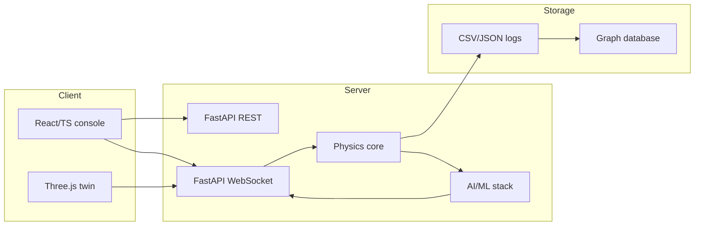

# Technology Stack

This article catalogs the technologies underlying ANUMAAN, organized by system layer, and states why each was chosen for the specific job it does. The goal is not a list of names but a record of engineering decisions: what problem each layer faces, and what property of the chosen technology solves it.

## Layers

| Layer | Technology | Why it was chosen |
|---|---|---|
| Web operator interface | React, TypeScript, Vite | The ground control station is a stateful, continuously updating interface, fleet tiles, live telemetry panels, diagnostic views, all reacting to a fast-moving stream of data. React's component model matches that shape directly. TypeScript catches a category of integration bugs, a telemetry field renamed on the backend and not updated in a component, before they reach a demo. Vite gives fast rebuild cycles during development of an interface this actively iterated on. |
| Backend | Python, FastAPI | The physics core, the ML stack, and the evaluation tooling are all Python, so the backend needed to host that code natively rather than translate it across a language boundary. FastAPI serves both REST endpoints for control operations (selecting an engine, injecting a fault, setting a lever) and native WebSocket support for telemetry streaming, in one framework, which matches ANUMAAN's actual traffic pattern: occasional commands, continuous data push. |
| Real-time transport | WebSockets | Telemetry and control state need continuous, low-latency push from server to client, RPM, temperatures, residuals, and diagnostic evidence updating many times a second while an engine runs. Polling would mean either wasteful empty requests between updates or added latency waiting for the next poll interval. A persistent WebSocket connection delivers each new frame as soon as it exists, which matters directly for how immediately a residual or fault indication reaches the operator's screen. |
| Digital twin core | Python (physics models and state estimation) | The physics core, slider-crank kinematics, the Wiebe heat-release function, gas and inertial torque propagation, order tracking, and the independent plant model, is numerically heavy but not latency-critical at the microsecond scale, and benefits from being in the same language and process family as the ML and evaluation code that consumes its output. Keeping the physics and the ML stack in one language removes a serialization boundary that would otherwise sit between every physics tick and every detection pass. |
| AI/ML | Sparse novelty coding, Bayesian diagnosis, prognostics, retrieval-augmented assistance | Each of these is a distinct problem with a method suited to it, not one general-purpose model applied uniformly. Bio-Inspired Sparse Novelty Coding needs no labeled training data to construct its projection, which matters because labeled fault data for this exact engine class does not exist publicly. Bayesian diagnosis suits reasoning over a structured fault taxonomy with explicit isolability relationships. Conformal prediction suits RUL because it produces a calibrated, testable coverage guarantee rather than a bare point estimate. Retrieval-augmented assistance suits the copilot because its answers need to be grounded in specific reference manual text, not generated freely. |
| 3D content | Blender (authoring), glTF/GLB with Draco compression (delivery) | Blender is the authoring environment for all five engine platform models, the showcase scenes, and the UAV airframe model, giving the asset pipeline one documented modeling and quality standard to author against. glTF/GLB is a format a browser can render natively through Three.js, without a plugin, and Draco compression keeps five detailed engine meshes, plus terrain for the canyon flight environment, to a download size that still loads promptly in a browser session. |
| 3D rendering | Three.js | The operator-facing twin has to run inside the same browser session as the rest of the ground control station, with no separate application to install. Three.js renders the Draco-compressed GLB models directly in that browser context and supports the component-level highlighting and eased camera transitions the operator workflow needs, all synchronized to the same WebSocket telemetry path the rest of the console uses. |
| Data | CSV telemetry logs, JSON manifests, graph database | Completed sorties are written as CSV telemetry logs paired with JSON manifests because that pairing is simple to generate, simple to replay deterministically, and easy for an evaluator to inspect directly without a specialized tool. The graph database sits above individual sortie logs, indexing sorties, anomalies, and maintenance history across the fleet as connected records, which suits fleet-level questions (which tail has repeated cylinder-2 events, which anomaly preceded which maintenance action) that a flat log format answers poorly. |
| Testing | pytest, characterization and integration tests | pytest is the standard Python testing framework and integrates directly with the backend's language and tooling. The characterization test category specifically exists to pin headline results, a conformal coverage figure, a recovered misfire rate, as regression tests, described further in [Validation and Experiments](21-validation-and-experiments.md), so method regressions are caught automatically rather than only noticed when someone happens to re-check the documentation against the code. |

## How the layers connect

*How a telemetry frame moves from the physics core through the AI/ML stack to both the live browser client and persistent storage.*

## Related systems

- [Operator Ground Control Station](20-operator-gcs.md)
- [Validation and Experiments](21-validation-and-experiments.md)
- [The 3D Digital Twin](18-3d-digital-twin.md)
- [End to End Demonstration](22-end-to-end-demonstration.md)
